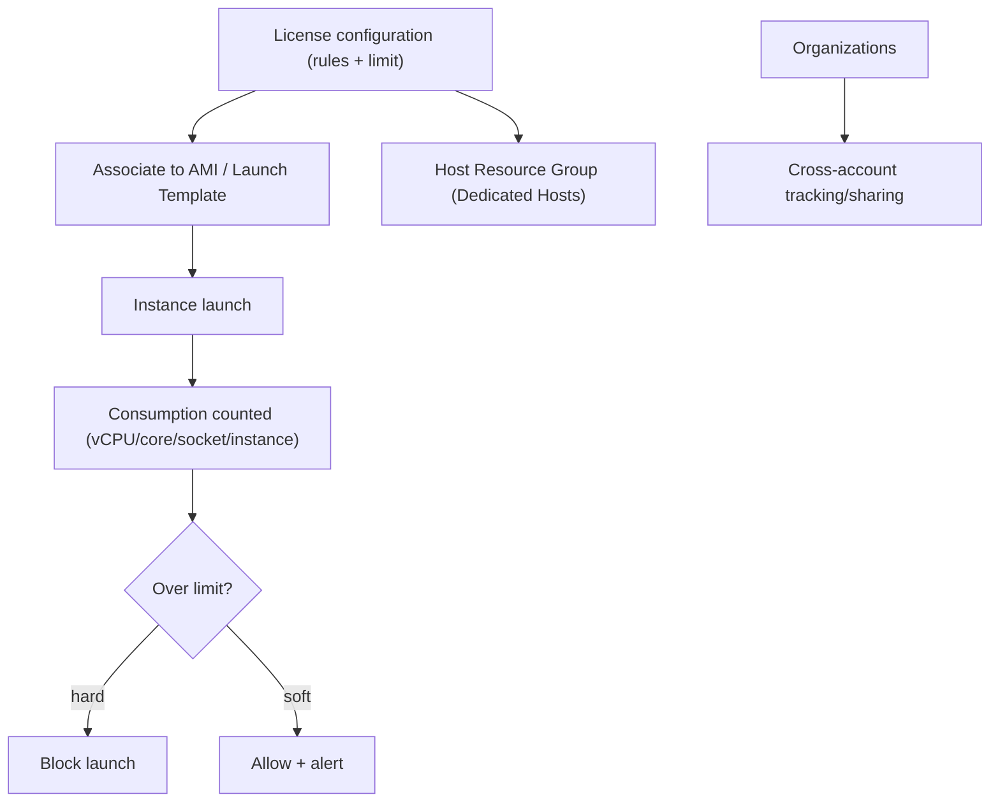

# AWS License Manager - Deep Dive

> Architecture, license configurations & counting, enforcement modes, Dedicated Host automation, Organizations & cross-account, seller-issued licenses, on-prem discovery, limits, integrations, comparisons, best practices.

See also: [01 - AWS License Manager Intro bits & bytes](01%20-%20AWS%20License%20Manager%20Intro%20bits%20%26%20bytes.md) · [03 - AWS License Manager Exam Scenarios](03%20-%20AWS%20License%20Manager%20Exam%20Scenarios.md) · [04 - AWS License Manager SRE Operations](04%20-%20AWS%20License%20Manager%20SRE%20Operations.md) · [06 - IAM Identity Center & Organizations](06%20-%20IAM%20Identity%20Center%20%26%20Organizations.md)

---

## Table of Contents

- [1. Architecture](#1-architecture)
- [2. License Configurations and Counting](#2-license-configurations-and-counting)
- [3. Enforcement Modes](#3-enforcement-modes)
- [4. Dedicated Host Automation](#4-dedicated-host-automation)
- [5. Organizations, Cross-Account, and On-Prem](#5-organizations-cross-account-and-on-prem)
- [6. Seller-Issued and Managed Entitlements](#6-seller-issued-and-managed-entitlements)
- [7. Service Limits and Quotas](#7-service-limits-and-quotas)
- [8. Integration Matrix](#8-integration-matrix)
- [9. Comparisons](#9-comparisons)
- [10. Best Practices by Pillar](#10-best-practices-by-pillar)

---

---

## 1. Architecture

You define **license configurations** (the rules), **associate** them with the artifacts that launch software (AMIs, launch templates, instances, Dedicated Hosts), and License Manager **counts consumption** automatically and applies **enforcement**. It integrates with **Organizations** for cross-account governance, with **Systems Manager** for discovering software inventory, and can track **on-premises** usage.

[⬆ Back to top](#table-of-contents)

---

## 2. License Configurations and Counting

| Counting type | Use                                                   |
| :------------ | :---------------------------------------------------- |
| **vCPUs**     | vCPU-based licensing                                  |
| **Cores**     | Physical core licensing (often needs Dedicated Hosts) |
| **Sockets**   | Socket-based licensing                                |
| **Instances** | Per-instance licensing                                |

A configuration specifies the counting type, a **limit**, optional **tenancy** requirements, and rules (e.g. allowed tenancy = dedicated). Associating it with an AMI means every launch from that AMI counts automatically.

[⬆ Back to top](#table-of-contents)

---

## 3. Enforcement Modes

- **Hard enforcement**: License Manager **blocks** an instance launch that would exceed the configured limit — guaranteeing you never exceed entitlements (compliance-first).
- **Soft enforcement**: launches proceed but **alerts/notifications** fire when over — useful when blocking would harm availability and you accept tracking + remediation.
- Choose per workload's compliance vs availability priority.

[⬆ Back to top](#table-of-contents)

---

## 4. Dedicated Host Automation

- For licenses requiring **Dedicated Hosts**, License Manager manages **Host Resource Groups**: it can **automatically allocate, manage, and release** hosts and place license-bound instances on compliant hosts.
- Reduces manual Dedicated Host juggling and ensures **affinity/tenancy** rules required by the license are met.
- Optimizes host utilization (pack instances onto hosts within license rules).

[⬆ Back to top](#table-of-contents)

---

## 5. Organizations, Cross-Account, and On-Prem

- With **Organizations**, license configurations and consumption can be **tracked centrally** and **shared** across accounts (often via RAM) — a single view of entitlements org-wide.
- **On-premises** usage can be discovered/tracked (via the SSM inventory / data sources), giving a hybrid license picture.
- A **delegated administrator** account can manage licensing centrally.

[⬆ Back to top](#table-of-contents)

---

## 6. Seller-Issued and Managed Entitlements

- Licenses purchased through **AWS Marketplace** can be **seller-issued** and tracked/distributed via License Manager **managed entitlements** — granting/revoking entitlements to accounts/users programmatically.
- Useful for ISVs distributing software and for buyers centralizing Marketplace licenses.

[⬆ Back to top](#table-of-contents)

---

## 7. Service Limits and Quotas

| Aspect                 | Detail                                    |
| :--------------------- | :---------------------------------------- |
| License configurations | Soft limit per account                    |
| Counting types         | vCPU / core / socket / instance           |
| Enforcement            | Hard (block) / soft (alert)               |
| Dedicated Hosts        | Subject to EC2 Dedicated Host quotas/cost |
| Org sharing            | Via Organizations + RAM                   |

[⬆ Back to top](#table-of-contents)

---

## 8. Integration Matrix

| Service                   | Integration                                                                                                        |
| :------------------------ | :----------------------------------------------------------------------------------------------------------------- |
| **EC2 / Dedicated Hosts** | Associate configs; place license-bound instances → tenancy                                                         |
| **Systems Manager**       | Software inventory/discovery (incl. on-prem) → [01 - AWS Systems Manager Intro bits & bytes](01%20-%20AWS%20Systems%20Manager%20Intro%20bits%20%26%20bytes.md)                     |
| **Organizations / RAM**   | Cross-account tracking + sharing → [06 - IAM Identity Center & Organizations](06%20-%20IAM%20Identity%20Center%20%26%20Organizations.md) · [16 - Directory Service & RAM](16%20-%20Directory%20Service%20%26%20RAM.md) |
| **AWS Marketplace**       | Seller-issued/managed entitlements                                                                                 |
| **CloudWatch / SNS**      | Usage alarms + notifications → [01 - Amazon CloudWatch Intro bits & bytes](01%20-%20Amazon%20CloudWatch%20Intro%20bits%20%26%20bytes.md)                                       |
| **CloudTrail**            | Audit license config/consumption changes → [01 - AWS CloudTrail Intro bits & bytes](01%20-%20AWS%20CloudTrail%20Intro%20bits%20%26%20bytes.md)                              |
| **CloudFormation**        | Associate configs to launch templates/AMIs                                                                         |

[⬆ Back to top](#table-of-contents)

---

## 9. Comparisons

### License Manager vs license-included vs manual tracking

|            | License Manager (BYOL)  | License-included  | Manual spreadsheet |
| :--------- | :---------------------- | :---------------- | :----------------- |
| Source     | You own the license     | AWS includes it   | You own it         |
| Tracking   | Automatic + enforcement | n/a (AWS handles) | Error-prone        |
| Compliance | Strong (hard enforce)   | n/a               | Weak               |

### Hard vs soft enforcement

|          | Hard                      | Soft                      |
| :------- | :------------------------ | :------------------------ |
| Behavior | Block over-limit launches | Allow + alert             |
| Priority | Compliance                | Availability + visibility |

[⬆ Back to top](#table-of-contents)

---

## 10. Best Practices by Pillar

**Cost Optimization** — track under-utilization to avoid over-buying; use Dedicated Hosts only when the license requires; reclaim unused entitlements.

**Security/Compliance** — **hard enforcement** for audit-critical licenses; central tracking via Organizations; CloudTrail audit.

**Operational Excellence** — associate configs with AMIs/launch templates so tracking is automatic; automate Dedicated Hosts via Host Resource Groups.

**Reliability** — soft enforcement where blocking launches would harm availability, paired with prompt remediation.

[⬆ Back to top](#table-of-contents)

---

> Continue to [03 - AWS License Manager Exam Scenarios](03%20-%20AWS%20License%20Manager%20Exam%20Scenarios.md).
