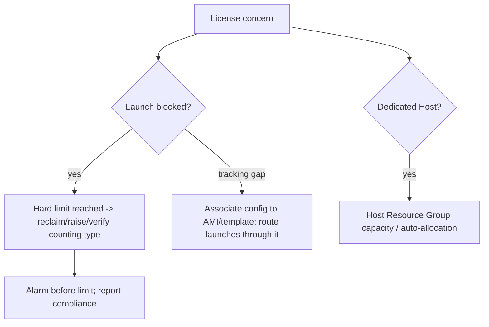

# AWS License Manager - SRE Operations

> Operational reality: launches blocked by limits, tracking gaps, Dedicated Host issues, real examples, and cost/compliance ops.

See also: [01 - AWS License Manager Intro bits & bytes](01%20-%20AWS%20License%20Manager%20Intro%20bits%20%26%20bytes.md) · [02 - AWS License Manager Deep Dive](02%20-%20AWS%20License%20Manager%20Deep%20Dive.md) · [03 - AWS License Manager Exam Scenarios](03%20-%20AWS%20License%20Manager%20Exam%20Scenarios.md) · [01 - AWS Systems Manager Intro bits & bytes](01%20-%20AWS%20Systems%20Manager%20Intro%20bits%20%26%20bytes.md)

---

## Table of Contents

- [1. Common Issues (Symptom → Root Cause → Fix → Prevention)](#1-common-issues-symptom--root-cause--fix--prevention)
- [2. Operational Workflow](#2-operational-workflow)
- [3. What to Monitor](#3-what-to-monitor)
- [4. Runbooks](#4-runbooks)
- [5. Real Examples](#5-real-examples)
- [6. Production Patterns by Org Size](#6-production-patterns-by-org-size)
- [7. Cost & Compliance Operations](#7-cost--compliance-operations)

---

## 1. Common Issues (Symptom → Root Cause → Fix → Prevention)

### Launch blocked unexpectedly

- **Cause:** Hard enforcement + license limit reached.
- **Fix:** Reclaim unused consumption, raise the limit (if you own more), or move to license-included; verify counting type matches the vendor metric.
- **Prevention:** Monitor consumption; alarm before the limit.

### Consumption not tracked

- **Cause:** License configuration not associated with the AMI/launch template; instances launched outside the tracked path.
- **Fix:** Associate the config; standardize launches through tracked AMIs/templates.
- **Prevention:** Bake association into golden AMIs/IaC.

### Wrong count (over/under)

- **Cause:** Counting type mismatch (vCPU vs core vs socket) or hyperthreading assumptions.
- **Fix:** Set the counting type to the vendor's actual metric.
- **Prevention:** Validate against the license terms at setup.

### Dedicated Host placement fails

- **Cause:** No available compliant host / Host Resource Group exhausted.
- **Fix:** Allocate more hosts (or let License Manager auto-allocate); check host quotas.
- **Prevention:** Capacity-plan Dedicated Hosts; automate via Host Resource Groups.

### On-prem usage missing

- **Cause:** No SSM inventory/data source feeding License Manager.
- **Fix:** Configure SSM inventory / hybrid activation.
- **Prevention:** Onboard on-prem to SSM.

[⬆ Back to top](#table-of-contents)

---

## 2. Operational Workflow



[⬆ Back to top](#table-of-contents)

---

## 3. What to Monitor

| Signal                           | Why                       |
| :------------------------------- | :------------------------ |
| Consumption vs limit per license | Compliance + capacity     |
| Approaching-limit alerts         | Pre-empt blocked launches |
| Untracked launches               | Tracking gaps             |
| Dedicated Host utilization       | Cost + placement          |
| Config change audit (CloudTrail) | Governance                |

[⬆ Back to top](#table-of-contents)

---

## 4. Runbooks

### Runbook: onboard a BYOL workload

1. Create a license configuration matching the vendor metric (cores/sockets/vCPU/instances) + limit + tenancy.
2. Associate it with the **golden AMI / launch template**.
3. Choose **hard** (compliance-critical) or **soft** enforcement.
4. For core/socket licenses, set up a **Host Resource Group** (Dedicated Hosts).
5. Add usage alarms; verify counts.

### Runbook: respond to a blocked launch

1. Confirm it's the license limit (License Manager console).
2. Reclaim consumption from unused instances or, if entitled, raise the limit.
3. If urgent and permitted, switch the workload to a license-included path.
4. Add an approaching-limit alarm to prevent recurrence.

[⬆ Back to top](#table-of-contents)

---

## 5. Real Examples

### Create a license configuration (core-counting, hard enforce)

```bash
aws license-manager create-license-configuration \
  --name "sqlserver-cores" \
  --license-counting-type Core \
  --license-count 64 --license-count-hard-limit \
  --description "BYOL SQL Server, 64 cores"
```

### Associate with an AMI

```bash
aws license-manager update-license-specifications-for-resource \
  --resource-arn arn:aws:ec2:ap-south-1:111111111111:image/ami-0abc \
  --add-license-specifications LicenseConfigurationArn=arn:aws:license-manager:...:license-configuration:lic-123
```

### Check consumption

```bash
aws license-manager get-license-configuration \
  --license-configuration-arn arn:aws:license-manager:...:license-configuration:lic-123 \
  --query "{Limit:LicenseCount,Used:ConsumedLicenses,Hard:LicenseCountHardLimit}"
```

[⬆ Back to top](#table-of-contents)

---

## 6. Production Patterns by Org Size

| Context        | Pattern                                                                                      |
| :------------- | :------------------------------------------------------------------------------------------- |
| **Startup**    | A couple of BYOL configs on golden AMIs; soft enforce + alerts.                              |
| **SMB**        | Hard enforce on audit-critical licenses; usage alarms.                                       |
| **Enterprise** | Org-wide tracking + RAM sharing; Host Resource Groups; CloudTrail audit; reclaim under-used. |
| **Regulated**  | Hard enforcement + Dedicated Hosts + reports as audit evidence.                              |
| **Hybrid**     | SSM inventory for on-prem; unified license view.                                             |

[⬆ Back to top](#table-of-contents)

---

## 7. Cost & Compliance Operations

- **Compliance:** hard enforcement for audit-critical licenses; central tracking; CloudTrail audit; reports as evidence.
- **Cost:** License Manager is free, but **Dedicated Hosts** can be expensive — use only when the license demands; reclaim unused entitlements; avoid renewing what's under-used.
- **Hygiene:** route all launches through tracked AMIs/templates so nothing escapes counting.

[⬆ Back to top](#table-of-contents)

---

Related: [01 - AWS License Manager Intro bits & bytes](01%20-%20AWS%20License%20Manager%20Intro%20bits%20%26%20bytes.md) · [02 - AWS License Manager Deep Dive](02%20-%20AWS%20License%20Manager%20Deep%20Dive.md) · [03 - AWS License Manager Exam Scenarios](03%20-%20AWS%20License%20Manager%20Exam%20Scenarios.md) · [01 - AWS Systems Manager Intro bits & bytes](01%20-%20AWS%20Systems%20Manager%20Intro%20bits%20%26%20bytes.md) · [06 - IAM Identity Center & Organizations](06%20-%20IAM%20Identity%20Center%20%26%20Organizations.md)
