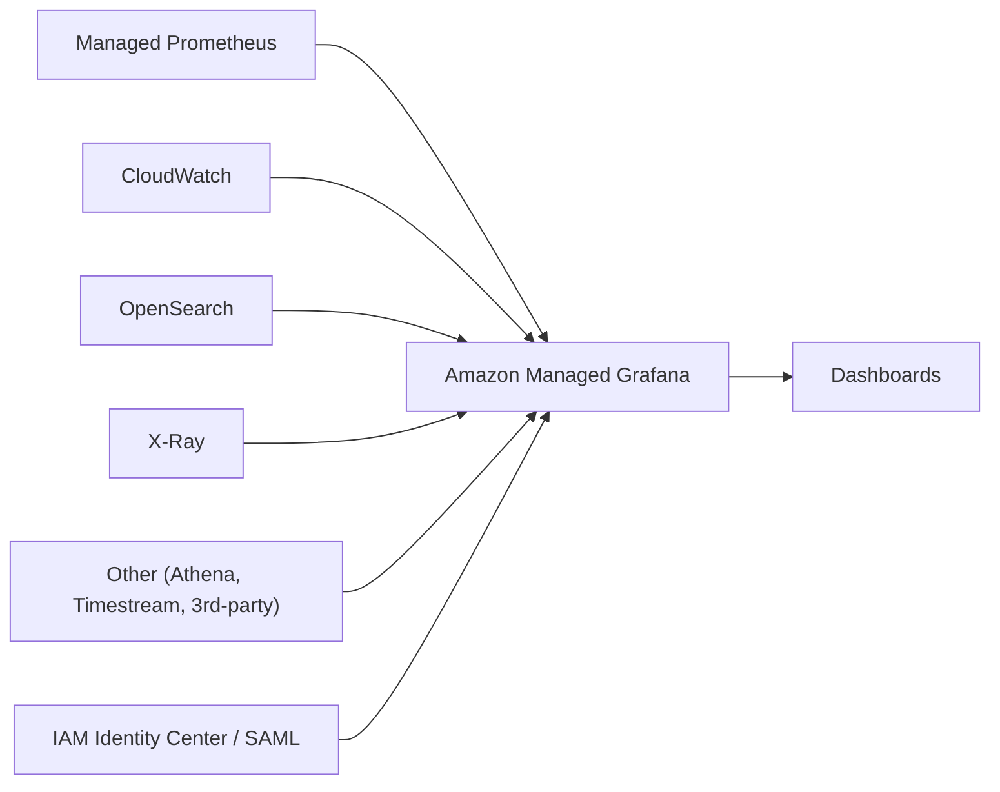

# Amazon Managed Grafana - Intro bits & bytes

> Amazon Managed Grafana (AMG) is a **fully managed Grafana** service for building dashboards that visualize metrics, logs, and traces from **many data sources at once** — CloudWatch, Prometheus, OpenSearch, Timestream, X-Ray, even non-AWS sources. It's "dashboards-as-a-service" without running Grafana servers.

See also: [02 - Amazon Managed Grafana Deep Dive](02%20-%20Amazon%20Managed%20Grafana%20Deep%20Dive.md) · [03 - Amazon Managed Grafana Exam Scenarios](03%20-%20Amazon%20Managed%20Grafana%20Exam%20Scenarios.md) · [04 - Amazon Managed Grafana SRE Operations](04%20-%20Amazon%20Managed%20Grafana%20SRE%20Operations.md) · [01 - Amazon Managed Service for Prometheus Intro bits & bytes](01%20-%20Amazon%20Managed%20Service%20for%20Prometheus%20Intro%20bits%20%26%20bytes.md) · [01 - Amazon CloudWatch Intro bits & bytes](01%20-%20Amazon%20CloudWatch%20Intro%20bits%20%26%20bytes.md)

---

## Table of Contents

- [1. The Problem It Solves](#1-the-problem-it-solves)
- [2. Core Concepts](#2-core-concepts)
- [3. Data Sources](#3-data-sources)
- [4. Authentication and Access](#4-authentication-and-access)
- [5. Managed Grafana vs CloudWatch Dashboards](#5-managed-grafana-vs-cloudwatch-dashboards)
- [6. When To Use It / When NOT To Use It](#6-when-to-use-it--when-not-to-use-it)
- [7. Cost Considerations](#7-cost-considerations)
- [8. Mini-Quiz](#8-mini-quiz)

---

---

## 1. The Problem It Solves

Teams (especially those running Kubernetes/containers) standardize on **Grafana** for dashboards, but self-hosting it means patching, scaling, securing, and upgrading Grafana servers. AMG removes that toil: AWS runs Grafana for you (HA, auto-scaled, patched), integrated with AWS auth and data sources, while you keep the familiar Grafana experience and **PromQL/LogQL** query power across **mixed** sources.

> Mental model: AMG is the **visualization layer**. It doesn't store metrics itself — it **queries** data sources (CloudWatch, Prometheus, etc.) and renders unified dashboards.

[⬆ Back to top](#table-of-contents)

---

## 2. Core Concepts

| Concept               | Meaning                                                   |
| :-------------------- | :-------------------------------------------------------- |
| **Workspace**         | A logical, isolated Grafana server (your instance of AMG) |
| **Data source**       | A backend AMG queries (CloudWatch, AMP, OpenSearch, etc.) |
| **Dashboard / Panel** | Visualizations built on queries                           |
| **Grafana version**   | AMG tracks supported upstream Grafana versions            |
| **Plugins**           | Data-source/panel plugins (managed set)                   |

[⬆ Back to top](#table-of-contents)

---

## 3. Data Sources

AMG can query, among others:

- **Amazon Managed Service for Prometheus (AMP)** and self-managed Prometheus
- **Amazon CloudWatch** (metrics + Logs)
- **Amazon OpenSearch Service**
- **AWS X-Ray** (traces), **Amazon Timestream**, **Athena**, **Redshift**, **SiteWise**
- **Third-party** sources (e.g. with appropriate plugins/connectivity)

The superpower is **one dashboard correlating multiple sources** (e.g. Prometheus container metrics next to CloudWatch ALB metrics and X-Ray traces).

[⬆ Back to top](#table-of-contents)

---

## 4. Authentication and Access

- **User authentication**: **IAM Identity Center (SSO)** or **SAML 2.0** — not IAM users. This is a common exam detail.
- **Permissions to data sources**: AMG uses **IAM roles** (service-managed permissions) to read AWS data sources.
- **Roles in Grafana**: Admin / Editor / Viewer, mapped from the identity provider.
- Supports VPC connectivity for private data sources.

[⬆ Back to top](#table-of-contents)

---

## 5. Managed Grafana vs CloudWatch Dashboards

|           | Managed Grafana                             | CloudWatch Dashboards           |
| :-------- | :------------------------------------------ | :------------------------------ |
| Sources   | **Many** (multi-source, incl. non-AWS)      | Mainly CloudWatch metrics/logs  |
| Query     | PromQL/LogQL/source-native + transforms     | CloudWatch metric/Logs Insights |
| Ecosystem | Full Grafana panels/plugins/alerting        | AWS-native                      |
| Auth      | Identity Center / SAML                      | IAM/console                     |
| Best for  | Unified, OSS-style, multi-source dashboards | AWS-native quick dashboards     |

> Cue: "Grafana dashboards across CloudWatch **and** Prometheus **and** other sources, managed for us" → **Amazon Managed Grafana**. "Simple AWS-native dashboard" → CloudWatch dashboards.

[⬆ Back to top](#table-of-contents)

---

## 6. When To Use It / When NOT To Use It

**Use it when:** you already use/standardize on Grafana, need **multi-source** correlation, run **EKS/containers** (with AMP), want managed HA dashboards with SSO, or need rich Grafana alerting/panels.

**Don't reach for it when:**

- A few **AWS-native** dashboards suffice → CloudWatch dashboards (cheaper/simpler).
- You need a **metrics store** (AMG stores nothing) → that's AMP/CloudWatch.
- You need **APM/tracing analysis** itself → X-Ray/Application Signals (AMG just visualizes).

[⬆ Back to top](#table-of-contents)

---

## 7. Cost Considerations

- AMG is priced **per active user per workspace per month** (Editor/Admin vs Viewer tiers), not per dashboard or query.
- You still pay for the **underlying data sources** (CloudWatch metrics/Logs, AMP ingestion/storage, OpenSearch).
- Cost levers: right-size **active users**; consolidate workspaces; avoid duplicating data into multiple stores.
- For pure AWS-native needs, CloudWatch dashboards may be cheaper than paying per Grafana user.

[⬆ Back to top](#table-of-contents)

---

## 8. Mini-Quiz

**Q1:** How do users sign in to Managed Grafana?
_A:_ **IAM Identity Center (SSO)** or **SAML 2.0** (not IAM users).

**Q2:** Does AMG store your metrics?
_A:_ **No** — it queries data sources (CloudWatch, AMP, etc.) and visualizes.

**Q3:** You run EKS with Prometheus metrics and want managed Grafana dashboards. Which combo?
_A:_ **AMP** (store/scrape) + **AMG** (visualize).

**Q4:** Pricing model?
_A:_ **Per active user** per workspace per month.

---

> Continue to [02 - Amazon Managed Grafana Deep Dive](02%20-%20Amazon%20Managed%20Grafana%20Deep%20Dive.md).
