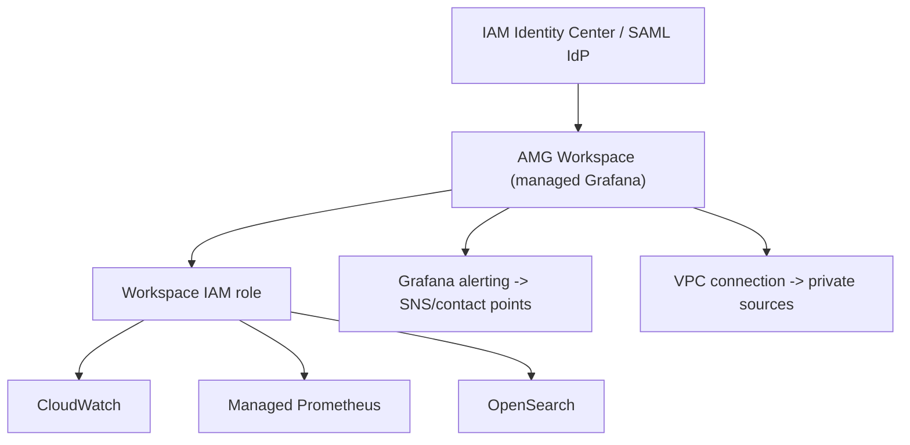

# Amazon Managed Grafana - Deep Dive

> Architecture & workspaces, authentication models, data-source permissions, alerting, plugins & versions, networking, cross-account/region observability, limits, integrations, comparisons, best practices.

See also: [01 - Amazon Managed Grafana Intro bits & bytes](01%20-%20Amazon%20Managed%20Grafana%20Intro%20bits%20%26%20bytes.md) · [03 - Amazon Managed Grafana Exam Scenarios](03%20-%20Amazon%20Managed%20Grafana%20Exam%20Scenarios.md) · [04 - Amazon Managed Grafana SRE Operations](04%20-%20Amazon%20Managed%20Grafana%20SRE%20Operations.md) · [01 - Amazon Managed Service for Prometheus Intro bits & bytes](01%20-%20Amazon%20Managed%20Service%20for%20Prometheus%20Intro%20bits%20%26%20bytes.md)

---

## Table of Contents

- [1. Architecture and Workspaces](#1-architecture-and-workspaces)
- [2. Authentication and Authorization](#2-authentication-and-authorization)
- [3. Data-Source Permissions](#3-data-source-permissions)
- [4. Grafana Alerting](#4-grafana-alerting)
- [5. Plugins, Versions, and APIs](#5-plugins-versions-and-apis)
- [6. Networking and Private Sources](#6-networking-and-private-sources)
- [7. Cross-Account / Cross-Region](#7-cross-account--cross-region)
- [8. Service Limits and Quotas](#8-service-limits-and-quotas)
- [9. Integration Matrix](#9-integration-matrix)
- [10. Comparisons](#10-comparisons)
- [11. Best Practices](#11-best-practices)

---

---

## 1. Architecture and Workspaces

A **workspace** is a managed, highly available Grafana environment. AWS handles provisioning, scaling, patching, and upgrades. Each workspace has its own URL, authentication config, data sources, dashboards, and an associated **IAM role** for AWS data access. You can run multiple workspaces (e.g. per team/environment).

[⬆ Back to top](#table-of-contents)

---

## 2. Authentication and Authorization

- **User auth**: **IAM Identity Center** or **SAML 2.0** federation. (No native Grafana username/password admin for end users; identity comes from the IdP.)
- **Grafana roles**: Admin, Editor, Viewer — assigned to users/groups, often mapped from SAML assertions or Identity Center groups.
- **API keys / service accounts** for programmatic dashboard management.

[⬆ Back to top](#table-of-contents)

---

## 3. Data-Source Permissions

- AMG uses an **IAM role** (workspace role) to query AWS data sources. Two modes:
  - **Service-managed**: AMG provisions/maintains the necessary permissions (incl. across accounts via Organizations for CloudWatch cross-account).
  - **Customer-managed**: you supply the role/policies.
- For **cross-account CloudWatch**, AMG can leverage CloudWatch cross-account observability so one workspace dashboards many accounts.

[⬆ Back to top](#table-of-contents)

---

## 4. Grafana Alerting

- AMG supports **Grafana-managed alerting**: define alert rules on panels/queries, route to **contact points** (SNS, email, Slack, PagerDuty, webhook) with notification policies.
- Complements (doesn't replace) CloudWatch alarms — useful when alerting on **multi-source** or PromQL-based conditions.
- Alerting state and history are managed within the workspace.

[⬆ Back to top](#table-of-contents)

---

## 5. Plugins, Versions, and APIs

- AMG offers a **managed set of plugins** (data sources, panels) and tracks supported **upstream Grafana versions** (you can upgrade workspace version).
- **Grafana HTTP API** for managing dashboards/data sources as code (GitOps-style dashboard provisioning).
- Enterprise plugins may be available depending on configuration.

[⬆ Back to top](#table-of-contents)

---

## 6. Networking and Private Sources

- Connect a workspace to a **VPC** to reach **private** data sources (self-managed Prometheus in a private subnet, private OpenSearch).
- Public AWS data sources are reached via the workspace role + AWS APIs.

[⬆ Back to top](#table-of-contents)

---

## 7. Cross-Account / Cross-Region

- A single workspace can query **multiple regions** (data sources specify region) and, with cross-account setup, **multiple accounts** — a central observability pane.
- Pairs with **AMP** workspaces and **CloudWatch cross-account observability** for org-wide dashboards.

[⬆ Back to top](#table-of-contents)

---

## 8. Service Limits and Quotas

| Aspect                     | Detail                                 |
| :------------------------- | :------------------------------------- |
| Workspaces per account     | Soft limit (Service Quotas)            |
| Data sources per workspace | Many                                   |
| Pricing                    | Per active user (Editor/Admin, Viewer) |
| Auth                       | Identity Center / SAML required        |
| Versions                   | Managed upgrade path                   |

[⬆ Back to top](#table-of-contents)

---

## 9. Integration Matrix

| Service                                      | Integration                                                                                         |
| :------------------------------------------- | :-------------------------------------------------------------------------------------------------- |
| **Managed Prometheus**                       | Primary metrics source (PromQL) → [01 - Amazon Managed Service for Prometheus Intro bits & bytes](01%20-%20Amazon%20Managed%20Service%20for%20Prometheus%20Intro%20bits%20%26%20bytes.md) |
| **CloudWatch**                               | Metrics/Logs source; cross-account observability → [01 - Amazon CloudWatch Intro bits & bytes](01%20-%20Amazon%20CloudWatch%20Intro%20bits%20%26%20bytes.md)    |
| **IAM Identity Center / SAML**               | User authentication → [06 - IAM Identity Center & Organizations](06%20-%20IAM%20Identity%20Center%20%26%20Organizations.md)                                  |
| **OpenSearch / Athena / Timestream / X-Ray** | Additional data sources                                                                             |
| **SNS**                                      | Alert contact point                                                                                 |
| **Organizations**                            | Cross-account data access                                                                           |
| **VPC / PrivateLink**                        | Private source connectivity                                                                         |

[⬆ Back to top](#table-of-contents)

---

## 10. Comparisons

### AMG vs self-managed Grafana

|      | AMG                           | Self-managed Grafana   |
| :--- | :---------------------------- | :--------------------- |
| Ops  | AWS manages (HA/patch/scale)  | You run EC2/containers |
| Auth | Identity Center/SAML built-in | DIY                    |
| Cost | Per active user               | Infra + ops time       |

### AMG vs CloudWatch dashboards vs QuickSight

|          | AMG                                   | CloudWatch dashboards | QuickSight        |
| :------- | :------------------------------------ | :-------------------- | :---------------- |
| Focus    | Ops metrics/logs/traces, multi-source | AWS-native ops        | BI/analytics      |
| Audience | SRE/ops                               | AWS ops               | Business analysts |

[⬆ Back to top](#table-of-contents)

---

## 11. Best Practices

- Authenticate via **Identity Center/SAML**; map groups to Admin/Editor/Viewer least privilege.
- Use **service-managed** data-source permissions unless you need custom scoping.
- Manage dashboards **as code** via the Grafana API for consistency.
- Pair with **AMP** for container metrics; use **CloudWatch cross-account observability** for org dashboards.
- Right-size **active users** to control cost; consolidate workspaces sensibly.
- Use **VPC connection** for private sources; keep the workspace role least-privilege.

[⬆ Back to top](#table-of-contents)

---

> Continue to [03 - Amazon Managed Grafana Exam Scenarios](03%20-%20Amazon%20Managed%20Grafana%20Exam%20Scenarios.md).
