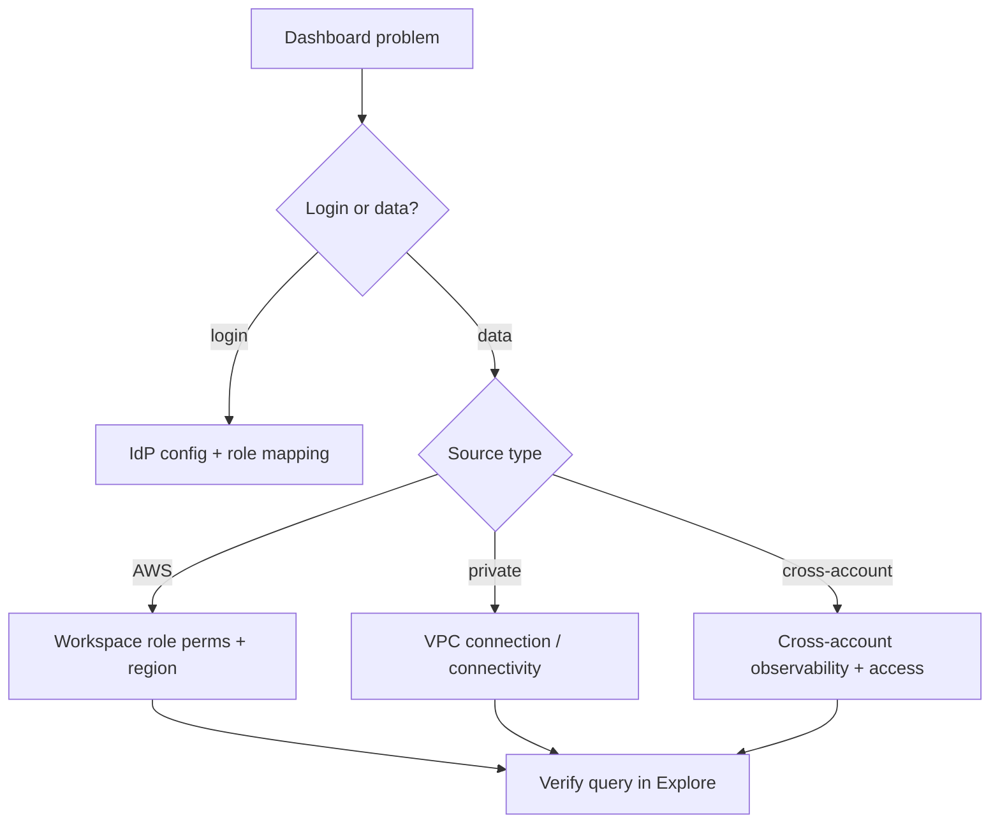

# Amazon Managed Grafana - SRE Operations

> Operational reality: auth/data-source failures, real setup examples, dashboard-as-code patterns, and cost ops.

See also: [01 - Amazon Managed Grafana Intro bits & bytes](01%20-%20Amazon%20Managed%20Grafana%20Intro%20bits%20%26%20bytes.md) · [02 - Amazon Managed Grafana Deep Dive](02%20-%20Amazon%20Managed%20Grafana%20Deep%20Dive.md) · [03 - Amazon Managed Grafana Exam Scenarios](03%20-%20Amazon%20Managed%20Grafana%20Exam%20Scenarios.md) · [01 - Amazon Managed Service for Prometheus Intro bits & bytes](01%20-%20Amazon%20Managed%20Service%20for%20Prometheus%20Intro%20bits%20%26%20bytes.md)

---

## Table of Contents

- [1. Common Errors (Symptom → Root Cause → Fix → Prevention)](#1-common-errors-symptom--root-cause--fix--prevention)
- [2. Troubleshooting Workflow](#2-troubleshooting-workflow)
- [3. What to Monitor](#3-what-to-monitor)
- [4. Runbooks](#4-runbooks)
- [5. Real Examples](#5-real-examples)
- [6. Production Patterns by Org Size](#6-production-patterns-by-org-size)
- [7. Cost Operations](#7-cost-operations)

---

## 1. Common Errors (Symptom → Root Cause → Fix → Prevention)

### Users can't log in

- **Cause:** Identity Center/SAML not configured or group mapping missing.
- **Fix:** Configure the IdP; map groups to Grafana roles.
- **Prevention:** Standard auth setup in IaC; test with a pilot group.

### Data source returns no data / access denied

- **Cause:** Workspace IAM role lacks read permission for the source; wrong region; private source unreachable.
- **Fix:** Grant least-privilege read (cloudwatch/aps/es); set the correct region; add VPC connection.
- **Prevention:** Use service-managed permissions or a tested customer-managed role.

### Cross-account CloudWatch empty

- **Cause:** Cross-account observability/links not set up.
- **Fix:** Configure CloudWatch cross-account sharing + workspace cross-account access.
- **Prevention:** Establish during landing-zone build.

### Alerts not firing

- **Cause:** Contact point misconfigured or notification policy mismatch.
- **Fix:** Verify contact point (SNS/webhook) and routing.
- **Prevention:** Test alert delivery on setup.

### Unexpected bill

- **Cause:** Too many Editor/Admin active users.
- **Fix:** Downgrade to Viewer where possible.
- **Prevention:** Periodic user-tier review.

[⬆ Back to top](#table-of-contents)

---

## 2. Troubleshooting Workflow



[⬆ Back to top](#table-of-contents)

---

## 3. What to Monitor

| Signal                         | Why                      |
| :----------------------------- | :----------------------- |
| Active user count by tier      | Cost                     |
| Data-source query errors       | Broken dashboards        |
| Alert delivery success         | Notification reliability |
| Workspace version vs supported | Upgrade hygiene          |

[⬆ Back to top](#table-of-contents)

---

## 4. Runbooks

### Runbook: stand up a workspace

1. Create workspace; choose **Identity Center** or **SAML**.
2. Assign users; map groups to Admin/Editor/Viewer.
3. Configure data sources (AMP, CloudWatch, OpenSearch) via workspace role.
4. Add VPC connection for private sources if needed.
5. Provision baseline dashboards via the Grafana API; set alert contact points.

### Runbook: onboard a new data source

1. Grant the workspace role least-privilege read.
2. Add the data source (correct region/endpoint).
3. Validate with a test query in Explore; build/import panels.

[⬆ Back to top](#table-of-contents)

---

## 5. Real Examples

### Create a workspace (CLI, concept)

```bash
aws grafana create-workspace \
  --account-access-type CURRENT_ACCOUNT \
  --authentication-providers AWS_SSO \
  --permission-type SERVICE_MANAGED \
  --workspace-data-sources PROMETHEUS CLOUDWATCH \
  --workspace-name platform-obs
```

### Provision a dashboard via the Grafana HTTP API

```bash
curl -s -X POST "$GRAFANA_URL/api/dashboards/db" \
  -H "Authorization: Bearer $GRAFANA_API_KEY" \
  -H "Content-Type: application/json" \
  -d @dashboard.json
```

### Workspace role policy (least-privilege read)

```json
{
  "Version": "2012-10-17",
  "Statement": [
    {
      "Effect": "Allow",
      "Action": [
        "cloudwatch:GetMetricData",
        "cloudwatch:ListMetrics",
        "logs:GetLogEvents",
        "logs:StartQuery",
        "logs:GetQueryResults",
        "aps:QueryMetrics",
        "aps:GetSeries",
        "aps:GetLabels"
      ],
      "Resource": "*"
    }
  ]
}
```

[⬆ Back to top](#table-of-contents)

---

## 6. Production Patterns by Org Size

| Context           | Pattern                                                                                                      |
| :---------------- | :----------------------------------------------------------------------------------------------------------- |
| **Startup**       | One workspace; CloudWatch + AMP sources; SSO; few Editors.                                                   |
| **SMB**           | Dashboards-as-code via API; alerting to Slack/SNS; Viewer tier for stakeholders.                             |
| **Enterprise**    | Per-team workspaces or one central; cross-account observability; customer-managed roles; version governance. |
| **Regulated**     | Federated auth audited; least-privilege roles; CloudTrail on workspace APIs; private VPC sources.            |
| **Multi-Account** | Central observability workspace querying many accounts/regions.                                              |

[⬆ Back to top](#table-of-contents)

---

## 7. Cost Operations

- AMG bills **per active user** — review tiers regularly; most stakeholders are **Viewers**.
- Consolidate workspaces where reasonable; avoid duplicate dashboards/workspaces.
- The real telemetry cost is in the **sources** (AMP ingestion, CloudWatch, OpenSearch) — manage those independently.
- For AWS-only simple needs, prefer **CloudWatch dashboards** to avoid per-user Grafana charges.

[⬆ Back to top](#table-of-contents)

---

Related: [01 - Amazon Managed Grafana Intro bits & bytes](01%20-%20Amazon%20Managed%20Grafana%20Intro%20bits%20%26%20bytes.md) · [02 - Amazon Managed Grafana Deep Dive](02%20-%20Amazon%20Managed%20Grafana%20Deep%20Dive.md) · [03 - Amazon Managed Grafana Exam Scenarios](03%20-%20Amazon%20Managed%20Grafana%20Exam%20Scenarios.md) · [01 - Amazon Managed Service for Prometheus Intro bits & bytes](01%20-%20Amazon%20Managed%20Service%20for%20Prometheus%20Intro%20bits%20%26%20bytes.md) · [01 - Amazon CloudWatch Intro bits & bytes](01%20-%20Amazon%20CloudWatch%20Intro%20bits%20%26%20bytes.md)
