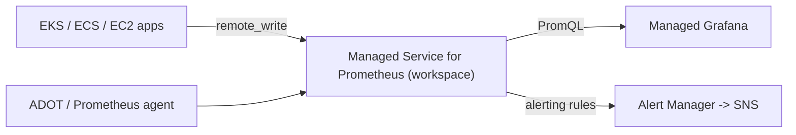

# Amazon Managed Service for Prometheus - Intro bits & bytes

> Amazon Managed Service for Prometheus (AMP) is a **fully managed, Prometheus-compatible** time-series database for **container and microservice metrics** — you keep PromQL and Prometheus ingestion, AWS runs the scalable, durable, HA backend. It's the **metrics store**; Grafana is the dashboards.

See also: [02 - Amazon Managed Service for Prometheus Deep Dive](02%20-%20Amazon%20Managed%20Service%20for%20Prometheus%20Deep%20Dive.md) · [03 - Amazon Managed Service for Prometheus Exam Scenarios](03%20-%20Amazon%20Managed%20Service%20for%20Prometheus%20Exam%20Scenarios.md) · [04 - Amazon Managed Service for Prometheus SRE Operations](04%20-%20Amazon%20Managed%20Service%20for%20Prometheus%20SRE%20Operations.md) · [01 - Amazon Managed Grafana Intro bits & bytes](01%20-%20Amazon%20Managed%20Grafana%20Intro%20bits%20%26%20bytes.md) · [01 - Amazon CloudWatch Intro bits & bytes](01%20-%20Amazon%20CloudWatch%20Intro%20bits%20%26%20bytes.md)

---

## Table of Contents

- [1. The Problem It Solves](#1-the-problem-it-solves)
- [2. Core Concepts](#2-core-concepts)
- [3. How Metrics Get In and Out](#3-how-metrics-get-in-and-out)
- [4. AMP vs CloudWatch vs self-managed Prometheus](#4-amp-vs-cloudwatch-vs-self-managed-prometheus)
- [5. When To Use It / When NOT To Use It](#5-when-to-use-it--when-not-to-use-it)
- [6. Cost Considerations](#6-cost-considerations)
- [7. Mini-Quiz](#7-mini-quiz)

---

---

## 1. The Problem It Solves

Prometheus is the de-facto standard for **Kubernetes/container** metrics, but self-managing it at scale is painful: it's single-node by default, you must shard/federate, manage long-term storage, and keep it HA. AMP gives you the **same Prometheus query (PromQL) and ingestion (remote write) interfaces** on a managed, automatically-scaling, durable, multi-AZ backend — no servers to run.

> Mental model: AMP = **managed Prometheus storage + query**. You still scrape with a Prometheus-compatible agent (or ADOT), but you `remote_write` to AMP instead of storing locally, and query with PromQL (often via [Managed Grafana](01%20-%20Amazon%20Managed%20Grafana%20Intro%20bits%20%26%20bytes.md)).

[⬆ Back to top](#table-of-contents)

---

## 2. Core Concepts

| Concept                           | Meaning                                                     |
| :-------------------------------- | :---------------------------------------------------------- |
| **Workspace**                     | A logical, isolated Prometheus environment (ingest + query) |
| **remote_write**                  | How metrics are ingested (agent pushes to AMP)              |
| **PromQL**                        | The query language (same as open-source Prometheus)         |
| **Rules**                         | Recording & alerting rules (managed ruler)                  |
| **Alert Manager**                 | Managed alerting/routing (to SNS)                           |
| **Scraper (agentless collector)** | AWS managed collector that scrapes EKS for you              |

[⬆ Back to top](#table-of-contents)

---

## 3. How Metrics Get In and Out

- **Ingest**: a Prometheus agent, the **AWS Distro for OpenTelemetry (ADOT)** collector, or the **AMP agentless scraper** for EKS sends metrics via **`remote_write`** (signed with SigV4/IAM).
- **Query**: PromQL via the query API — typically visualized in **Managed Grafana**, or queried by tools/SDKs.
- **Alert/record**: managed **rules** evaluate PromQL; **Alert Manager** routes alerts (e.g. to **SNS**).
- Access is **IAM-authenticated** (SigV4), unlike open-source Prometheus's open HTTP.

[⬆ Back to top](#table-of-contents)

---

## 4. AMP vs CloudWatch vs self-managed Prometheus

|            | AMP                                           | CloudWatch                         | Self-managed Prometheus |
| :--------- | :-------------------------------------------- | :--------------------------------- | :---------------------- |
| Model      | **Pull-origin** metrics, PromQL, remote_write | Push + service metrics, CW queries | Pull, PromQL            |
| Best for   | K8s/containers, PromQL ecosystems             | AWS-native everything              | Full control / on-prem  |
| Ops        | Managed (HA, scale, durable)                  | Managed                            | **You run it**          |
| Auth       | IAM (SigV4)                                   | IAM                                | DIY                     |
| Dashboards | Grafana (AMG)                                 | CloudWatch dashboards / Grafana    | Grafana                 |

> Cue: "Prometheus/PromQL, Kubernetes metrics, managed, don't run servers" → **AMP**. "AWS-native metrics/alarms" → **CloudWatch**.

[⬆ Back to top](#table-of-contents)

---

## 5. When To Use It / When NOT To Use It

**Use it when:** you run **EKS/Kubernetes** or containers instrumented for Prometheus, your teams use **PromQL**, you need long-term, HA Prometheus storage without operational burden, or you're consolidating many Prometheus servers.

**Don't reach for it when:**

- You only need **AWS-native** metrics/alarms → CloudWatch is simpler/cheaper.
- You need **dashboards** (AMP doesn't visualize) → pair with Grafana.
- You need **logs/traces** (AMP is metrics only) → CloudWatch Logs / OpenSearch / X-Ray.

[⬆ Back to top](#table-of-contents)

---

## 6. Cost Considerations

- Priced on **metric samples ingested**, **storage**, and **query samples processed** (plus collector costs).
- High-cardinality metrics (many label combinations) drive cost — control with **relabeling/dropping** unneeded series at the agent.
- Set **retention** appropriately; long retention increases storage cost.
- Cheaper than running and scaling your own HA Prometheus + long-term storage for most teams; but CloudWatch may be cheaper for purely AWS-native needs.

[⬆ Back to top](#table-of-contents)

---

## 7. Mini-Quiz

**Q1:** What does AMP store and query?
_A:_ **Prometheus time-series metrics**, queried with **PromQL**.

**Q2:** How are metrics ingested?
_A:_ Via **`remote_write`** from a Prometheus agent/ADOT/the managed scraper (IAM/SigV4 auth).

**Q3:** Does AMP draw dashboards?
_A:_ **No** — pair it with **Managed Grafana** (or another Grafana).

**Q4:** EKS metrics with PromQL, fully managed — which services?
_A:_ **AMP** (store/query) + **AMG** (dashboards), scraped via ADOT/managed collector.

---

> Continue to [02 - Amazon Managed Service for Prometheus Deep Dive](02%20-%20Amazon%20Managed%20Service%20for%20Prometheus%20Deep%20Dive.md).
