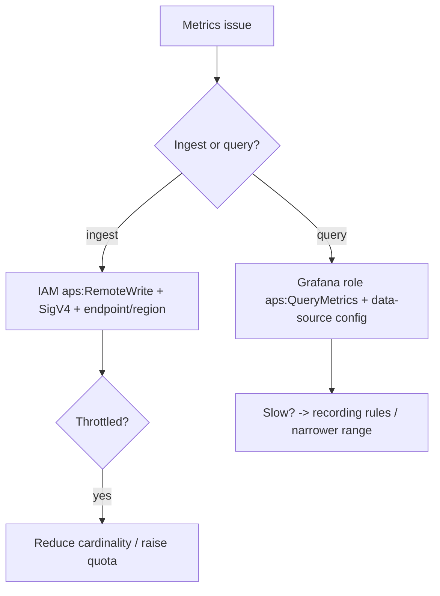

# Amazon Managed Service for Prometheus - SRE Operations

> Operational reality: ingestion auth failures, cardinality blowups, real remote_write/IRSA examples, container observability patterns, and cost ops.

See also: [01 - Amazon Managed Service for Prometheus Intro bits & bytes](01%20-%20Amazon%20Managed%20Service%20for%20Prometheus%20Intro%20bits%20%26%20bytes.md) · [02 - Amazon Managed Service for Prometheus Deep Dive](02%20-%20Amazon%20Managed%20Service%20for%20Prometheus%20Deep%20Dive.md) · [03 - Amazon Managed Service for Prometheus Exam Scenarios](03%20-%20Amazon%20Managed%20Service%20for%20Prometheus%20Exam%20Scenarios.md) · [01 - Amazon Managed Grafana Intro bits & bytes](01%20-%20Amazon%20Managed%20Grafana%20Intro%20bits%20%26%20bytes.md)

---

## Table of Contents

- [1. Common Errors (Symptom → Root Cause → Fix → Prevention)](#1-common-errors-symptom--root-cause--fix--prevention)
- [2. Troubleshooting Workflow](#2-troubleshooting-workflow)
- [3. What to Monitor](#3-what-to-monitor)
- [4. Runbooks](#4-runbooks)
- [5. Real Examples](#5-real-examples)
- [6. Production Patterns by Org Size](#6-production-patterns-by-org-size)
- [7. Cost Operations](#7-cost-operations)

---

## 1. Common Errors (Symptom → Root Cause → Fix → Prevention)

### remote_write 403 / SigV4 errors

- **Cause:** Missing `aps:RemoteWrite` permission, wrong region/endpoint, or unsigned requests.
- **Fix:** Grant the collector role/IRSA `aps:RemoteWrite`; configure SigV4 in the remote_write config; correct workspace endpoint.
- **Prevention:** IRSA + tested IAM; manage config as code.

### Ingestion throttled / 429

- **Cause:** Exceeding samples/sec or active-series limits.
- **Fix:** Reduce cardinality (relabel/drop); request quota increase.
- **Prevention:** Cardinality budget; monitor active series.

### Cardinality blowup (cost + perf)

- **Cause:** Unbounded labels (IDs, paths).
- **Fix:** `metric_relabel_configs` to drop/aggregate; remove offending labels.
- **Prevention:** Label hygiene review before rollout.

### Queries slow/time out

- **Cause:** Heavy ad-hoc aggregations over long ranges.
- **Fix:** Recording rules; narrower ranges; downsample.
- **Prevention:** Precompute SLO series.

### Grafana shows no data

- **Cause:** Grafana workspace role lacks `aps:QueryMetrics`/`GetSeries`, or wrong workspace URL/region.
- **Fix:** Grant query permissions; fix data-source config.
- **Prevention:** Validate data source on setup.

[⬆ Back to top](#table-of-contents)

---

## 2. Troubleshooting Workflow



[⬆ Back to top](#table-of-contents)

---

## 3. What to Monitor

| Signal                          | Why                  |
| :------------------------------ | :------------------- |
| Active series count             | Cardinality/cost     |
| Ingestion rate vs quota         | Throttling risk      |
| remote_write success/error rate | Pipeline health      |
| Query latency                   | Dashboard usability  |
| Rule evaluation failures        | Alerting reliability |

[⬆ Back to top](#table-of-contents)

---

## 4. Runbooks

### Runbook: onboard an EKS cluster

1. Create AMP workspace.
2. Choose collection: **managed scraper** (least ops) or ADOT/Prometheus-agent with **IRSA** (`aps:RemoteWrite`).
3. Configure remote_write (SigV4, workspace endpoint).
4. Add the workspace as a data source in **Managed Grafana**; validate queries.
5. Upload recording/alerting rules; set Alert Manager → SNS.

### Runbook: tame cardinality

1. Identify top series by label (query/inspect).
2. Add `metric_relabel_configs` to drop/aggregate offending labels at the agent.
3. Verify active-series drop; confirm cost/throttle relief.

[⬆ Back to top](#table-of-contents)

---

## 5. Real Examples

### Prometheus remote_write to AMP (SigV4)

```yaml
remote_write:
  - url: https://aps-workspaces.ap-south-1.amazonaws.com/workspaces/ws-xxxx/api/v1/remote_write
    sigv4:
      region: ap-south-1
    queue_config:
      max_samples_per_send: 1000
    write_relabel_configs:
      - source_labels: [request_id] # drop high-cardinality label
        action: labeldrop
```

### IRSA policy for the collector (least privilege)

```json
{
  "Version": "2012-10-17",
  "Statement": [
    {
      "Effect": "Allow",
      "Action": ["aps:RemoteWrite"],
      "Resource": "arn:aws:aps:ap-south-1:111111111111:workspace/ws-xxxx"
    }
  ]
}
```

### Create workspace + upload alerting rules (CLI, concept)

```bash
aws amp create-workspace --alias platform-metrics
aws amp create-rule-groups-namespace --workspace-id ws-xxxx \
  --name slo-rules --data fileb://rules.yaml
```

### Grafana query-role policy

```json
{
  "Effect": "Allow",
  "Action": [
    "aps:QueryMetrics",
    "aps:GetSeries",
    "aps:GetLabels",
    "aps:GetMetricMetadata"
  ],
  "Resource": "arn:aws:aps:ap-south-1:111111111111:workspace/ws-xxxx"
}
```

[⬆ Back to top](#table-of-contents)

---

## 6. Production Patterns by Org Size

| Context           | Pattern                                                                                                        |
| :---------------- | :------------------------------------------------------------------------------------------------------------- |
| **Startup**       | One workspace; managed scraper; AMG dashboards.                                                                |
| **SMB**           | ADOT collectors with IRSA; recording rules; Alert Manager → SNS.                                               |
| **Enterprise**    | Per-env workspaces with tuned retention; cardinality governance; PrivateLink; cross-account dashboards in AMG. |
| **Regulated**     | KMS + PrivateLink; least-privilege write/query roles; audited; long prod retention.                            |
| **Multi-Account** | Central AMG querying multiple AMP workspaces; consistent rule libraries.                                       |

[⬆ Back to top](#table-of-contents)

---

## 7. Cost Operations

- **Cardinality is the #1 cost lever** — drop/relabel unbounded labels at the agent (`labeldrop`, `drop`).
- Tune **retention** per workspace (short for dev, long for prod SLOs).
- Use **recording rules** to reduce repeated heavy query processing.
- Consolidate workspaces where it doesn't violate isolation needs.
- For purely AWS-native metrics, prefer **CloudWatch** to avoid duplicate ingestion cost.

[⬆ Back to top](#table-of-contents)

---

Related: [01 - Amazon Managed Service for Prometheus Intro bits & bytes](01%20-%20Amazon%20Managed%20Service%20for%20Prometheus%20Intro%20bits%20%26%20bytes.md) · [02 - Amazon Managed Service for Prometheus Deep Dive](02%20-%20Amazon%20Managed%20Service%20for%20Prometheus%20Deep%20Dive.md) · [03 - Amazon Managed Service for Prometheus Exam Scenarios](03%20-%20Amazon%20Managed%20Service%20for%20Prometheus%20Exam%20Scenarios.md) · [01 - Amazon Managed Grafana Intro bits & bytes](01%20-%20Amazon%20Managed%20Grafana%20Intro%20bits%20%26%20bytes.md) · [01 - Amazon CloudWatch Intro bits & bytes](01%20-%20Amazon%20CloudWatch%20Intro%20bits%20%26%20bytes.md)
