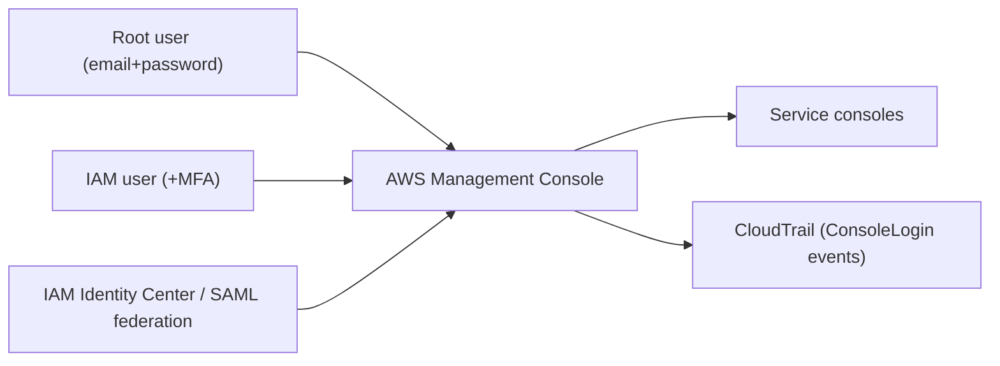

# AWS Management Console - Intro bits & bytes

> The AWS Management Console is the **web UI** for AWS — the human-facing front door to every service. For the exam it matters mostly as an **access surface**: how people sign in (root vs IAM vs Identity Center/federation), how access is secured (MFA), and how it relates to the CLI/API (same IAM, same audit).

See also: [02 - AWS Management Console Deep Dive](02%20-%20AWS%20Management%20Console%20Deep%20Dive.md) · [03 - AWS Management Console Exam Scenarios](03%20-%20AWS%20Management%20Console%20Exam%20Scenarios.md) · [04 - AWS Management Console SRE Operations](04%20-%20AWS%20Management%20Console%20SRE%20Operations.md) · [01 - AWS CLI Intro bits & bytes](01%20-%20AWS%20CLI%20Intro%20bits%20%26%20bytes.md) · [06 - IAM Identity Center & Organizations](06%20-%20IAM%20Identity%20Center%20%26%20Organizations.md)

---

## Table of Contents

- [1. What It Is and Why It Matters](#1-what-it-is-and-why-it-matters)
- [2. Sign-In Identities](#2-sign-in-identities)
- [3. Securing Console Access](#3-securing-console-access)
- [4. Console vs CLI vs API](#4-console-vs-cli-vs-api)
- [5. When To Use It / When NOT To Use It](#5-when-to-use-it--when-not-to-use-it)
- [6. Cost Considerations](#6-cost-considerations)
- [7. Mini-Quiz](#7-mini-quiz)

---

---

## 1. What It Is and Why It Matters

The console is the browser-based interface for configuring and operating AWS. It's where humans click; it's great for **exploration, one-off tasks, dashboards, and learning**, but poor for **repeatability** (use IaC/CLI for that). On the exam, console questions are really about **identity and access**: who signs in, how, and how securely — and the fact that the console hits the **same APIs and IAM** as the CLI, with the same **CloudTrail** audit.

> Mental model: the console is a **front door**, not a separate permission system. A console click and a CLI call are the same API under the same IAM policy, both logged in CloudTrail.

[⬆ Back to top](#table-of-contents)

---

## 2. Sign-In Identities

| Identity                      | Sign-in                                                     | Use                                                   |
| :---------------------------- | :---------------------------------------------------------- | :---------------------------------------------------- |
| **Root user**                 | Account email + password                                    | **Almost never** — only root-only tasks; lock it down |
| **IAM user**                  | Account ID/alias + username + password (+MFA)               | Legacy/long-lived human access (being superseded)     |
| **IAM Identity Center (SSO)** | Central SSO portal → assume permission sets across accounts | **Preferred** workforce access at scale               |
| **Federated (SAML/OIDC)**     | Corporate IdP → temporary console session                   | Enterprises with existing IdP                         |

> Modern best practice: humans access the console via **IAM Identity Center** (or federation) for **short-lived** credentials across many accounts — not per-account IAM users. See [06 - IAM Identity Center & Organizations](06%20-%20IAM%20Identity%20Center%20%26%20Organizations.md).

[⬆ Back to top](#table-of-contents)

---

## 3. Securing Console Access

- **MFA** on root and all human sign-ins (ideally enforced by policy).
- **Strong password policy** for IAM users; prefer federation to avoid passwords entirely.
- **IAM policies / permission sets** scope what each identity can do (least privilege).
- **Account alias** for a friendlier sign-in URL.
- **Session duration** controls; **AWS Console Mobile App** for on-the-go monitoring/limited actions.
- **CloudTrail `ConsoleLogin`** events for sign-in audit; alarm on root logins / failures.

[⬆ Back to top](#table-of-contents)

---

## 4. Console vs CLI vs API

|            | Console                          | CLI                  | API/SDK              |
| :--------- | :------------------------------- | :------------------- | :------------------- |
| Interface  | Web UI                           | Commands             | Code                 |
| Best for   | Exploration, one-off, dashboards | Scripting/automation | Applications         |
| Repeatable | No                               | Yes                  | Yes                  |
| IAM/Audit  | Same IAM, CloudTrail             | Same IAM, CloudTrail | Same IAM, CloudTrail |

> Same permissions and audit across all three — the difference is **ergonomics and repeatability**, not authority.

[⬆ Back to top](#table-of-contents)

---

## 5. When To Use It / When NOT To Use It

**Use it for:** exploring services, one-off configuration, viewing dashboards/health, learning, and break-glass operations.

**Avoid it for:**

- **Repeatable infrastructure** → CloudFormation/CDK/Terraform.
- **Bulk/automated tasks** → CLI/SDK/Systems Manager.
- **Daily root usage** → never; use Identity Center/IAM.
- **Shared logins** → never share credentials; one identity per human.

[⬆ Back to top](#table-of-contents)

---

## 6. Cost Considerations

- The console is **free**; you pay for what you provision through it.
- The hidden risk is **human error/inconsistency** (clicking ≠ reviewable IaC) leading to misconfig, drift, and cost — prefer IaC for anything repeatable.
- **CloudShell** in the console gives a free, pre-authenticated CLI (1 GB storage/region free).

[⬆ Back to top](#table-of-contents)

---

## 7. Mini-Quiz

**Q1:** Does a console action have different permissions than the CLI?
_A:_ **No** — same API, same IAM, same CloudTrail audit.

**Q2:** Preferred way for a large workforce to sign in across many accounts?
_A:_ **IAM Identity Center (SSO)** / federation — short-lived credentials.

**Q3:** How are console sign-ins audited?
_A:_ CloudTrail **`ConsoleLogin`** events (alarm on root/failed logins).

**Q4:** Should you use root for daily console work?
_A:_ **No** — only root-only tasks; enable MFA and lock it away.

---

> Continue to [02 - AWS Management Console Deep Dive](02%20-%20AWS%20Management%20Console%20Deep%20Dive.md).
