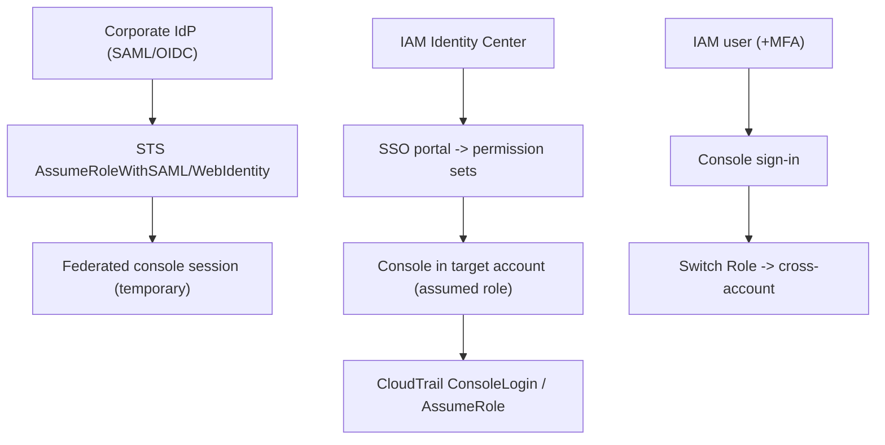

# AWS Management Console - Deep Dive

> Sign-in architecture, federation flows, account switching & cross-account roles, the Console Mobile App, CloudShell, session/security controls, limits, integrations, comparisons, best practices.

See also: [01 - AWS Management Console Intro bits & bytes](01%20-%20AWS%20Management%20Console%20Intro%20bits%20%26%20bytes.md) · [03 - AWS Management Console Exam Scenarios](03%20-%20AWS%20Management%20Console%20Exam%20Scenarios.md) · [04 - AWS Management Console SRE Operations](04%20-%20AWS%20Management%20Console%20SRE%20Operations.md) · [13 - STS & Federation](13%20-%20STS%20%26%20Federation.md) · [06 - IAM Identity Center & Organizations](06%20-%20IAM%20Identity%20Center%20%26%20Organizations.md)

---

## Table of Contents

- [1. Sign-In Architecture](#1-sign-in-architecture)
- [2. Federation Flows](#2-federation-flows)
- [3. Account Switching and Cross-Account Roles](#3-account-switching-and-cross-account-roles)
- [4. CloudShell and the Console Mobile App](#4-cloudshell-and-the-console-mobile-app)
- [5. Session and Security Controls](#5-session-and-security-controls)
- [6. Service Limits and Quotas](#6-service-limits-and-quotas)
- [7. Integration Matrix](#7-integration-matrix)
- [8. Comparisons](#8-comparisons)
- [9. Best Practices by Pillar](#9-best-practices-by-pillar)

---

---

## 1. Sign-In Architecture

- **IAM user**: signs in at the account-specific URL (account ID or **alias**) with username/password + MFA.
- **Root**: signs in with the account email; bypasses IAM — reserve for root-only tasks.
- **Identity Center**: users authenticate to a central **SSO portal** and pick an account + **permission set**, which maps to an assumed role in that account (temporary credentials).
- **Federation**: the corporate IdP authenticates, then STS issues a temporary console session.

[⬆ Back to top](#table-of-contents)

---

## 2. Federation Flows

- **SAML 2.0**: IdP → `AssumeRoleWithSAML` → console sign-in URL with a temporary session. Classic enterprise SSO to AWS.
- **OIDC / web identity**: `AssumeRoleWithWebIdentity` for web/identity-provider logins.
- **Custom federation broker**: your app calls STS `AssumeRole`, then builds a **console sign-in URL** via the federation endpoint (getSigninToken) for users without IAM credentials.
- All produce **temporary** credentials — no long-lived console passwords to manage.

[⬆ Back to top](#table-of-contents)

---

## 3. Account Switching and Cross-Account Roles

- **Switch Role**: from one account's console, assume a role in **another account** (cross-account access) without a second login — uses STS under the hood.
- Identity Center makes this seamless across all org accounts via the portal.
- Each role assumption is a **CloudTrail `AssumeRole`** event with the role session name — attribution for who did what where. See [19 - IAM Cross Account Access](19%20-%20IAM%20Cross%20Account%20Access.md).

[⬆ Back to top](#table-of-contents)

---

## 4. CloudShell and the Console Mobile App

- **AWS CloudShell**: a browser-based shell **pre-authenticated** with your console identity — run CLI without local setup (1 GB free persistent storage per Region).
- **AWS Console Mobile App**: monitor resources, view CloudWatch alarms/Health, and perform limited actions (start/stop instances) from a phone — useful for on-call.

[⬆ Back to top](#table-of-contents)

---

## 5. Session and Security Controls

- **MFA** (virtual/hardware/passkey) on root and humans; enforce via IAM condition for sensitive actions.
- **Session duration**: permission sets / federated roles control how long a console session lasts.
- **Account alias** for a friendly sign-in URL.
- **Permissions boundaries / SCPs** cap what console users can do regardless of their policies.
- **CloudTrail** `ConsoleLogin` (success/failure, MFA used) for sign-in monitoring.

[⬆ Back to top](#table-of-contents)

---

## 6. Service Limits and Quotas

| Aspect      | Detail                                     |
| :---------- | :----------------------------------------- |
| Console     | Free; global UI, regional service views    |
| Sessions    | Duration controlled by role/permission set |
| MFA devices | Multiple per user supported                |
| CloudShell  | 1 GB storage/Region free; session timeouts |
| Mobile app  | Limited action set                         |

[⬆ Back to top](#table-of-contents)

---

## 7. Integration Matrix

| Service                 | Integration                                                                            |
| :---------------------- | :------------------------------------------------------------------------------------- |
| **IAM / STS**           | Identity, assume-role, federation → [13 - STS & Federation](13%20-%20STS%20%26%20Federation.md)                          |
| **IAM Identity Center** | SSO portal + permission sets → [06 - IAM Identity Center & Organizations](06%20-%20IAM%20Identity%20Center%20%26%20Organizations.md)            |
| **CloudTrail**          | ConsoleLogin/AssumeRole audit → [01 - AWS CloudTrail Intro bits & bytes](01%20-%20AWS%20CloudTrail%20Intro%20bits%20%26%20bytes.md)             |
| **CloudWatch**          | Dashboards, alarms surfaced in console → [01 - Amazon CloudWatch Intro bits & bytes](01%20-%20Amazon%20CloudWatch%20Intro%20bits%20%26%20bytes.md) |
| **CloudShell**          | Pre-authenticated CLI → [01 - AWS CLI Intro bits & bytes](01%20-%20AWS%20CLI%20Intro%20bits%20%26%20bytes.md)                            |
| **Organizations**       | Switch across org accounts                                                             |
| **Health Dashboard**    | Account health surfaced in console → [01 - AWS Health Dashboard Intro bits & bytes](01%20-%20AWS%20Health%20Dashboard%20Intro%20bits%20%26%20bytes.md)  |

[⬆ Back to top](#table-of-contents)

---

## 8. Comparisons

### Console access methods

|             | Root               | IAM user            | Identity Center      | Federation          |
| :---------- | :----------------- | :------------------ | :------------------- | :------------------ |
| Credentials | Long-lived (email) | Long-lived password | Temporary (SSO)      | Temporary (IdP)     |
| Scale       | n/a                | Poor (per account)  | Excellent (org-wide) | Good (existing IdP) |
| Recommended | Emergency only     | Legacy              | **Preferred**        | Enterprise          |

### Console vs CloudShell vs CLI

|       | Console         | CloudShell       | Local CLI       |
| :---- | :-------------- | :--------------- | :-------------- |
| Setup | None            | None             | Install/config  |
| Auth  | Console session | Inherits console | Provider chain  |
| Use   | Click           | Quick scripted   | Full automation |

[⬆ Back to top](#table-of-contents)

---

## 9. Best Practices by Pillar

**Security** — Identity Center/federation over IAM users; **MFA** everywhere; root locked away with MFA; SCP/permissions boundaries cap console power; alarm on root/failed `ConsoleLogin`.

**Operational Excellence** — use console for exploration/one-off; IaC/CLI for repeatable work; account alias; CloudShell for quick tasks.

**Reliability** — Console Mobile App for on-call visibility; dashboards for health.

**Cost Optimization** — prefer reviewable IaC to avoid costly click-misconfigurations/drift.

[⬆ Back to top](#table-of-contents)

---

> Continue to [03 - AWS Management Console Exam Scenarios](03%20-%20AWS%20Management%20Console%20Exam%20Scenarios.md).
