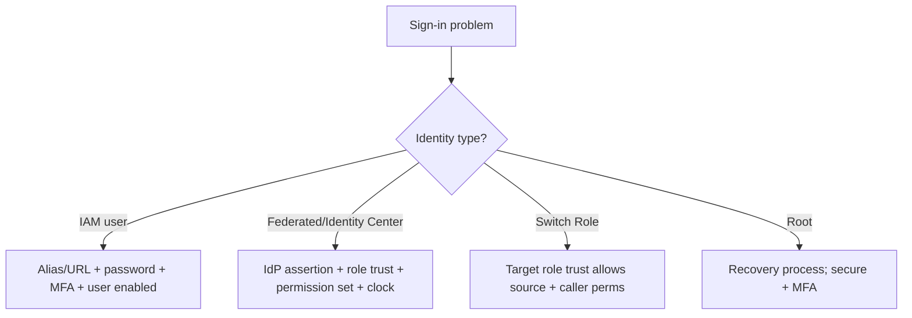

# AWS Management Console - SRE Operations

> Operational reality: sign-in problems, securing access, real federation/audit examples, governance patterns, and cost-of-clicking.

See also: [01 - AWS Management Console Intro bits & bytes](01%20-%20AWS%20Management%20Console%20Intro%20bits%20%26%20bytes.md) · [02 - AWS Management Console Deep Dive](02%20-%20AWS%20Management%20Console%20Deep%20Dive.md) · [03 - AWS Management Console Exam Scenarios](03%20-%20AWS%20Management%20Console%20Exam%20Scenarios.md) · [06 - IAM Identity Center & Organizations](06%20-%20IAM%20Identity%20Center%20%26%20Organizations.md)

---

## Table of Contents

- [1. Common Issues (Symptom → Root Cause → Fix → Prevention)](#1-common-issues-symptom--root-cause--fix--prevention)
- [2. Access Triage Workflow](#2-access-triage-workflow)
- [3. What to Monitor](#3-what-to-monitor)
- [4. Runbooks](#4-runbooks)
- [5. Real Examples](#5-real-examples)
- [6. Production Patterns by Org Size](#6-production-patterns-by-org-size)
- [7. Cost & Security Operations](#7-cost--security-operations)

---

## 1. Common Issues (Symptom → Root Cause → Fix → Prevention)

### Can't sign in

- **Cause:** Wrong account alias/URL, expired federated session, MFA device lost, or disabled user.
- **Fix:** Use the correct sign-in URL; re-authenticate via IdP; recover/replace MFA; re-enable identity.
- **Prevention:** Document sign-in URLs; multiple MFA devices; Identity Center for central recovery.

### Federated login fails

- **Cause:** SAML assertion/role trust misconfig, role not in account, clock skew.
- **Fix:** Verify the IdP metadata, role trust policy, attribute mapping; sync time.
- **Prevention:** Test federation per account; manage trust via IaC.

### Switch Role fails

- **Cause:** Target role's trust policy doesn't allow the source; missing permission.
- **Fix:** Update the target role trust + caller permission.
- **Prevention:** Standardize cross-account roles via StackSets.

### Locked out of root

- **Cause:** Lost root MFA/credentials.
- **Fix:** AWS account recovery process (alternate contacts).
- **Prevention:** Secure root credentials + MFA in a safe; set alternate contacts.

### Console drift/misconfig in prod

- **Cause:** Ad-hoc clicking.
- **Fix:** Reconcile via IaC; detect with Config.
- **Prevention:** Restrict prod console writes; IaC source of truth.

[⬆ Back to top](#table-of-contents)

---

## 2. Access Triage Workflow



[⬆ Back to top](#table-of-contents)

---

## 3. What to Monitor

| Signal                       | Why                       |
| :--------------------------- | :------------------------ |
| Root `ConsoleLogin`          | Should be near-zero       |
| Failed `ConsoleLogin` spikes | Credential attacks        |
| Logins without MFA           | Policy violations         |
| Unusual source IPs/geos      | Compromise                |
| AssumeRole session names     | Cross-account attribution |

[⬆ Back to top](#table-of-contents)

---

## 4. Runbooks

### Runbook: roll out federated console access

1. Configure **IAM Identity Center** federated to the corporate IdP.
2. Define **permission sets** (least privilege) and assign groups to accounts.
3. Enforce **MFA**; set session durations.
4. Verify sign-in to each account; enable CloudTrail ConsoleLogin alarms.

### Runbook: secure the root user

1. Enable strong **MFA**; remove root access keys.
2. Set **alternate contacts**; store credentials in a safe.
3. Alarm on any root `ConsoleLogin`; restrict root-only tasks to a documented process.

[⬆ Back to top](#table-of-contents)

---

## 5. Real Examples

### Metric filter + alarm on root console login

```bash
aws logs put-metric-filter --log-group-name aws-cloudtrail-logs \
  --filter-name RootConsoleLogin \
  --filter-pattern '{ ($.eventName = "ConsoleLogin") && ($.userIdentity.type = "Root") }' \
  --metric-transformations metricName=RootLoginCount,metricNamespace=Security,metricValue=1

aws cloudwatch put-metric-alarm --alarm-name RootConsoleLogin \
  --namespace Security --metric-name RootLoginCount \
  --statistic Sum --period 300 --threshold 1 \
  --comparison-operator GreaterThanOrEqualToThreshold --evaluation-periods 1 \
  --alarm-actions arn:aws:sns:ap-south-1:111111111111:sec-alerts
```

### IAM condition: require MFA for console-driven sensitive actions

```json
{
  "Version": "2012-10-17",
  "Statement": [
    {
      "Effect": "Deny",
      "Action": ["ec2:TerminateInstances", "iam:*"],
      "Resource": "*",
      "Condition": { "BoolIfExists": { "aws:MultiFactorAuthPresent": "false" } }
    }
  ]
}
```

### Set an account alias (friendly sign-in URL)

```bash
aws iam create-account-alias --account-alias my-company-prod
```

[⬆ Back to top](#table-of-contents)

---

## 6. Production Patterns by Org Size

| Context           | Pattern                                                                                                 |
| :---------------- | :------------------------------------------------------------------------------------------------------ |
| **Startup**       | IAM users + MFA early; move to Identity Center as you grow; lock root.                                  |
| **SMB**           | Identity Center for humans; account alias; root-login alarms.                                           |
| **Enterprise**    | Federation via corporate IdP + Identity Center; permission sets; SCP ceilings; ConsoleLogin monitoring. |
| **Regulated**     | Hardware/passkey MFA; session-duration limits; full sign-in audit; restricted prod console writes.      |
| **Multi-Account** | Switch Role / portal for cross-account; standardized roles via StackSets.                               |

[⬆ Back to top](#table-of-contents)

---

## 7. Cost & Security Operations

- **Security:** Identity Center/federation over IAM users; MFA everywhere; lock root; SCP/boundary ceilings; alarm on root/failed `ConsoleLogin`.
- **Cost:** console is free, but **click-driven misconfig/drift** is a real (and costly) risk — prefer IaC for repeatable work and restrict prod console writes.
- **Hygiene:** one identity per human; no shared logins; rotate/recover MFA; document sign-in URLs.

[⬆ Back to top](#table-of-contents)

---

Related: [01 - AWS Management Console Intro bits & bytes](01%20-%20AWS%20Management%20Console%20Intro%20bits%20%26%20bytes.md) · [02 - AWS Management Console Deep Dive](02%20-%20AWS%20Management%20Console%20Deep%20Dive.md) · [03 - AWS Management Console Exam Scenarios](03%20-%20AWS%20Management%20Console%20Exam%20Scenarios.md) · [06 - IAM Identity Center & Organizations](06%20-%20IAM%20Identity%20Center%20%26%20Organizations.md) · [13 - STS & Federation](13%20-%20STS%20%26%20Federation.md) · [01 - AWS CloudTrail Intro bits & bytes](01%20-%20AWS%20CloudTrail%20Intro%20bits%20%26%20bytes.md)
