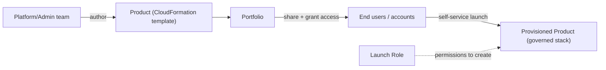

# AWS Service Catalog - Intro bits & bytes

> Service Catalog lets a central team publish **approved, pre-configured infrastructure as products** that end users can self-serve — launching governed CloudFormation stacks without needing the underlying permissions. It's "an app store for your standardized, compliant AWS resources."

See also: [02 - AWS Service Catalog Deep Dive](02%20-%20AWS%20Service%20Catalog%20Deep%20Dive.md) · [03 - AWS Service Catalog Exam Scenarios](03%20-%20AWS%20Service%20Catalog%20Exam%20Scenarios.md) · [04 - AWS Service Catalog SRE Operations](04%20-%20AWS%20Service%20Catalog%20SRE%20Operations.md) · [01 - AWS CloudFormation Intro bits & bytes](01%20-%20AWS%20CloudFormation%20Intro%20bits%20%26%20bytes.md) · [07 - AWS Control Tower](07%20-%20AWS%20Control%20Tower.md)

---

## Table of Contents

- [1. The Problem It Solves](#1-the-problem-it-solves)
- [2. Core Vocabulary](#2-core-vocabulary)
- [3. The Launch-Role Trick (Why It's Powerful)](#3-the-launch-role-trick-why-its-powerful)
- [4. Constraints: How Governance Is Enforced](#4-constraints-how-governance-is-enforced)
- [5. When To Use It / When NOT To Use It](#5-when-to-use-it--when-not-to-use-it)
- [6. Service Catalog vs CloudFormation vs Control Tower](#6-service-catalog-vs-cloudformation-vs-control-tower)
- [7. Cost Considerations](#7-cost-considerations)
- [8. Mini-Quiz](#8-mini-quiz)

---

---

## 1. The Problem It Solves

Without governance, teams either (a) get **too much access** (they can launch anything, including non-compliant, expensive, or insecure resources) or (b) get **blocked** waiting on the platform team to build everything. Service Catalog resolves the tension: the platform team defines **what good looks like** as products; users **self-serve** within those guardrails — standardized, tagged, region-limited, and launched with permissions they don't personally hold.

> Mental model: Service Catalog = **CloudFormation + governance + self-service**. Users pick a product and fill parameters; they never see or edit the template and don't need the IAM rights to create the resources directly.

[⬆ Back to top](#table-of-contents)

---

## 2. Core Vocabulary

| Term                      | Meaning                                                                |
| :------------------------ | :--------------------------------------------------------------------- |
| **Product**               | A deployable item, defined by a CloudFormation template (and versions) |
| **Portfolio**             | A collection of products + access grants + constraints                 |
| **Provisioned product**   | A running instance a user launched (a governed stack)                  |
| **Constraint**            | A governance rule attached to a product in a portfolio                 |
| **Launch role**           | The IAM role Service Catalog assumes to create resources               |
| **Provisioning artifact** | A specific product **version**                                         |

[⬆ Back to top](#table-of-contents)

---

## 3. The Launch-Role Trick (Why It's Powerful)

The key idea: when a user launches a product, **Service Catalog assumes a launch role** to create the resources. So:

- The **user needs only** permission to _launch the product_ (`servicecatalog:*` on it) — **not** permission to create EC2/RDS/etc. directly.
- The **launch role** holds the actual creation permissions (least privilege, scoped to what the product needs).
- Result: a developer can stand up a compliant RDS+EC2 stack **without** having `rds:*`/`ec2:*` on their own identity. This is a clean separation of "who can request" from "what gets created."

[⬆ Back to top](#table-of-contents)

---

## 4. Constraints: How Governance Is Enforced

| Constraint                    | Enforces                                                                         |
| :---------------------------- | :------------------------------------------------------------------------------- |
| **Launch constraint**         | Which IAM role is used to provision (the launch-role trick)                      |
| **Template constraint**       | Limits parameter values (e.g. only `t3.micro`/`t3.small`; only approved regions) |
| **Notification constraint**   | SNS notifications on stack events                                                |
| **Stack Set constraint**      | Provision across multiple accounts/regions                                       |
| **Tag options / tag updates** | Enforce mandatory tags for cost allocation/governance                            |

> Template constraints are how you stop users from launching a `x1e.32xlarge` "by accident" — the catalog only offers approved choices.

[⬆ Back to top](#table-of-contents)

---

## 5. When To Use It / When NOT To Use It

**Use it when:**

- You need **self-service** but must enforce standards (security, tags, sizes, regions).
- Non-infra users should launch resources **without broad IAM**.
- You want a **curated, versioned** set of approved architectures across many teams/accounts.
- You're building a governed platform (often alongside Control Tower).

**Don't reach for it when:**

- A small team just writes and applies its own IaC → plain CloudFormation/CDK.
- You need **one-off** infrastructure, not a reusable catalog.
- You need **detective compliance** of existing resources → Config (Service Catalog governs _provisioning_, not drift of arbitrary resources).

[⬆ Back to top](#table-of-contents)

---

## 6. Service Catalog vs CloudFormation vs Control Tower

|              | Service Catalog                               | CloudFormation                             | Control Tower                              |
| :----------- | :-------------------------------------------- | :----------------------------------------- | :----------------------------------------- |
| Role         | Curated **self-service** of approved products | The provisioning engine (templates/stacks) | Landing zone + org guardrails              |
| Audience     | End users/consumers                           | Platform/infra engineers                   | Org/governance admins                      |
| Relationship | **Uses** CloudFormation under the hood        | Standalone IaC                             | **Uses** Service Catalog (Account Factory) |

> Exam cue: "let users self-serve approved infrastructure without giving them the underlying permissions, with standardized configs" → **Service Catalog**. The engine beneath it is CloudFormation; the org wrapper above it is Control Tower.

[⬆ Back to top](#table-of-contents)

---

## 7. Cost Considerations

- Service Catalog has **API/usage-based pricing** (largely modest; provisioning operations), and you pay for the **resources** products create.
- Governance itself saves money: **template constraints** cap instance sizes; **mandatory tags** enable cost allocation; standardized products avoid expensive misconfigurations.
- Combine with **Budgets** associated to products/portfolios to alert on spend.

[⬆ Back to top](#table-of-contents)

---

## 8. Mini-Quiz

**Q1:** Let developers launch a compliant database stack without granting them `rds:*`. How?
_A:_ A Service Catalog **product** with a **launch constraint** (launch role holds the permissions).

**Q2:** Stop users choosing huge instance types.
_A:_ **Template constraint** limiting allowed parameter values.

**Q3:** What's the engine that actually provisions a product?
_A:_ **CloudFormation**.

**Q4:** Distribute the same approved products across many accounts.
_A:_ Share the **portfolio** (and/or use a **StackSet constraint**), often org-wide.

---

> Continue to [02 - AWS Service Catalog Deep Dive](02%20-%20AWS%20Service%20Catalog%20Deep%20Dive.md).
