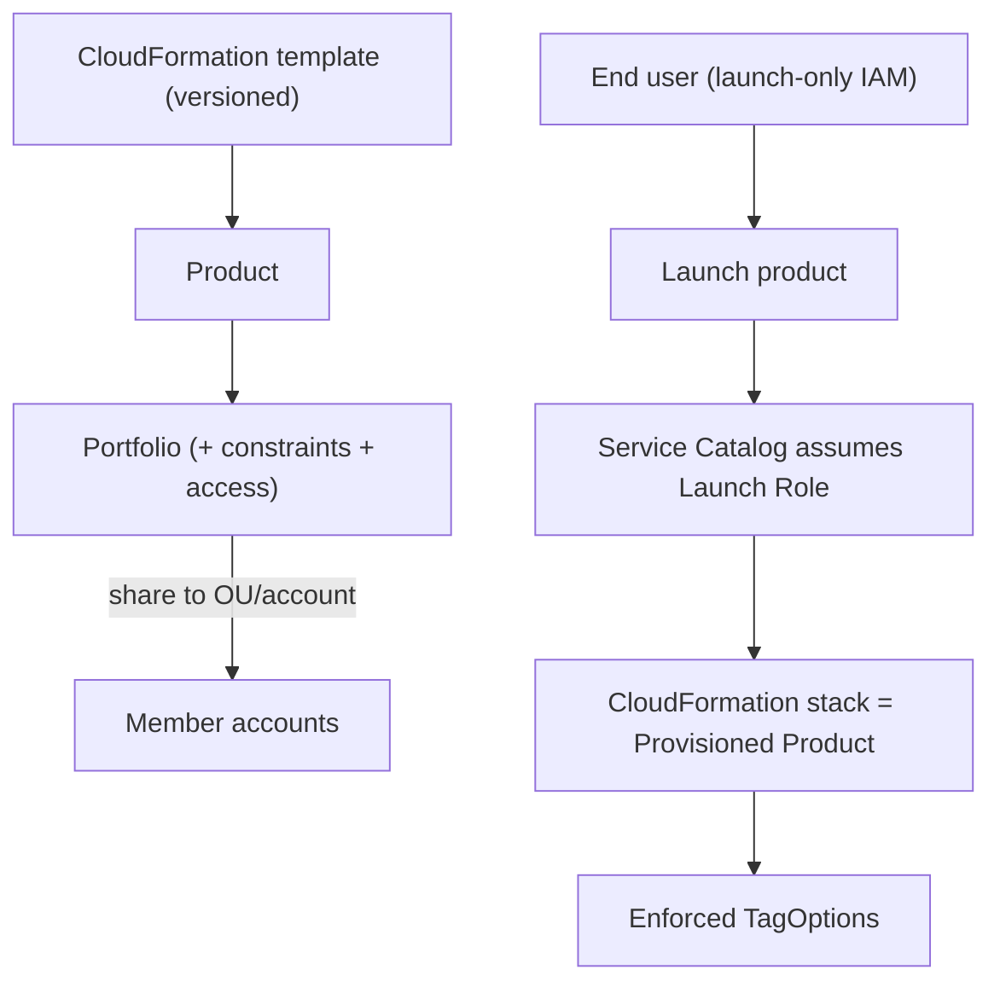

# AWS Service Catalog - Deep Dive

> Architecture, portfolios & sharing, launch vs template constraints, versions & lifecycle, org sharing & Account Factory relationship, end-user experience, limits, integrations, comparisons, best practices.

See also: [01 - AWS Service Catalog Intro bits & bytes](01%20-%20AWS%20Service%20Catalog%20Intro%20bits%20%26%20bytes.md) · [03 - AWS Service Catalog Exam Scenarios](03%20-%20AWS%20Service%20Catalog%20Exam%20Scenarios.md) · [04 - AWS Service Catalog SRE Operations](04%20-%20AWS%20Service%20Catalog%20SRE%20Operations.md) · [01 - AWS CloudFormation Intro bits & bytes](01%20-%20AWS%20CloudFormation%20Intro%20bits%20%26%20bytes.md) · [01 - AWS Account Factory and Landing Zone Intro bits & bytes](01%20-%20AWS%20Account%20Factory%20and%20Landing%20Zone%20Intro%20bits%20%26%20bytes.md)

---

## Table of Contents

- [1. Architecture](#1-architecture)
- [2. Portfolios and Sharing Models](#2-portfolios-and-sharing-models)
- [3. Constraints in Depth](#3-constraints-in-depth)
- [4. Product Versions and Lifecycle](#4-product-versions-and-lifecycle)
- [5. Organization Sharing and Account Factory](#5-organization-sharing-and-account-factory)
- [6. End-User Experience and APIs](#6-end-user-experience-and-apis)
- [7. Service Limits and Quotas](#7-service-limits-and-quotas)
- [8. Integration Matrix](#8-integration-matrix)
- [9. Comparisons](#9-comparisons)
- [10. Best Practices by Pillar](#10-best-practices-by-pillar)

---

---

## 1. Architecture

Service Catalog wraps **CloudFormation**: each product version is a template (a _provisioning artifact_). Admins group products into **portfolios**, attach **constraints**, and grant **access** to IAM principals or share portfolios to other accounts/OUs. End users browse and launch; Service Catalog provisions via a **launch role**, records the result as a **provisioned product**, and tracks its lifecycle (update/terminate).

[⬆ Back to top](#table-of-contents)

---

## 2. Portfolios and Sharing Models

- **Access within an account**: grant IAM users/groups/roles access to a portfolio.
- **Account-to-account sharing**: share a portfolio to another account (imported portfolio).
- **Organization sharing**: share to an **OU or the whole org** via AWS Organizations — the scalable model; new accounts can inherit shared portfolios.
- A shared portfolio's products stay centrally managed; updates propagate to importers.

[⬆ Back to top](#table-of-contents)

---

## 3. Constraints in Depth

| Constraint          | Detail                                                                                                                                                  |
| :------------------ | :------------------------------------------------------------------------------------------------------------------------------------------------------ |
| **Launch**          | Specifies the IAM **launch role**; decouples user perms from creation perms. Alternatively a **local launch role name** (StackSets/cross-account safe). |
| **Template**        | A JSON rule constraining allowed parameter values (instance types, AZs, regions, CIDRs).                                                                |
| **Notification**    | SNS topic for stack event notifications.                                                                                                                |
| **Stack Set**       | Launch the product across target accounts/regions with concurrency/failure tolerance.                                                                   |
| **TagOptions**      | Library of approved key/value tags enforced at launch (cost allocation/governance).                                                                     |
| **Resource update** | Control which tags can be changed on update.                                                                                                            |

[⬆ Back to top](#table-of-contents)

---

## 4. Product Versions and Lifecycle

- A product has multiple **versions** (provisioning artifacts); admins mark versions active/deprecated/guidance.
- Users launch a version; admins can push **updates** to provisioned products (move users to a new template version) — controlled change rollout.
- **Terminate** cleanly deletes the provisioned product's stack.
- Versioning enables safe iteration without breaking existing deployments.

[⬆ Back to top](#table-of-contents)

---

## 5. Organization Sharing and Account Factory

- **Control Tower Account Factory** is essentially a Service Catalog product that **vends new accounts** with a baseline — the canonical org-scale use. See [01 - AWS Account Factory and Landing Zone Intro bits & bytes](01%20-%20AWS%20Account%20Factory%20and%20Landing%20Zone%20Intro%20bits%20%26%20bytes.md).
- Org-shared portfolios let a central platform team distribute golden products (standard VPC, compliant data store, golden ASG) to every account automatically.
- Pairs with **StackSets** for multi-account provisioning and with **SCPs** to prevent out-of-catalog creation.

[⬆ Back to top](#table-of-contents)

---

## 6. End-User Experience and APIs

- Users see only products they're granted, with constrained parameters; they launch, update, and terminate **provisioned products** from the Service Catalog console or API.
- APIs: `ProvisionProduct`, `UpdateProvisionedProduct`, `TerminateProvisionedProduct`, `SearchProducts`.
- Integrates with **ServiceNow** and **Terraform** (Service Catalog supports external/Terraform-based products too) for enterprises with existing ITSM/IaC.

[⬆ Back to top](#table-of-contents)

---

## 7. Service Limits and Quotas

| Limit                  | Default               | Notes                               |
| :--------------------- | :-------------------- | :---------------------------------- |
| Portfolios per account | 100                   | Soft                                |
| Products per account   | 350                   | Soft                                |
| Products per portfolio | 100                   | Soft                                |
| Versions per product   | 100                   | Soft                                |
| Constraints            | per product/portfolio | —                                   |
| Provisioned products   | high                  | Bound by underlying resource quotas |

[⬆ Back to top](#table-of-contents)

---

## 8. Integration Matrix

| Service                    | Integration                                                                                 |
| :------------------------- | :------------------------------------------------------------------------------------------ |
| **CloudFormation**         | The provisioning engine for products → [01 - AWS CloudFormation Intro bits & bytes](01%20-%20AWS%20CloudFormation%20Intro%20bits%20%26%20bytes.md)       |
| **IAM**                    | Launch roles + end-user access; the permission-decoupling core                              |
| **Organizations**          | Org/OU portfolio sharing → [06 - IAM Identity Center & Organizations](06%20-%20IAM%20Identity%20Center%20%26%20Organizations.md)                     |
| **Control Tower**          | Account Factory product → [07 - AWS Control Tower](07%20-%20AWS%20Control%20Tower.md)                                        |
| **CloudTrail**             | Audits provision/update/terminate → [01 - AWS CloudTrail Intro bits & bytes](01%20-%20AWS%20CloudTrail%20Intro%20bits%20%26%20bytes.md)              |
| **Config**                 | Detect drift/compliance of provisioned resources → [24 - AWS Config & Audit Manager](24%20-%20AWS%20Config%20%26%20Audit%20Manager.md)      |
| **Budgets**                | Associate budgets to products/portfolios → [01 - AWS Budgets Fundamentals & Architecture](01%20-%20AWS%20Budgets%20Fundamentals%20%26%20Architecture.md) |
| **SNS**                    | Notification constraint                                                                     |
| **ServiceNow / Terraform** | External product types / ITSM integration                                                   |

[⬆ Back to top](#table-of-contents)

---

## 9. Comparisons

### Service Catalog vs raw CloudFormation

|                             | Service Catalog       | CloudFormation         |
| :-------------------------- | :-------------------- | :--------------------- |
| Self-service for non-admins | Yes (launch-only IAM) | No (need create perms) |
| Guardrails on parameters    | Template constraints  | DIY                    |
| Curated/versioned catalog   | Yes                   | No                     |
| Permission decoupling       | Launch role           | No                     |

### Service Catalog vs Control Tower guardrails

|         | Service Catalog                                | Control Tower                                     |
| :------ | :--------------------------------------------- | :------------------------------------------------ |
| Governs | **What can be provisioned** (curated products) | **What's allowed at all** (SCP/Config guardrails) |
| Layer   | Self-service provisioning                      | Org baseline/policy                               |

[⬆ Back to top](#table-of-contents)

---

## 10. Best Practices by Pillar

**Security** — least-privilege **launch roles**; users get launch-only IAM; enforce regions via template constraints; audit with CloudTrail.

**Operational Excellence** — version products; controlled updates to provisioned products; org-shared portfolios for consistency; templates in version control.

**Reliability** — test product versions in non-prod; deprecate old versions gracefully; StackSet constraints for multi-account.

**Cost Optimization** — template constraints cap sizes; mandatory **TagOptions** for cost allocation; associate **Budgets**.

**Performance Efficiency** — offer right-sized defaults; bake good architecture into products.

[⬆ Back to top](#table-of-contents)

---

> Continue to [03 - AWS Service Catalog Exam Scenarios](03%20-%20AWS%20Service%20Catalog%20Exam%20Scenarios.md).
