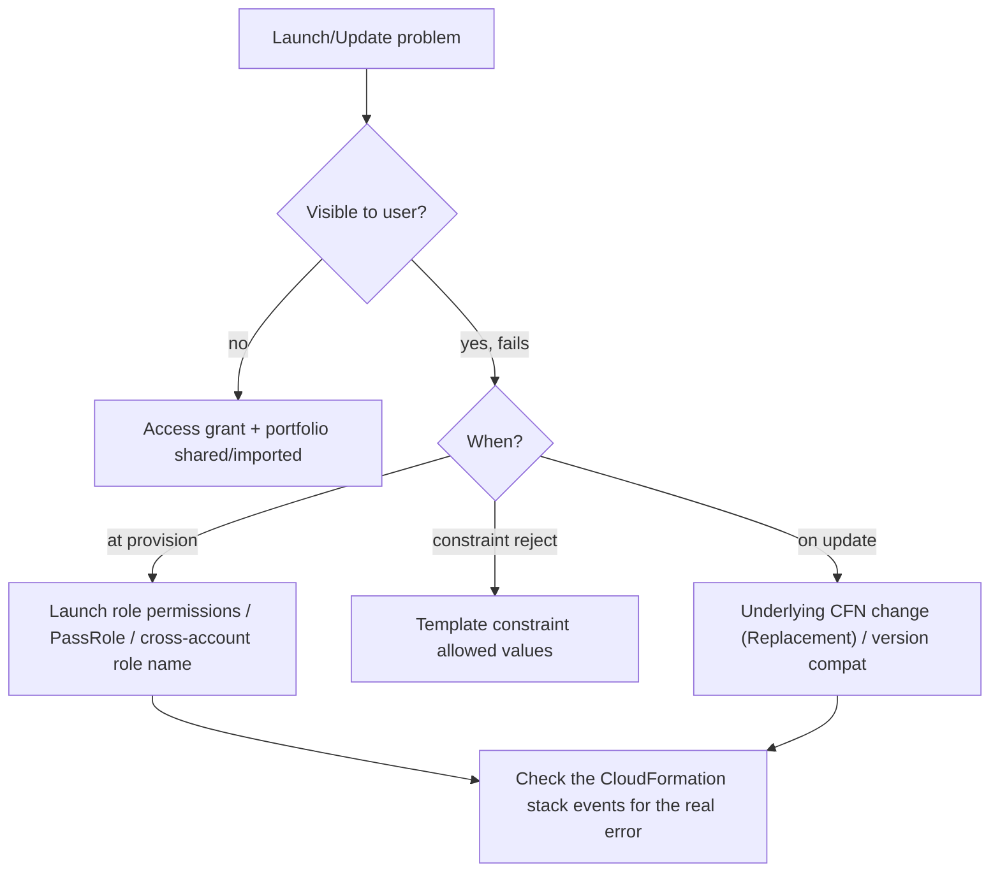

# AWS Service Catalog - SRE Operations

> Operational reality: launch failures, cross-account role gaps, real CLI examples, governance patterns, and cost ops.

See also: [01 - AWS Service Catalog Intro bits & bytes](01%20-%20AWS%20Service%20Catalog%20Intro%20bits%20%26%20bytes.md) · [02 - AWS Service Catalog Deep Dive](02%20-%20AWS%20Service%20Catalog%20Deep%20Dive.md) · [03 - AWS Service Catalog Exam Scenarios](03%20-%20AWS%20Service%20Catalog%20Exam%20Scenarios.md) · [01 - AWS CloudFormation Intro bits & bytes](01%20-%20AWS%20CloudFormation%20Intro%20bits%20%26%20bytes.md)

---

## Table of Contents

- [1. Common Errors (Symptom → Root Cause → Fix → Prevention)](#1-common-errors-symptom--root-cause--fix--prevention)
- [2. Troubleshooting Workflow](#2-troubleshooting-workflow)
- [3. What to Monitor](#3-what-to-monitor)
- [4. Runbooks](#4-runbooks)
- [5. Real Examples](#5-real-examples)
- [6. Production Patterns by Org Size](#6-production-patterns-by-org-size)
- [7. Cost Operations](#7-cost-operations)

---

## 1. Common Errors (Symptom → Root Cause → Fix → Prevention)

### Launch fails with AccessDenied during provisioning

- **Cause:** The **launch role** lacks permissions for a resource the template creates (or for `iam:PassRole`/`cloudformation:*`).
- **Fix:** Add the missing least-privilege permissions to the launch role.
- **Prevention:** Derive launch-role policy from the template's resources; test in non-prod.

### User can't see / launch a product

- **Cause:** No portfolio access grant, or portfolio not shared/imported into the account.
- **Fix:** Grant the principal access; share/import the portfolio.
- **Prevention:** Org sharing + group-based access.

### Cross-account launch role not found

- **Cause:** Shared portfolio references a launch role ARN that doesn't exist in the target account.
- **Fix:** Use a **local launch role name** present in each account (deploy via StackSet baseline).
- **Prevention:** Bake the named launch role into the account baseline.

### Template constraint rejects a valid value

- **Cause:** Constraint too strict / outdated allowed list.
- **Fix:** Update the template constraint's allowed values.
- **Prevention:** Review constraints with product version updates.

### Provisioned product update fails

- **Cause:** Replacement of a stateful resource, or new template version incompatible.
- **Fix:** Review the change set behavior; use DeletionPolicy/UpdateReplacePolicy on the underlying template.
- **Prevention:** Test version upgrades; stage rollouts.

[⬆ Back to top](#table-of-contents)

---

## 2. Troubleshooting Workflow



> The real error is almost always in the **underlying CloudFormation stack events** — open the provisioned product's stack.

[⬆ Back to top](#table-of-contents)

---

## 3. What to Monitor

| Signal                                     | Why                |
| :----------------------------------------- | :----------------- |
| Provision/Update/Terminate success rate    | Catalog health     |
| Launch-role AccessDenied trends            | Under-scoped roles |
| Provisioned product count per portfolio    | Adoption/cost      |
| Config compliance of provisioned resources | Post-launch drift  |
| Budget alerts per product                  | Cost control       |

[⬆ Back to top](#table-of-contents)

---

## 4. Runbooks

### Runbook: publish a new product

1. Author/validate the CloudFormation template; store in git.
2. Create product + version (provisioning artifact).
3. Add to portfolio; attach **launch**, **template**, **TagOptions**, and (if multi-account) **StackSet** constraints.
4. Grant access / share the portfolio org-wide.
5. Test launch as an end-user identity; verify tags/region enforcement.

### Runbook: rotate to a new version

1. Add new provisioning artifact; mark old deprecated.
2. Communicate; update provisioned products in batches.
3. Verify Config compliance post-update.

[⬆ Back to top](#table-of-contents)

---

## 5. Real Examples

### Create portfolio, product, launch constraint (CLI)

```bash
aws servicecatalog create-portfolio --display-name "Platform" --provider-name "PlatformTeam"

aws servicecatalog create-product --name "Compliant-RDS" --owner "PlatformTeam" \
  --product-type CLOUD_FORMATION_TEMPLATE \
  --provisioning-artifact-parameters '{"Name":"v1","Info":{"LoadTemplateFromURL":"https://s3.../rds.yaml"},"Type":"CLOUD_FORMATION_TEMPLATE"}'

# Launch constraint: provision using a least-privilege role
aws servicecatalog create-constraint --portfolio-id port-xxx --product-id prod-xxx \
  --type LAUNCH --parameters '{"RoleArn":"arn:aws:iam::111111111111:role/SC-RDS-Launch"}'
```

### Template constraint (limit instance type)

```json
{
  "Rules": {
    "Sizing": {
      "Assertions": [
        {
          "Assert": {
            "Fn::Contains": [
              ["db.t3.micro", "db.t3.small"],
              { "Ref": "DBClass" }
            ]
          },
          "AssertDescription": "Only t3.micro/small allowed"
        }
      ]
    }
  }
}
```

### End-user launches a product

```bash
aws servicecatalog provision-product --product-id prod-xxx \
  --provisioning-artifact-id pa-xxx --provisioned-product-name my-db \
  --provisioning-parameters Key=DBClass,Value=db.t3.small
```

### Launch role (least privilege, scoped to the product's resources)

```json
{
  "Version": "2012-10-17",
  "Statement": [
    {
      "Effect": "Allow",
      "Action": [
        "cloudformation:*",
        "rds:CreateDBInstance",
        "rds:DescribeDBInstances",
        "rds:DeleteDBInstance",
        "ec2:CreateSecurityGroup",
        "ec2:AuthorizeSecurityGroupIngress"
      ],
      "Resource": "*"
    }
  ]
}
```

[⬆ Back to top](#table-of-contents)

---

## 6. Production Patterns by Org Size

| Context           | Pattern                                                                                                                      |
| :---------------- | :--------------------------------------------------------------------------------------------------------------------------- |
| **Startup**       | A few products for common stacks; single account; launch-only IAM for devs.                                                  |
| **SMB**           | Template constraints for sizing; TagOptions; budgets per product.                                                            |
| **Enterprise**    | Org-shared portfolios; local launch roles via account baseline; SCPs to force catalog-only creation; ServiceNow integration. |
| **Regulated**     | Versioned approved templates; least-privilege launch roles; CloudTrail audit; Config compliance; documented provenance.      |
| **Multi-Account** | Account Factory + golden product portfolios distributed org-wide.                                                            |

[⬆ Back to top](#table-of-contents)

---

## 7. Cost Operations

- **Template constraints** cap instance sizes — direct cost control.
- **TagOptions** enforce cost-allocation tags → accurate showback/chargeback.
- **Budgets** associated to products/portfolios alert on overspend.
- Standardized products avoid expensive misconfigurations and rework.
- Terminate unused **provisioned products** to stop their resource charges.

[⬆ Back to top](#table-of-contents)

---

Related: [01 - AWS Service Catalog Intro bits & bytes](01%20-%20AWS%20Service%20Catalog%20Intro%20bits%20%26%20bytes.md) · [02 - AWS Service Catalog Deep Dive](02%20-%20AWS%20Service%20Catalog%20Deep%20Dive.md) · [03 - AWS Service Catalog Exam Scenarios](03%20-%20AWS%20Service%20Catalog%20Exam%20Scenarios.md) · [01 - AWS CloudFormation Intro bits & bytes](01%20-%20AWS%20CloudFormation%20Intro%20bits%20%26%20bytes.md) · [07 - AWS Control Tower](07%20-%20AWS%20Control%20Tower.md) · [24 - AWS Config & Audit Manager](24%20-%20AWS%20Config%20%26%20Audit%20Manager.md)
