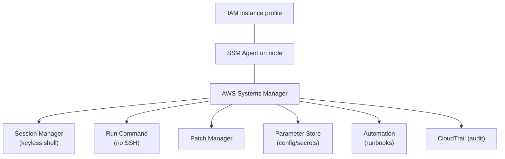

# AWS Systems Manager - Intro bits & bytes

> Systems Manager (SSM) is the **operations hub** for AWS: patch fleets, run commands without SSH, store config & secrets, open keyless shell sessions, and automate runbooks — all IAM-governed and CloudTrail-audited. It's the answer to "manage my servers at scale, securely."

See also: [02 - AWS Systems Manager Deep Dive](02%20-%20AWS%20Systems%20Manager%20Deep%20Dive.md) · [03 - AWS Systems Manager Exam Scenarios](03%20-%20AWS%20Systems%20Manager%20Exam%20Scenarios.md) · [04 - AWS Systems Manager SRE Operations](04%20-%20AWS%20Systems%20Manager%20SRE%20Operations.md) · [01 - AWS CLI Intro bits & bytes](01%20-%20AWS%20CLI%20Intro%20bits%20%26%20bytes.md) · [22 - Secrets Manager vs SSM Parameter Store](22%20-%20Secrets%20Manager%20vs%20SSM%20Parameter%20Store.md)

---

## Table of Contents

- [1. The Problem It Solves](#1-the-problem-it-solves)
- [2. The Capability Map](#2-the-capability-map)
- [3. The SSM Agent and Managed Nodes](#3-the-ssm-agent-and-managed-nodes)
- [4. The Big Five for the Exam](#4-the-big-five-for-the-exam)
- [5. When To Use It / When NOT To Use It](#5-when-to-use-it--when-not-to-use-it)
- [6. Parameter Store vs Secrets Manager](#6-parameter-store-vs-secrets-manager)
- [7. Cost Considerations](#7-cost-considerations)
- [8. Mini-Quiz](#8-mini-quiz)

---

---

## 1. The Problem It Solves

Managing fleets the old way meant **SSH keys, bastion hosts, open inbound ports, manual patching, and config sprawl** — every one a security and operational liability. Systems Manager replaces all of it with an **agent + IAM** model: you operate instances (and on-prem/other-cloud servers) through AWS APIs, with no inbound ports, no shared keys, and full audit.

> Mental model: SSM turns "log into the box" into "**call an API that the agent executes**." Access is IAM, every action is in CloudTrail, and you never open SSH/RDP to the internet.

[⬆ Back to top](#table-of-contents)

---

## 2. The Capability Map

| Group                      | Capabilities                                                                                                                      |
| :------------------------- | :-------------------------------------------------------------------------------------------------------------------------------- |
| **Node management**        | Fleet Manager, Session Manager, Run Command, State Manager, Patch Manager, Inventory, Compliance, Distributor, Hybrid Activations |
| **Application management** | Parameter Store, Application Manager, AppConfig                                                                                   |
| **Change management**      | Automation (runbooks), Change Manager, Change Calendar, Maintenance Windows, OpsCenter                                            |
| **Operations insight**     | Explorer, OpsCenter, Incident Manager (operational dashboards & incidents)                                                        |

You don't need every feature for the exam — focus on the Big Five (below).

[⬆ Back to top](#table-of-contents)

---

## 3. The SSM Agent and Managed Nodes

- The **SSM Agent** runs on the instance (pre-installed on Amazon Linux, recent Ubuntu, Windows AMIs) and polls SSM. No inbound ports — it makes **outbound** calls.
- For SSM to manage a node it needs:
  1. The **agent** running, and
  2. An **IAM instance profile** with `AmazonSSMManagedInstanceCore` (or scoped equivalent), and
  3. **Network path** to SSM endpoints (NAT/IGW, or **VPC interface endpoints** for fully private subnets).
- **Hybrid Activations** extend management to **on-premises** and other-cloud servers — they become "managed nodes" too.

> Exam staple: "instance not appearing as a managed node" → check agent running, instance profile permissions, and connectivity to SSM endpoints (private subnets need interface endpoints).

[⬆ Back to top](#table-of-contents)

---

## 4. The Big Five for the Exam

| Capability          | What it does                                                               | Replaces / why                                       |
| :------------------ | :------------------------------------------------------------------------- | :--------------------------------------------------- |
| **Session Manager** | Browser/CLI shell to a node, no SSH key, no open port, fully logged        | Replaces bastion hosts + SSH; audit to S3/CloudWatch |
| **Run Command**     | Execute a document (script) across many nodes at once                      | Replaces SSH-loops; IAM-gated, audited               |
| **Patch Manager**   | Define patch baselines, scan & install on a schedule (Maintenance Windows) | Fleet-wide compliant patching                        |
| **Parameter Store** | Hierarchical store for config & secrets (SecureString via KMS)             | Centralized config; free standard tier               |
| **Automation**      | Multi-step runbooks (documents) for ops tasks & remediation                | Self-healing, AMI builds, Config remediation         |

[⬆ Back to top](#table-of-contents)

---

## 5. When To Use It / When NOT To Use It

**Use it for:** keyless secure access (Session Manager), fleet command execution, patch compliance, centralized configuration, operational automation/runbooks, and hybrid/on-prem management.

**Reach elsewhere when:**

- You need **declarative infrastructure provisioning** → CloudFormation/CDK (SSM operates _on_ resources, doesn't define infra).
- You need a true **secrets lifecycle** (automatic rotation, cross-account sharing) → **Secrets Manager**.
- You need **container orchestration** → ECS/EKS (though SSM Exec can shell into containers/ECS).
- You need **APM/observability** → CloudWatch/X-Ray.

[⬆ Back to top](#table-of-contents)

---

## 6. Parameter Store vs Secrets Manager

|                       | Parameter Store                            | Secrets Manager              |
| :-------------------- | :----------------------------------------- | :--------------------------- |
| Primary use           | Config + simple secrets                    | Secrets with lifecycle       |
| Automatic rotation    | No (DIY via Lambda)                        | **Yes**, built-in (RDS etc.) |
| Cost                  | **Standard tier free**; advanced tier paid | Per secret + per API call    |
| Cross-account sharing | Limited                                    | Resource policies            |
| Encryption            | KMS (SecureString)                         | KMS (always)                 |

> Exam cue: "**automatic rotation** / managed database credentials" → **Secrets Manager**. "Cheap/free centralized **config** (and basic secrets)" → **Parameter Store**. See [22 - Secrets Manager vs SSM Parameter Store](22%20-%20Secrets%20Manager%20vs%20SSM%20Parameter%20Store.md).

[⬆ Back to top](#table-of-contents)

---

## 7. Cost Considerations

- **Core features are free**: Session Manager, Run Command, Patch Manager, State Manager, Inventory, **Parameter Store standard tier**.
- **Paid**: Parameter Store **advanced** tier (more/larger params, parameter policies), **Automation** beyond the free allotment (per step), **on-prem/hybrid** managed instances (per-node "advanced-instances" tier when exceeding the on-prem free model), high-volume API throughput.
- You still pay for the **resources** SSM acts on (e.g. the compute during a patch window).
- Hidden savings: eliminating **bastion hosts** and **NAT** (with interface endpoints) reduces cost and attack surface.

[⬆ Back to top](#table-of-contents)

---

## 8. Mini-Quiz

**Q1:** Give engineers shell access to private instances with no SSH keys and no open ports, fully audited.
_A:_ **Session Manager**.

**Q2:** Patch 800 instances on a schedule with compliance reporting.
_A:_ **Patch Manager** + **Maintenance Windows**.

**Q3:** Store a DB password that must **auto-rotate**.
_A:_ **Secrets Manager** (Parameter Store doesn't auto-rotate).

**Q4:** Instance isn't showing as a managed node — likely causes?
_A:_ Agent not running, missing instance-profile permissions, or no network path to SSM (private subnet needs interface endpoints).

**Q5:** Run the same script across a fleet, IAM-controlled and logged.
_A:_ **Run Command**.

---

> Continue to [02 - AWS Systems Manager Deep Dive](02%20-%20AWS%20Systems%20Manager%20Deep%20Dive.md).
