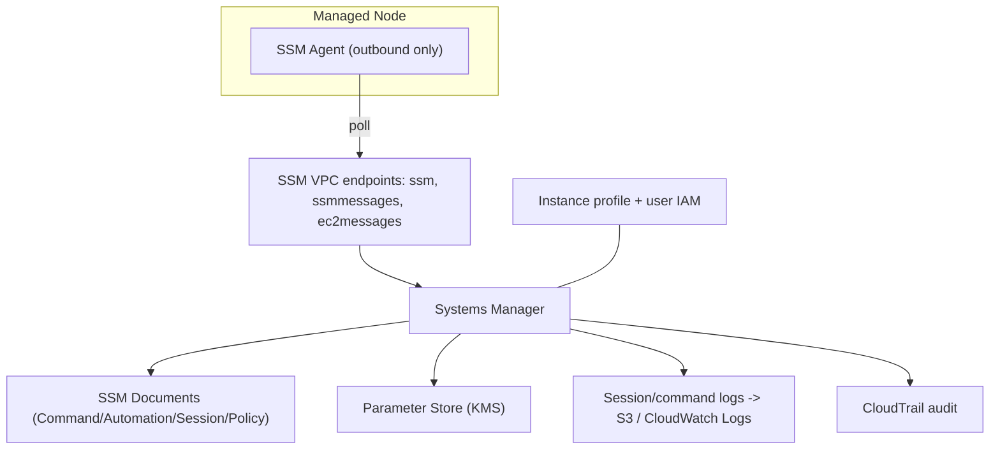

# AWS Systems Manager - Deep Dive

> Architecture & agent model, documents (SSM docs), Session Manager internals, Run Command/State Manager, Patch Manager & Maintenance Windows, Parameter Store internals, Automation runbooks, private connectivity, limits, integrations, comparisons, best practices.

See also: [01 - AWS Systems Manager Intro bits & bytes](01%20-%20AWS%20Systems%20Manager%20Intro%20bits%20%26%20bytes.md) · [03 - AWS Systems Manager Exam Scenarios](03%20-%20AWS%20Systems%20Manager%20Exam%20Scenarios.md) · [04 - AWS Systems Manager SRE Operations](04%20-%20AWS%20Systems%20Manager%20SRE%20Operations.md) · [01 - AWS CloudFormation Intro bits & bytes](01%20-%20AWS%20CloudFormation%20Intro%20bits%20%26%20bytes.md) · [24 - AWS Config & Audit Manager](24%20-%20AWS%20Config%20%26%20Audit%20Manager.md)

---

## Table of Contents

- [1. Architecture and the Agent Model](#1-architecture-and-the-agent-model)
- [2. SSM Documents (The Unit of Work)](#2-ssm-documents-the-unit-of-work)
- [3. Session Manager Internals](#3-session-manager-internals)
- [4. Run Command and State Manager](#4-run-command-and-state-manager)
- [5. Patch Manager and Maintenance Windows](#5-patch-manager-and-maintenance-windows)
- [6. Parameter Store Internals](#6-parameter-store-internals)
- [7. Automation Runbooks](#7-automation-runbooks)
- [8. Private Connectivity (VPC Endpoints)](#8-private-connectivity-vpc-endpoints)
- [9. Service Limits and Quotas](#9-service-limits-and-quotas)
- [10. Integration Matrix](#10-integration-matrix)
- [11. Comparisons](#11-comparisons)
- [12. Best Practices by Pillar](#12-best-practices-by-pillar)

---

---

## 1. Architecture and the Agent Model

The SSM Agent makes **outbound HTTPS** calls to three service endpoints — `ssm` (core), `ssmmessages` (Session Manager data channel), and `ec2messages` (Run Command) — and executes work locally. Because traffic is **agent-initiated outbound**, you never open inbound SSH/RDP. Access control is split: **instance-side** (instance profile lets the agent talk to SSM) and **operator-side** (IAM policies/conditions govern who can start sessions, run commands, read parameters).

[⬆ Back to top](#table-of-contents)

---

## 2. SSM Documents (The Unit of Work)

A **document (SSM doc)** defines what SSM does. Types:

| Type           | Used by                     | Example                                              |
| :------------- | :-------------------------- | :--------------------------------------------------- |
| **Command**    | Run Command / State Manager | `AWS-RunShellScript`, `AWS-RunPatchBaseline`         |
| **Automation** | Automation                  | `AWS-RestartEC2Instance`, custom multi-step runbooks |
| **Session**    | Session Manager             | `SSM-SessionManagerRunShell` (logging/prefs)         |
| **Policy**     | State Manager               | Inventory collection                                 |

Docs are versioned, shareable across accounts, and written in YAML/JSON. AWS provides hundreds of managed docs; you can author custom ones.

[⬆ Back to top](#table-of-contents)

---

## 3. Session Manager Internals

- Opens an interactive shell via the `ssmmessages` channel — **no inbound port, no SSH key, no bastion**.
- **Logging**: full session activity to **S3** and/or **CloudWatch Logs** (and keystroke logging optional) — strong auditability.
- **Access control**: IAM (who can `StartSession`, on which tagged instances), optionally with MFA conditions.
- **Port forwarding**: tunnel to a port on the instance (or, via the instance, to RDS/remote hosts) without exposing it publicly.
- Works for **private-subnet** instances (with endpoints) and hybrid nodes.

[⬆ Back to top](#table-of-contents)

---

## 4. Run Command and State Manager

- **Run Command**: one-off execution of a Command doc across targets selected by instance IDs or **tags / resource groups**; rate control, error thresholds, and output to S3/CloudWatch.
- **State Manager**: enforces a **desired state** on a schedule (e.g. "agent installed," "domain joined," "inventory collected," "this config applied") — drift back into compliance automatically. Think "config management lite."

[⬆ Back to top](#table-of-contents)

---

## 5. Patch Manager and Maintenance Windows

- **Patch baselines**: rules for which patches are approved (by severity, classification, auto-approval delay), per OS; default baselines exist per platform.
- **Patch groups**: tag-based grouping so different fleets get different baselines/schedules.
- **Maintenance Windows**: scheduled windows to run patching (and other tasks) with concurrency/error limits to bound blast radius.
- **Compliance**: reports which nodes are compliant/non-compliant; integrates with Config and Security Hub.

[⬆ Back to top](#table-of-contents)

---

## 6. Parameter Store Internals

- **Hierarchical** keys (`/app/prod/db/url`) enable path-based IAM and bulk `GetParametersByPath`.
- Types: `String`, `StringList`, `SecureString` (KMS-encrypted).
- **Standard** tier (free, up to 10,000 params, 4 KB) vs **Advanced** tier (paid, up to 100,000, 8 KB, **parameter policies** like expiration/notification).
- **Versioning** and **labels**; integrates as **dynamic references** in CloudFormation (`{{resolve:ssm:...}}`) and with most AWS services.
- Can reference Secrets Manager secrets via a `secretsmanager` path.

[⬆ Back to top](#table-of-contents)

---

## 7. Automation Runbooks

- **Automation documents** chain steps (AWS API calls, Run Command, approvals, branching, Lambda) into runbooks.
- Uses: **self-healing** (restart/replace unhealthy resources), **AMI build/patch pipelines**, **Config rule remediation**, controlled **Change Manager** approvals, scheduled ops.
- Runs under an **assume role** (least privilege), with rate control and safety checks.

[⬆ Back to top](#table-of-contents)

---

## 8. Private Connectivity (VPC Endpoints)

For instances in **private subnets with no internet**, create **interface VPC endpoints** for `com.amazonaws.<region>.ssm`, `.ssmmessages`, and `.ec2messages` (plus `s3`/`logs` gateway/interface endpoints for session logging and patch downloads). This is the canonical way to use SSM **without** a NAT gateway or bastion — cheaper and more secure.

[⬆ Back to top](#table-of-contents)

---

## 9. Service Limits and Quotas

| Limit                    | Default                   | Notes                                      |
| :----------------------- | :------------------------ | :----------------------------------------- |
| Parameter Store standard | 10,000 params, 4 KB each  | Free                                       |
| Parameter Store advanced | 100,000 params, 8 KB      | Paid; parameter policies                   |
| Run Command targets      | large (rate-controlled)   | Use concurrency/error limits               |
| Automation steps         | bounded per execution     | Use sub-automations                        |
| Session duration         | configurable idle timeout | Logging to S3/CWL                          |
| API throughput           | per-API rate limits       | SecureString GET may be throttled at scale |

[⬆ Back to top](#table-of-contents)

---

## 10. Integration Matrix

| Service             | Integration                                                                                                                           |
| :------------------ | :------------------------------------------------------------------------------------------------------------------------------------ |
| **IAM**             | Instance profile (`AmazonSSMManagedInstanceCore`) + operator policies/conditions                                                      |
| **CloudWatch**      | Agent config in Parameter Store; session/command logs; OpsCenter; alarms → Automation → [01 - Amazon CloudWatch Intro bits & bytes](01%20-%20Amazon%20CloudWatch%20Intro%20bits%20%26%20bytes.md) |
| **CloudTrail**      | Audits all SSM actions → [01 - AWS CloudTrail Intro bits & bytes](01%20-%20AWS%20CloudTrail%20Intro%20bits%20%26%20bytes.md)                                                                   |
| **Config**          | Remediation via Automation; managed-instance compliance → [24 - AWS Config & Audit Manager](24%20-%20AWS%20Config%20%26%20Audit%20Manager.md)                                         |
| **CloudFormation**  | Dynamic references to parameters; provision SSM resources → [01 - AWS CloudFormation Intro bits & bytes](01%20-%20AWS%20CloudFormation%20Intro%20bits%20%26%20bytes.md)                            |
| **Secrets Manager** | SecureString alternative with rotation → [22 - Secrets Manager vs SSM Parameter Store](22%20-%20Secrets%20Manager%20vs%20SSM%20Parameter%20Store.md)                                              |
| **KMS**             | Encrypt SecureString parameters & session logs                                                                                        |
| **EventBridge**     | Trigger Automation on events/schedule → [01 - EventBridge Governance Integrations Intro bits & bytes](01%20-%20EventBridge%20Governance%20Integrations%20Intro%20bits%20%26%20bytes.md)                               |
| **Security Hub**    | Patch compliance findings; automated response                                                                                         |

[⬆ Back to top](#table-of-contents)

---

## 11. Comparisons

### Session Manager vs SSH/Bastion

|                 | Session Manager    | SSH + Bastion            |
| :-------------- | :----------------- | :----------------------- |
| Inbound ports   | **None**           | 22 open (attack surface) |
| Keys            | None (IAM)         | SSH key management       |
| Audit           | S3/CloudWatch logs | DIY                      |
| Private subnets | Yes (endpoints)    | Needs bastion/NAT        |

### Run Command vs Custom Scripts over SSH

|                    | Run Command          | SSH loop          |
| :----------------- | :------------------- | :---------------- |
| Access             | IAM, no ports        | Keys + ports      |
| Targeting          | Tags/resource groups | Manual host lists |
| Audit/rate control | Built-in             | DIY               |

### SSM Automation vs Lambda vs Step Functions

|                | Automation                              | Lambda         | Step Functions             |
| :------------- | :-------------------------------------- | :------------- | :------------------------- |
| Best for       | Ops runbooks on AWS resources/instances | Arbitrary code | Complex stateful workflows |
| Built-in steps | AWS API/Run Command/approvals           | None           | State machine              |

[⬆ Back to top](#table-of-contents)

---

## 12. Best Practices by Pillar

**Security** — Session Manager instead of SSH/bastion; log sessions to S3/CWL; IAM conditions (tags, MFA) on `StartSession`/`SendCommand`; SecureString + least-privilege KMS; private endpoints.

**Operational Excellence** — runbooks as Automation docs; State Manager for desired state; agent config centralized in Parameter Store; Change Calendar to freeze risky windows.

**Reliability** — Maintenance Windows with concurrency/error limits; Automation for self-healing; patch compliance reporting.

**Cost Optimization** — drop bastions/NAT via endpoints; Parameter Store standard tier; bound automation/patch concurrency.

**Performance** — cache/batch parameter reads (`GetParametersByPath`); avoid per-request SecureString throttling.

[⬆ Back to top](#table-of-contents)

---

> Continue to [03 - AWS Systems Manager Exam Scenarios](03%20-%20AWS%20Systems%20Manager%20Exam%20Scenarios.md).
