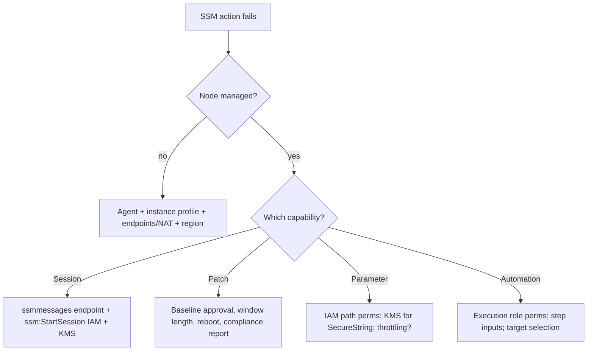

# AWS Systems Manager - SRE Operations

> Operational reality: why nodes go missing, session/patch failures, real CLI/runbook examples, fleet patterns, and cost/security ops.

See also: [01 - AWS Systems Manager Intro bits & bytes](01%20-%20AWS%20Systems%20Manager%20Intro%20bits%20%26%20bytes.md) · [02 - AWS Systems Manager Deep Dive](02%20-%20AWS%20Systems%20Manager%20Deep%20Dive.md) · [03 - AWS Systems Manager Exam Scenarios](03%20-%20AWS%20Systems%20Manager%20Exam%20Scenarios.md) · [01 - Amazon CloudWatch Intro bits & bytes](01%20-%20Amazon%20CloudWatch%20Intro%20bits%20%26%20bytes.md)

---

## Table of Contents

- [1. Common Errors (Symptom → Root Cause → Fix → Prevention)](#1-common-errors-symptom--root-cause--fix--prevention)
- [2. Troubleshooting Workflow](#2-troubleshooting-workflow)
- [3. What to Monitor](#3-what-to-monitor)
- [4. Runbooks](#4-runbooks)
- [5. Real Examples](#5-real-examples)
- [6. Production Patterns by Org Size](#6-production-patterns-by-org-size)
- [7. Cost & Security Operations](#7-cost--security-operations)
- [8. Disaster Recovery Considerations](#8-disaster-recovery-considerations)

---

## 1. Common Errors (Symptom → Root Cause → Fix → Prevention)

### Instance not listed as a managed node

- **Cause:** Agent not running/old; instance profile missing `AmazonSSMManagedInstanceCore`; no network path (private subnet without endpoints); wrong region.
- **Fix:** Start/upgrade agent; attach the policy; add interface endpoints or NAT; check region.
- **Prevention:** Bake agent + role into AMIs/Launch Templates; deploy endpoints via StackSets.

### Session Manager won't connect

- **Cause:** Missing `ssmmessages` endpoint/route; operator IAM lacks `StartSession`; KMS key for session encryption inaccessible.
- **Fix:** Add endpoint; grant scoped `ssm:StartSession`; fix KMS grant.
- **Prevention:** Standard session preferences doc + endpoint baseline.

### Patch shows non-compliant

- **Cause:** Baseline approval rules exclude the patch; window too short; reboot suppressed; agent/connectivity.
- **Fix:** Adjust baseline/auto-approval; lengthen window; allow reboot.
- **Prevention:** Test baselines on a canary patch group first.

### `GetParameter` throttled

- **Cause:** High read rate on a hot parameter.
- **Fix:** Cache/batch (`GetParametersByPath`), use parameter caching, raise throughput tier.
- **Prevention:** Read at startup + cache; avoid per-request fetch.

### Automation step fails / stuck

- **Cause:** Assume-role lacks permission; target not reachable; bad input.
- **Fix:** Check execution role, step inputs, target selection; review the failed step output.
- **Prevention:** Least-privilege role tested; rate control; idempotent steps.

[⬆ Back to top](#table-of-contents)

---

## 2. Troubleshooting Workflow



> First check is always **"is it a managed node?"** — most SSM problems are the three prerequisites (agent, IAM, network).

[⬆ Back to top](#table-of-contents)

---

## 3. What to Monitor

| Signal                                     | Why                  |
| :----------------------------------------- | :------------------- |
| Managed-node count vs fleet size           | Coverage gaps        |
| Patch compliance %                         | Security posture     |
| Failed Run Command / Automation executions | Operational health   |
| Session count + duration (logs)            | Access audit         |
| Parameter `GetParameter` throttles         | Config read pressure |
| Agent version distribution                 | Drift/upgrade need   |

[⬆ Back to top](#table-of-contents)

---

## 4. Runbooks

### Runbook: onboard a private fleet to SSM

1. Attach instance profile with `AmazonSSMManagedInstanceCore`.
2. Create interface endpoints (ssm, ssmmessages, ec2messages) + S3 gateway + logs endpoint.
3. Confirm nodes appear in Fleet Manager.
4. Set session logging (S3/CWL) via session preferences doc.
5. Create patch baseline + Maintenance Window; tag patch groups.

### Runbook: emergency investigate a host

1. `aws ssm start-session --target i-...` (no key, audited).
2. Collect evidence; if needed, `start-automation-execution` to capture logs/snapshot.
3. Remediate; record in OpsCenter/Incident Manager.

[⬆ Back to top](#table-of-contents)

---

## 5. Real Examples

### Start a session / run a command

```bash
aws ssm start-session --target i-0123456789abcdef0

aws ssm send-command \
  --document-name "AWS-RunShellScript" \
  --targets "Key=tag:Env,Values=prod" \
  --parameters 'commands=["yum -y update httpd"]' \
  --max-concurrency 10% --max-errors 5 \
  --output-s3-bucket-name ssm-cmd-logs
```

### Put / get parameters

```bash
aws ssm put-parameter --name /web/prod/db/url --type String --value "db.internal:5432"
aws ssm put-parameter --name /web/prod/db/password --type SecureString \
  --value "s3cr3t" --key-id alias/app-kms
aws ssm get-parameters-by-path --path /web/prod/ --with-decryption --recursive
```

### Patch baseline + maintenance window (concept)

```bash
aws ssm create-patch-baseline --name prod-linux \
  --operating-system AMAZON_LINUX_2 \
  --approval-rules 'PatchRules=[{PatchFilterGroup={PatchFilters=[{Key=CLASSIFICATION,Values=[Security,Bugfix]}]},ApproveAfterDays=7,ComplianceLevel=CRITICAL}]'
# associate baseline to a patch group tag, then schedule AWS-RunPatchBaseline in a Maintenance Window
```

### IAM: scope Session Manager to tagged hosts with MFA

```json
{
  "Version": "2012-10-17",
  "Statement": [
    {
      "Effect": "Allow",
      "Action": "ssm:StartSession",
      "Resource": "arn:aws:ec2:*:*:instance/*",
      "Condition": {
        "StringEquals": { "ssm:resourceTag/Team": "payments" },
        "Bool": { "aws:MultiFactorAuthPresent": "true" }
      }
    }
  ]
}
```

[⬆ Back to top](#table-of-contents)

---

## 6. Production Patterns by Org Size

| Context           | Pattern                                                                                                              |
| :---------------- | :------------------------------------------------------------------------------------------------------------------- |
| **Startup**       | Session Manager instead of SSH; Parameter Store for config; basic patch baseline.                                    |
| **SMB**           | Patch groups + Maintenance Windows; State Manager for desired state; session logging.                                |
| **Enterprise**    | Endpoints + no bastions; Automation runbooks for self-heal; Change Manager/Calendar; agent baked into AMIs.          |
| **Regulated**     | Keystroke logging, MFA + tag-scoped access, central log-archive account, Config remediation, SCP-enforced baselines. |
| **Multi-Account** | SSM baselines via StackSets; central OpsCenter; org-wide patch compliance reporting.                                 |
| **Hybrid**        | Hybrid Activations for on-prem/other-cloud; unified patch + inventory.                                               |

[⬆ Back to top](#table-of-contents)

---

## 7. Cost & Security Operations

- **Security:** no inbound SSH/RDP; Session Manager logging; IAM conditions (tags/MFA) on session/command; SecureString + scoped KMS; private endpoints; SCP to require logging/forbid `ssm:StartSession` without tags.
- **Cost:** remove **bastions + NAT** (endpoints); use Parameter Store **standard** tier; bound automation/patch **concurrency**; advanced parameter tier only when needed.
- **Hygiene:** keep agents current (State Manager); review managed-node coverage; alert on patch non-compliance.

[⬆ Back to top](#table-of-contents)

---

## 8. Disaster Recovery Considerations

- Store **agent config, automation runbooks, and parameters in IaC / git** so the operational tooling is reproducible in a DR region.
- Replicate critical **parameters/secrets** (multi-region) so apps can read config after failover.
- Pre-create **SSM endpoints** and **session logging** in the DR region.
- Use **Automation runbooks** as the executable DR procedure (scale up, restore, reconfigure) triggered by EventBridge/Incident Manager.
- Patch baselines/Maintenance Windows should exist in DR so recovered fleets stay compliant.

[⬆ Back to top](#table-of-contents)

---

Related: [01 - AWS Systems Manager Intro bits & bytes](01%20-%20AWS%20Systems%20Manager%20Intro%20bits%20%26%20bytes.md) · [02 - AWS Systems Manager Deep Dive](02%20-%20AWS%20Systems%20Manager%20Deep%20Dive.md) · [03 - AWS Systems Manager Exam Scenarios](03%20-%20AWS%20Systems%20Manager%20Exam%20Scenarios.md) · [22 - Secrets Manager vs SSM Parameter Store](22%20-%20Secrets%20Manager%20vs%20SSM%20Parameter%20Store.md) · [24 - AWS Config & Audit Manager](24%20-%20AWS%20Config%20%26%20Audit%20Manager.md) · [01 - Amazon CloudWatch Intro bits & bytes](01%20-%20Amazon%20CloudWatch%20Intro%20bits%20%26%20bytes.md)
