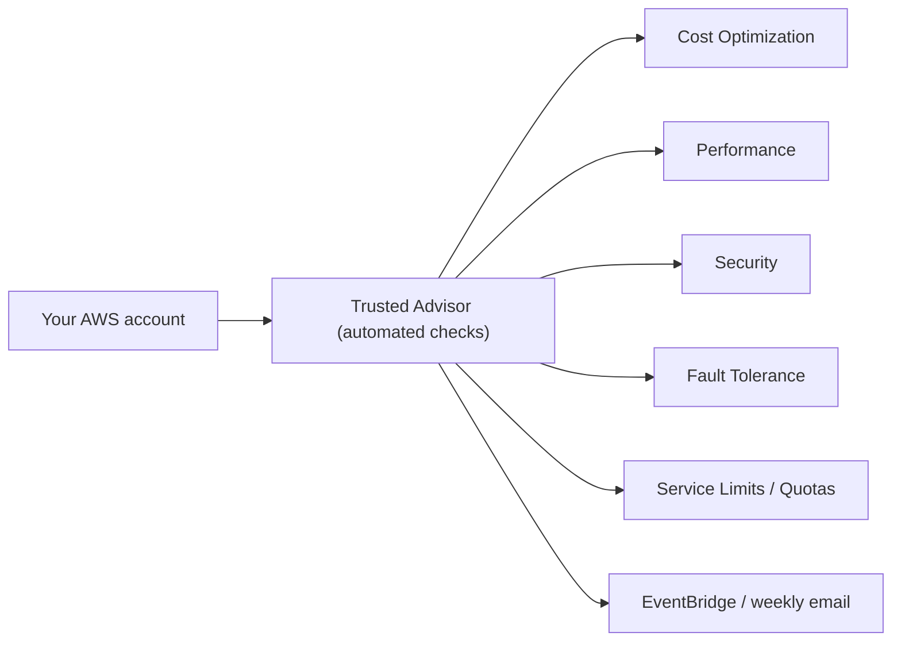

# AWS Trusted Advisor - Intro bits & bytes

> Trusted Advisor is an automated **best-practice checker**: it continuously inspects your account and flags issues across five pillars — **cost, performance, security, fault tolerance, and service limits** — with recommended actions. Think "a free automated AWS consultant that reviews your account."

See also: [02 - AWS Trusted Advisor Deep Dive](02%20-%20AWS%20Trusted%20Advisor%20Deep%20Dive.md) · [03 - AWS Trusted Advisor Exam Scenarios](03%20-%20AWS%20Trusted%20Advisor%20Exam%20Scenarios.md) · [04 - AWS Trusted Advisor SRE Operations](04%20-%20AWS%20Trusted%20Advisor%20SRE%20Operations.md) · [01 - AWS Well-Architected Tool Intro bits & bytes](01%20-%20AWS%20Well-Architected%20Tool%20Intro%20bits%20%26%20bytes.md) · [01 - AWS Compute Optimizer Intro bits & bytes](01%20-%20AWS%20Compute%20Optimizer%20Intro%20bits%20%26%20bytes.md)

---

## Table of Contents

- [1. The Problem It Solves](#1-the-problem-it-solves)
- [2. The Five Check Categories](#2-the-five-check-categories)
- [3. Support-Plan Tiers (Critical Exam Point)](#3-support-plan-tiers-critical-exam-point)
- [4. Trusted Advisor vs Well-Architected vs Compute Optimizer](#4-trusted-advisor-vs-well-architected-vs-compute-optimizer)
- [5. When To Use It / When NOT To Use It](#5-when-to-use-it--when-not-to-use-it)
- [6. Cost Considerations](#6-cost-considerations)
- [7. Mini-Quiz](#7-mini-quiz)

---

---

## 1. The Problem It Solves

It's easy to drift into waste, risk, and fragility: idle load balancers nobody deleted, security groups open to the world, single-AZ deployments, approaching service limits. Trusted Advisor **automatically and continuously** scans for these well-known anti-patterns and gives you a prioritized, actionable list — no setup, no agents.

> Mental model: Trusted Advisor = an always-on **checklist** against AWS best practices. It tells you _what's wrong now_; the [Well-Architected Tool](01%20-%20AWS%20Well-Architected%20Tool%20Intro%20bits%20%26%20bytes.md) is a _structured review_ you drive against the framework. They complement each other.

[⬆ Back to top](#table-of-contents)

---

## 2. The Five Check Categories

| Category              | Example checks                                                                                         |
| :-------------------- | :----------------------------------------------------------------------------------------------------- |
| **Cost Optimization** | Idle/underutilized EC2, unattached EBS, idle load balancers/RDS, unused RIs/Savings Plans coverage     |
| **Performance**       | Over-utilized instances, high-latency configs, excessive security group rules, EBS throughput          |
| **Security**          | S3 buckets open to public, security groups open (0.0.0.0/0), MFA on root, exposed access keys, IAM use |
| **Fault Tolerance**   | Single-AZ resources, no Multi-AZ RDS, missing backups/snapshots, ASG/ELB health, S3 versioning         |
| **Service Limits**    | Resources approaching account quotas (e.g. EC2 count, EIPs, VPCs)                                      |

[⬆ Back to top](#table-of-contents)

---

## 3. Support-Plan Tiers (Critical Exam Point)

The set of checks you get **depends on your AWS Support plan** — a favorite exam detail.

| Support plan                                     | Trusted Advisor access                                                                                       |
| :----------------------------------------------- | :----------------------------------------------------------------------------------------------------------- |
| **Basic / Developer**                            | **Core checks only**: a limited set (key security checks + **all service-limit checks**)                     |
| **Business / Enterprise (On-Ramp) / Enterprise** | **Full set** of checks across all 5 categories, **programmatic API access**, and **EventBridge** integration |

> Exam trap: "We want the _full_ Trusted Advisor checks / API access / automated notifications." → Requires a **Business or Enterprise Support plan**. Basic/Developer get only core checks.

[⬆ Back to top](#table-of-contents)

---

## 4. Trusted Advisor vs Well-Architected vs Compute Optimizer

| Tool                      | What it is                                                     | Output                                  |
| :------------------------ | :------------------------------------------------------------- | :-------------------------------------- |
| **Trusted Advisor**       | Automated account-wide best-practice checks (5 pillars)        | Prioritized issue checklist + actions   |
| **Well-Architected Tool** | Guided, questionnaire-based **review** against the WAF pillars | Risk items (HRI/MRI) + improvement plan |
| **Compute Optimizer**     | ML right-sizing of specific compute resources                  | Instance type/size recommendations      |

> Cue: "automated checks across cost/security/limits with no setup" → **Trusted Advisor**. "Structured architecture review/workshop" → **Well-Architected Tool**. "Right-size this EC2/Lambda" → **Compute Optimizer**.

[⬆ Back to top](#table-of-contents)

---

## 5. When To Use It / When NOT To Use It

**Use it for:** quick wins on cost waste, surfacing obvious security exposure, watching service limits, and a recurring health snapshot — especially with Business/Enterprise support and **organizational view**.

**Don't expect it to:**

- Replace **deep right-sizing** (use Compute Optimizer) or **cost analysis/forecasting** (Cost Explorer).
- Replace a **structured architecture review** (Well-Architected Tool).
- Provide **continuous compliance with custom rules** (use Config + conformance packs).
- Give the **full** check set on Basic/Developer support.

[⬆ Back to top](#table-of-contents)

---

## 6. Cost Considerations

- Trusted Advisor itself has **no separate charge** — but the **full** checks require a paid **Support plan** (Business/Enterprise), which is the real cost lever.
- Its **Cost Optimization** category often pays for itself by surfacing idle resources (delete unattached EBS, idle ELBs/RDS, underused RIs).
- Use **organizational view** (Enterprise) to roll up savings opportunities across all accounts.

[⬆ Back to top](#table-of-contents)

---

## 7. Mini-Quiz

**Q1:** You only have Basic support — which Trusted Advisor checks do you get?
_A:_ **Core checks only** (limited security checks + all **service-limit** checks).

**Q2:** You need API access and EventBridge notifications for all checks. What's required?
_A:_ **Business or Enterprise** Support plan.

**Q3:** Difference between Trusted Advisor and the Well-Architected Tool?
_A:_ Trusted Advisor = automated best-practice **checks**; Well-Architected Tool = guided **review** against the framework.

**Q4:** Which category warns you're nearing the EC2 instance quota?
_A:_ **Service Limits**.

---

> Continue to [02 - AWS Trusted Advisor Deep Dive](02%20-%20AWS%20Trusted%20Advisor%20Deep%20Dive.md).
