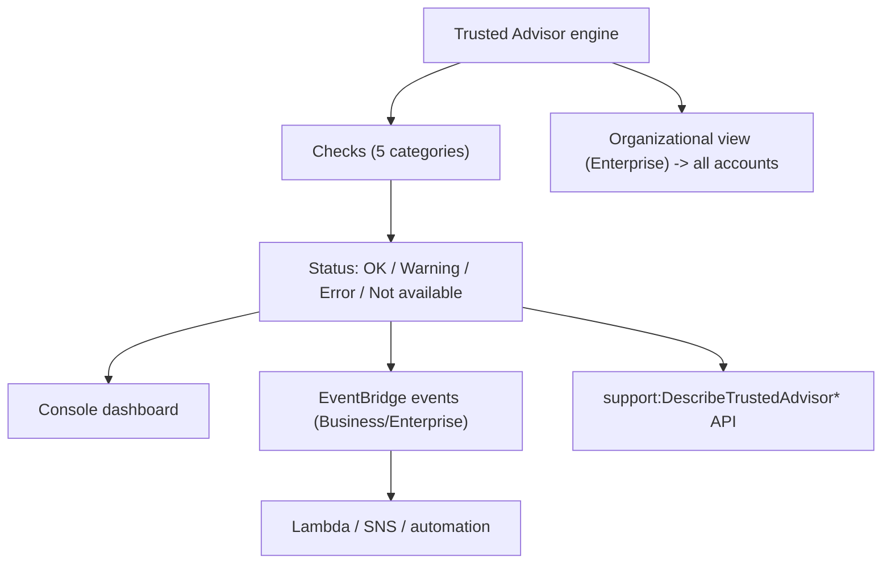

# AWS Trusted Advisor - Deep Dive

> Architecture, check refresh & status, organizational view, EventBridge/API integration, the service-limits relationship, preferences & opt-outs, limits, integrations, comparisons, best practices.

See also: [01 - AWS Trusted Advisor Intro bits & bytes](01%20-%20AWS%20Trusted%20Advisor%20Intro%20bits%20%26%20bytes.md) · [03 - AWS Trusted Advisor Exam Scenarios](03%20-%20AWS%20Trusted%20Advisor%20Exam%20Scenarios.md) · [04 - AWS Trusted Advisor SRE Operations](04%20-%20AWS%20Trusted%20Advisor%20SRE%20Operations.md) · [01 - AWS Service Quotas Intro bits & bytes](01%20-%20AWS%20Service%20Quotas%20Intro%20bits%20%26%20bytes.md) · [01 - AWS Well-Architected Tool Intro bits & bytes](01%20-%20AWS%20Well-Architected%20Tool%20Intro%20bits%20%26%20bytes.md)

---

## Table of Contents

- [1. Architecture and Check Model](#1-architecture-and-check-model)
- [2. Check Status and Refresh](#2-check-status-and-refresh)
- [3. Organizational View](#3-organizational-view)
- [4. EventBridge and API Integration](#4-eventbridge-and-api-integration)
- [5. Service Limits Relationship](#5-service-limits-relationship)
- [6. Preferences, Opt-Out, and Tags](#6-preferences-opt-out-and-tags)
- [7. Service Limits and Quotas](#7-service-limits-and-quotas)
- [8. Integration Matrix](#8-integration-matrix)
- [9. Comparisons](#9-comparisons)
- [10. Best Practices by Pillar](#10-best-practices-by-pillar)

---

---

## 1. Architecture and Check Model

Trusted Advisor is a managed, account-wide service. Each **check** evaluates resources against a best-practice rule and returns flagged resources plus guidance. Checks are grouped into the five categories. There is **no agent**; it inspects via AWS service metadata. The breadth of checks is gated by your **Support plan**.

[⬆ Back to top](#table-of-contents)

---

## 2. Check Status and Refresh

- Each check yields a status: **OK (green)**, **Warning (yellow)**, **Error (red)**, or **Not available**.
- Checks **auto-refresh** periodically; you can **manually refresh** (rate-limited). Programmatic refresh via the Support API.
- The dashboard summarizes counts and **potential monthly savings** from the cost category.

[⬆ Back to top](#table-of-contents)

---

## 3. Organizational View

- With **Enterprise Support** + AWS Organizations, **organizational view** aggregates Trusted Advisor results across **all member accounts** in the management/delegated-admin account.
- Lets you create reports (CSV/JSON) of org-wide findings — e.g. every account with public S3 or nearing a limit.
- The scalable way to drive cost/security posture across many accounts.

[⬆ Back to top](#table-of-contents)

---

## 4. EventBridge and API Integration

- **EventBridge**: Trusted Advisor emits check-status-change events (Business/Enterprise) so you can trigger **Lambda/SNS/automation** — e.g. auto-notify or remediate when a check goes red.
- **API**: the AWS **Support API** (`DescribeTrustedAdvisorChecks/Results`, `RefreshTrustedAdvisorCheck`) enables programmatic retrieval and dashboards (requires Business/Enterprise).
- Common pattern: scheduled pull or event-driven push of red checks into a security/FinOps dashboard or ticketing.

[⬆ Back to top](#table-of-contents)

---

## 5. Service Limits Relationship

- The **Service Limits** category warns when usage approaches a quota (e.g. ~80%).
- **Service Quotas** is the service to _view and request increases_; Trusted Advisor is the _early-warning_ that you're near a limit. Use them together. See [01 - AWS Service Quotas Intro bits & bytes](01%20-%20AWS%20Service%20Quotas%20Intro%20bits%20%26%20bytes.md).
- Service-limit checks are available even on **Basic/Developer** support (part of core checks).

[⬆ Back to top](#table-of-contents)

---

## 6. Preferences, Opt-Out, and Tags

- You can **exclude resources** from specific checks (suppress known/accepted items) to reduce noise.
- Configure **notification preferences** (weekly email summary; recipients).
- Filter findings by **tags/region** to focus on relevant resources.

[⬆ Back to top](#table-of-contents)

---

## 7. Service Limits and Quotas

| Aspect              | Detail                                                   |
| :------------------ | :------------------------------------------------------- |
| Checks available    | Core (Basic/Developer) vs full set (Business/Enterprise) |
| Refresh             | Auto + manual (rate-limited)                             |
| API/EventBridge     | Business/Enterprise only                                 |
| Organizational view | Enterprise Support + Organizations                       |
| Cost                | No service charge; gated by Support plan                 |

[⬆ Back to top](#table-of-contents)

---

## 8. Integration Matrix

| Service                               | Integration                                                                                         |
| :------------------------------------ | :-------------------------------------------------------------------------------------------------- |
| **AWS Support / Support API**         | The access path for full checks + programmatic use                                                  |
| **EventBridge**                       | Status-change events → automation → [01 - EventBridge Governance Integrations Intro bits & bytes](01%20-%20EventBridge%20Governance%20Integrations%20Intro%20bits%20%26%20bytes.md) |
| **Organizations**                     | Org-wide aggregation → [06 - IAM Identity Center & Organizations](06%20-%20IAM%20Identity%20Center%20%26%20Organizations.md)                                 |
| **Service Quotas**                    | Limits warnings ↔ quota increases → [01 - AWS Service Quotas Intro bits & bytes](01%20-%20AWS%20Service%20Quotas%20Intro%20bits%20%26%20bytes.md)                  |
| **Compute Optimizer / Cost Explorer** | Deeper cost/right-sizing → [01 - AWS Compute Optimizer Intro bits & bytes](01%20-%20AWS%20Compute%20Optimizer%20Intro%20bits%20%26%20bytes.md)                        |
| **Security Hub**                      | Some TA security checks surface alongside posture findings                                          |
| **CloudWatch/SNS**                    | Alarms/notifications on findings                                                                    |

[⬆ Back to top](#table-of-contents)

---

## 9. Comparisons

### Trusted Advisor vs Config vs Security Hub

|              | Trusted Advisor                        | Config                                        | Security Hub                           |
| :----------- | :------------------------------------- | :-------------------------------------------- | :------------------------------------- |
| Nature       | Fixed best-practice checks (5 pillars) | Custom + managed config rules, history, drift | Aggregated security findings/standards |
| Setup        | None                                   | Recorder + rules                              | Enable + standards                     |
| Custom rules | No                                     | Yes                                           | Via standards/integrations             |
| Best for     | Quick broad posture + limits           | Continuous compliance, custom policy          | Centralized security findings          |

### Trusted Advisor vs Well-Architected Tool

|        | Trusted Advisor       | Well-Architected Tool            |
| :----- | :-------------------- | :------------------------------- |
| Mode   | Automated, continuous | Guided questionnaire review      |
| Output | Checklist of issues   | HRI/MRI risks + improvement plan |
| When   | Always-on monitoring  | Periodic architecture reviews    |

[⬆ Back to top](#table-of-contents)

---

## 10. Best Practices by Pillar

**Cost Optimization** — review the cost category regularly; act on idle/unattached resources; use org view to find savings fleet-wide.

**Security** — treat red security checks (public S3, open SGs, root MFA) as priorities; pipe to Security Hub/ticketing.

**Reliability** — address fault-tolerance checks (Multi-AZ, backups, versioning).

**Operational Excellence** — automate with EventBridge; suppress accepted items to cut noise; schedule reports.

**Performance Efficiency** — act on performance checks; pair with Compute Optimizer for depth.

[⬆ Back to top](#table-of-contents)

---

> Continue to [03 - AWS Trusted Advisor Exam Scenarios](03%20-%20AWS%20Trusted%20Advisor%20Exam%20Scenarios.md).
