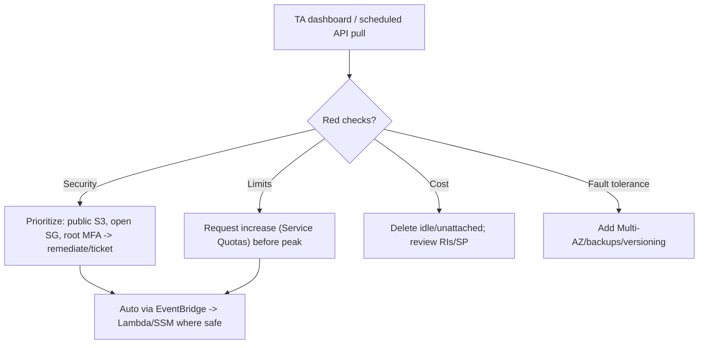

# AWS Trusted Advisor - SRE Operations

> Operational reality: missing checks, refresh limits, real API/EventBridge examples, FinOps/security patterns, and cost ops.

See also: [01 - AWS Trusted Advisor Intro bits & bytes](01%20-%20AWS%20Trusted%20Advisor%20Intro%20bits%20%26%20bytes.md) · [02 - AWS Trusted Advisor Deep Dive](02%20-%20AWS%20Trusted%20Advisor%20Deep%20Dive.md) · [03 - AWS Trusted Advisor Exam Scenarios](03%20-%20AWS%20Trusted%20Advisor%20Exam%20Scenarios.md) · [01 - AWS Service Quotas Intro bits & bytes](01%20-%20AWS%20Service%20Quotas%20Intro%20bits%20%26%20bytes.md)

---

## Table of Contents

- [1. Common Issues (Symptom → Root Cause → Fix → Prevention)](#1-common-issues-symptom--root-cause--fix--prevention)
- [2. Operational Workflow](#2-operational-workflow)
- [3. What to Monitor](#3-what-to-monitor)
- [4. Runbooks](#4-runbooks)
- [5. Real Examples](#5-real-examples)
- [6. Production Patterns by Org Size](#6-production-patterns-by-org-size)
- [7. Cost Operations](#7-cost-operations)

---

## 1. Common Issues (Symptom → Root Cause → Fix → Prevention)

### Most checks missing / API denied

- **Cause:** Basic/Developer support plan.
- **Fix:** Upgrade to Business/Enterprise for full checks + API/EventBridge.
- **Prevention:** Match support tier to governance needs.

### Findings look stale

- **Cause:** Auto-refresh interval; manual refresh rate-limited.
- **Fix:** Refresh via API/console (respect rate limits).
- **Prevention:** Schedule periodic refresh + pull.

### Too much noise

- **Cause:** Accepted exceptions repeatedly flagged.
- **Fix:** Exclude specific resources from the check (documented).
- **Prevention:** Maintain an exception register; review quarterly.

### Org view empty

- **Cause:** Not Enterprise Support, or trusted access/delegated admin not configured.
- **Fix:** Enable org view prerequisites.
- **Prevention:** Configure during landing-zone setup.

### Limit hit despite a warning

- **Cause:** Warning not actioned; quota increase not requested in time.
- **Fix:** Request increase via Service Quotas; mitigate (release unused resources).
- **Prevention:** Automate: EventBridge on limit check → ticket/quota request.

[⬆ Back to top](#table-of-contents)

---

## 2. Operational Workflow



[⬆ Back to top](#table-of-contents)

---

## 3. What to Monitor

| Signal                          | Why                                |
| :------------------------------ | :--------------------------------- |
| Red security checks count       | Exposure                           |
| Service-limit checks at warning | Pre-empt throttling/launch failure |
| Estimated monthly savings       | FinOps backlog                     |
| Open vs resolved findings trend | Program effectiveness              |
| Org-view per-account hotspots   | Where to focus                     |

[⬆ Back to top](#table-of-contents)

---

## 4. Runbooks

### Runbook: weekly governance review

1. Pull TA results (API) or open the dashboard / weekly email.
2. Triage red checks by category; create tickets for security + limits first.
3. Action cost checks (delete idle resources); track realized savings.
4. Update the exception register for accepted items.

### Runbook: automate limit-warning response

1. EventBridge rule on TA service-limit status change.
2. Lambda opens a ticket and (optionally) submits a Service Quotas increase request.
3. Notify owners via SNS.

[⬆ Back to top](#table-of-contents)

---

## 5. Real Examples

### Pull check summaries (Support API)

```bash
# List available checks (language required by the API)
aws support describe-trusted-advisor-checks --language en \
  --query "checks[?category=='security'].{Id:id,Name:name}" --output table

# Get a specific check's result
aws support describe-trusted-advisor-check-result \
  --check-id <check-id> --language en \
  --query "result.{Status:status,Flagged:flaggedResources[].metadata}"
```

### Refresh a check

```bash
aws support refresh-trusted-advisor-check --check-id <check-id>
```

### EventBridge rule on TA status change → SNS

```json
{
  "source": ["aws.trustedadvisor"],
  "detail-type": ["Trusted Advisor Check Item Refresh Notification"],
  "detail": { "status": ["ERROR"], "check-name": ["Service Limits"] }
}
```

[⬆ Back to top](#table-of-contents)

---

## 6. Production Patterns by Org Size

| Context           | Pattern                                                                                                    |
| :---------------- | :--------------------------------------------------------------------------------------------------------- |
| **Startup**       | Use whatever core checks Basic provides; watch service limits + obvious security.                          |
| **SMB**           | Business support; weekly email review; act on cost + security reds.                                        |
| **Enterprise**    | Enterprise support; org view; EventBridge → ticketing/remediation; exception register.                     |
| **Regulated**     | TA + Config (custom) + Security Hub aggregation; documented exceptions; periodic Well-Architected reviews. |
| **Multi-Account** | Org view reports feed a central governance dashboard.                                                      |

[⬆ Back to top](#table-of-contents)

---

## 7. Cost Operations

- The **Cost Optimization** checks are a quick-win backlog: idle ELB/RDS/EC2, unattached EBS, low RI/SP coverage.
- Track **realized** savings (correlate with Cost Explorer) to justify the Support plan.
- Use **org view** to prioritize the biggest savers across accounts.
- The Support plan is the cost trade-off — Business/Enterprise typically pays for itself via surfaced waste at scale.

[⬆ Back to top](#table-of-contents)

---

Related: [01 - AWS Trusted Advisor Intro bits & bytes](01%20-%20AWS%20Trusted%20Advisor%20Intro%20bits%20%26%20bytes.md) · [02 - AWS Trusted Advisor Deep Dive](02%20-%20AWS%20Trusted%20Advisor%20Deep%20Dive.md) · [03 - AWS Trusted Advisor Exam Scenarios](03%20-%20AWS%20Trusted%20Advisor%20Exam%20Scenarios.md) · [01 - AWS Well-Architected Tool Intro bits & bytes](01%20-%20AWS%20Well-Architected%20Tool%20Intro%20bits%20%26%20bytes.md) · [01 - AWS Service Quotas Intro bits & bytes](01%20-%20AWS%20Service%20Quotas%20Intro%20bits%20%26%20bytes.md) · [01 - AWS Compute Optimizer Intro bits & bytes](01%20-%20AWS%20Compute%20Optimizer%20Intro%20bits%20%26%20bytes.md)
