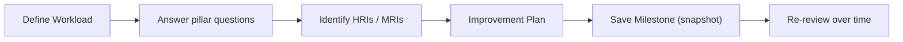

# AWS Well-Architected Tool - Intro bits & bytes

> The Well-Architected Tool (WA Tool) is a free service that guides you through a **structured review** of a workload against the AWS Well-Architected Framework's **six pillars**, surfacing **High and Medium Risk Issues (HRIs/MRIs)** and producing an improvement plan. It's the _review_ counterpart to Trusted Advisor's _automated checks_.

See also: [02 - AWS Well-Architected Tool Deep Dive](02%20-%20AWS%20Well-Architected%20Tool%20Deep%20Dive.md) · [03 - AWS Well-Architected Tool Exam Scenarios](03%20-%20AWS%20Well-Architected%20Tool%20Exam%20Scenarios.md) · [04 - AWS Well-Architected Tool SRE Operations](04%20-%20AWS%20Well-Architected%20Tool%20SRE%20Operations.md) · [01 - AWS Trusted Advisor Intro bits & bytes](01%20-%20AWS%20Trusted%20Advisor%20Intro%20bits%20%26%20bytes.md)

---

## Table of Contents

- [1. The Problem It Solves](#1-the-problem-it-solves)
- [2. The Six Pillars](#2-the-six-pillars)
- [3. How a Review Works](#3-how-a-review-works)
- [4. WA Tool vs Trusted Advisor vs Framework](#4-wa-tool-vs-trusted-advisor-vs-framework)
- [5. When To Use It / When NOT To Use It](#5-when-to-use-it--when-not-to-use-it)
- [6. Cost Considerations](#6-cost-considerations)
- [7. Mini-Quiz](#7-mini-quiz)

---

---

## 1. The Problem It Solves

Teams build workloads but rarely step back to ask "is this _well-architected_?" in a consistent, documented way. The WA Tool operationalizes the **Well-Architected Framework**: a guided questionnaire per pillar, a record of risks, an improvement plan, and **milestones** to track progress over time. It turns "we should review this someday" into a repeatable, auditable practice.

> Mental model: the **Framework** is the book of best practices; the **WA Tool** is the workbook you fill in to measure a specific workload against it and track improvement.

[⬆ Back to top](#table-of-contents)

---

## 2. The Six Pillars

| Pillar                     | Core question                                                                |
| :------------------------- | :--------------------------------------------------------------------------- |
| **Operational Excellence** | Can we run and improve workloads effectively (IaC, observability, runbooks)? |
| **Security**               | Are identity, data protection, detection, and incident response sound?       |
| **Reliability**            | Does it recover from failure and meet demand (HA, DR, scaling)?              |
| **Performance Efficiency** | Are we using compute/storage/network efficiently and evolving them?          |
| **Cost Optimization**      | Are we avoiding unnecessary cost and matching spend to value?                |
| **Sustainability**         | Are we minimizing environmental impact (efficient resource use)?             |

> The original framework had **five** pillars; **Sustainability** was added as the sixth. Remember all six for current exams.

[⬆ Back to top](#table-of-contents)

---

## 3. How a Review Works

1. **Define a workload** (name, environment, regions, account scope).
2. **Answer questions** for each pillar (optionally apply **lenses** — see deep dive).
3. The tool flags **HRIs** (High Risk Issues) and **MRIs** (Medium Risk Issues).
4. Review the **improvement plan** (links to guidance/best practices).
5. **Save a milestone** — an immutable snapshot — then implement fixes and re-review to show progress.

[⬆ Back to top](#table-of-contents)

---

## 4. WA Tool vs Trusted Advisor vs Framework

|         | WA Tool                                   | Trusted Advisor          | WA Framework                       |
| :------ | :---------------------------------------- | :----------------------- | :--------------------------------- |
| Nature  | Guided **review** (questionnaire)         | Automated **checks**     | The best-practice **content/book** |
| Output  | HRIs/MRIs + improvement plan + milestones | Live checklist of issues | Guidance/whitepapers               |
| Cadence | Periodic, human-driven                    | Continuous, automated    | Reference                          |

> Cue: "structured/guided review," "identify high-risk issues," "track improvement with milestones" → **WA Tool**. "automated account checks" → **Trusted Advisor**.

[⬆ Back to top](#table-of-contents)

---

## 5. When To Use It / When NOT To Use It

**Use it for:** periodic architecture reviews, pre-launch readiness, documenting risk acceptance, tracking remediation over time, and aligning teams to AWS best practices.

**Don't expect it to:**

- **Automatically detect** misconfigurations (that's Trusted Advisor/Config) — it relies on your answers.
- **Right-size** resources (Compute Optimizer) or analyze cost (Cost Explorer).
- **Enforce** anything — it's advisory; enforcement is SCPs/Config/Service Catalog.

[⬆ Back to top](#table-of-contents)

---

## 6. Cost Considerations

- The WA Tool is **free**.
- Its **Cost Optimization pillar** review surfaces savings opportunities (often validated with Trusted Advisor/Compute Optimizer/Cost Explorer).
- Value is in the **discipline**: catching reliability/security risks before they cause expensive incidents.

[⬆ Back to top](#table-of-contents)

---

## 7. Mini-Quiz

**Q1:** How many pillars, and what's the newest?
_A:_ **Six**; **Sustainability** is the newest.

**Q2:** What are HRIs?
_A:_ **High Risk Issues** flagged by the review.

**Q3:** WA Tool vs Trusted Advisor?
_A:_ WA Tool = guided **review** (you answer questions); Trusted Advisor = **automated** checks.

**Q4:** How do you track improvement over time?
_A:_ Save **milestones** and re-review.

---

> Continue to [02 - AWS Well-Architected Tool Deep Dive](02%20-%20AWS%20Well-Architected%20Tool%20Deep%20Dive.md).
