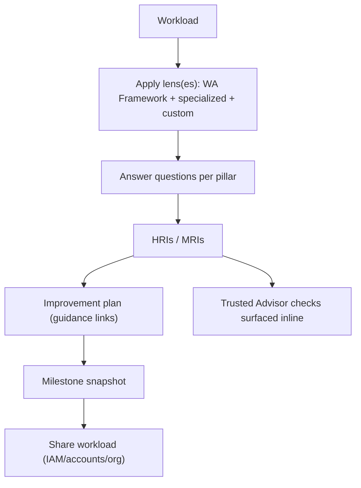

# AWS Well-Architected Tool - Deep Dive

> Architecture, lenses (incl. custom lenses & Lens Catalog), milestones, the review workflow, profiles & review templates, organization sharing, limits, integrations, comparisons, best practices.

See also: [01 - AWS Well-Architected Tool Intro bits & bytes](01%20-%20AWS%20Well-Architected%20Tool%20Intro%20bits%20%26%20bytes.md) · [03 - AWS Well-Architected Tool Exam Scenarios](03%20-%20AWS%20Well-Architected%20Tool%20Exam%20Scenarios.md) · [04 - AWS Well-Architected Tool SRE Operations](04%20-%20AWS%20Well-Architected%20Tool%20SRE%20Operations.md) · [01 - AWS Trusted Advisor Intro bits & bytes](01%20-%20AWS%20Trusted%20Advisor%20Intro%20bits%20%26%20bytes.md)

---

## Table of Contents

- [1. Architecture and Concepts](#1-architecture-and-concepts)
- [2. Lenses and the Lens Catalog](#2-lenses-and-the-lens-catalog)
- [3. Custom Lenses](#3-custom-lenses)
- [4. Milestones and Improvement Tracking](#4-milestones-and-improvement-tracking)
- [5. Profiles and Review Templates](#5-profiles-and-review-templates)
- [6. Organization and Sharing](#6-organization-and-sharing)
- [7. Trusted Advisor Integration](#7-trusted-advisor-integration)
- [8. Service Limits and Quotas](#8-service-limits-and-quotas)
- [9. Integration Matrix](#9-integration-matrix)
- [10. Comparisons](#10-comparisons)
- [11. Best Practices](#11-best-practices)

---

---

## 1. Architecture and Concepts

A **workload** is the unit of review (an app/system with its environment and scope). You answer best-practice questions grouped by pillar; the tool computes **risk** (HRI/MRI/none) and assembles an **improvement plan**. Reviews are stored per workload, can be **shared**, and snapshotted as **milestones**. Everything is advisory — the tool records and guides; it doesn't change resources.

[⬆ Back to top](#table-of-contents)

---

## 2. Lenses and the Lens Catalog

- A **lens** is a set of questions/best practices for a domain. The default is the **AWS Well-Architected Framework** lens (six pillars).
- **Specialized lenses** (from the **Lens Catalog**) tailor reviews to domains — e.g. **Serverless**, **SaaS**, **Foundational Technical Review (FTR)**, **Machine Learning**, **Data Analytics**, **IoT**, **Financial Services**.
- Apply multiple lenses to one workload for layered guidance.

[⬆ Back to top](#table-of-contents)

---

## 3. Custom Lenses

- You can author **custom lenses** (your org's own best-practice questions) and share them across accounts.
- Useful for embedding internal standards (naming, tagging, compliance) into the review process.
- Distributed via the Lens Catalog mechanism / sharing.

[⬆ Back to top](#table-of-contents)

---

## 4. Milestones and Improvement Tracking

- A **milestone** is an immutable snapshot of the workload's answers/risks at a point in time.
- Save one after each review to **measure progress** (HRIs trending down) and to evidence governance/audit.
- Compare milestones to demonstrate remediation between reviews.

[⬆ Back to top](#table-of-contents)

---

## 5. Profiles and Review Templates

- **Profiles** capture business context (e.g. "regulated, pre-launch, cost-sensitive") so the tool **prioritizes** the most relevant questions/risks for that context.
- **Review templates** standardize how reviews are started across many workloads/teams — consistency at scale.

[⬆ Back to top](#table-of-contents)

---

## 6. Organization and Sharing

- **Share workloads and custom lenses** with specific IAM principals, other accounts, or across the **organization**.
- Central architecture teams can review/advise on many teams' workloads; results roll up for governance.
- Integrates with AWS Organizations for org-wide visibility.

[⬆ Back to top](#table-of-contents)

---

## 7. Trusted Advisor Integration

- The WA Tool can **surface relevant Trusted Advisor checks** directly within a review, linking automated findings to the manual questions — so the questionnaire is informed by live account data.
- This bridges the "review vs automated check" gap.

[⬆ Back to top](#table-of-contents)

---

## 8. Service Limits and Quotas

| Aspect     | Detail                          |
| :--------- | :------------------------------ |
| Cost       | Free                            |
| Workloads  | Many per account (soft limits)  |
| Lenses     | Framework + catalog + custom    |
| Milestones | Multiple snapshots per workload |
| Sharing    | IAM principals / accounts / org |

[⬆ Back to top](#table-of-contents)

---

## 9. Integration Matrix

| Service                                        | Integration                                                                           |
| :--------------------------------------------- | :------------------------------------------------------------------------------------ |
| **Trusted Advisor**                            | Surfaces relevant checks in reviews → [01 - AWS Trusted Advisor Intro bits & bytes](01%20-%20AWS%20Trusted%20Advisor%20Intro%20bits%20%26%20bytes.md) |
| **Organizations**                              | Share workloads/lenses org-wide → [06 - IAM Identity Center & Organizations](06%20-%20IAM%20Identity%20Center%20%26%20Organizations.md)        |
| **IAM**                                        | Access control on workloads/lenses                                                    |
| **Jira / external**                            | Improvement items can be exported/integrated into ticketing                           |
| **Config / Compute Optimizer / Cost Explorer** | Provide the evidence behind pillar answers                                            |

[⬆ Back to top](#table-of-contents)

---

## 10. Comparisons

### WA Tool vs Trusted Advisor vs Config

|          | WA Tool                       | Trusted Advisor  | Config                      |
| :------- | :---------------------------- | :--------------- | :-------------------------- |
| Mode     | Guided review                 | Automated checks | Continuous compliance rules |
| Output   | HRIs/MRIs + plan + milestones | Issue checklist  | Compliance status + history |
| Enforces | No (advisory)                 | No               | Can remediate               |

### Default lens vs specialized/custom lenses

|       | Default WA lens      | Specialized/custom                    |
| :---- | :------------------- | :------------------------------------ |
| Scope | Six pillars, general | Domain-specific or org-specific       |
| Use   | Any workload         | Serverless/SaaS/ML/internal standards |

[⬆ Back to top](#table-of-contents)

---

## 11. Best Practices

- Review **before launch** and **periodically** (e.g. quarterly) for critical workloads.
- Apply the **right lenses** (serverless app → Serverless lens) and a **profile** for context-aware prioritization.
- Save **milestones** each review; track HRIs to zero or documented acceptance.
- Feed answers with **evidence** from Trusted Advisor/Config/Compute Optimizer rather than guesses.
- Use **custom lenses** to encode internal standards; **share** workloads with a central architecture team.
- Convert HRIs into tracked work items (Jira/tickets) with owners.

[⬆ Back to top](#table-of-contents)

---

> Continue to [03 - AWS Well-Architected Tool Exam Scenarios](03%20-%20AWS%20Well-Architected%20Tool%20Exam%20Scenarios.md).
