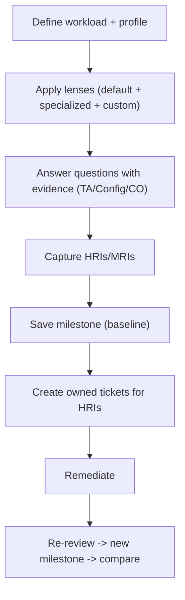

# AWS Well-Architected Tool - SRE Operations

> Operational reality: running reviews that actually drive change, integrating with ticketing, real workflow, and how the tool fits an SRE/governance cadence.

See also: [01 - AWS Well-Architected Tool Intro bits & bytes](01%20-%20AWS%20Well-Architected%20Tool%20Intro%20bits%20%26%20bytes.md) · [02 - AWS Well-Architected Tool Deep Dive](02%20-%20AWS%20Well-Architected%20Tool%20Deep%20Dive.md) · [03 - AWS Well-Architected Tool Exam Scenarios](03%20-%20AWS%20Well-Architected%20Tool%20Exam%20Scenarios.md) · [01 - AWS Trusted Advisor Intro bits & bytes](01%20-%20AWS%20Trusted%20Advisor%20Intro%20bits%20%26%20bytes.md)

---

## Table of Contents

- [1. Common Pitfalls (Symptom → Root Cause → Fix → Prevention)](#1-common-pitfalls-symptom--root-cause--fix--prevention)
- [2. Review Workflow](#2-review-workflow)
- [3. What to Track](#3-what-to-track)
- [4. Runbooks](#4-runbooks)
- [5. Real Examples](#5-real-examples)
- [6. Production Patterns by Org Size](#6-production-patterns-by-org-size)
- [7. Cost & Reliability Outcomes](#7-cost--reliability-outcomes)

---

## 1. Common Pitfalls (Symptom → Root Cause → Fix → Prevention)

### Review done, nothing improves

- **Cause:** HRIs not assigned/tracked; no follow-up.
- **Fix:** Convert HRIs into owned tickets with due dates; re-review and compare milestones.
- **Prevention:** Bake review → ticket → re-review into the governance cadence.

### Unreliable risk picture

- **Cause:** Guessed answers.
- **Fix:** Ground answers in Trusted Advisor/Config/Compute Optimizer evidence.
- **Prevention:** Require evidence links per answer.

### Missed domain risks

- **Cause:** Only the default lens used.
- **Fix:** Apply relevant specialized lenses (Serverless, SaaS, ML…).
- **Prevention:** Lens selection part of the review template.

### Inconsistent reviews across teams

- **Cause:** No standardization.
- **Fix:** Review templates + custom lens for internal standards.
- **Prevention:** Central architecture team owns templates/lenses.

### Belief that it enforces

- **Cause:** Misunderstanding scope.
- **Fix:** Pair with SCP/Config/Service Catalog for enforcement.
- **Prevention:** Document the advisory nature.

[⬆ Back to top](#table-of-contents)

---

## 2. Review Workflow



[⬆ Back to top](#table-of-contents)

---

## 3. What to Track

| Signal                                  | Why                            |
| :-------------------------------------- | :----------------------------- |
| HRIs open vs resolved over milestones   | Improvement trend              |
| Time-to-remediate per HRI               | Process efficiency             |
| Coverage: % critical workloads reviewed | Governance reach               |
| Repeat HRIs across workloads            | Systemic gaps → platform fixes |

[⬆ Back to top](#table-of-contents)

---

## 4. Runbooks

### Runbook: quarterly workload review

1. Open the workload; confirm profile + lenses.
2. Re-answer questions using current evidence (TA/Config).
3. Save a milestone; diff against last quarter.
4. File/refresh tickets for open HRIs; assign owners.
5. Report trend to leadership.

### Runbook: new-workload readiness

1. Create workload; apply default + relevant specialized lens (or FTR).
2. Complete review pre-launch; resolve HRIs or document accepted risk.
3. Milestone = launch baseline.

[⬆ Back to top](#table-of-contents)

---

## 5. Real Examples

### Create a workload + milestone (CLI)

```bash
aws wellarchitected create-workload \
  --workload-name payments-api \
  --description "Payments service" \
  --environment PRODUCTION \
  --aws-regions ap-south-1 \
  --lenses wellarchitected \
  --review-owner platform-team

aws wellarchitected create-milestone \
  --workload-id <id> --milestone-name "Q2-2026-baseline"
```

### List answers / risks for a pillar

```bash
aws wellarchitected list-answers --workload-id <id> --lens-alias wellarchitected \
  --pillar-id reliability \
  --query "AnswerSummaries[?Risk=='HIGH'].{Q:QuestionTitle,Risk:Risk}"
```

### Apply a specialized lens

```bash
aws wellarchitected associate-lenses --workload-id <id> --lens-aliases serverless
```

[⬆ Back to top](#table-of-contents)

---

## 6. Production Patterns by Org Size

| Context           | Pattern                                                                                                 |
| :---------------- | :------------------------------------------------------------------------------------------------------ |
| **Startup**       | One review per key workload pre-launch; default lens; fix HRIs.                                         |
| **SMB**           | Quarterly reviews; serverless/SaaS lens as relevant; milestones tracked.                                |
| **Enterprise**    | Central architecture team; custom lens + review templates; shared workloads org-wide; HRIs → Jira.      |
| **Regulated**     | Reviews as audit evidence; documented risk acceptance; FTR/compliance lenses; milestone diffs retained. |
| **Multi-Account** | Org-shared workloads/lenses; aggregate HRI trends; repeat HRIs drive platform/Service Catalog fixes.    |

[⬆ Back to top](#table-of-contents)

---

## 7. Cost & Reliability Outcomes

- The tool is **free**; the payoff is **fewer incidents** (reliability/security HRIs caught early) and **lower cost** (cost-pillar findings validated with Trusted Advisor/Compute Optimizer/Cost Explorer).
- Systemic, repeat HRIs across workloads are the strongest signal to invest in **platform guardrails** (Service Catalog products, Config rules, SCPs) so the fix is structural, not per-team.

[⬆ Back to top](#table-of-contents)

---

Related: [01 - AWS Well-Architected Tool Intro bits & bytes](01%20-%20AWS%20Well-Architected%20Tool%20Intro%20bits%20%26%20bytes.md) · [02 - AWS Well-Architected Tool Deep Dive](02%20-%20AWS%20Well-Architected%20Tool%20Deep%20Dive.md) · [03 - AWS Well-Architected Tool Exam Scenarios](03%20-%20AWS%20Well-Architected%20Tool%20Exam%20Scenarios.md) · [01 - AWS Trusted Advisor Intro bits & bytes](01%20-%20AWS%20Trusted%20Advisor%20Intro%20bits%20%26%20bytes.md) · [24 - AWS Config & Audit Manager](24%20-%20AWS%20Config%20%26%20Audit%20Manager.md) · [01 - AWS Service Catalog Intro bits & bytes](01%20-%20AWS%20Service%20Catalog%20Intro%20bits%20%26%20bytes.md)
