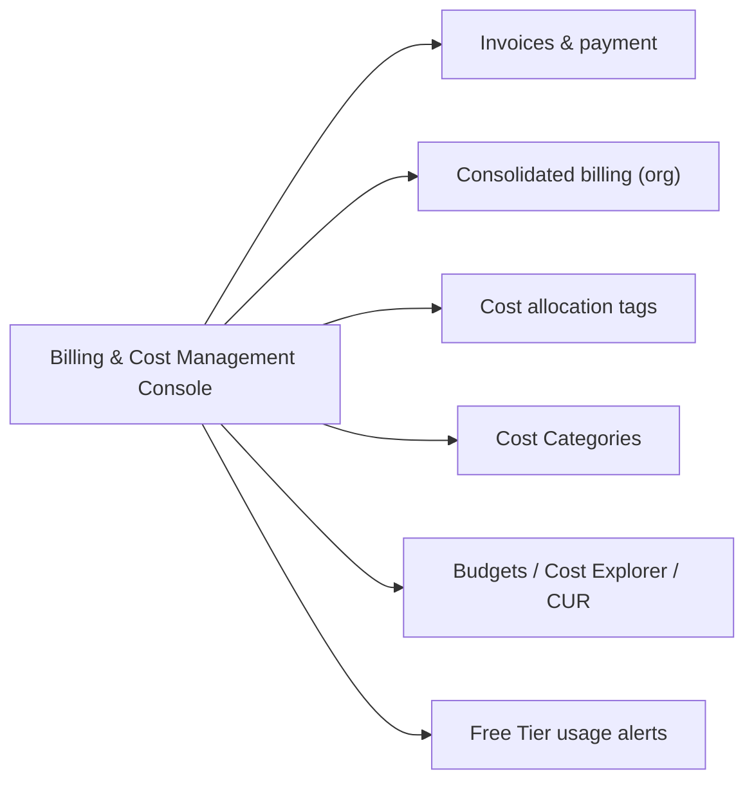

# AWS Billing Dashboard - Intro bits & bytes

> The Billing & Cost Management console (the "Billing Dashboard") is where you **see, organize, and control** what you're paying AWS: current/forecasted charges, **consolidated billing** across an organization, **cost allocation tags**, **Cost Categories**, invoices, and payment. It's the front door to the cost-governance tools (Budgets, Cost Explorer, CUR).

See also: [02 - AWS Billing Dashboard Deep Dive](02%20-%20AWS%20Billing%20Dashboard%20Deep%20Dive.md) · [03 - AWS Billing Dashboard Exam Scenarios](03%20-%20AWS%20Billing%20Dashboard%20Exam%20Scenarios.md) · [04 - AWS Billing Dashboard SRE Operations](04%20-%20AWS%20Billing%20Dashboard%20SRE%20Operations.md) · [01 - AWS Budgets Fundamentals & Architecture](01%20-%20AWS%20Budgets%20Fundamentals%20%26%20Architecture.md) · [01 - Cost Explorer Fundamentals & Architecture](01%20-%20Cost%20Explorer%20Fundamentals%20%26%20Architecture.md)

---

## Table of Contents

- [1. The Problem It Solves](#1-the-problem-it-solves)
- [2. What Lives in Billing & Cost Management](#2-what-lives-in-billing--cost-management)
- [3. Consolidated Billing](#3-consolidated-billing)
- [4. Cost Allocation Tags and Cost Categories](#4-cost-allocation-tags-and-cost-categories)
- [5. When To Use What (Billing vs Budgets vs Cost Explorer vs CUR)](#5-when-to-use-what-billing-vs-budgets-vs-cost-explorer-vs-cur)
- [6. Cost Considerations](#6-cost-considerations)
- [7. Mini-Quiz](#7-mini-quiz)

---

---

## 1. The Problem It Solves

Cloud spend is dynamic and easy to lose track of. The Billing Dashboard centralizes **visibility** (what am I spending, forecast, by service/account) and **organization** (consolidated billing, tags, categories) plus **administration** (invoices, payment methods, tax settings, account-level controls). It's the hub that the deeper tools — **Budgets** (alerts/actions), **Cost Explorer** (analysis), **CUR** (raw data) — plug into.

> Mental model: the Billing Dashboard is the **cockpit**; Budgets/Cost Explorer/CUR are the **instruments**. Consolidated billing is the wiring that brings every account's spend into one bill.

[⬆ Back to top](#table-of-contents)

---

## 2. What Lives in Billing & Cost Management

| Area                             | Purpose                                                               |
| :------------------------------- | :-------------------------------------------------------------------- |
| **Bills / Invoices**             | Month-to-date charges, past invoices, by service/account              |
| **Payments / methods**           | Payment, credits, tax settings                                        |
| **Consolidated billing**         | Single payer for the whole organization                               |
| **Cost allocation tags**         | Activate tags for cost breakdown                                      |
| **Cost Categories**              | Define billing groupings/rules over accounts/tags                     |
| **Free Tier**                    | Usage tracking + alerts                                               |
| **Billing alerts / preferences** | Enable CloudWatch billing alarms, PDF invoices, IAM access to billing |
| **Entry points**                 | Budgets, Cost Explorer, CUR, Savings Plans, Payments                  |

[⬆ Back to top](#table-of-contents)

---

## 3. Consolidated Billing

- With **AWS Organizations**, the **management (payer) account** receives **one consolidated bill** for all member accounts.
- Benefits: **single payment**, **aggregated usage for volume/tiered pricing**, and **shared Reserved Instances / Savings Plans** discounts across accounts.
- Each member account's usage is still **visible per account**; costs roll up to the payer.
- **Member accounts can't see the consolidated bill**; the payer manages billing centrally.

[⬆ Back to top](#table-of-contents)

---

## 4. Cost Allocation Tags and Cost Categories

- **Cost allocation tags**: activated tag keys that let Cost Explorer/CUR/Budgets break down spend by `CostCenter`, `Project`, `Env`, etc. **Not retroactive** — activate early. See [01 - AWS Tagging Strategies Intro bits & bytes](01%20-%20AWS%20Tagging%20Strategies%20Intro%20bits%20%26%20bytes.md).
- **Cost Categories**: rules that **group** accounts/tags/services into named buckets (e.g. "Platform", "Customer-Facing") for reporting **without re-tagging** resources.
- Together they turn raw spend into business-meaningful **showback/chargeback**.

[⬆ Back to top](#table-of-contents)

---

## 5. When To Use What (Billing vs Budgets vs Cost Explorer vs CUR)

| Need                                                      | Tool                                                                     |
| :-------------------------------------------------------- | :----------------------------------------------------------------------- |
| See current bill, invoices, consolidated billing, payment | **Billing Dashboard**                                                    |
| **Alert/act** when spend crosses a threshold              | **Budgets** → [01 - AWS Budgets Fundamentals & Architecture](01%20-%20AWS%20Budgets%20Fundamentals%20%26%20Architecture.md)           |
| **Analyze/forecast** trends, RI/SP recommendations        | **Cost Explorer** → [01 - Cost Explorer Fundamentals & Architecture](01%20-%20Cost%20Explorer%20Fundamentals%20%26%20Architecture.md)   |
| **Raw, granular** line-item data for BI                   | **Cost & Usage Report (CUR)** → [01 - CUR Fundamentals & Architecture](01%20-%20CUR%20Fundamentals%20%26%20Architecture.md) |

[⬆ Back to top](#table-of-contents)

---

## 6. Cost Considerations

- The Billing console is **free**; CUR delivery incurs **S3 storage** (and Athena/QuickSight if used).
- **Consolidated billing** is the big lever: volume discounts + shared commitments across the org.
- Enable **billing alerts** (CloudWatch) and **Budgets** so spend never surprises you.
- Control **who can see/act on billing** via IAM (activate "IAM user/role access to billing").

[⬆ Back to top](#table-of-contents)

---

## 7. Mini-Quiz

**Q1:** What gives one bill + shared discounts across many accounts?
_A:_ **Consolidated billing** via AWS Organizations (management/payer account).

**Q2:** Group accounts/tags into named buckets for reporting without re-tagging?
_A:_ **Cost Categories**.

**Q3:** Alert when spend crosses a threshold — Billing Dashboard or Budgets?
_A:_ **Budgets** (the dashboard is the hub; Budgets does alerts/actions).

**Q4:** Why activate cost allocation tags early?
_A:_ They're **not retroactive**.

---

> Continue to [02 - AWS Billing Dashboard Deep Dive](02%20-%20AWS%20Billing%20Dashboard%20Deep%20Dive.md).
