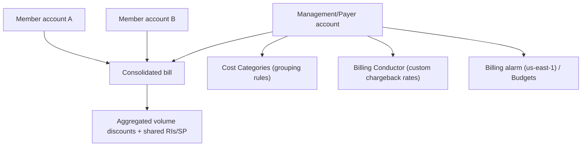

# AWS Billing Dashboard - Deep Dive

> Consolidated billing internals, billing IAM access, billing alarms, Cost Categories, billing conductor, invoice/payment controls, limits, integrations, comparisons, best practices.

See also: [01 - AWS Billing Dashboard Intro bits & bytes](01%20-%20AWS%20Billing%20Dashboard%20Intro%20bits%20%26%20bytes.md) · [03 - AWS Billing Dashboard Exam Scenarios](03%20-%20AWS%20Billing%20Dashboard%20Exam%20Scenarios.md) · [04 - AWS Billing Dashboard SRE Operations](04%20-%20AWS%20Billing%20Dashboard%20SRE%20Operations.md) · [01 - AWS Budgets Fundamentals & Architecture](01%20-%20AWS%20Budgets%20Fundamentals%20%26%20Architecture.md)

---

## Table of Contents

- [1. Consolidated Billing Internals](#1-consolidated-billing-internals)
- [2. IAM Access to Billing](#2-iam-access-to-billing)
- [3. Billing Alarms (CloudWatch)](#3-billing-alarms-cloudwatch)
- [4. Cost Categories](#4-cost-categories)
- [5. AWS Billing Conductor (Chargeback)](#5-aws-billing-conductor-chargeback)
- [6. Invoice and Payment Controls](#6-invoice-and-payment-controls)
- [7. Service Limits and Quotas](#7-service-limits-and-quotas)
- [8. Integration Matrix](#8-integration-matrix)
- [9. Comparisons](#9-comparisons)
- [10. Best Practices by Pillar](#10-best-practices-by-pillar)

---

---

## 1. Consolidated Billing Internals

- The **payer (management) account** aggregates all member accounts' usage into one invoice.
- **Volume/tiered pricing** is computed on **combined** usage (e.g. S3 tiers reached faster).
- **Reserved Instances & Savings Plans** purchased in any account can **apply across the org** (discount sharing — toggleable).
- Member accounts retain **per-account cost visibility**; the payer sees the whole.
- Removing an account from the org stops its costs rolling into the payer going forward.

[⬆ Back to top](#table-of-contents)

---

## 2. IAM Access to Billing

- By default, **only the root user** can see billing; you must **activate "IAM user and role access to billing"** to delegate.
- Then use IAM policies (`aws-portal:*`, or the newer fine-grained **billing/payments/account** actions) to grant least-privilege access to FinOps/admins.
- In an org, billing data access can be delegated; member-account billing visibility can be controlled.

[⬆ Back to top](#table-of-contents)

---

## 3. Billing Alarms (CloudWatch)

- Billing metrics (`EstimatedCharges`) are published **only in us-east-1** — a classic exam/ops gotcha. Create the **CloudWatch billing alarm in us-east-1**.
- Enable **"Receive Billing Alerts"** in billing preferences first.
- For richer control (forecasted thresholds, actions), use **Budgets** instead of/in addition to a raw billing alarm.

[⬆ Back to top](#table-of-contents)

---

## 4. Cost Categories

- **Rules** map accounts, tags, services, charge types, or other categories into **named buckets**.
- Used in Cost Explorer, Budgets, and CUR for **business-aligned reporting** (e.g. by team, product, environment) **without re-tagging** resources.
- Supports inheritance and split charges; great for chargeback hierarchies.

[⬆ Back to top](#table-of-contents)

---

## 5. AWS Billing Conductor (Chargeback)

- **Billing Conductor** lets you create **custom pricing/chargeback views** — apply custom rates, discounts, or markups per "billing group" of accounts.
- Used by MSPs/enterprises that **re-bill** internal teams or customers with rates different from AWS's actual charges.
- Produces pro-forma invoices per billing group.

[⬆ Back to top](#table-of-contents)

---

## 6. Invoice and Payment Controls

- Invoices (PDF/CSV), payment methods, **credits/discounts**, **tax settings**, and **purchase orders** (for Enterprise).
- **Account-level controls** (close account, alternate contacts) — some are **root-only**.
- **Invoice configuration** for org members (separate invoices per linked account where supported).

[⬆ Back to top](#table-of-contents)

---

## 7. Service Limits and Quotas

| Aspect               | Detail                      |
| :------------------- | :-------------------------- |
| Billing alarm region | **us-east-1 only**          |
| IAM billing access   | Must be activated           |
| Cost Categories      | Multiple rules per category |
| Consolidated billing | Up to org account quota     |
| Cost allocation tags | Activate; not retroactive   |

[⬆ Back to top](#table-of-contents)

---

## 8. Integration Matrix

| Service                 | Integration                                                                                                         |
| :---------------------- | :------------------------------------------------------------------------------------------------------------------ |
| **Organizations**       | Consolidated billing, member visibility → [06 - IAM Identity Center & Organizations](06%20-%20IAM%20Identity%20Center%20%26%20Organizations.md)                              |
| **Budgets**             | Threshold alerts/actions → [01 - AWS Budgets Fundamentals & Architecture](01%20-%20AWS%20Budgets%20Fundamentals%20%26%20Architecture.md)                                         |
| **Cost Explorer / CUR** | Analysis + raw data → [01 - Cost Explorer Fundamentals & Architecture](01%20-%20Cost%20Explorer%20Fundamentals%20%26%20Architecture.md) · [01 - CUR Fundamentals & Architecture](01%20-%20CUR%20Fundamentals%20%26%20Architecture.md) |
| **CloudWatch**          | Billing alarm (us-east-1) → [01 - Amazon CloudWatch Intro bits & bytes](01%20-%20Amazon%20CloudWatch%20Intro%20bits%20%26%20bytes.md)                                           |
| **Tagging**             | Cost allocation tags → [01 - AWS Tagging Strategies Intro bits & bytes](01%20-%20AWS%20Tagging%20Strategies%20Intro%20bits%20%26%20bytes.md)                                           |
| **IAM**                 | Delegate billing access                                                                                             |
| **Savings Plans / RIs** | Shared commitment discounts → [01 - Savings Plans Fundamentals & Architecture](01%20-%20Savings%20Plans%20Fundamentals%20%26%20Architecture.md)                                    |

[⬆ Back to top](#table-of-contents)

---

## 9. Comparisons

### Billing Dashboard vs Budgets vs Cost Explorer vs CUR

|             | Billing Dashboard                          | Budgets                 | Cost Explorer    | CUR            |
| :---------- | :----------------------------------------- | :---------------------- | :--------------- | :------------- |
| Role        | Hub: bills, consolidated billing, settings | Alert/act on thresholds | Analyze/forecast | Raw line items |
| Granularity | Summary/invoice                            | Threshold               | Aggregated views | Most granular  |

### Cost Categories vs cost allocation tags

|                | Cost Categories                  | Cost allocation tags     |
| :------------- | :------------------------------- | :----------------------- |
| Where          | Billing rules over accounts/tags | Resource metadata        |
| Re-tag needed? | No                               | Tags must exist/activate |

[⬆ Back to top](#table-of-contents)

---

## 10. Best Practices by Pillar

**Cost Optimization** — consolidated billing for discounts; activate cost allocation tags; Cost Categories for chargeback; Budgets + billing alarm.

**Security** — restrict billing access via IAM (don't rely on root); protect the payer account.

**Operational Excellence** — billing alarm in **us-east-1**; PDF invoices; alternate contacts; delegate FinOps access least-privilege.

**Governance** — Cost Categories/tags aligned to the org; per-account/OU budgets.

[⬆ Back to top](#table-of-contents)

---

> Continue to [03 - AWS Billing Dashboard Exam Scenarios](03%20-%20AWS%20Billing%20Dashboard%20Exam%20Scenarios.md).
