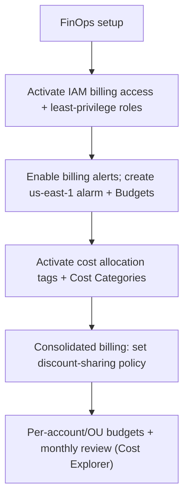

# AWS Billing Dashboard - SRE Operations

> Operational reality: billing access pitfalls, the us-east-1 alarm gotcha, real examples, FinOps patterns, and governance.

See also: [01 - AWS Billing Dashboard Intro bits & bytes](01%20-%20AWS%20Billing%20Dashboard%20Intro%20bits%20%26%20bytes.md) · [02 - AWS Billing Dashboard Deep Dive](02%20-%20AWS%20Billing%20Dashboard%20Deep%20Dive.md) · [03 - AWS Billing Dashboard Exam Scenarios](03%20-%20AWS%20Billing%20Dashboard%20Exam%20Scenarios.md) · [01 - AWS Budgets Fundamentals & Architecture](01%20-%20AWS%20Budgets%20Fundamentals%20%26%20Architecture.md)

---

## Table of Contents

- [1. Common Issues (Symptom → Root Cause → Fix → Prevention)](#1-common-issues-symptom--root-cause--fix--prevention)
- [2. Operational Workflow](#2-operational-workflow)
- [3. What to Monitor](#3-what-to-monitor)
- [4. Runbooks](#4-runbooks)
- [5. Real Examples](#5-real-examples)
- [6. FinOps Patterns by Org Size](#6-finops-patterns-by-org-size)
- [7. Cost & Security Operations](#7-cost--security-operations)

---

## 1. Common Issues (Symptom → Root Cause → Fix → Prevention)

### Finance can't see billing

- **Cause:** "IAM access to billing" not activated; only root sees it.
- **Fix:** Activate it (root, once); attach least-privilege billing IAM.
- **Prevention:** Do this at account setup.

### Billing alarm never fires

- **Cause:** Created outside **us-east-1** or billing alerts not enabled.
- **Fix:** Enable "Receive Billing Alerts"; create alarm in **us-east-1**.
- **Prevention:** Standard FinOps setup; prefer Budgets too.

### Tag breakdown missing

- **Cause:** Cost allocation tags not activated (not retroactive) / untagged resources.
- **Fix:** Activate tags; bulk-tag; Cost Categories for grouping.
- **Prevention:** Activate at setup; enforce tagging.

### Unexpected discount allocation

- **Cause:** Shared RIs/SP applied to another account under consolidated billing.
- **Fix:** Toggle **discount sharing** off for isolated accounts if needed.
- **Prevention:** Define sharing policy intentionally.

### Member confused by visibility

- **Cause:** Expecting consolidated view in a member account.
- **Fix:** Explain payer-only consolidated view; share curated reports.
- **Prevention:** Document the model.

[⬆ Back to top](#table-of-contents)

---

## 2. Operational Workflow



[⬆ Back to top](#table-of-contents)

---

## 3. What to Monitor

| Signal                                  | Why                   |
| :-------------------------------------- | :-------------------- |
| Month-to-date vs forecast               | Spend control         |
| Budget threshold breaches               | Early warning         |
| Untagged/uncategorized spend            | Attribution gaps      |
| Anomaly detection alerts                | Unexpected spikes     |
| Discount (RI/SP) coverage & utilization | Commitment efficiency |

[⬆ Back to top](#table-of-contents)

---

## 4. Runbooks

### Runbook: stand up FinOps governance

1. Activate IAM billing access; grant FinOps least-privilege.
2. Enable billing alerts; create a **us-east-1** billing alarm; set **Budgets** (actual + forecast) per account/OU.
3. Activate **cost allocation tags**; define **Cost Categories**.
4. Configure consolidated-billing **discount sharing** policy.
5. Schedule monthly Cost Explorer reviews + anomaly detection.

### Runbook: investigate a cost spike

1. Cost Explorer: group by service/account/Cost Category for the spike window.
2. Drill to CUR for line-item detail; identify the resource/owner (tags).
3. Remediate; add a Budget/anomaly monitor to catch recurrence.

[⬆ Back to top](#table-of-contents)

---

## 5. Real Examples

### CloudWatch billing alarm (must be us-east-1)

```bash
aws cloudwatch put-metric-alarm --region us-east-1 \
  --alarm-name est-charges-1000 \
  --namespace "AWS/Billing" --metric-name EstimatedCharges \
  --dimensions Name=Currency,Value=USD \
  --statistic Maximum --period 21600 --threshold 1000 \
  --comparison-operator GreaterThanThreshold --evaluation-periods 1 \
  --alarm-actions arn:aws:sns:us-east-1:111111111111:billing-alerts
```

### Create a Cost Category (CLI, concept)

```bash
aws ce create-cost-category-definition --name "BusinessUnit" --rule-version CostCategoryExpression.v1 \
  --rules '[{"Value":"Platform","Rule":{"Dimensions":{"Key":"LINKED_ACCOUNT","Values":["111111111111","222222222222"]}}},
            {"Value":"CustomerFacing","Rule":{"Tags":{"Key":"Team","Values":["web","mobile"]}}}]'
```

### Least-privilege billing read policy

```json
{
  "Version": "2012-10-17",
  "Statement": [
    {
      "Effect": "Allow",
      "Action": [
        "ce:GetCostAndUsage",
        "ce:GetCostForecast",
        "budgets:ViewBudget",
        "aws-portal:ViewBilling",
        "cur:DescribeReportDefinitions"
      ],
      "Resource": "*"
    }
  ]
}
```

[⬆ Back to top](#table-of-contents)

---

## 6. FinOps Patterns by Org Size

| Context           | Pattern                                                                                                  |
| :---------------- | :------------------------------------------------------------------------------------------------------- |
| **Startup**       | Billing alarm + a Budget; activate cost tags early.                                                      |
| **SMB**           | Consolidated billing; per-project budgets; monthly Cost Explorer review.                                 |
| **Enterprise**    | Cost Categories chargeback; anomaly detection; delegated FinOps access; Billing Conductor if re-billing. |
| **Regulated**     | Per-account invoices; audited billing access; documented allocation.                                     |
| **Multi-Account** | Payer governs; discount-sharing policy; per-OU budgets; central FinOps dashboard.                        |

[⬆ Back to top](#table-of-contents)

---

## 7. Cost & Security Operations

- **Security:** never use **root** for daily billing — activate IAM access and delegate least-privilege; protect the payer/management account.
- **Cost:** consolidated billing for discounts; **Budgets + anomaly detection** for guardrails; activate cost allocation tags early; Cost Categories for chargeback.
- **Gotcha to remember:** billing alarms live in **us-east-1**.

[⬆ Back to top](#table-of-contents)

---

Related: [01 - AWS Billing Dashboard Intro bits & bytes](01%20-%20AWS%20Billing%20Dashboard%20Intro%20bits%20%26%20bytes.md) · [02 - AWS Billing Dashboard Deep Dive](02%20-%20AWS%20Billing%20Dashboard%20Deep%20Dive.md) · [03 - AWS Billing Dashboard Exam Scenarios](03%20-%20AWS%20Billing%20Dashboard%20Exam%20Scenarios.md) · [01 - AWS Budgets Fundamentals & Architecture](01%20-%20AWS%20Budgets%20Fundamentals%20%26%20Architecture.md) · [01 - Cost Explorer Fundamentals & Architecture](01%20-%20Cost%20Explorer%20Fundamentals%20%26%20Architecture.md) · [01 - AWS Tagging Strategies Intro bits & bytes](01%20-%20AWS%20Tagging%20Strategies%20Intro%20bits%20%26%20bytes.md)
