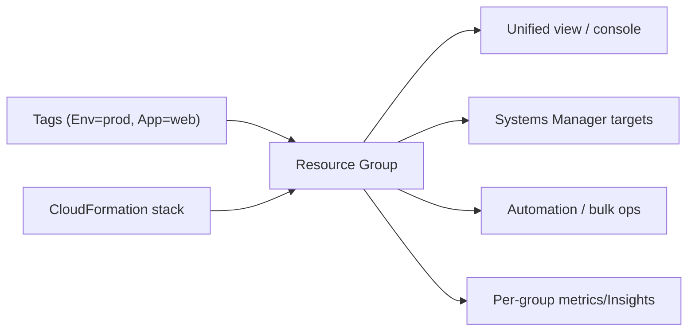

# AWS Resource Groups - Intro bits & bytes

> Resource Groups let you organize AWS resources into logical collections — by **tag** or by **CloudFormation stack** — so you can view, manage, automate, and apply operations to them **as a unit** (e.g. "all prod web-tier resources"). It's the bridge between your tagging strategy and bulk operations.

See also: [02 - AWS Resource Groups Deep Dive](02%20-%20AWS%20Resource%20Groups%20Deep%20Dive.md) · [03 - AWS Resource Groups Exam Scenarios](03%20-%20AWS%20Resource%20Groups%20Exam%20Scenarios.md) · [04 - AWS Resource Groups SRE Operations](04%20-%20AWS%20Resource%20Groups%20SRE%20Operations.md) · [01 - AWS Tagging Strategies Intro bits & bytes](01%20-%20AWS%20Tagging%20Strategies%20Intro%20bits%20%26%20bytes.md) · [01 - AWS Systems Manager Intro bits & bytes](01%20-%20AWS%20Systems%20Manager%20Intro%20bits%20%26%20bytes.md)

---

## Table of Contents

- [1. The Problem It Solves](#1-the-problem-it-solves)
- [2. Two Ways to Define a Group](#2-two-ways-to-define-a-group)
- [3. Tag Editor and the Tagging API](#3-tag-editor-and-the-tagging-api)
- [4. What You Do With a Group](#4-what-you-do-with-a-group)
- [5. When To Use It / When NOT To Use It](#5-when-to-use-it--when-not-to-use-it)
- [6. Cost Considerations](#6-cost-considerations)
- [7. Mini-Quiz](#7-mini-quiz)

---

---

## 1. The Problem It Solves

A real account has hundreds of resources scattered across services. Answering "show me everything that makes up the _prod payments_ app" or "patch all _web-tier_ instances" is painful when resources live in separate service consoles. **Resource Groups** collect resources that share **tags** (or belong to a **stack**) into a named group you can view and act on together — turning your tagging discipline into operational leverage.

> Mental model: tags are the _labels_; a Resource Group is a _saved query/collection_ over those labels (or a stack) that other services (especially **Systems Manager**) can target as a unit.

[⬆ Back to top](#table-of-contents)

---

## 2. Two Ways to Define a Group

| Type                           | Membership                                                                                                                     |
| :----------------------------- | :----------------------------------------------------------------------------------------------------------------------------- |
| **Tag-based**                  | All resources matching a **tag query** (e.g. `Env=prod AND App=web`); **dynamic** — membership updates as resources are tagged |
| **CloudFormation stack-based** | All resources created by a specific **stack**                                                                                  |

Tag-based groups are the common, flexible choice; stack-based mirrors your IaC boundaries.

[⬆ Back to top](#table-of-contents)

---

## 3. Tag Editor and the Tagging API

- **Tag Editor** (part of Resource Groups) lets you **find and bulk-edit tags** across many resource types and Regions at once — essential for fixing inconsistent tagging.
- The **Resource Groups Tagging API** (`GetResources`, `TagResources`, `UntagResources`) provides programmatic, cross-service tag operations.
- These tools make your [tagging strategy](01%20-%20AWS%20Tagging%20Strategies%20Intro%20bits%20%26%20bytes.md) enforceable and maintainable at scale.

[⬆ Back to top](#table-of-contents)

---

## 4. What You Do With a Group

- **View** all members across services in one place (console).
- **Target with Systems Manager** — Run Command, Patch Manager, Automation against a group.
- **Apply automation/bulk operations** (e.g. start/stop dev resources by group).
- **Per-group insights** and CloudWatch metric views.
- **Scope IAM/permissions** and organize cost/operations around the group.

[⬆ Back to top](#table-of-contents)

---

## 5. When To Use It / When NOT To Use It

**Use it when:** you need to operate on a logical app/environment as a unit, target SSM operations by tag, clean up/standardize tags (Tag Editor), or give teams a scoped view of "their" resources.

**Don't expect it to:**

- Replace **tagging strategy** — groups depend on good tags → [01 - AWS Tagging Strategies Intro bits & bytes](01%20-%20AWS%20Tagging%20Strategies%20Intro%20bits%20%26%20bytes.md).
- Be a **billing** construct — for cost grouping use **cost allocation tags** + Cost Explorer/CUR.
- Manage **accounts/OUs** — that's Organizations.

[⬆ Back to top](#table-of-contents)

---

## 6. Cost Considerations

- Resource Groups and Tag Editor are **free**.
- Their cost value is **operational**: enabling tag-driven automation (start/stop non-prod by group), accurate **cost allocation** (via tags), and faster ops.
- Pair group tags with **cost allocation tags** so the same labels drive both operations and showback/chargeback.

[⬆ Back to top](#table-of-contents)

---

## 7. Mini-Quiz

**Q1:** Two ways to define a Resource Group?
_A:_ **Tag-based** (dynamic tag query) or **CloudFormation stack-based**.

**Q2:** Patch all instances tagged `Tier=web` together — how?
_A:_ Create a tag-based **Resource Group** and target it with **Systems Manager** Patch Manager.

**Q3:** Bulk-fix inconsistent tags across services/regions?
_A:_ **Tag Editor** (and the Tagging API).

**Q4:** Are Resource Groups a billing feature?
_A:_ No — for cost use **cost allocation tags** + Cost Explorer/CUR (they share the same tags).

---

> Continue to [02 - AWS Resource Groups Deep Dive](02%20-%20AWS%20Resource%20Groups%20Deep%20Dive.md).
