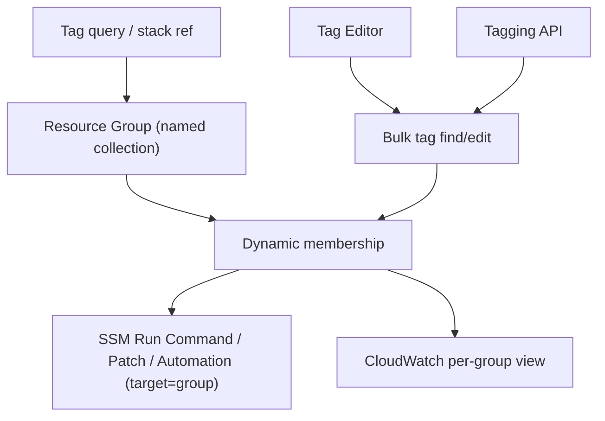

# AWS Resource Groups - Deep Dive

> Architecture, tag-query syntax, Tag Editor & Tagging API, SSM targeting, group-based access & insights, limits, integrations, comparisons, best practices.

See also: [01 - AWS Resource Groups Intro bits & bytes](01%20-%20AWS%20Resource%20Groups%20Intro%20bits%20%26%20bytes.md) · [03 - AWS Resource Groups Exam Scenarios](03%20-%20AWS%20Resource%20Groups%20Exam%20Scenarios.md) · [04 - AWS Resource Groups SRE Operations](04%20-%20AWS%20Resource%20Groups%20SRE%20Operations.md) · [01 - AWS Tagging Strategies Intro bits & bytes](01%20-%20AWS%20Tagging%20Strategies%20Intro%20bits%20%26%20bytes.md)

---

## Table of Contents

- [1. Architecture](#1-architecture)
- [2. Tag-Query and Stack Membership](#2-tag-query-and-stack-membership)
- [3. Tag Editor and Tagging API](#3-tag-editor-and-tagging-api)
- [4. Systems Manager Targeting](#4-systems-manager-targeting)
- [5. Access Control and Insights](#5-access-control-and-insights)
- [6. Service Limits and Quotas](#6-service-limits-and-quotas)
- [7. Integration Matrix](#7-integration-matrix)
- [8. Comparisons](#8-comparisons)
- [9. Best Practices by Pillar](#9-best-practices-by-pillar)

---

---

## 1. Architecture

A Resource Group is a saved definition (a tag query or a stack reference) that resolves to a **dynamic set of resource ARNs**. It's regional in scope for most uses (resources are regional), though Tag Editor can operate across Regions for tag management. Groups are consumed by other services—most importantly **Systems Manager**—as a targeting mechanism.

[⬆ Back to top](#table-of-contents)

---

## 2. Tag-Query and Stack Membership

- **Tag-based**: a query of `TagFilters` (key + optional values), combined with resource-type filters. Membership is **dynamic** — newly-tagged resources appear automatically.
- **Stack-based**: members are exactly the resources of a CloudFormation stack — tracks IaC boundaries.
- Groups can be **nested**/composed conceptually via consistent tagging conventions.

[⬆ Back to top](#table-of-contents)

---

## 3. Tag Editor and Tagging API

- **Tag Editor**: search resources across services/Regions by tag or type, then **add/edit/remove tags in bulk** — the remediation tool for tag drift.
- **Resource Groups Tagging API**: `GetResources` (find by tag/type), `TagResources`, `UntagResources`, `GetTagKeys/Values` — programmatic, cross-service.
- Together they make a tagging strategy **operational and enforceable**.

[⬆ Back to top](#table-of-contents)

---

## 4. Systems Manager Targeting

- SSM **Run Command**, **Patch Manager**, **State Manager**, and **Automation** can target a **Resource Group** (or a tag query directly) instead of explicit instance IDs.
- This is the operational payoff: "patch the `prod/web` group" stays correct as instances come and go (dynamic membership).
- See [01 - AWS Systems Manager Intro bits & bytes](01%20-%20AWS%20Systems%20Manager%20Intro%20bits%20%26%20bytes.md).

[⬆ Back to top](#table-of-contents)

---

## 5. Access Control and Insights

- **IAM** can scope permissions using tags (ABAC) — the same tags that define groups can gate access. See [17 - ABAC (Attribute-Based Access Control)](17%20-%20ABAC%20%28Attribute-Based%20Access%20Control%29.md).
- **Group-level CloudWatch** views/insights help monitor an app/environment as a unit.
- Console "Resource Groups" gives teams a focused view of just their resources.

[⬆ Back to top](#table-of-contents)

---

## 6. Service Limits and Quotas

| Aspect             | Detail                                                  |
| :----------------- | :------------------------------------------------------ |
| Cost               | Free                                                    |
| Membership         | Dynamic (tag) or stack-defined                          |
| Scope              | Regional resources; Tag Editor cross-Region for tagging |
| Tagging API        | Cross-service programmatic tag ops                      |
| Groups per account | Soft limit                                              |

[⬆ Back to top](#table-of-contents)

---

## 7. Integration Matrix

| Service                 | Integration                                                                                      |
| :---------------------- | :----------------------------------------------------------------------------------------------- |
| **Systems Manager**     | Target groups for Run Command/Patch/Automation → [01 - AWS Systems Manager Intro bits & bytes](01%20-%20AWS%20Systems%20Manager%20Intro%20bits%20%26%20bytes.md) |
| **Tagging strategy**    | Groups are built on tags → [01 - AWS Tagging Strategies Intro bits & bytes](01%20-%20AWS%20Tagging%20Strategies%20Intro%20bits%20%26%20bytes.md)                    |
| **CloudFormation**      | Stack-based groups → [01 - AWS CloudFormation Intro bits & bytes](01%20-%20AWS%20CloudFormation%20Intro%20bits%20%26%20bytes.md)                              |
| **CloudWatch**          | Per-group metric views → [01 - Amazon CloudWatch Intro bits & bytes](01%20-%20Amazon%20CloudWatch%20Intro%20bits%20%26%20bytes.md)                           |
| **IAM / ABAC**          | Tag-based access control → [17 - ABAC (Attribute-Based Access Control)](17%20-%20ABAC%20%28Attribute-Based%20Access%20Control%29.md)                        |
| **Cost Explorer / CUR** | Same tags drive cost allocation → [01 - Cost Explorer Fundamentals & Architecture](01%20-%20Cost%20Explorer%20Fundamentals%20%26%20Architecture.md)             |
| **Config**              | Tag-compliance rules complement grouping → [24 - AWS Config & Audit Manager](24%20-%20AWS%20Config%20%26%20Audit%20Manager.md)                   |

[⬆ Back to top](#table-of-contents)

---

## 8. Comparisons

### Resource Groups vs Tags vs Organizations

|         | Resource Groups                         | Tags                         | Organizations            |
| :------ | :-------------------------------------- | :--------------------------- | :----------------------- |
| Unit    | Collection of resources (in an account) | Metadata labels on resources | Accounts/OUs             |
| Purpose | Operate on resources as a unit          | Classify/allocate            | Multi-account governance |
| Dynamic | Yes (tag query)                         | n/a                          | n/a                      |

### Tag-based vs Stack-based groups

|            | Tag-based                    | Stack-based          |
| :--------- | :--------------------------- | :------------------- |
| Membership | Dynamic query                | Stack resources      |
| Best for   | Cross-stack logical grouping | IaC-aligned grouping |

[⬆ Back to top](#table-of-contents)

---

## 9. Best Practices by Pillar

**Operational Excellence** — define groups around apps/environments; target SSM by group; use Tag Editor to fix drift.

**Security** — use the same tags for **ABAC** access scoping; least-privilege per group.

**Cost Optimization** — align group tags with **cost allocation tags**; automate start/stop of non-prod groups.

**Reliability** — group-based patching/automation keeps fleets consistent as they change.

**Governance** — enforce required tags (Config/SCP/tag policies) so groups stay accurate.

[⬆ Back to top](#table-of-contents)

---

> Continue to [03 - AWS Resource Groups Exam Scenarios](03%20-%20AWS%20Resource%20Groups%20Exam%20Scenarios.md).
