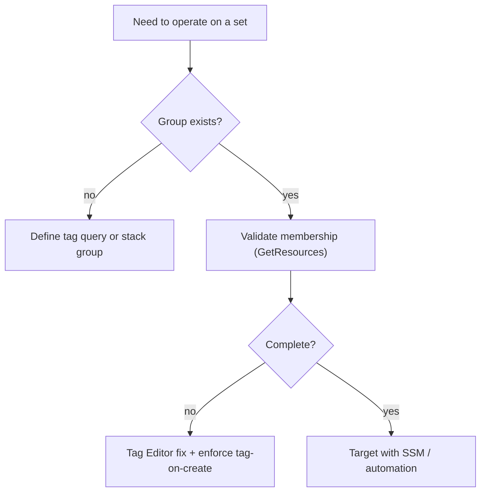

# AWS Resource Groups - SRE Operations

> Operational reality: stale/empty groups, tag drift, real CLI examples, automation patterns, and cost ops.

See also: [01 - AWS Resource Groups Intro bits & bytes](01%20-%20AWS%20Resource%20Groups%20Intro%20bits%20%26%20bytes.md) · [02 - AWS Resource Groups Deep Dive](02%20-%20AWS%20Resource%20Groups%20Deep%20Dive.md) · [03 - AWS Resource Groups Exam Scenarios](03%20-%20AWS%20Resource%20Groups%20Exam%20Scenarios.md) · [01 - AWS Systems Manager Intro bits & bytes](01%20-%20AWS%20Systems%20Manager%20Intro%20bits%20%26%20bytes.md)

---

## Table of Contents

- [1. Common Issues (Symptom → Root Cause → Fix → Prevention)](#1-common-issues-symptom--root-cause--fix--prevention)
- [2. Operational Workflow](#2-operational-workflow)
- [3. What to Monitor](#3-what-to-monitor)
- [4. Runbooks](#4-runbooks)
- [5. Real Examples](#5-real-examples)
- [6. Production Patterns by Org Size](#6-production-patterns-by-org-size)
- [7. Cost Operations](#7-cost-operations)

---

## 1. Common Issues (Symptom → Root Cause → Fix → Prevention)

### Group missing resources

- **Cause:** Resources launched untagged or with wrong tag values.
- **Fix:** Tag Editor bulk-fix; correct the tag query.
- **Prevention:** Enforce tag-on-create (tag policies/Config/IaC defaults).

### SSM targets fewer instances than expected

- **Cause:** Tag mismatch or instances not managed nodes.
- **Fix:** Verify tags and SSM prerequisites (agent/role/connectivity).
- **Prevention:** Standard tags + managed-node baseline.

### Inconsistent tag keys/case

- **Cause:** No tag standard; `env` vs `Env`.
- **Fix:** Standardize via Tag Editor/Tagging API.
- **Prevention:** Tag policy enforcing allowed keys/case.

### Group query too broad/narrow

- **Cause:** Imprecise TagFilters.
- **Fix:** Refine the query (combine App+Env+Region).
- **Prevention:** Documented tag taxonomy.

[⬆ Back to top](#table-of-contents)

---

## 2. Operational Workflow



[⬆ Back to top](#table-of-contents)

---

## 3. What to Monitor

| Signal                             | Why                          |
| :--------------------------------- | :--------------------------- |
| Untagged-resource count            | Group completeness/cost gaps |
| Tag-policy compliance (Config)     | Governance                   |
| SSM target match count vs expected | Operational coverage         |
| Group membership drift             | Accuracy                     |

[⬆ Back to top](#table-of-contents)

---

## 4. Runbooks

### Runbook: create an app group and patch it

1. Confirm resources carry `App` + `Env` tags (Tag Editor to fix gaps).
2. Create a tag-based Resource Group for `App=payments AND Env=prod`.
3. Target the group with SSM Patch Manager in a Maintenance Window.

### Runbook: remediate tag drift

1. `GetResources` with no/partial tags to find offenders.
2. `TagResources` to apply the standard tags in bulk.
3. Enable a tag policy/Config rule to prevent recurrence.

[⬆ Back to top](#table-of-contents)

---

## 5. Real Examples

### Create a tag-based group (CLI)

```bash
aws resource-groups create-group --name prod-web \
  --resource-query '{"Type":"TAG_FILTERS_1_0","Query":"{\"ResourceTypeFilters\":[\"AWS::AllSupported\"],\"TagFilters\":[{\"Key\":\"App\",\"Values\":[\"web\"]},{\"Key\":\"Env\",\"Values\":[\"prod\"]}]}"}'
```

### Find and bulk-tag resources (Tagging API)

```bash
aws resourcegroupstaggingapi get-resources \
  --tag-filters Key=App,Values=web --query "ResourceTagMappingList[].ResourceARN"

aws resourcegroupstaggingapi tag-resources \
  --resource-arn-list arn:aws:ec2:...:instance/i-123 arn:aws:rds:...:db:mydb \
  --tags Env=prod,App=web,CostCenter=cc-100
```

### Target the group with SSM Run Command

```bash
aws ssm send-command --document-name "AWS-RunPatchBaseline" \
  --targets "Key=resource-groups:Name,Values=prod-web" \
  --parameters Operation=Install --max-concurrency 10%
```

[⬆ Back to top](#table-of-contents)

---

## 6. Production Patterns by Org Size

| Context           | Pattern                                                                      |
| :---------------- | :--------------------------------------------------------------------------- |
| **Startup**       | A few app/env groups; Tag Editor to keep tidy.                               |
| **SMB**           | Patch/automation by group; scheduled non-prod stop/start.                    |
| **Enterprise**    | Governed tag taxonomy; tag policies enforce; groups drive SSM + ABAC + cost. |
| **Regulated**     | Config verifies required tags; auditable app membership exports.             |
| **Multi-Account** | Consistent tag standard org-wide; per-account groups; central reporting.     |

[⬆ Back to top](#table-of-contents)

---

## 7. Cost Operations

- Use the **same tags** for groups and **cost allocation** so ops and FinOps align.
- Automate **non-prod stop/start** by group to cut idle cost.
- Tag Editor to find **untagged** (often unattributed-cost) resources.
- Resource Groups are free; the savings come from the **automation** they enable.

[⬆ Back to top](#table-of-contents)

---

Related: [01 - AWS Resource Groups Intro bits & bytes](01%20-%20AWS%20Resource%20Groups%20Intro%20bits%20%26%20bytes.md) · [02 - AWS Resource Groups Deep Dive](02%20-%20AWS%20Resource%20Groups%20Deep%20Dive.md) · [03 - AWS Resource Groups Exam Scenarios](03%20-%20AWS%20Resource%20Groups%20Exam%20Scenarios.md) · [01 - AWS Tagging Strategies Intro bits & bytes](01%20-%20AWS%20Tagging%20Strategies%20Intro%20bits%20%26%20bytes.md) · [01 - AWS Systems Manager Intro bits & bytes](01%20-%20AWS%20Systems%20Manager%20Intro%20bits%20%26%20bytes.md)
