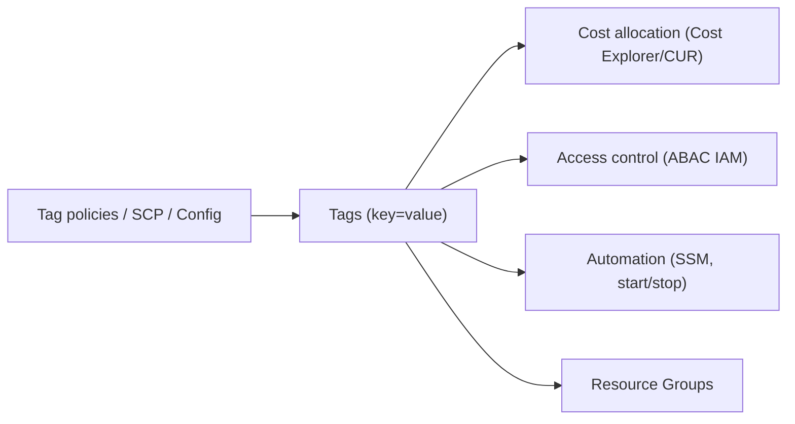

# AWS Tagging Strategies - Intro bits & bytes

> Tags are key/value labels on AWS resources, and a **tagging strategy** is the disciplined, enforced taxonomy that makes them useful. Tags are the connective tissue of governance: they drive **cost allocation**, **access control (ABAC)**, **automation**, and **resource grouping**. Get tags right and most governance becomes easy.

See also: [02 - AWS Tagging Strategies Deep Dive](02%20-%20AWS%20Tagging%20Strategies%20Deep%20Dive.md) · [03 - AWS Tagging Strategies Exam Scenarios](03%20-%20AWS%20Tagging%20Strategies%20Exam%20Scenarios.md) · [04 - AWS Tagging Strategies SRE Operations](04%20-%20AWS%20Tagging%20Strategies%20SRE%20Operations.md) · [01 - AWS Resource Groups Intro bits & bytes](01%20-%20AWS%20Resource%20Groups%20Intro%20bits%20%26%20bytes.md) · [17 - ABAC (Attribute-Based Access Control)](17%20-%20ABAC%20%28Attribute-Based%20Access%20Control%29.md)

---

## Table of Contents

- [1. The Problem It Solves](#1-the-problem-it-solves)
- [2. What a Tag Is (and Limits)](#2-what-a-tag-is-and-limits)
- [3. The Four Jobs Tags Do](#3-the-four-jobs-tags-do)
- [4. Designing a Tag Taxonomy](#4-designing-a-tag-taxonomy)
- [5. Enforcing Tags](#5-enforcing-tags)
- [6. Cost Considerations](#6-cost-considerations)
- [7. Mini-Quiz](#7-mini-quiz)

---

---

## 1. The Problem It Solves

In a large account, "whose is this, what's it for, can I delete it, which cost center pays?" is unanswerable without metadata. **Tags** answer those questions, but only if they're **consistent and enforced**. A tagging strategy turns ad-hoc labels into a governed taxonomy that powers cost reporting, least-privilege access, automation, and organization — across every service and account.

> Mental model: tags are **cheap metadata with outsized leverage**. The same `Env=prod`, `CostCenter=cc-100`, `Owner=team-x` tags simultaneously drive billing reports, IAM conditions, SSM targeting, and Resource Groups. Inconsistent tags break all of them at once.

[⬆ Back to top](#table-of-contents)

---

## 2. What a Tag Is (and Limits)

- A **tag** = a **key** + optional **value** (e.g. `Environment=production`).
- Limits: **up to 50 tags per resource**; key up to 128 chars, value up to 256 chars; case-sensitive (`Env` ≠ `env`).
- **Reserved prefix**: `aws:` tags are AWS-managed (you can't set them).
- Most resources support tags; tag-on-create is supported by most create APIs.

[⬆ Back to top](#table-of-contents)

---

## 3. The Four Jobs Tags Do

| Job                       | How tags enable it                                                                                                                    |
| :------------------------ | :------------------------------------------------------------------------------------------------------------------------------------ |
| **Cost allocation**       | Activate **cost allocation tags**; Cost Explorer/CUR break down spend by tag (CostCenter, Project, Env)                               |
| **Access control (ABAC)** | IAM conditions on `aws:ResourceTag`/`aws:PrincipalTag` grant access by matching tags → [17 - ABAC (Attribute-Based Access Control)](17%20-%20ABAC%20%28Attribute-Based%20Access%20Control%29.md) |
| **Automation**            | SSM/Lambda target by tag; schedules (stop dev nightly); backup selection (AWS Backup tag-based plans)                                 |
| **Organization**          | Resource Groups collect by tag; search, dashboards, ownership → [01 - AWS Resource Groups Intro bits & bytes](01%20-%20AWS%20Resource%20Groups%20Intro%20bits%20%26%20bytes.md)                       |

[⬆ Back to top](#table-of-contents)

---

## 4. Designing a Tag Taxonomy

A good taxonomy has a small set of **mandatory** keys plus optional ones, with **standardized keys and allowed values**:

| Tag key                  | Purpose          | Example                  |
| :----------------------- | :--------------- | :----------------------- |
| `Environment`            | Lifecycle        | `prod`, `staging`, `dev` |
| `CostCenter` / `Project` | Cost allocation  | `cc-100`, `payments`     |
| `Owner` / `Team`         | Accountability   | `team-platform`          |
| `Application`            | App grouping     | `web`, `orders`          |
| `DataClassification`     | Security         | `public`, `confidential` |
| `Compliance`             | Regulatory scope | `pci`, `none`            |
| `BackupPolicy`           | Automation       | `daily`, `none`          |

Principles: **few mandatory keys**, **consistent case**, **controlled values**, documented, and applied **at creation** (via IaC defaults).

[⬆ Back to top](#table-of-contents)

---

## 5. Enforcing Tags

| Mechanism                        | What it does                                                                                                 |
| :------------------------------- | :----------------------------------------------------------------------------------------------------------- |
| **Tag Policies** (Organizations) | Define standardized keys/values; report non-compliance org-wide                                              |
| **SCPs**                         | **Deny** create actions lacking required tags (`aws:RequestTag`/`aws:TagKeys` conditions) — hard enforcement |
| **AWS Config rules**             | Detect resources missing required tags (`required-tags`); remediate                                          |
| **IaC defaults**                 | CloudFormation/Terraform apply standard tags automatically                                                   |
| **Tag Editor / Tagging API**     | Bulk-fix existing drift → [01 - AWS Resource Groups Intro bits & bytes](01%20-%20AWS%20Resource%20Groups%20Intro%20bits%20%26%20bytes.md)                                    |

> Exam nuance: **Tag Policies report** standardization; **SCPs enforce** (block untagged creates). Use both — policies for visibility, SCPs for hard guardrails.

[⬆ Back to top](#table-of-contents)

---

## 6. Cost Considerations

- Tags are **free**; the payoff is enormous: accurate **showback/chargeback**, finding untagged (unattributed) cost, and automating **non-prod shutdown** by tag.
- **Cost allocation tags** must be **activated** in Billing before they appear in Cost Explorer/CUR — and they're **not retroactive** (activate early).
- Untagged resources are the enemy of cost visibility — enforce tag-on-create.

[⬆ Back to top](#table-of-contents)

---

## 7. Mini-Quiz

**Q1:** Name the four jobs tags do.
_A:_ **Cost allocation, access control (ABAC), automation, organization (grouping).**

**Q2:** Difference between Tag Policies and SCPs for tagging?
_A:_ Tag Policies **standardize/report**; SCPs **enforce** (deny untagged creates).

**Q3:** Why activate cost allocation tags early?
_A:_ They aren't **retroactive** — only spend after activation is broken down.

**Q4:** Max tags per resource?
_A:_ **50**.

---

> Continue to [02 - AWS Tagging Strategies Deep Dive](02%20-%20AWS%20Tagging%20Strategies%20Deep%20Dive.md).
