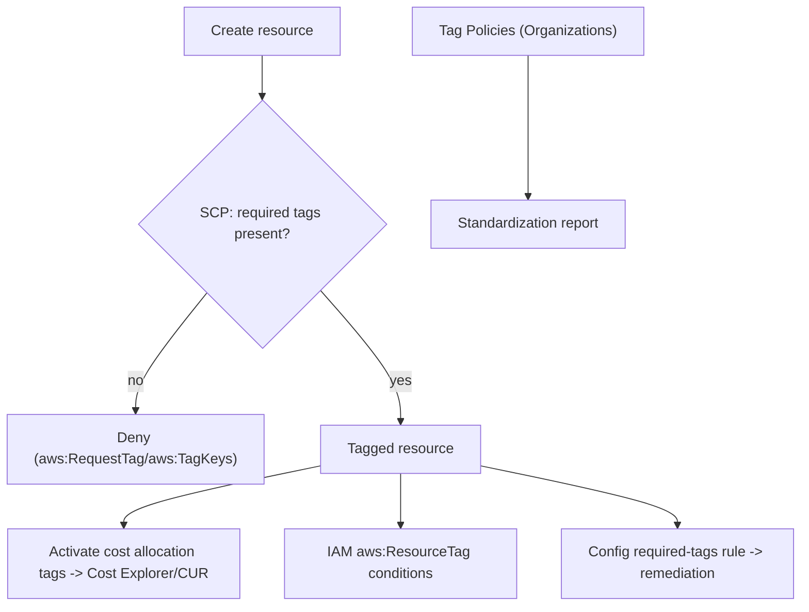

# AWS Tagging Strategies - Deep Dive

> Tag mechanics, cost allocation tags, ABAC with tags, tag policies vs SCP enforcement, tag-on-create conditions, Config remediation, limits, integrations, comparisons, best practices.

See also: [01 - AWS Tagging Strategies Intro bits & bytes](01%20-%20AWS%20Tagging%20Strategies%20Intro%20bits%20%26%20bytes.md) · [03 - AWS Tagging Strategies Exam Scenarios](03%20-%20AWS%20Tagging%20Strategies%20Exam%20Scenarios.md) · [04 - AWS Tagging Strategies SRE Operations](04%20-%20AWS%20Tagging%20Strategies%20SRE%20Operations.md) · [17 - ABAC (Attribute-Based Access Control)](17%20-%20ABAC%20%28Attribute-Based%20Access%20Control%29.md) · [01 - AWS Resource Groups Intro bits & bytes](01%20-%20AWS%20Resource%20Groups%20Intro%20bits%20%26%20bytes.md)

---

## Table of Contents

- [1. Tag Mechanics and Inheritance](#1-tag-mechanics-and-inheritance)
- [2. Cost Allocation Tags](#2-cost-allocation-tags)
- [3. ABAC with Tags](#3-abac-with-tags)
- [4. Enforcement: Tag Policies vs SCP](#4-enforcement-tag-policies-vs-scp)
- [5. Tag-on-Create and Config Remediation](#5-tag-on-create-and-config-remediation)
- [6. Limits and Gotchas](#6-limits-and-gotchas)
- [7. Integration Matrix](#7-integration-matrix)
- [8. Comparisons](#8-comparisons)
- [9. Best Practices by Pillar](#9-best-practices-by-pillar)

---

---

## 1. Tag Mechanics and Inheritance

- Tags are applied per-resource; **there is no automatic inheritance** (a tag on a VPC doesn't flow to instances) — except where a service explicitly propagates (e.g. **ASG tag propagation** to launched instances, CloudFormation stack-level tags to resources).
- **Tag-on-create**: pass tags in the create call so resources are never untagged.
- Case-sensitive keys/values; pick one convention (e.g. PascalCase keys) and enforce it.

[⬆ Back to top](#table-of-contents)

---

## 2. Cost Allocation Tags

- Two kinds: **AWS-generated** (`aws:createdBy`, etc.) and **user-defined**.
- Must be **activated** in the Billing console before they appear in **Cost Explorer**, **CUR**, and **Budgets** filters.
- **Not retroactive** — activate keys early to get historical breakdowns going forward.
- Power **showback/chargeback**, per-team/per-project budgets, and anomaly attribution.

[⬆ Back to top](#table-of-contents)

---

## 3. ABAC with Tags

- **Attribute-Based Access Control**: IAM policies use conditions like `aws:ResourceTag/Team` and `aws:PrincipalTag/Team` so access is granted when **principal tag matches resource tag** — scalable, fewer policies.
- Enables "engineers can manage only resources tagged with their own team," and tag-based delegation.
- Requires **trusted tagging** (control who can set the governing tags) — otherwise users could self-grant by retagging. See [17 - ABAC (Attribute-Based Access Control)](17%20-%20ABAC%20%28Attribute-Based%20Access%20Control%29.md).

[⬆ Back to top](#table-of-contents)

---

## 4. Enforcement: Tag Policies vs SCP

|             | **Tag Policies**                                                                                                                                      | **SCP**                                                                |
| :---------- | :---------------------------------------------------------------------------------------------------------------------------------------------------- | :--------------------------------------------------------------------- |
| Scope       | Organizations                                                                                                                                         | Organizations                                                          |
| Function    | Define standard keys/allowed values; **report** non-compliance; optionally **enforce** (prevent non-compliant tag operations for supported resources) | **Deny** API actions (e.g. create) when required tags absent/incorrect |
| Strength    | Standardization + visibility                                                                                                                          | Hard guardrail on actions                                              |
| Typical use | Org-wide tag consistency reporting                                                                                                                    | Block untagged resource creation                                       |

> Use **both**: Tag Policies to define/standardize and report; SCPs (with `aws:RequestTag`/`aws:TagKeys` conditions) to hard-block non-compliant creates.

[⬆ Back to top](#table-of-contents)

---

## 5. Tag-on-Create and Config Remediation

- **SCP example**: deny `ec2:RunInstances` unless `aws:RequestTag/CostCenter` exists — forces tagging at creation.
- **Config `required-tags` rule**: detects existing resources missing mandatory tags; pair with **SSM Automation** remediation to add a default or notify owners.
- **IaC**: set default/stack tags so everything is born compliant.

[⬆ Back to top](#table-of-contents)

---

## 6. Limits and Gotchas

| Gotcha                     | Detail                                          |
| :------------------------- | :---------------------------------------------- |
| 50 tags/resource           | Plan a lean mandatory set                       |
| Case sensitivity           | `Env` ≠ `env` — standardize                     |
| No inheritance             | Tag explicitly (or rely on ASG/CFN propagation) |
| Cost tags not retroactive  | Activate early                                  |
| `aws:` reserved            | Can't set AWS-managed tags                      |
| Not all resources taggable | Verify per service                              |

[⬆ Back to top](#table-of-contents)

---

## 7. Integration Matrix

| Service                           | Integration                                                                                                                       |
| :-------------------------------- | :-------------------------------------------------------------------------------------------------------------------------------- |
| **Cost Explorer / CUR / Budgets** | Cost allocation tags → [01 - Cost Explorer Fundamentals & Architecture](01%20-%20Cost%20Explorer%20Fundamentals%20%26%20Architecture.md) · [01 - AWS Budgets Fundamentals & Architecture](01%20-%20AWS%20Budgets%20Fundamentals%20%26%20Architecture.md)      |
| **IAM (ABAC)**                    | Tag-condition access → [17 - ABAC (Attribute-Based Access Control)](17%20-%20ABAC%20%28Attribute-Based%20Access%20Control%29.md)                                                             |
| **Resource Groups / Tag Editor**  | Group + bulk-edit → [01 - AWS Resource Groups Intro bits & bytes](01%20-%20AWS%20Resource%20Groups%20Intro%20bits%20%26%20bytes.md)                                                               |
| **Organizations**                 | Tag Policies + SCP enforcement → [06 - IAM Identity Center & Organizations](06%20-%20IAM%20Identity%20Center%20%26%20Organizations.md) · [08 - SCP](08%20-%20SCP.md)                                      |
| **Config**                        | `required-tags` + remediation → [24 - AWS Config & Audit Manager](24%20-%20AWS%20Config%20%26%20Audit%20Manager.md)                                                               |
| **Systems Manager / AWS Backup**  | Tag-based targeting & backup selection → [01 - AWS Systems Manager Intro bits & bytes](01%20-%20AWS%20Systems%20Manager%20Intro%20bits%20%26%20bytes.md) · [01 - AWS Backup Intro bits & bytes](01%20-%20AWS%20Backup%20Intro%20bits%20%26%20bytes.md) |
| **CloudFormation**                | Default/stack tags propagate                                                                                                      |

[⬆ Back to top](#table-of-contents)

---

## 8. Comparisons

### Tag Policies vs SCP vs Config (for tags)

|          | Tag Policies       | SCP             | Config required-tags      |
| :------- | :----------------- | :-------------- | :------------------------ |
| When     | Standardize/report | Block at create | Detect/remediate existing |
| Strength | Consistency        | Prevention      | Detection + fix           |

### Tags vs Resource Groups vs Cost Categories

|      | Tags            | Resource Groups       | Cost Categories         |
| :--- | :-------------- | :-------------------- | :---------------------- |
| What | Metadata labels | Collections over tags | Billing groupings/rules |
| Use  | Everything      | Operations            | Cost reporting roll-ups |

[⬆ Back to top](#table-of-contents)

---

## 9. Best Practices by Pillar

**Cost Optimization** — define + **activate cost allocation tags** early; mandatory `CostCenter`/`Project`; find untagged spend.

**Security** — **ABAC** with governed tags; restrict who can set governing tags; `DataClassification` tag drives controls.

**Operational Excellence** — tag-on-create via IaC; Tag Policies to standardize; Tag Editor to remediate drift.

**Governance** — **SCP** to block untagged creates; **Config** to detect/remediate; org-wide consistency.

**Reliability** — `BackupPolicy` tag drives AWS Backup selection; tag-based SSM patch groups.

[⬆ Back to top](#table-of-contents)

---

> Continue to [03 - AWS Tagging Strategies Exam Scenarios](03%20-%20AWS%20Tagging%20Strategies%20Exam%20Scenarios.md).
