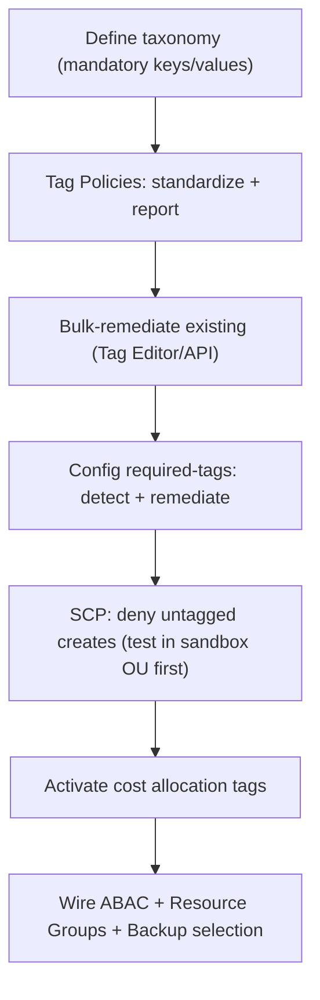

# AWS Tagging Strategies - SRE Operations

> Operational reality: tag drift, enforcement rollouts, real SCP/Config/CLI examples, governance patterns, and cost ops.

See also: [01 - AWS Tagging Strategies Intro bits & bytes](01%20-%20AWS%20Tagging%20Strategies%20Intro%20bits%20%26%20bytes.md) · [02 - AWS Tagging Strategies Deep Dive](02%20-%20AWS%20Tagging%20Strategies%20Deep%20Dive.md) · [03 - AWS Tagging Strategies Exam Scenarios](03%20-%20AWS%20Tagging%20Strategies%20Exam%20Scenarios.md) · [01 - AWS Resource Groups Intro bits & bytes](01%20-%20AWS%20Resource%20Groups%20Intro%20bits%20%26%20bytes.md)

---

## Table of Contents

- [1. Common Issues (Symptom → Root Cause → Fix → Prevention)](#1-common-issues-symptom--root-cause--fix--prevention)
- [2. Rollout Workflow](#2-rollout-workflow)
- [3. What to Monitor](#3-what-to-monitor)
- [4. Runbooks](#4-runbooks)
- [5. Real Examples](#5-real-examples)
- [6. Production Patterns by Org Size](#6-production-patterns-by-org-size)
- [7. Cost Operations](#7-cost-operations)

---

## 1. Common Issues (Symptom → Root Cause → Fix → Prevention)

### Untagged resources / unattributed cost

- **Cause:** No tag-on-create enforcement.
- **Fix:** Bulk-tag (Tag Editor/API); enforce via SCP going forward.
- **Prevention:** SCP deny untagged creates; IaC defaults.

### Inconsistent keys/case

- **Cause:** No standard.
- **Fix:** Tag Policies define canonical keys; Tag Editor remediates.
- **Prevention:** Tag Policies + value validation.

### Cost breakdown missing months

- **Cause:** Cost allocation tags activated late (not retroactive).
- **Fix:** Reconstruct from CUR where possible; activate now.
- **Prevention:** Activate cost tags at account/landing-zone setup.

### ABAC privilege escalation via retag

- **Cause:** Users can modify governing tags.
- **Fix:** Deny tag modification except by trusted roles.
- **Prevention:** Separate tag-admin permissions.

### SCP blocks legitimate creates

- **Cause:** Required-tag SCP too strict / breaks automation roles.
- **Fix:** Exempt service-linked/automation roles; allow service-applied tags.
- **Prevention:** Test SCPs in a sandbox OU first.

[⬆ Back to top](#table-of-contents)

---

## 2. Rollout Workflow



[⬆ Back to top](#table-of-contents)

---

## 3. What to Monitor

| Signal                              | Why                         |
| :---------------------------------- | :-------------------------- |
| Untagged-resource count / %         | Coverage + cost attribution |
| Tag Policy non-compliance report    | Standardization             |
| Config required-tags compliance     | Continuous governance       |
| Unattributed spend in Cost Explorer | Tagging gaps                |
| Denied creates (SCP)                | Enforcement friction        |

[⬆ Back to top](#table-of-contents)

---

## 4. Runbooks

### Runbook: enforce mandatory tags org-wide

1. Publish the taxonomy; attach **Tag Policies** at the org/OU (report mode first).
2. Remediate existing resources (Tag Editor/Tagging API).
3. Add **Config required-tags** with remediation.
4. Pilot the **SCP** in a sandbox OU; then roll out org-wide (exempt automation roles).
5. Activate **cost allocation tags**; validate Cost Explorer breakdowns.

### Runbook: find and fix untagged cost

1. Cost Explorer: filter by "no tag" / untagged.
2. Tagging API `GetResources` with empty tag filters to list offenders.
3. Bulk `TagResources`; notify owners; close the loop with enforcement.

[⬆ Back to top](#table-of-contents)

---

## 5. Real Examples

### SCP: require CostCenter on EC2 launches

```json
{
  "Version": "2012-10-17",
  "Statement": [
    {
      "Sid": "RequireCostCenterTag",
      "Effect": "Deny",
      "Action": "ec2:RunInstances",
      "Resource": "arn:aws:ec2:*:*:instance/*",
      "Condition": { "Null": { "aws:RequestTag/CostCenter": "true" } }
    }
  ]
}
```

### Config managed rule: required-tags

```bash
aws configservice put-config-rule --config-rule '{
  "ConfigRuleName": "required-tags",
  "Source": {"Owner":"AWS","SourceIdentifier":"REQUIRED_TAGS"},
  "InputParameters": "{\"tag1Key\":\"Environment\",\"tag2Key\":\"Owner\",\"tag3Key\":\"CostCenter\"}"
}'
```

### ABAC policy (team match)

```json
{
  "Version": "2012-10-17",
  "Statement": [
    {
      "Effect": "Allow",
      "Action": ["ec2:StartInstances", "ec2:StopInstances"],
      "Resource": "*",
      "Condition": {
        "StringEquals": { "aws:ResourceTag/Team": "${aws:PrincipalTag/Team}" }
      }
    }
  ]
}
```

### Bulk tag via Tagging API

```bash
aws resourcegroupstaggingapi tag-resources \
  --resource-arn-list arn:aws:ec2:...:instance/i-1 arn:aws:s3:::bucket \
  --tags Environment=prod,Owner=team-platform,CostCenter=cc-100
```

[⬆ Back to top](#table-of-contents)

---

## 6. Production Patterns by Org Size

| Context           | Pattern                                                                            |
| :---------------- | :--------------------------------------------------------------------------------- |
| **Startup**       | A few mandatory tags via IaC defaults; activate cost tags early.                   |
| **SMB**           | Tag Policies (report) + Config required-tags; bulk remediate.                      |
| **Enterprise**    | Org-wide Tag Policies + SCP enforcement; ABAC; cost categories; FinOps dashboards. |
| **Regulated**     | Continuous Config compliance; DataClassification-driven controls; audited.         |
| **Multi-Account** | Tag governance at OU level; new accounts inherit; central reporting.               |

[⬆ Back to top](#table-of-contents)

---

## 7. Cost Operations

- **Activate cost allocation tags early** (not retroactive) — the single biggest cost-visibility lever.
- Hunt **untagged/unattributed** spend; remediate and enforce.
- Use **Cost Categories** to roll up tags/accounts for reporting without re-tagging.
- Tag-driven **non-prod shutdown** and **right-size by team** convert tags into savings.

[⬆ Back to top](#table-of-contents)

---

Related: [01 - AWS Tagging Strategies Intro bits & bytes](01%20-%20AWS%20Tagging%20Strategies%20Intro%20bits%20%26%20bytes.md) · [02 - AWS Tagging Strategies Deep Dive](02%20-%20AWS%20Tagging%20Strategies%20Deep%20Dive.md) · [03 - AWS Tagging Strategies Exam Scenarios](03%20-%20AWS%20Tagging%20Strategies%20Exam%20Scenarios.md) · [01 - AWS Resource Groups Intro bits & bytes](01%20-%20AWS%20Resource%20Groups%20Intro%20bits%20%26%20bytes.md) · [17 - ABAC (Attribute-Based Access Control)](17%20-%20ABAC%20%28Attribute-Based%20Access%20Control%29.md) · [01 - Cost Explorer Fundamentals & Architecture](01%20-%20Cost%20Explorer%20Fundamentals%20%26%20Architecture.md)
