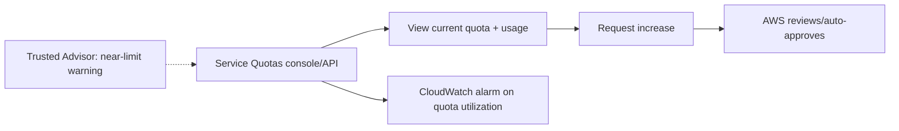

# AWS Service Quotas - Intro bits & bytes

> Service Quotas is the central place to **view and request increases** to the limits AWS places on your resources (EC2 vCPUs, VPCs, Lambda concurrency, etc.). It answers "what's my limit, how close am I, and how do I raise it?" — and it pairs with Trusted Advisor's early-warning checks.

See also: [02 - AWS Service Quotas Deep Dive](02%20-%20AWS%20Service%20Quotas%20Deep%20Dive.md) · [03 - AWS Service Quotas Exam Scenarios](03%20-%20AWS%20Service%20Quotas%20Exam%20Scenarios.md) · [04 - AWS Service Quotas SRE Operations](04%20-%20AWS%20Service%20Quotas%20SRE%20Operations.md) · [01 - AWS Trusted Advisor Intro bits & bytes](01%20-%20AWS%20Trusted%20Advisor%20Intro%20bits%20%26%20bytes.md) · [01 - AWS Auto Scaling Intro bits & bytes](01%20-%20AWS%20Auto%20Scaling%20Intro%20bits%20%26%20bytes.md)

---

## Table of Contents

- [1. The Problem It Solves](#1-the-problem-it-solves)
- [2. Soft vs Hard Limits](#2-soft-vs-hard-limits)
- [3. How Increases Work](#3-how-increases-work)
- [4. Service Quotas vs Trusted Advisor](#4-service-quotas-vs-trusted-advisor)
- [5. When To Use It / When NOT To Use It](#5-when-to-use-it--when-not-to-use-it)
- [6. Cost Considerations](#6-cost-considerations)
- [7. Mini-Quiz](#7-mini-quiz)

---

---

## 1. The Problem It Solves

Every AWS account has **limits** (quotas) per service per region — they protect AWS and you from runaway usage. The pain: you discover a limit only when something **fails to launch** (an ASG can't add instances, Lambda throttles, you can't create another VPC). Service Quotas centralizes **visibility** (what is my limit, current usage) and **action** (request an increase, track approval) so you can raise limits **proactively** instead of during an incident.

> Mental model: Service Quotas = the **limits control panel**. Trusted Advisor _warns_ you're near a limit; Service Quotas is where you _see and raise_ it.

[⬆ Back to top](#table-of-contents)

---

## 2. Soft vs Hard Limits

|                | **Soft limit (adjustable quota)**                              | **Hard limit**                                               |
| :------------- | :------------------------------------------------------------- | :----------------------------------------------------------- |
| Can be raised? | **Yes**, via request                                           | **No** (architectural maximum)                               |
| Examples       | EC2 On-Demand vCPUs, VPCs per region, Lambda concurrency, EIPs | Max security-group rules ceilings, certain absolute maximums |
| Where          | Service Quotas request                                         | Design around it                                             |

> Exam framing: most "we hit a limit, how do we get more?" answers are **soft limits → request increase via Service Quotas**. If it's a **hard** limit, you must **architect around it** (e.g. spread across accounts/regions).

[⬆ Back to top](#table-of-contents)

---

## 3. How Increases Work

- View a quota's **applied value** and (where supported) **current utilization**.
- **Request an increase**; some are **auto-approved** quickly, others go to AWS Support review.
- **Quota request templates** can apply desired increases **automatically to new accounts** in an Organization — great for landing zones.
- Integrates with **CloudWatch** so you can **alarm on quota utilization** (e.g. at 80%).
- Programmatic via the Service Quotas **API/CLI**.

[⬆ Back to top](#table-of-contents)

---

## 4. Service Quotas vs Trusted Advisor

|              | Service Quotas                                              | Trusted Advisor (Service Limits check)                              |
| :----------- | :---------------------------------------------------------- | :------------------------------------------------------------------ |
| Role         | **View + request increases** (the control plane for limits) | **Warns** when nearing a limit                                      |
| Action       | Submit/track increase requests                              | Surfaces the issue (you then act in Service Quotas)                 |
| Availability | All accounts                                                | Limits check in core (all plans); full TA needs Business/Enterprise |

> They're complementary: Trusted Advisor (or a CloudWatch alarm) **alerts**; Service Quotas **raises**.

[⬆ Back to top](#table-of-contents)

---

## 5. When To Use It / When NOT To Use It

**Use it to:** check limits before scaling events, request increases proactively, standardize quota increases across org accounts (templates), and alarm on utilization.

**Don't expect it to:**

- **Auto-scale** resources (that's Auto Scaling — the _limit_ is just the ceiling).
- Raise **hard** limits (architect around them).
- Replace **Trusted Advisor** monitoring (use both).

[⬆ Back to top](#table-of-contents)

---

## 6. Cost Considerations

- Service Quotas itself is **free**.
- Indirect cost impact: raising a quota lets you create **more (chargeable) resources** — pair with **Budgets** so a higher limit doesn't mean surprise spend.
- The bigger cost is the **incident** caused by hitting a limit unprepared (failed launches, outages) — proactive quota management is cheap insurance.

[⬆ Back to top](#table-of-contents)

---

## 7. Mini-Quiz

**Q1:** An ASG can't scale past N despite headroom in `max`. Likely cause and fix?
_A:_ Account **EC2 vCPU soft limit**; request an increase in **Service Quotas**.

**Q2:** Difference between Service Quotas and Trusted Advisor for limits?
_A:_ Trusted Advisor **warns**; Service Quotas **views and raises**.

**Q3:** Apply standard quota increases to every new org account automatically.
_A:_ **Quota request templates** (with Organizations).

**Q4:** Can every limit be raised?
_A:_ **No** — soft limits can; **hard** limits require architecting around them.

---

> Continue to [02 - AWS Service Quotas Deep Dive](02%20-%20AWS%20Service%20Quotas%20Deep%20Dive.md).
