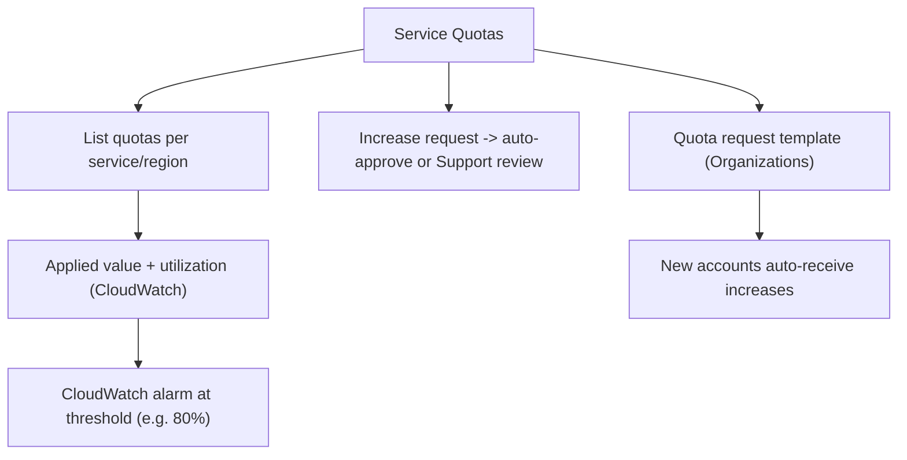

# AWS Service Quotas - Deep Dive

> Architecture, quota request templates, CloudWatch utilization alarms, org integration, API, limits, integrations, comparisons, best practices.

See also: [01 - AWS Service Quotas Intro bits & bytes](01%20-%20AWS%20Service%20Quotas%20Intro%20bits%20%26%20bytes.md) · [03 - AWS Service Quotas Exam Scenarios](03%20-%20AWS%20Service%20Quotas%20Exam%20Scenarios.md) · [04 - AWS Service Quotas SRE Operations](04%20-%20AWS%20Service%20Quotas%20SRE%20Operations.md) · [01 - AWS Trusted Advisor Intro bits & bytes](01%20-%20AWS%20Trusted%20Advisor%20Intro%20bits%20%26%20bytes.md)

---

## Table of Contents

- [1. Architecture](#1-architecture)
- [2. Quota Request Templates](#2-quota-request-templates)
- [3. CloudWatch Utilization Alarms](#3-cloudwatch-utilization-alarms)
- [4. Organizations Integration](#4-organizations-integration)
- [5. API and Automation](#5-api-and-automation)
- [6. Service Limits and Quotas](#6-service-limits-and-quotas)
- [7. Integration Matrix](#7-integration-matrix)
- [8. Comparisons](#8-comparisons)
- [9. Best Practices by Pillar](#9-best-practices-by-pillar)

---

---

## 1. Architecture

Service Quotas is a regional control plane over the limits each AWS service enforces. It exposes **applied quota values**, supports **increase requests** (routed for auto-approval or AWS Support review), and—for many quotas—publishes **utilization metrics to CloudWatch** so you can alarm. Quotas are **per service, per Region, per account**.

[⬆ Back to top](#table-of-contents)

---

## 2. Quota Request Templates

- A **quota request template** defines desired quota increases that are **automatically requested for new accounts** created in your AWS Organization.
- Removes the manual step of raising limits on every freshly-vended account (pairs with **Account Factory**).
- Configured in the management account; applies org-wide.

[⬆ Back to top](#table-of-contents)

---

## 3. CloudWatch Utilization Alarms

- Many quotas emit a **utilization metric** (`AWS/Usage` namespace) — percentage of the applied quota in use.
- Create a **CloudWatch alarm** (e.g. >80%) to be warned **before** you hit the ceiling, then raise the quota proactively.
- This is the programmatic equivalent of Trusted Advisor's near-limit check and works on any support plan.

[⬆ Back to top](#table-of-contents)

---

## 4. Organizations Integration

- View and manage quotas with **delegated administration**; apply templates org-wide.
- Combine with **Control Tower/Account Factory** so new accounts launch with appropriate limits.
- Centralized quota governance avoids per-account scrambling during scaling events.

[⬆ Back to top](#table-of-contents)

---

## 5. API and Automation

- `list-service-quotas`, `get-service-quota`, `request-service-quota-increase`, `list-requested-service-quota-change-history`.
- Automate: detect high utilization (CloudWatch) → auto-submit an increase request via Lambda → notify.
- Track request status programmatically for change management.

[⬆ Back to top](#table-of-contents)

---

## 6. Service Limits and Quotas

| Aspect        | Detail                                     |
| :------------ | :----------------------------------------- |
| Scope         | Per service, per Region, per account       |
| Adjustable    | Soft quotas via request; hard limits fixed |
| Auto-approval | Some quotas; others Support-reviewed       |
| Templates     | Org-wide auto-increase for new accounts    |
| Cost          | Free                                       |

[⬆ Back to top](#table-of-contents)

---

## 7. Integration Matrix

| Service                             | Integration                                                                                    |
| :---------------------------------- | :--------------------------------------------------------------------------------------------- |
| **CloudWatch**                      | Utilization metrics + alarms → [01 - Amazon CloudWatch Intro bits & bytes](01%20-%20Amazon%20CloudWatch%20Intro%20bits%20%26%20bytes.md)                   |
| **Trusted Advisor**                 | Near-limit warnings → [01 - AWS Trusted Advisor Intro bits & bytes](01%20-%20AWS%20Trusted%20Advisor%20Intro%20bits%20%26%20bytes.md)                          |
| **Organizations**                   | Templates + delegated admin → [06 - IAM Identity Center & Organizations](06%20-%20IAM%20Identity%20Center%20%26%20Organizations.md)                     |
| **Control Tower / Account Factory** | New-account quota baselines → [01 - AWS Account Factory and Landing Zone Intro bits & bytes](01%20-%20AWS%20Account%20Factory%20and%20Landing%20Zone%20Intro%20bits%20%26%20bytes.md) |
| **Budgets**                         | Pair higher limits with spend control → [01 - AWS Budgets Fundamentals & Architecture](01%20-%20AWS%20Budgets%20Fundamentals%20%26%20Architecture.md)       |
| **Auto Scaling**                    | vCPU quota is the real scaling ceiling → [01 - AWS Auto Scaling Intro bits & bytes](01%20-%20AWS%20Auto%20Scaling%20Intro%20bits%20%26%20bytes.md)          |
| **Support API**                     | Legacy limit increases / case management                                                       |

[⬆ Back to top](#table-of-contents)

---

## 8. Comparisons

### Service Quotas vs Trusted Advisor vs CloudWatch alarms

|                  | Service Quotas | Trusted Advisor        | CloudWatch alarm   |
| :--------------- | :------------- | :--------------------- | :----------------- |
| View limit/usage | Yes            | Warns near limit       | Utilization metric |
| Raise limit      | **Yes**        | No                     | No                 |
| Availability     | All accounts   | Limits check all plans | All accounts       |

### Soft vs hard limits

|          | Soft                 | Hard                              |
| :------- | :------------------- | :-------------------------------- |
| Raise    | Request              | No                                |
| Strategy | Increase proactively | Architect across accounts/regions |

[⬆ Back to top](#table-of-contents)

---

## 9. Best Practices by Pillar

**Reliability** — alarm on quota utilization (80%); request increases **before** scaling events; for hard limits, design multi-account/region.

**Operational Excellence** — quota request templates for new accounts; automate increase requests; track via API.

**Cost Optimization** — pair higher quotas with **Budgets** so raised limits don't cause runaway spend.

**Security** — least-privilege on who can request increases; audit via CloudTrail.

[⬆ Back to top](#table-of-contents)

---

> Continue to [03 - AWS Service Quotas Exam Scenarios](03%20-%20AWS%20Service%20Quotas%20Exam%20Scenarios.md).
