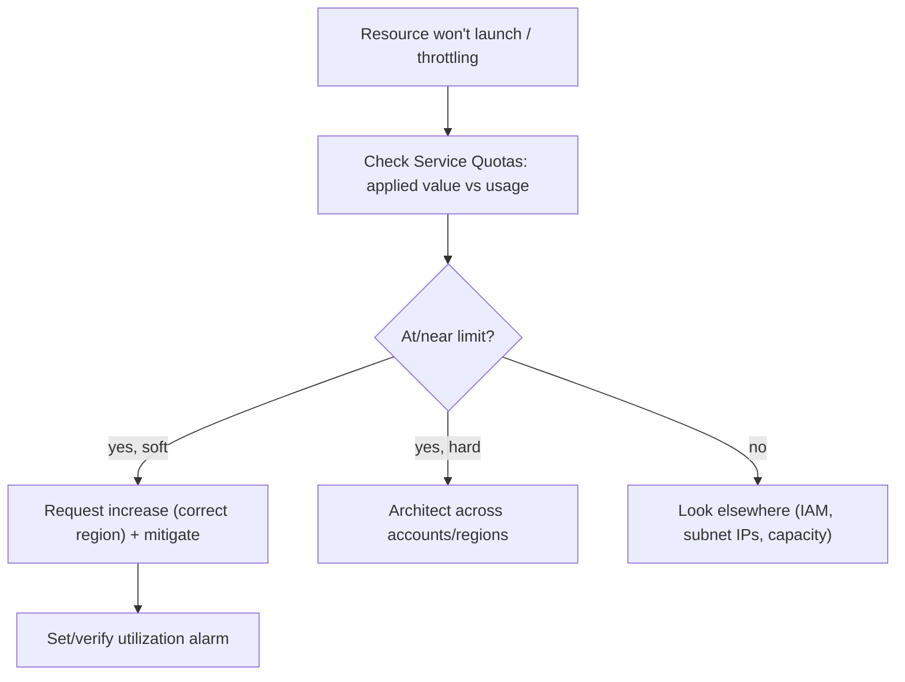

# AWS Service Quotas - SRE Operations

> Operational reality: the limit-induced outages, proactive quota programs, real CLI/alarm examples, and cost-aware patterns.

See also: [01 - AWS Service Quotas Intro bits & bytes](01%20-%20AWS%20Service%20Quotas%20Intro%20bits%20%26%20bytes.md) · [02 - AWS Service Quotas Deep Dive](02%20-%20AWS%20Service%20Quotas%20Deep%20Dive.md) · [03 - AWS Service Quotas Exam Scenarios](03%20-%20AWS%20Service%20Quotas%20Exam%20Scenarios.md) · [01 - Amazon CloudWatch Intro bits & bytes](01%20-%20Amazon%20CloudWatch%20Intro%20bits%20%26%20bytes.md)

---

## Table of Contents

- [1. Common Issues (Symptom → Root Cause → Fix → Prevention)](#1-common-issues-symptom--root-cause--fix--prevention)
- [2. Investigation Workflow](#2-investigation-workflow)
- [3. What to Monitor](#3-what-to-monitor)
- [4. Runbooks](#4-runbooks)
- [5. Real Examples](#5-real-examples)
- [6. Production Patterns by Org Size](#6-production-patterns-by-org-size)
- [7. Cost Operations](#7-cost-operations)

---

## 1. Common Issues (Symptom → Root Cause → Fix → Prevention)

### Launch failures at scale

- **Cause:** Soft quota reached (vCPU, EIP, subnet IPs as a related limit).
- **Fix:** Request increase (right region); release unused resources as a stop-gap.
- **Prevention:** Utilization alarms at 80%; raise ahead of events.

### Lambda/API throttling

- **Cause:** Concurrency or request-rate quota.
- **Fix:** Request increase; add backoff; reserved/provisioned concurrency.
- **Prevention:** Capacity planning + alarms.

### DR region can't absorb failover

- **Cause:** Quotas not raised in the secondary region.
- **Fix:** Raise per-region quotas in DR to match primary.
- **Prevention:** Include DR quotas in DR readiness checks.

### New account immediately limited

- **Cause:** Default low quotas on fresh accounts.
- **Fix:** Apply quota request templates.
- **Prevention:** Bake into landing zone/Account Factory.

### Increase request stuck

- **Cause:** Support-reviewed quota pending.
- **Fix:** Escalate via Support; mitigate (spread regions/types).
- **Prevention:** Request well ahead of need.

[⬆ Back to top](#table-of-contents)

---

## 2. Investigation Workflow



[⬆ Back to top](#table-of-contents)

---

## 3. What to Monitor

| Signal                                     | Why                  |
| :----------------------------------------- | :------------------- |
| `AWS/Usage` utilization per critical quota | Pre-empt limits      |
| Quota request status/history               | Change management    |
| Per-region quota parity (prod vs DR)       | Failover readiness   |
| New-account quota baselines                | Landing-zone hygiene |

[⬆ Back to top](#table-of-contents)

---

## 4. Runbooks

### Runbook: pre-event capacity check

1. List critical quotas (vCPU by family, EIP, NAT, Lambda concurrency) per region.
2. Compare projected peak vs applied value; request increases with buffer.
3. Set utilization alarms; validate with a scale test.

### Runbook: automate increase on high utilization

1. CloudWatch alarm on `AWS/Usage` (e.g. >80%).
2. Alarm → SNS → Lambda → `request-service-quota-increase`.
3. Track via history API; notify owners.

[⬆ Back to top](#table-of-contents)

---

## 5. Real Examples

### View and request increases (CLI)

```bash
# Find the vCPU (Standard family) quota
aws service-quotas list-service-quotas --service-code ec2 \
  --query "Quotas[?contains(QuotaName,'Standard')].{Name:QuotaName,Code:QuotaCode,Value:Value}"

# Request an increase
aws service-quotas request-service-quota-increase \
  --service-code ec2 --quota-code L-1216C47A --desired-value 512

# Check status
aws service-quotas list-requested-service-quota-change-history \
  --service-code ec2 --query "RequestedQuotas[].{Q:QuotaName,Status:Status,Desired:DesiredValue}"
```

### CloudWatch alarm on quota utilization

```bash
aws cloudwatch put-metric-alarm --alarm-name vcpu-80pct \
  --namespace "AWS/Usage" --metric-name ResourceCount \
  --dimensions Name=Service,Value=EC2 Name=Type,Value=Resource Name=Resource,Value=vCPU Name=Class,Value=Standard/OnDemand \
  --statistic Maximum --period 300 --threshold 80 \
  --comparison-operator GreaterThanThreshold --evaluation-periods 1 \
  --alarm-actions arn:aws:sns:ap-south-1:111111111111:capacity-alerts
```

> Pair this with metric math against the applied quota to alarm on **percentage** utilization.

[⬆ Back to top](#table-of-contents)

---

## 6. Production Patterns by Org Size

| Context          | Pattern                                                                                  |
| :--------------- | :--------------------------------------------------------------------------------------- |
| **Startup**      | Manually raise key quotas before growth; watch vCPU/EIP.                                 |
| **SMB**          | Utilization alarms at 80%; request ahead of launches.                                    |
| **Enterprise**   | Quota request templates org-wide; automated increase pipeline; per-region parity checks. |
| **Regulated**    | Least-privilege quota actions; CloudTrail audit; documented capacity reviews.            |
| **Multi-Region** | Maintain DR-region quota parity as part of DR readiness.                                 |

[⬆ Back to top](#table-of-contents)

---

## 7. Cost Operations

- Service Quotas is free; **raising limits enables more spend** — pair with **Budgets** and anomaly detection.
- Release unused **EIPs/volumes/instances** as both a cost and a quota relief measure.
- Avoid the hidden cost of **limit-induced outages** via proactive management.

[⬆ Back to top](#table-of-contents)

---

Related: [01 - AWS Service Quotas Intro bits & bytes](01%20-%20AWS%20Service%20Quotas%20Intro%20bits%20%26%20bytes.md) · [02 - AWS Service Quotas Deep Dive](02%20-%20AWS%20Service%20Quotas%20Deep%20Dive.md) · [03 - AWS Service Quotas Exam Scenarios](03%20-%20AWS%20Service%20Quotas%20Exam%20Scenarios.md) · [01 - AWS Trusted Advisor Intro bits & bytes](01%20-%20AWS%20Trusted%20Advisor%20Intro%20bits%20%26%20bytes.md) · [01 - AWS Auto Scaling Intro bits & bytes](01%20-%20AWS%20Auto%20Scaling%20Intro%20bits%20%26%20bytes.md) · [01 - Amazon CloudWatch Intro bits & bytes](01%20-%20Amazon%20CloudWatch%20Intro%20bits%20%26%20bytes.md)
