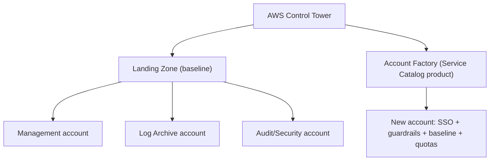

# AWS Account Factory & Landing Zone - Intro bits & bytes

> A **landing zone** is a well-architected, multi-account AWS baseline (security, logging, networking, identity) that new workloads land into. **Account Factory** is the automated **account-vending** mechanism (in Control Tower, implemented via Service Catalog) that provisions new accounts pre-configured to that baseline. Together: "every new account is born compliant."

See also: [02 - AWS Account Factory and Landing Zone Deep Dive](02%20-%20AWS%20Account%20Factory%20and%20Landing%20Zone%20Deep%20Dive.md) · [03 - AWS Account Factory and Landing Zone Exam Scenarios](03%20-%20AWS%20Account%20Factory%20and%20Landing%20Zone%20Exam%20Scenarios.md) · [04 - AWS Account Factory and Landing Zone SRE Operations](04%20-%20AWS%20Account%20Factory%20and%20Landing%20Zone%20SRE%20Operations.md) · [07 - AWS Control Tower](07%20-%20AWS%20Control%20Tower.md) · [01 - AWS Service Catalog Intro bits & bytes](01%20-%20AWS%20Service%20Catalog%20Intro%20bits%20%26%20bytes.md)

---

## Table of Contents

- [1. The Problem It Solves](#1-the-problem-it-solves)
- [2. Landing Zone: The Baseline](#2-landing-zone-the-baseline)
- [3. Account Factory: The Vending Machine](#3-account-factory-the-vending-machine)
- [4. The Standard Multi-Account Structure](#4-the-standard-multi-account-structure)
- [5. When To Use It / When NOT To Use It](#5-when-to-use-it--when-not-to-use-it)
- [6. Cost Considerations](#6-cost-considerations)
- [7. Mini-Quiz](#7-mini-quiz)

---

---

## 1. The Problem It Solves

As organizations grow, they need **many AWS accounts** (per team/env/workload) for isolation, blast-radius control, and billing separation. Doing this by hand is slow and inconsistent — accounts end up with missing guardrails, no central logging, ad-hoc networking, and weak identity. A **landing zone** defines the secure, well-architected baseline once; **Account Factory** vends new accounts that automatically inherit it.

> Mental model: the **landing zone** is the blueprint of a safe neighborhood; **Account Factory** is the builder that constructs each new house to code. AWS **Control Tower** is the most common turnkey way to get both.

[⬆ Back to top](#table-of-contents)

---

## 2. Landing Zone: The Baseline

A landing zone typically establishes:

- **Multi-account structure** via **AWS Organizations** (OUs for security, infrastructure, workloads, sandbox).
- **Centralized logging** (org **CloudTrail** + **Config** to a **Log Archive** account).
- **Security tooling** in an **Audit/Security** account (GuardDuty, Security Hub, cross-account roles).
- **Identity** via **IAM Identity Center** (SSO) for workforce access.
- **Guardrails** (preventive SCPs, detective Config rules, proactive CloudFormation Hooks).
- **Baseline networking** and **quota** defaults.

You can build it yourself (DIY landing zone), use the older **Landing Zone Accelerator (LZA)** solution, or use **AWS Control Tower** (managed/opinionated).

[⬆ Back to top](#table-of-contents)

---

## 3. Account Factory: The Vending Machine

- **Account Factory** (a feature of Control Tower) provisions new accounts that automatically get: enrollment in the org/OU, **guardrails**, **Identity Center** access, centralized logging, and (with **quota request templates**) appropriate limits.
- Under the hood it's a **Service Catalog product** — so account creation is a governed, self-service action. See [01 - AWS Service Catalog Intro bits & bytes](01%20-%20AWS%20Service%20Catalog%20Intro%20bits%20%26%20bytes.md).
- **Account Factory for Terraform (AFT)** offers a GitOps/Terraform-driven vending pipeline for teams that prefer IaC.

[⬆ Back to top](#table-of-contents)

---

## 4. The Standard Multi-Account Structure

| Account / OU                 | Purpose                                               |
| :--------------------------- | :---------------------------------------------------- |
| **Management account**       | Org root, billing, Control Tower; minimal workloads   |
| **Log Archive account**      | Central, immutable CloudTrail + Config logs           |
| **Audit / Security account** | Security tooling, cross-account read, delegated admin |
| **Security OU**              | Accounts for security/shared services                 |
| **Infrastructure OU**        | Networking/shared infrastructure accounts             |
| **Workloads OU**             | Per-app/per-env workload accounts (prod/non-prod)     |
| **Sandbox OU**               | Experimentation with tighter guardrails               |

[⬆ Back to top](#table-of-contents)

---

## 5. When To Use It / When NOT To Use It

**Use it when:** you're going multi-account, need consistent governance/security/logging from day one, want self-service account vending, or are setting up a new AWS footprint at scale.

**Don't reach for it when:**

- You have a **single small account** with no multi-account need (overkill).
- You need a **highly bespoke** structure Control Tower can't express → DIY/LZA (more effort, more control).
- It's about **resource provisioning within** an account → Service Catalog/CloudFormation (Account Factory vends _accounts_, not in-account resources).

[⬆ Back to top](#table-of-contents)

---

## 6. Cost Considerations

- **Control Tower** has no license fee, but the baseline **enables services that cost** (CloudTrail org trail, Config recording — Config can be a notable cost driver at scale), plus the per-account resource usage.
- **Consolidated billing** across the org gives **volume discounts** and shared RIs/Savings Plans.
- Govern cost from the start: **Budgets** per account/OU, **cost allocation tags**, and Config recording scope tuning.

[⬆ Back to top](#table-of-contents)

---

## 7. Mini-Quiz

**Q1:** What vends new pre-configured accounts, and what's it built on?
_A:_ **Account Factory**, implemented as a **Service Catalog** product (in Control Tower).

**Q2:** Which two dedicated accounts does a Control Tower landing zone create besides management?
_A:_ **Log Archive** and **Audit/Security**.

**Q3:** Landing zone vs Account Factory?
_A:_ Landing zone = the **baseline/blueprint**; Account Factory = the **vending** that applies it to new accounts.

**Q4:** Want Terraform-driven account vending?
_A:_ **Account Factory for Terraform (AFT)**.

---

> Continue to [02 - AWS Account Factory and Landing Zone Deep Dive](02%20-%20AWS%20Account%20Factory%20and%20Landing%20Zone%20Deep%20Dive.md).
