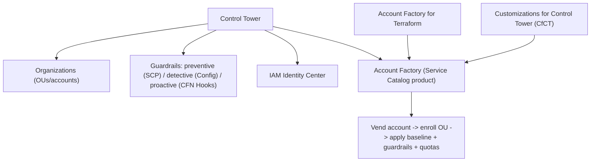

# AWS Account Factory & Landing Zone - Deep Dive

> Control Tower internals, guardrail types, Account Factory provisioning, AFT, customizations (CfCT), Landing Zone Accelerator, drift, limits, integrations, comparisons, best practices.

See also: [01 - AWS Account Factory and Landing Zone Intro bits & bytes](01%20-%20AWS%20Account%20Factory%20and%20Landing%20Zone%20Intro%20bits%20%26%20bytes.md) · [03 - AWS Account Factory and Landing Zone Exam Scenarios](03%20-%20AWS%20Account%20Factory%20and%20Landing%20Zone%20Exam%20Scenarios.md) · [04 - AWS Account Factory and Landing Zone SRE Operations](04%20-%20AWS%20Account%20Factory%20and%20Landing%20Zone%20SRE%20Operations.md) · [07 - AWS Control Tower](07%20-%20AWS%20Control%20Tower.md) · [08 - SCP](08%20-%20SCP.md)

---

## Table of Contents

- [1. Control Tower as the Engine](#1-control-tower-as-the-engine)
- [2. Guardrail Types](#2-guardrail-types)
- [3. Account Factory Provisioning Flow](#3-account-factory-provisioning-flow)
- [4. Account Factory for Terraform (AFT)](#4-account-factory-for-terraform-aft)
- [5. Customizations (CfCT) and Landing Zone Accelerator](#5-customizations-cfct-and-landing-zone-accelerator)
- [6. Drift and Lifecycle](#6-drift-and-lifecycle)
- [7. Service Limits and Quotas](#7-service-limits-and-quotas)
- [8. Integration Matrix](#8-integration-matrix)
- [9. Comparisons](#9-comparisons)
- [10. Best Practices by Pillar](#10-best-practices-by-pillar)

---

---

## 1. Control Tower as the Engine

**AWS Control Tower** orchestrates the landing zone: it sets up **Organizations**, the **Log Archive** and **Audit** accounts, **IAM Identity Center**, baseline **CloudTrail/Config**, and **guardrails**, then provides **Account Factory** for vending. It's the managed/opinionated path; the underlying primitives are Organizations + Config + SCPs + Service Catalog. See [07 - AWS Control Tower](07%20-%20AWS%20Control%20Tower.md).

[⬆ Back to top](#table-of-contents)

---

## 2. Guardrail Types

| Type           | Mechanism                | Behavior                                                                 |
| :------------- | :----------------------- | :----------------------------------------------------------------------- |
| **Preventive** | **SCPs**                 | **Block** disallowed actions (e.g. disable region, deny CloudTrail stop) |
| **Detective**  | **Config rules**         | **Detect/report** non-compliance after the fact                          |
| **Proactive**  | **CloudFormation Hooks** | **Block at deploy** before non-compliant resources are created           |

Guardrails are categorized as **mandatory**, **strongly recommended**, or **elective**, applied at the OU level.

[⬆ Back to top](#table-of-contents)

---

## 3. Account Factory Provisioning Flow

1. Request a new account (console/Service Catalog/AFT) with name, email, OU, SSO access.
2. Control Tower **creates the account**, **enrolls** it in the target OU, applies **guardrails**, configures **Identity Center** access, and wires **central logging**.
3. **Quota request templates** (Service Quotas) can auto-raise limits.
4. **Customizations** (CfCT/AFT) deploy additional baseline resources (network, security tooling) via CloudFormation/StackSets.

[⬆ Back to top](#table-of-contents)

---

## 4. Account Factory for Terraform (AFT)

- A **GitOps pipeline** (Terraform-based) for vending and customizing accounts: account requests live in a repo; a pipeline provisions and applies global/account-specific customizations.
- Suits organizations standardized on **Terraform** who want account vending as code with review/approval.
- Built on Control Tower's Account Factory underneath.

[⬆ Back to top](#table-of-contents)

---

## 5. Customizations (CfCT) and Landing Zone Accelerator

- **Customizations for Control Tower (CfCT)**: deploy your own **CloudFormation/SCPs** automatically to accounts/OUs as part of the vending lifecycle (event-driven).
- **Landing Zone Accelerator (LZA)**: an AWS solution for **highly regulated/complex** baselines (e.g. specific compliance frameworks) beyond Control Tower's opinionated defaults — more flexible, more to operate.
- DIY landing zones use Organizations + StackSets + Config + SCPs directly.

[⬆ Back to top](#table-of-contents)

---

## 6. Drift and Lifecycle

- Control Tower detects **drift** (e.g. someone modifies a managed SCP/OU outside Control Tower) and prompts re-registration/repair.
- **Enroll existing accounts** into the landing zone; **un-enroll**/close as needed.
- Landing zone **version upgrades** roll out new baseline features.

[⬆ Back to top](#table-of-contents)

---

## 7. Service Limits and Quotas

| Aspect      | Detail                                                                    |
| :---------- | :------------------------------------------------------------------------ |
| Accounts    | Bounded by Organizations account quota (raise via Service Quotas/Support) |
| Guardrails  | Mandatory/recommended/elective per OU                                     |
| Config cost | Recording across all accounts can be significant — tune scope             |
| Regions     | Control Tower governs selected regions; deny others via guardrail         |

[⬆ Back to top](#table-of-contents)

---

## 8. Integration Matrix

| Service                      | Integration                                                                         |
| :--------------------------- | :---------------------------------------------------------------------------------- |
| **Organizations**            | Account/OU structure, SCP guardrails → [06 - IAM Identity Center & Organizations](06%20-%20IAM%20Identity%20Center%20%26%20Organizations.md) |
| **Service Catalog**          | Account Factory product → [01 - AWS Service Catalog Intro bits & bytes](01%20-%20AWS%20Service%20Catalog%20Intro%20bits%20%26%20bytes.md)           |
| **Config**                   | Detective guardrails, central recording → [24 - AWS Config & Audit Manager](24%20-%20AWS%20Config%20%26%20Audit%20Manager.md)       |
| **CloudTrail**               | Org trail to Log Archive → [01 - AWS CloudTrail Intro bits & bytes](01%20-%20AWS%20CloudTrail%20Intro%20bits%20%26%20bytes.md)               |
| **IAM Identity Center**      | Workforce access to vended accounts                                                 |
| **Service Quotas**           | Quota templates for new accounts → [01 - AWS Service Quotas Intro bits & bytes](01%20-%20AWS%20Service%20Quotas%20Intro%20bits%20%26%20bytes.md)   |
| **CloudFormation StackSets** | Baseline deployment to accounts → [01 - AWS CloudFormation Intro bits & bytes](01%20-%20AWS%20CloudFormation%20Intro%20bits%20%26%20bytes.md)    |
| **SCPs / Hooks**             | Preventive/proactive guardrails → [08 - SCP](08%20-%20SCP.md)                                      |

[⬆ Back to top](#table-of-contents)

---

## 9. Comparisons

### Control Tower vs DIY vs Landing Zone Accelerator

|             | Control Tower | DIY (Organizations + StackSets) | LZA                      |
| :---------- | :------------ | :------------------------------ | :----------------------- |
| Effort      | Low (managed) | High                            | Medium-High              |
| Flexibility | Opinionated   | Full                            | High (complex/regulated) |
| Best for    | Most orgs     | Bespoke needs                   | Heavy compliance         |

### Account Factory vs AFT

|           | Account Factory         | AFT                       |
| :-------- | :---------------------- | :------------------------ |
| Interface | Console/Service Catalog | Terraform/GitOps pipeline |
| Best for  | Click/self-service      | IaC-driven teams          |

[⬆ Back to top](#table-of-contents)

---

## 10. Best Practices by Pillar

**Security** — central Log Archive + Audit accounts; mandatory preventive guardrails; least-privilege via Identity Center; restrict the management account.

**Operational Excellence** — vend via Account Factory/AFT; customize with CfCT; manage baselines as code; monitor drift.

**Reliability** — multi-account isolation limits blast radius; standardized DR baselines per account.

**Cost Optimization** — consolidated billing + volume discounts; Budgets per account/OU; tune Config recording scope.

**Governance** — guardrails at OU level; enroll all accounts; quota templates; tag policies org-wide.

[⬆ Back to top](#table-of-contents)

---

> Continue to [03 - AWS Account Factory and Landing Zone Exam Scenarios](03%20-%20AWS%20Account%20Factory%20and%20Landing%20Zone%20Exam%20Scenarios.md).
