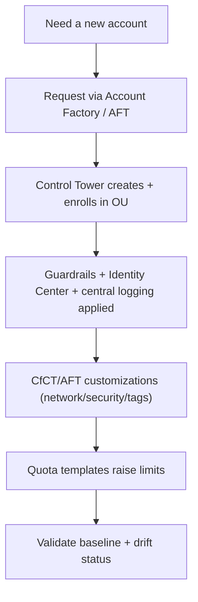

# AWS Account Factory & Landing Zone - SRE Operations

> Operational reality: vending failures, drift, enrollment, real examples, multi-account patterns, and cost/security ops.

See also: [01 - AWS Account Factory and Landing Zone Intro bits & bytes](01%20-%20AWS%20Account%20Factory%20and%20Landing%20Zone%20Intro%20bits%20%26%20bytes.md) · [02 - AWS Account Factory and Landing Zone Deep Dive](02%20-%20AWS%20Account%20Factory%20and%20Landing%20Zone%20Deep%20Dive.md) · [03 - AWS Account Factory and Landing Zone Exam Scenarios](03%20-%20AWS%20Account%20Factory%20and%20Landing%20Zone%20Exam%20Scenarios.md) · [07 - AWS Control Tower](07%20-%20AWS%20Control%20Tower.md)

---

## Table of Contents

- [1. Common Issues (Symptom → Root Cause → Fix → Prevention)](#1-common-issues-symptom--root-cause--fix--prevention)
- [2. Operational Workflow](#2-operational-workflow)
- [3. What to Monitor](#3-what-to-monitor)
- [4. Runbooks](#4-runbooks)
- [5. Real Examples](#5-real-examples)
- [6. Production Patterns by Org Size](#6-production-patterns-by-org-size)
- [7. Cost & Security Operations](#7-cost--security-operations)

---

## 1. Common Issues (Symptom → Root Cause → Fix → Prevention)

### Account vending fails

- **Cause:** Email already used, account quota reached, or a customization (CfCT/StackSet) errored.
- **Fix:** Use a unique root email; raise the Organizations account quota; fix the failing customization stack.
- **Prevention:** Email naming convention; monitor account quota; test customizations.

### Landing zone drift

- **Cause:** Out-of-band edits to managed OUs/SCPs/accounts.
- **Fix:** Re-register/repair via Control Tower.
- **Prevention:** Restrict who can modify managed resources; change via Control Tower/CfCT only.

### New account missing baseline resources

- **Cause:** CfCT/AFT customization not applied or failed.
- **Fix:** Re-run the customization pipeline; check StackSet operation results.
- **Prevention:** Validate customizations in a test OU.

### Guardrail blocks legitimate work

- **Cause:** Mandatory/elective guardrail too strict for a workload.
- **Fix:** Adjust elective guardrails per OU; place the workload in an appropriate OU.
- **Prevention:** Design OU structure to match guardrail needs.

### Config cost spikes

- **Cause:** Recording all resource types in all accounts.
- **Fix:** Tune Config recording scope; aggregate efficiently.
- **Prevention:** Define recording strategy at setup.

[⬆ Back to top](#table-of-contents)

---

## 2. Operational Workflow



[⬆ Back to top](#table-of-contents)

---

## 3. What to Monitor

| Signal                                     | Why                   |
| :----------------------------------------- | :-------------------- |
| Landing zone drift status                  | Governance integrity  |
| Account vending success/failure            | Operational health    |
| Guardrail compliance (Config)              | Policy adherence      |
| Org account quota utilization              | Vending capacity      |
| Customization (StackSet) operation results | Baseline completeness |

[⬆ Back to top](#table-of-contents)

---

## 4. Runbooks

### Runbook: vend a new workload account

1. Submit Account Factory request (name, unique email, target OU, SSO access).
2. Wait for enrollment; verify guardrails + central logging applied.
3. Confirm CfCT/AFT customizations (VPC, security tooling, tags) succeeded.
4. Verify quota template applied; smoke-test access via Identity Center.

### Runbook: repair drift

1. Review Control Tower drift report.
2. Re-register the OU/account or update the landing zone.
3. Identify the out-of-band actor (CloudTrail); restrict permissions.

[⬆ Back to top](#table-of-contents)

---

## 5. Real Examples

### Vend an account via Service Catalog (Account Factory product)

```bash
aws servicecatalog provision-product \
  --product-name "AWS Control Tower Account Factory" \
  --provisioning-artifact-name "AWS Control Tower Account Factory" \
  --provisioned-product-name "team-payments-prod" \
  --provisioning-parameters \
    Key=AccountName,Value=payments-prod \
    Key=AccountEmail,Value=aws+payments-prod@example.com \
    Key=ManagedOrganizationalUnit,Value=Workloads \
    Key=SSOUserEmail,Value=lead@example.com
```

### Region-deny preventive guardrail (SCP excerpt)

```json
{
  "Version": "2012-10-17",
  "Statement": [
    {
      "Effect": "Deny",
      "NotAction": [
        "iam:*",
        "sts:*",
        "organizations:*",
        "cloudfront:*",
        "route53:*",
        "support:*"
      ],
      "Resource": "*",
      "Condition": {
        "StringNotEquals": {
          "aws:RequestedRegion": ["ap-south-1", "us-east-1"]
        }
      }
    }
  ]
}
```

### AFT account request (Terraform, concept)

```hcl
module "payments_prod" {
  source = "./modules/aft-account-request"
  control_tower_parameters = {
    AccountEmail            = "aws+payments-prod@example.com"
    AccountName             = "payments-prod"
    ManagedOrganizationalUnit = "Workloads"
    SSOUserEmail            = "lead@example.com"
    SSOUserFirstName        = "Pay"
    SSOUserLastName         = "Team"
  }
  account_tags = { Environment = "prod", CostCenter = "cc-100" }
}
```

[⬆ Back to top](#table-of-contents)

---

## 6. Production Patterns by Org Size

| Context           | Pattern                                                                                                     |
| :---------------- | :---------------------------------------------------------------------------------------------------------- |
| **Startup**       | Control Tower with default guardrails; few accounts (prod/non-prod/security).                               |
| **SMB**           | Account Factory vending; CfCT for network/security baseline; Budgets per account.                           |
| **Enterprise**    | AFT GitOps vending; rich OU/guardrail design; org-enabled security services; quota templates.               |
| **Regulated**     | LZA or heavily-customized Control Tower; strict preventive guardrails; central audit; documented baselines. |
| **Multi-Account** | Standard OU taxonomy; tag policies + SCPs at OU; central Log Archive/Audit.                                 |

[⬆ Back to top](#table-of-contents)

---

## 7. Cost & Security Operations

- **Security:** central Log Archive (immutable) + Audit account; mandatory preventive guardrails; keep the **management account** minimal with break-glass; least-privilege via Identity Center.
- **Cost:** consolidated billing for volume discounts; **Budgets per account/OU**; **tune Config recording** scope (a key cost driver at scale); cost allocation tags enforced org-wide.
- **Hygiene:** monitor drift; enroll all accounts; review guardrail compliance regularly.

[⬆ Back to top](#table-of-contents)

---

Related: [01 - AWS Account Factory and Landing Zone Intro bits & bytes](01%20-%20AWS%20Account%20Factory%20and%20Landing%20Zone%20Intro%20bits%20%26%20bytes.md) · [02 - AWS Account Factory and Landing Zone Deep Dive](02%20-%20AWS%20Account%20Factory%20and%20Landing%20Zone%20Deep%20Dive.md) · [03 - AWS Account Factory and Landing Zone Exam Scenarios](03%20-%20AWS%20Account%20Factory%20and%20Landing%20Zone%20Exam%20Scenarios.md) · [07 - AWS Control Tower](07%20-%20AWS%20Control%20Tower.md) · [01 - AWS Service Catalog Intro bits & bytes](01%20-%20AWS%20Service%20Catalog%20Intro%20bits%20%26%20bytes.md) · [24 - AWS Config & Audit Manager](24%20-%20AWS%20Config%20%26%20Audit%20Manager.md)
