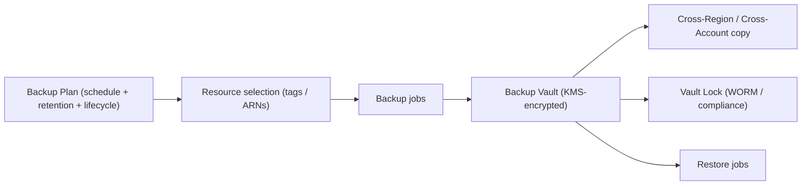

# AWS Backup - Intro bits & bytes

> AWS Backup is a **centralized, policy-driven** backup service that protects many AWS resources (EBS, RDS/Aurora, DynamoDB, EFS, FSx, EC2, S3, Storage Gateway, and more) from one place — with scheduling, retention, **cross-Region/cross-account copy**, and **immutable (vault lock)** compliance. It replaces per-service, hand-rolled backup scripts.

See also: [02 - AWS Backup Deep Dive](02%20-%20AWS%20Backup%20Deep%20Dive.md) · [03 - AWS Backup Exam Scenarios](03%20-%20AWS%20Backup%20Exam%20Scenarios.md) · [04 - AWS Backup SRE Operations](04%20-%20AWS%20Backup%20SRE%20Operations.md) · [01 - AWS Tagging Strategies Intro bits & bytes](01%20-%20AWS%20Tagging%20Strategies%20Intro%20bits%20%26%20bytes.md) · [06 - IAM Identity Center & Organizations](06%20-%20IAM%20Identity%20Center%20%26%20Organizations.md)

---

## Table of Contents

- [1. The Problem It Solves](#1-the-problem-it-solves)
- [2. Core Concepts](#2-core-concepts)
- [3. Backup Plans and Selection](#3-backup-plans-and-selection)
- [4. Cross-Region, Cross-Account, and Vault Lock](#4-cross-region-cross-account-and-vault-lock)
- [5. When To Use It / When NOT To Use It](#5-when-to-use-it--when-not-to-use-it)
- [6. Cost Considerations](#6-cost-considerations)
- [7. Mini-Quiz](#7-mini-quiz)

---

---

## 1. The Problem It Solves

Each AWS data service has its own snapshot/backup mechanism (EBS snapshots, RDS automated backups, DynamoDB PITR…), leading to **inconsistent policies**, **no central view**, and **gaps** (someone forgets to back up a resource). AWS Backup centralizes this into **backup plans** applied across services and accounts, with **consistent retention, encryption, monitoring, and compliance** — and tag-based selection so new resources are protected automatically.

> Mental model: AWS Backup is the **org-wide backup policy engine**. Define "back up everything tagged `Backup=daily`, keep 35 days, copy to a second Region, lock for compliance" once — it applies everywhere.

[⬆ Back to top](#table-of-contents)

---

## 2. Core Concepts

| Concept                             | Meaning                                                |
| :---------------------------------- | :----------------------------------------------------- |
| **Backup plan**                     | Schedule(s) + retention/lifecycle + copy actions       |
| **Resource selection**              | Which resources a plan covers (by **tag** or ARN)      |
| **Backup vault**                    | Encrypted (KMS) container for recovery points          |
| **Recovery point**                  | A single backup (snapshot/point-in-time)               |
| **Vault Lock**                      | WORM/immutability + retention enforcement (compliance) |
| **Backup policies (Organizations)** | Centrally apply plans across accounts                  |
| **Restore**                         | Recreate a resource from a recovery point              |

[⬆ Back to top](#table-of-contents)

---

## 3. Backup Plans and Selection

- A **plan** defines one or more **rules**: frequency (e.g. daily/weekly), **backup window**, **lifecycle** (transition to cold storage, expire after N days), and optional **copy** to another vault/Region/account.
- **Selection by tag** is the powerful pattern: resources tagged (e.g. `BackupPolicy=daily`) are **dynamically** included — new resources with the tag are protected automatically. (Ties to [01 - AWS Tagging Strategies Intro bits & bytes](01%20-%20AWS%20Tagging%20Strategies%20Intro%20bits%20%26%20bytes.md).)
- Continuous backup / **point-in-time restore (PITR)** is supported for some services (e.g. RDS, S3).

[⬆ Back to top](#table-of-contents)

---

## 4. Cross-Region, Cross-Account, and Vault Lock

- **Cross-Region copy**: replicate recovery points to another Region for DR.
- **Cross-account copy**: copy to a separate **backup account** (isolation from a compromised production account) — a key ransomware/insider defense.
- **Vault Lock (Compliance mode)**: makes recovery points **immutable** and enforces minimum retention — even root/admins can't delete them before expiry. Essential for regulatory WORM requirements.
- **KMS encryption** on vaults; backups encrypted at rest.

[⬆ Back to top](#table-of-contents)

---

## 5. When To Use It / When NOT To Use It

**Use it when:** you need **centralized, consistent, auditable** backups across services/accounts, compliance-grade **immutability**, **cross-Region/account** DR copies, or tag-driven automatic protection.

**Don't (only) rely on it when:**

- You need **sub-second RPO / continuous replication** for HA → use service-native replication (RDS Multi-AZ/read replicas, DynamoDB global tables, S3 replication) — backup is for **recovery points**, not real-time HA.
- The data isn't a **supported resource** type → handle separately.
- You need **application-consistent** multi-tier orchestration beyond what plans express → add custom automation.

[⬆ Back to top](#table-of-contents)

---

## 6. Cost Considerations

- You pay for **backup storage** (warm + cold tiers), **restore**, and **cross-Region/account data transfer** for copies.
- Levers: **lifecycle to cold storage**, sensible **retention**, dedup where applicable, and **don't over-copy** (cross-Region copies cost storage + transfer).
- Vault Lock retention means you **can't delete early** to save cost — size retention deliberately.
- Centralization often **reduces** cost vs scattered, over-retained manual snapshots.

[⬆ Back to top](#table-of-contents)

---

## 7. Mini-Quiz

**Q1:** Protect all resources tagged `Backup=daily` automatically, including future ones.
_A:_ A **backup plan** with **tag-based resource selection**.

**Q2:** Make backups immutable so even admins can't delete them before retention ends.
_A:_ **Vault Lock (Compliance mode)**.

**Q3:** Defend backups against a compromised prod account.
_A:_ **Cross-account copy** to an isolated backup account.

**Q4:** Apply backup policies across all org accounts centrally.
_A:_ **AWS Backup policies via Organizations**.

---

> Continue to [02 - AWS Backup Deep Dive](02%20-%20AWS%20Backup%20Deep%20Dive.md).
