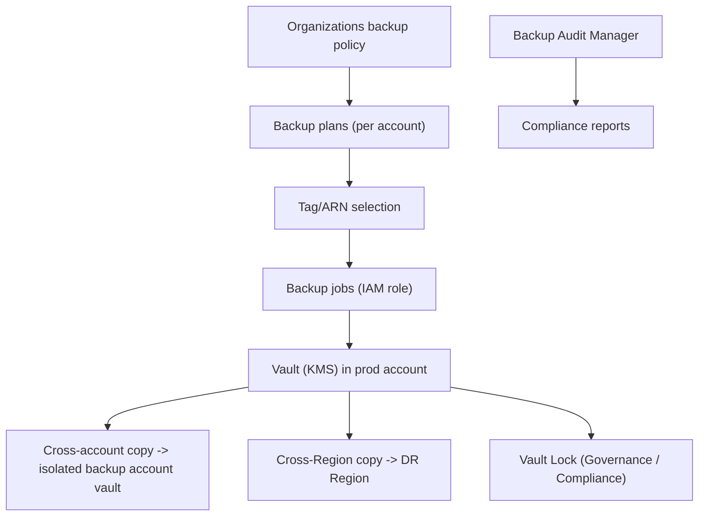

# AWS Backup - Deep Dive

> Architecture, supported resources, vaults & vault lock modes, cross-account/region, Organizations backup policies, Backup Audit Manager, restore testing, limits, integrations, comparisons, best practices.

See also: [01 - AWS Backup Intro bits & bytes](01%20-%20AWS%20Backup%20Intro%20bits%20%26%20bytes.md) · [03 - AWS Backup Exam Scenarios](03%20-%20AWS%20Backup%20Exam%20Scenarios.md) · [04 - AWS Backup SRE Operations](04%20-%20AWS%20Backup%20SRE%20Operations.md) · [24 - AWS Config & Audit Manager](24%20-%20AWS%20Config%20%26%20Audit%20Manager.md)

---

## Table of Contents

- [1. Architecture](#1-architecture)
- [2. Supported Resources](#2-supported-resources)
- [3. Vaults and Vault Lock Modes](#3-vaults-and-vault-lock-modes)
- [4. Cross-Account and Cross-Region](#4-cross-account-and-cross-region)
- [5. Organizations Backup Policies](#5-organizations-backup-policies)
- [6. Backup Audit Manager and Restore Testing](#6-backup-audit-manager-and-restore-testing)
- [7. Service Limits and Quotas](#7-service-limits-and-quotas)
- [8. Integration Matrix](#8-integration-matrix)
- [9. Comparisons](#9-comparisons)
- [10. Best Practices by Pillar](#10-best-practices-by-pillar)

---

---

## 1. Architecture

AWS Backup uses an **IAM service role** to call each resource's snapshot/backup API on a schedule defined by a **plan**, stores recovery points in **vaults** (KMS-encrypted), and can **copy** them across Regions/accounts. **Backup Audit Manager** reports on policy compliance. The whole thing is centrally governable via **Organizations backup policies**.

[⬆ Back to top](#table-of-contents)

---

## 2. Supported Resources

EBS, EC2 (instances/AMIs), RDS, Aurora, DynamoDB, EFS, FSx, Storage Gateway volumes, S3, DocumentDB, Neptune, Redshift, VMware (via Storage Gateway/hybrid), and more (the list grows). Some support **continuous backup / PITR** (e.g. RDS, S3). Always verify a given resource type is supported for your use.

[⬆ Back to top](#table-of-contents)

---

## 3. Vaults and Vault Lock Modes

|                       | **Governance mode**                            | **Compliance mode**                              |
| :-------------------- | :--------------------------------------------- | :----------------------------------------------- |
| Who can change/delete | Privileged users (with permissions) can manage | **No one** (not even root) before retention ends |
| Reversible            | Yes                                            | **No** (immutable once locked in)                |
| Use                   | Guardrail against accidental deletion          | Regulatory WORM, ransomware defense              |

- Vaults are **KMS-encrypted**; access controlled by **vault access policies** + IAM.
- **Vault Lock** adds immutability + min/max retention enforcement.

[⬆ Back to top](#table-of-contents)

---

## 4. Cross-Account and Cross-Region

- **Cross-Region copy**: DR resilience to a Region failure; copy recovery points to a DR Region vault.
- **Cross-account copy**: copy to a **dedicated, isolated backup account** so backups survive compromise/deletion in production (defense-in-depth, ransomware).
- Copies can themselves have lifecycle/retention; the destination vault can be **vault-locked**.
- Cross-account requires the destination vault's access policy to allow the source.

[⬆ Back to top](#table-of-contents)

---

## 5. Organizations Backup Policies

- **Backup policies** (a type of Organizations policy) let the management/delegated-admin account **centrally define and enforce** backup plans across member accounts/OUs.
- New accounts inherit the org backup policy — consistent protection org-wide.
- Combine with **SCPs** to prevent disabling/deleting backups, and **tag policies** so the `BackupPolicy` tag is standardized.

[⬆ Back to top](#table-of-contents)

---

## 6. Backup Audit Manager and Restore Testing

- **Backup Audit Manager**: frameworks/controls that **audit** whether resources are backed up per policy (frequency, retention, encryption, cross-Region) and produce **compliance reports**.
- **Restore testing**: automated, scheduled **test restores** to validate that recovery points are actually restorable and to measure restore time — closing the "we have backups but never tested restore" gap.

[⬆ Back to top](#table-of-contents)

---

## 7. Service Limits and Quotas

| Aspect                 | Detail                                                    |
| :--------------------- | :-------------------------------------------------------- |
| Backup plans / vaults  | Soft limits                                               |
| Concurrent backup jobs | Soft limit (Service Quotas)                               |
| Retention              | Warm + cold tiers; lifecycle transitions                  |
| Vault Lock             | Cooling-off period before Compliance mode is irreversible |
| Cross-account          | Requires Organizations + vault policies                   |

[⬆ Back to top](#table-of-contents)

---

## 8. Integration Matrix

| Service                      | Integration                                                                           |
| :--------------------------- | :------------------------------------------------------------------------------------ |
| **Organizations**            | Central backup policies → [06 - IAM Identity Center & Organizations](06%20-%20IAM%20Identity%20Center%20%26%20Organizations.md)                |
| **KMS**                      | Vault encryption                                                                      |
| **Tagging**                  | Tag-based resource selection → [01 - AWS Tagging Strategies Intro bits & bytes](01%20-%20AWS%20Tagging%20Strategies%20Intro%20bits%20%26%20bytes.md)     |
| **Config**                   | Detect resources missing backup / non-compliant → [24 - AWS Config & Audit Manager](24%20-%20AWS%20Config%20%26%20Audit%20Manager.md) |
| **CloudWatch / EventBridge** | Job state events, alarms, automation → [01 - Amazon CloudWatch Intro bits & bytes](01%20-%20Amazon%20CloudWatch%20Intro%20bits%20%26%20bytes.md)  |
| **CloudTrail**               | Audit backup/restore API → [01 - AWS CloudTrail Intro bits & bytes](01%20-%20AWS%20CloudTrail%20Intro%20bits%20%26%20bytes.md)                 |
| **SNS**                      | Backup job notifications                                                              |
| **Service-native**           | RDS/DynamoDB/EFS/EBS snapshot APIs under the hood                                     |

[⬆ Back to top](#table-of-contents)

---

## 9. Comparisons

### AWS Backup vs service-native snapshots vs replication

|              | AWS Backup                         | Native snapshots           | Replication (Multi-AZ/global/S3 CRR)       |
| :----------- | :--------------------------------- | :------------------------- | :----------------------------------------- |
| Scope        | Centralized, multi-service/account | Per service, manual policy | Real-time copies                           |
| Purpose      | Recovery points + compliance       | Point backups              | **HA/low-RPO**, not point-in-time recovery |
| Immutability | Vault Lock                         | Limited                    | n/a                                        |

### Governance vs Compliance vault lock

|          | Governance       | Compliance      |
| :------- | :--------------- | :-------------- |
| Override | Privileged users | None            |
| Use      | Anti-accident    | Regulatory WORM |

[⬆ Back to top](#table-of-contents)

---

## 10. Best Practices by Pillar

**Reliability** — central plans with tested **restores**; cross-Region copies for DR; sensible RPO/RTO per tier.

**Security** — **cross-account** copies to an isolated backup account; **Vault Lock (Compliance)** for immutability; KMS + vault policies; SCPs to prevent backup deletion.

**Operational Excellence** — tag-based selection; Organizations backup policies; Backup Audit Manager reporting; EventBridge alerts on failed jobs.

**Cost Optimization** — lifecycle to cold storage; right-size retention; avoid unnecessary cross-Region copies.

**Governance** — Config detects unprotected resources; standardized `BackupPolicy` tag.

[⬆ Back to top](#table-of-contents)

---

> Continue to [03 - AWS Backup Exam Scenarios](03%20-%20AWS%20Backup%20Exam%20Scenarios.md).
