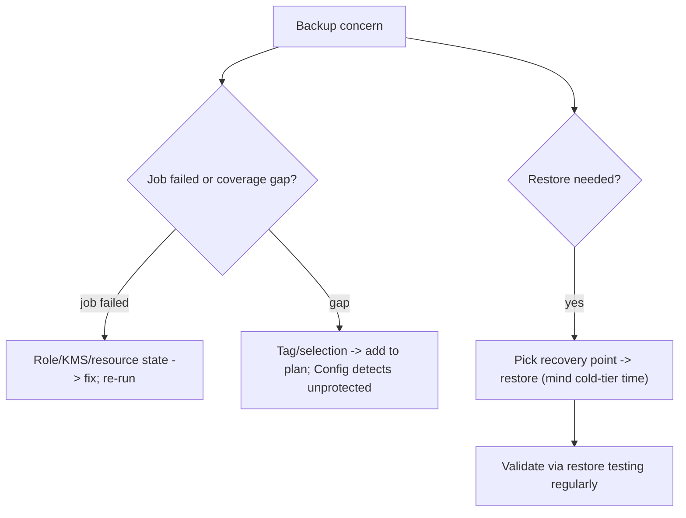

# AWS Backup - SRE Operations

> Operational reality: failed jobs, restore validation, cross-account copy errors, real examples, DR patterns, and cost ops.

See also: [01 - AWS Backup Intro bits & bytes](01%20-%20AWS%20Backup%20Intro%20bits%20%26%20bytes.md) · [02 - AWS Backup Deep Dive](02%20-%20AWS%20Backup%20Deep%20Dive.md) · [03 - AWS Backup Exam Scenarios](03%20-%20AWS%20Backup%20Exam%20Scenarios.md) · [24 - AWS Config & Audit Manager](24%20-%20AWS%20Config%20%26%20Audit%20Manager.md)

---

## Table of Contents

- [1. Common Errors (Symptom → Root Cause → Fix → Prevention)](#1-common-errors-symptom--root-cause--fix--prevention)
- [2. Operational Workflow](#2-operational-workflow)
- [3. What to Monitor](#3-what-to-monitor)
- [4. Runbooks](#4-runbooks)
- [5. Real Examples](#5-real-examples)
- [6. Production Patterns by Org Size](#6-production-patterns-by-org-size)
- [7. DR & Cost Operations](#7-dr--cost-operations)

---

## 1. Common Errors (Symptom → Root Cause → Fix → Prevention)

### Backup job fails

- **Cause:** Service role lacks permissions; resource unsupported/in a bad state; KMS key access denied.
- **Fix:** Repair the AWS Backup service role; verify resource type; grant KMS usage.
- **Prevention:** Use the managed backup role; test plans; alarm on failures.

### Resource not being backed up

- **Cause:** Missing/incorrect selection tag, or not covered by any plan.
- **Fix:** Apply the selection tag; add to a plan.
- **Prevention:** Tag-on-create + Config detection of unprotected resources.

### Cross-account copy denied

- **Cause:** Destination vault access policy / KMS grant missing for the source.
- **Fix:** Update destination vault policy + KMS key policy to allow the source account/role.
- **Prevention:** Provision destination policies via IaC.

### Can't delete a recovery point

- **Cause:** **Vault Lock Compliance** retention not elapsed (by design).
- **Fix:** Wait until retention expires (immutable); plan retention deliberately.
- **Prevention:** Size Compliance retention carefully before locking.

### Restore is slow / fails

- **Cause:** Cold-storage retrieval latency; wrong target config.
- **Fix:** Account for cold-tier restore time; validate restore parameters.
- **Prevention:** **Restore testing**; document RTO per tier.

[⬆ Back to top](#table-of-contents)

---

## 2. Operational Workflow



[⬆ Back to top](#table-of-contents)

---

## 3. What to Monitor

| Signal                                       | Why                    |
| :------------------------------------------- | :--------------------- |
| Failed/expired backup jobs                   | Coverage reliability   |
| Unprotected resources (Config/Audit Manager) | Gaps                   |
| Restore test results + RTO                   | Recoverability         |
| Cross-Region/account copy success            | DR/isolation integrity |
| Storage growth (warm/cold)                   | Cost                   |

[⬆ Back to top](#table-of-contents)

---

## 4. Runbooks

### Runbook: set up org-wide protected backups

1. Define backup plans (schedule/retention/lifecycle/copy) and tag-based selection.
2. Apply via **Organizations backup policies**; standardize the tag (tag policy).
3. Create an **isolated backup account** vault; enable **cross-account** + **cross-Region** copy.
4. **Vault Lock (Compliance)** where regulation requires.
5. Enable **Backup Audit Manager** + **restore testing**; alarm on job failures.

### Runbook: perform and validate a restore

1. Identify the recovery point (Region/account, time).
2. Restore to a test target; verify data integrity and app boot.
3. Record RTO; update DR runbook.

[⬆ Back to top](#table-of-contents)

---

## 5. Real Examples

### Create a backup plan with cross-Region copy (CLI, concept)

```bash
aws backup create-backup-plan --backup-plan '{
  "BackupPlanName": "daily-35d",
  "Rules": [{
    "RuleName": "daily",
    "TargetBackupVaultName": "prod-vault",
    "ScheduleExpression": "cron(0 5 * * ? *)",
    "Lifecycle": {"MoveToColdStorageAfterDays": 30, "DeleteAfterDays": 365},
    "CopyActions": [{
      "DestinationBackupVaultArn": "arn:aws:backup:us-east-1:111111111111:backup-vault:dr-vault",
      "Lifecycle": {"DeleteAfterDays": 365}
    }]
  }]
}'
```

### Tag-based resource selection

```bash
aws backup create-backup-selection --backup-plan-id <id> --backup-selection '{
  "SelectionName": "tagged-daily",
  "IamRoleArn": "arn:aws:iam::111111111111:role/AWSBackupDefaultServiceRole",
  "ListOfTags": [{"ConditionType":"STRINGEQUALS","ConditionKey":"BackupPolicy","ConditionValue":"daily"}]
}'
```

### Apply Vault Lock (Compliance)

```bash
aws backup put-backup-vault-lock-configuration --backup-vault-name prod-vault \
  --min-retention-days 35 --max-retention-days 2555 --changeable-for-days 3
```

> `changeable-for-days` is the cooling-off window before Compliance lock becomes irreversible.

[⬆ Back to top](#table-of-contents)

---

## 6. Production Patterns by Org Size

| Context           | Pattern                                                                       |
| :---------------- | :---------------------------------------------------------------------------- |
| **Startup**       | One plan, tag-based selection, daily + retention; same-account vault.         |
| **SMB**           | Cross-Region copy for DR; lifecycle to cold; failure alarms.                  |
| **Enterprise**    | Org backup policies; isolated backup account; Audit Manager; restore testing. |
| **Regulated**     | Vault Lock Compliance; SCPs preventing deletion; documented RTO/RPO; audits.  |
| **Multi-Account** | Delegated admin; central monitoring; standardized tags org-wide.              |

[⬆ Back to top](#table-of-contents)

---

## 7. DR & Cost Operations

- **DR:** cross-Region copies + tested restores define real RTO/RPO; isolated backup account defends against compromise. Backups complement (don't replace) **replication** for HA.
- **Cost:** lifecycle to **cold storage**, right-size **retention**, copy cross-Region only what DR needs; remember **Vault Lock** retention can't be shortened.
- **Governance:** Config + Audit Manager prove coverage; SCPs prevent deletion; standardized `BackupPolicy` tag drives selection.

[⬆ Back to top](#table-of-contents)

---

Related: [01 - AWS Backup Intro bits & bytes](01%20-%20AWS%20Backup%20Intro%20bits%20%26%20bytes.md) · [02 - AWS Backup Deep Dive](02%20-%20AWS%20Backup%20Deep%20Dive.md) · [03 - AWS Backup Exam Scenarios](03%20-%20AWS%20Backup%20Exam%20Scenarios.md) · [24 - AWS Config & Audit Manager](24%20-%20AWS%20Config%20%26%20Audit%20Manager.md) · [01 - AWS Tagging Strategies Intro bits & bytes](01%20-%20AWS%20Tagging%20Strategies%20Intro%20bits%20%26%20bytes.md) · [06 - IAM Identity Center & Organizations](06%20-%20IAM%20Identity%20Center%20%26%20Organizations.md)
