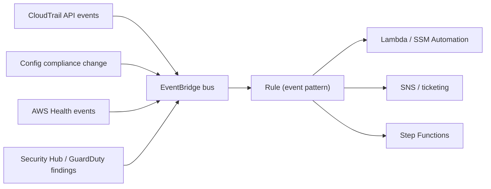

# EventBridge Governance Integrations - Intro bits & bytes

> EventBridge is AWS's serverless **event bus**. In a _governance_ context it's the **automation glue**: it reacts in near-real-time to security/config/operational events (from CloudTrail, Config, Health, Security Hub, GuardDuty) and triggers remediation, notification, or workflow — turning detection into action.

See also: [02 - EventBridge Governance Integrations Deep Dive](02%20-%20EventBridge%20Governance%20Integrations%20Deep%20Dive.md) · [03 - EventBridge Governance Integrations Exam Scenarios](03%20-%20EventBridge%20Governance%20Integrations%20Exam%20Scenarios.md) · [04 - EventBridge Governance Integrations SRE Operations](04%20-%20EventBridge%20Governance%20Integrations%20SRE%20Operations.md) · [01 - EventBridge Fundamentals & Deep Dive](01%20-%20EventBridge%20Fundamentals%20%26%20Deep%20Dive.md) · [01 - AWS CloudTrail Intro bits & bytes](01%20-%20AWS%20CloudTrail%20Intro%20bits%20%26%20bytes.md)

---

## Table of Contents

- [1. The Problem It Solves (in Governance)](#1-the-problem-it-solves-in-governance)
- [2. Core Concepts](#2-core-concepts)
- [3. Governance Event Sources](#3-governance-event-sources)
- [4. Common Governance Patterns](#4-common-governance-patterns)
- [5. When To Use It / When NOT To Use It](#5-when-to-use-it--when-not-to-use-it)
- [6. Cost Considerations](#6-cost-considerations)
- [7. Mini-Quiz](#7-mini-quiz)

---

---

## 1. The Problem It Solves (in Governance)

Detection without action is just noise. Governance services _detect_ things — a public S3 bucket created (CloudTrail), a resource gone non-compliant (Config), an instance scheduled for retirement (Health), a threat (GuardDuty). **EventBridge** is how you **react automatically and immediately**: match the event, route it to a target, and remediate/notify/escalate. It's the nervous system connecting "something happened" to "do something about it."

> Mental model: governance services are the **sensors**; EventBridge is the **reflex arc** that routes a signal to an **actuator** (Lambda, SSM Automation, SNS, Step Functions). This is the basis of **auto-remediation** and **event-driven governance**.

[⬆ Back to top](#table-of-contents)

---

## 2. Core Concepts

| Concept                            | Meaning                                                               |
| :--------------------------------- | :-------------------------------------------------------------------- |
| **Event bus**                      | Receives events (default bus, custom bus, partner bus)                |
| **Rule**                           | Matches events via an **event pattern** (or schedule)                 |
| **Target**                         | Where matched events go (Lambda, SSM, SNS, SQS, Step Functions, etc.) |
| **Event pattern**                  | JSON filter on event fields (source, detail-type, detail)             |
| **Scheduler / scheduled rules**    | Cron/rate triggers (EventBridge Scheduler)                            |
| **Organization/cross-account bus** | Route events org-wide to a central account                            |
| **Input transformer**              | Reshape the event before sending to a target                          |

[⬆ Back to top](#table-of-contents)

---

## 3. Governance Event Sources

| Source                           | Example governance event                                                      |
| :------------------------------- | :---------------------------------------------------------------------------- |
| **CloudTrail** (via EventBridge) | `PutBucketPolicy`, `AuthorizeSecurityGroupIngress`, `StopLogging`, root login |
| **AWS Config**                   | Compliance state change (resource became NON_COMPLIANT)                       |
| **AWS Health**                   | Scheduled change / issue / EC2 retirement                                     |
| **Security Hub**                 | Aggregated finding (Sev: High)                                                |
| **GuardDuty**                    | Threat finding                                                                |
| **AWS Backup**                   | Backup job failed                                                             |
| **Service events**               | ASG lifecycle, ECS task state, etc.                                           |

[⬆ Back to top](#table-of-contents)

---

## 4. Common Governance Patterns

- **Auto-remediation**: public S3 created → rule → Lambda/SSM Automation reverts it.
- **Real-time alerting**: `StopLogging`/root login → rule → SNS → on-call.
- **Compliance response**: Config NON_COMPLIANT → SSM Automation remediation.
- **Operational response**: Health retirement → SSM Automation replaces the instance.
- **Org-wide centralization**: member-account events → central security bus → unified handling.
- **Scheduled governance**: nightly rule → Lambda to stop dev resources / run drift detection.

[⬆ Back to top](#table-of-contents)

---

## 5. When To Use It / When NOT To Use It

**Use it when:** you need **event-driven** reaction to governance/security/ops events, auto-remediation, real-time alerting, fan-out to multiple handlers, or org-wide event centralization.

**Don't reach for it when:**

- You need a **metric threshold** reaction → that's a **CloudWatch alarm** (EventBridge reacts to _events_, not metric breaches).
- You need **ordered, high-throughput streaming** of records → Kinesis.
- The reaction is purely **synchronous request/response** → direct API/SDK.
- Continuous **compliance evaluation** itself → that's **Config** (EventBridge just routes the result).

[⬆ Back to top](#table-of-contents)

---

## 6. Cost Considerations

- EventBridge is priced **per event** for custom/cross-account/partner events; **AWS service events on the default bus are generally free** to match.
- The cost of **targets** (Lambda invocations, SSM Automation, Step Functions) applies.
- Cheap relative to the value of **automated remediation** (faster MTTR, fewer manual hours, reduced exposure window).
- Watch high-volume custom event publishing and overly broad rules triggering expensive targets.

[⬆ Back to top](#table-of-contents)

---

## 7. Mini-Quiz

**Q1:** Public S3 bucket is created; auto-revert it within seconds. Which service routes the trigger?
_A:_ **EventBridge** rule on the CloudTrail event → Lambda/SSM remediation (or Config auto-remediation).

**Q2:** EventBridge vs CloudWatch alarm?
_A:_ EventBridge reacts to **events**; CloudWatch **alarms** react to **metric thresholds**.

**Q3:** Centralize all accounts' security events for unified handling.
_A:_ Route member-account events to a **central account's event bus** (org/cross-account).

**Q4:** Run a governance task nightly.
_A:_ **EventBridge scheduled rule** (cron/rate).

---

> Continue to [02 - EventBridge Governance Integrations Deep Dive](02%20-%20EventBridge%20Governance%20Integrations%20Deep%20Dive.md).
