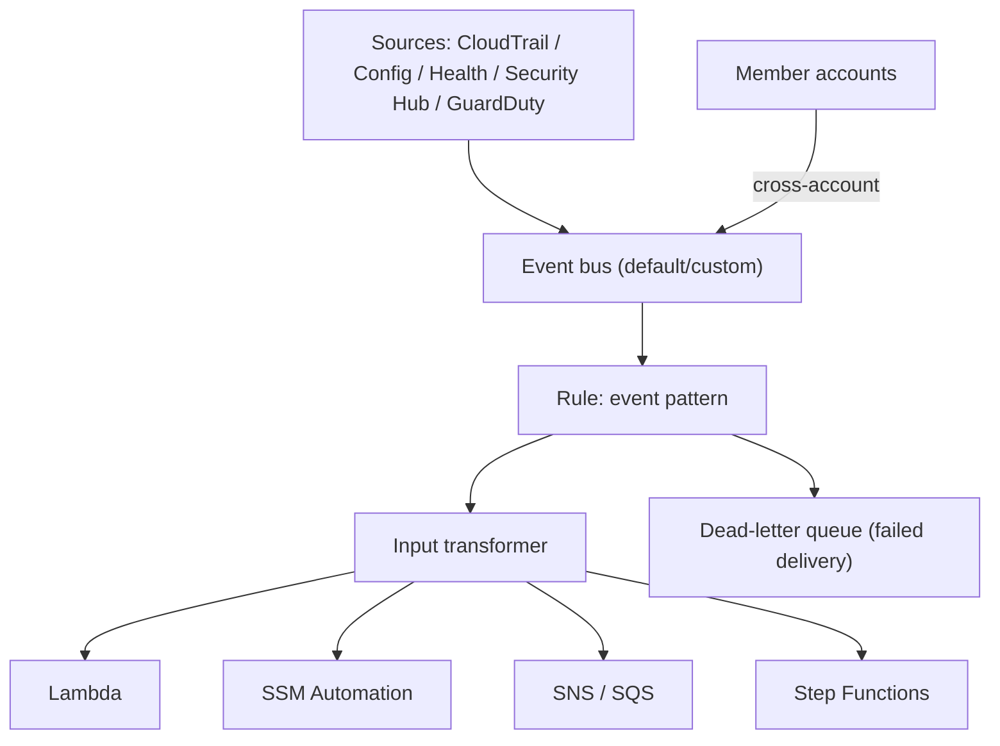

# EventBridge Governance Integrations - Deep Dive

> Architecture, event patterns, targets, cross-account/org buses, Scheduler, Pipes, remediation wiring, reliability (DLQ/retry), limits, integrations, comparisons, best practices — through a governance lens.

See also: [01 - EventBridge Governance Integrations Intro bits & bytes](01%20-%20EventBridge%20Governance%20Integrations%20Intro%20bits%20%26%20bytes.md) · [03 - EventBridge Governance Integrations Exam Scenarios](03%20-%20EventBridge%20Governance%20Integrations%20Exam%20Scenarios.md) · [04 - EventBridge Governance Integrations SRE Operations](04%20-%20EventBridge%20Governance%20Integrations%20SRE%20Operations.md) · [01 - EventBridge Fundamentals & Deep Dive](01%20-%20EventBridge%20Fundamentals%20%26%20Deep%20Dive.md) · [01 - AWS Systems Manager Intro bits & bytes](01%20-%20AWS%20Systems%20Manager%20Intro%20bits%20%26%20bytes.md)

---

## Table of Contents

- [1. Architecture](#1-architecture)
- [2. Event Patterns](#2-event-patterns)
- [3. Targets and Remediation Wiring](#3-targets-and-remediation-wiring)
- [4. Cross-Account and Organization Buses](#4-cross-account-and-organization-buses)
- [5. EventBridge Scheduler and Pipes](#5-eventbridge-scheduler-and-pipes)
- [6. Reliability: Retries, DLQ, Archive/Replay](#6-reliability-retries-dlq-archivereplay)
- [7. Service Limits and Quotas](#7-service-limits-and-quotas)
- [8. Integration Matrix](#8-integration-matrix)
- [9. Comparisons](#9-comparisons)
- [10. Best Practices by Pillar](#10-best-practices-by-pillar)

---

---

## 1. Architecture

EventBridge receives events onto a **bus**, evaluates **rules** (event-pattern matches), optionally reshapes with an **input transformer**, and delivers to **targets** with retries and an optional **DLQ**. AWS services emit events to the **default bus**; you can create **custom buses** (e.g. a central security bus) and route **cross-account/organization**. It's regional; for multi-Region you replicate rules or forward events.

[⬆ Back to top](#table-of-contents)

---

## 2. Event Patterns

- JSON filters on fields like `source` (e.g. `aws.config`), `detail-type`, and nested `detail`.
- Governance examples:
  - CloudTrail: `{"source":["aws.s3"],"detail-type":["AWS API Call via CloudTrail"],"detail":{"eventName":["PutBucketPolicy","PutBucketAcl"]}}`
  - Config: `{"source":["aws.config"],"detail-type":["Config Rules Compliance Change"],"detail":{"newEvaluationResult":{"complianceType":["NON_COMPLIANT"]}}}`
  - Health: `{"source":["aws.health"],"detail":{"eventTypeCategory":["scheduledChange"]}}`
- Content filtering supports prefixes, anything-but, numeric ranges, exists — precise targeting reduces noise/cost.

[⬆ Back to top](#table-of-contents)

---

## 3. Targets and Remediation Wiring

| Target                | Governance use                                                        |
| :-------------------- | :-------------------------------------------------------------------- |
| **Lambda**            | Custom remediation/notification logic                                 |
| **SSM Automation**    | Run a remediation runbook (close SG, revert bucket, replace instance) |
| **SNS**               | Notify on-call / fan-out / ticketing                                  |
| **SQS**               | Buffer for downstream processing                                      |
| **Step Functions**    | Multi-step approval/remediation workflow                              |
| **Another event bus** | Cross-account centralization                                          |

Targets assume an **IAM role**; scope least-privilege to exactly the remediation actions.

[⬆ Back to top](#table-of-contents)

---

## 4. Cross-Account and Organization Buses

- Configure a bus **resource policy** to accept events from other accounts/the organization → a **central security/ops account** consolidates events.
- Pattern: every member account forwards relevant events to the security account's bus; rules there drive unified remediation/alerting and feed a SIEM.
- Pairs with org **CloudTrail**, **Config aggregator**, and **Security Hub** for end-to-end governance.

[⬆ Back to top](#table-of-contents)

---

## 5. EventBridge Scheduler and Pipes

- **EventBridge Scheduler**: managed **cron/rate** scheduling at scale (e.g. nightly drift detection, scheduled stop/start, periodic compliance scans) — successor to scheduled rules for large fleets.
- **EventBridge Pipes**: point-to-point integrations (source → optional filter/enrichment → target) for streaming/queue sources; useful to wire event sources to processors with built-in filtering/enrichment.

[⬆ Back to top](#table-of-contents)

---

## 6. Reliability: Retries, DLQ, Archive/Replay

- Delivery has **retries with backoff**; configure a **dead-letter queue (SQS)** to capture events that fail delivery (so remediation isn't silently lost).
- **Archive & replay**: archive events and **replay** them later — invaluable for re-running remediation after fixing a bug or for forensic reprocessing.
- Idempotent targets matter (an event may be delivered more than once).

[⬆ Back to top](#table-of-contents)

---

## 7. Service Limits and Quotas

| Aspect               | Detail                                    |
| :------------------- | :---------------------------------------- |
| Rules per bus        | Soft limit                                |
| Targets per rule     | Up to 5                                   |
| Event size           | ~256 KB                                   |
| PutEvents throughput | Soft limit (raise via Service Quotas)     |
| Delivery             | At-least-once (design idempotent targets) |

[⬆ Back to top](#table-of-contents)

---

## 8. Integration Matrix

| Service                                 | Integration                                                                        |
| :-------------------------------------- | :--------------------------------------------------------------------------------- |
| **CloudTrail**                          | API events → rules → [01 - AWS CloudTrail Intro bits & bytes](01%20-%20AWS%20CloudTrail%20Intro%20bits%20%26%20bytes.md)                    |
| **Config**                              | Compliance-change events → remediation → [24 - AWS Config & Audit Manager](24%20-%20AWS%20Config%20%26%20Audit%20Manager.md)       |
| **AWS Health**                          | Operational events → automation → [01 - AWS Health Dashboard Intro bits & bytes](01%20-%20AWS%20Health%20Dashboard%20Intro%20bits%20%26%20bytes.md) |
| **Security Hub / GuardDuty**            | Findings → response → [25 - GuardDuty Inspector Macie Security Hub](25%20-%20GuardDuty%20Inspector%20Macie%20Security%20Hub.md)              |
| **Systems Manager**                     | Automation runbooks as targets → [01 - AWS Systems Manager Intro bits & bytes](01%20-%20AWS%20Systems%20Manager%20Intro%20bits%20%26%20bytes.md)   |
| **Lambda / Step Functions / SNS / SQS** | Remediation/notification/workflow targets                                          |
| **Organizations**                       | Org/cross-account event routing → [06 - IAM Identity Center & Organizations](06%20-%20IAM%20Identity%20Center%20%26%20Organizations.md)     |
| **AWS Backup / Auto Scaling**           | Job/lifecycle events → handling                                                    |

[⬆ Back to top](#table-of-contents)

---

## 9. Comparisons

### EventBridge vs CloudWatch Alarms vs Config remediation

|                | EventBridge               | CloudWatch alarm             | Config remediation                                |
| :------------- | :------------------------ | :--------------------------- | :------------------------------------------------ |
| Trigger        | An **event**              | A **metric threshold**       | A rule's **NON_COMPLIANT** result                 |
| Governance use | Route any event to action | Health/utilization alerts    | Config-specific auto-fix (uses SSM)               |
| Relationship   | Often the router for all  | Can feed EventBridge via SNS | Config can invoke SSM directly or via EventBridge |

### EventBridge vs SNS vs SQS

|          | EventBridge                                      | SNS                          | SQS                  |
| :------- | :----------------------------------------------- | :--------------------------- | :------------------- |
| Model    | Event bus + content filtering + many AWS sources | Pub/sub fan-out              | Queue/buffer         |
| Best for | Event-driven routing/governance                  | Simple fan-out notifications | Decoupling/buffering |

[⬆ Back to top](#table-of-contents)

---

## 10. Best Practices by Pillar

**Security** — central security bus (org/cross-account); least-privilege target roles; auto-remediate high-severity findings; alert on audit-tampering events.

**Operational Excellence** — precise event patterns (less noise/cost); DLQ + archive/replay; idempotent targets; Scheduler for periodic governance.

**Reliability** — DLQ to capture failures; retries; multi-Region rule replication for critical automation.

**Cost Optimization** — narrow patterns; free AWS-service events on default bus; avoid broad rules invoking expensive targets.

**Governance** — wire Config/CloudTrail/Health/Security Hub to consistent remediation runbooks.

[⬆ Back to top](#table-of-contents)

---

> Continue to [03 - EventBridge Governance Integrations Exam Scenarios](03%20-%20EventBridge%20Governance%20Integrations%20Exam%20Scenarios.md).
