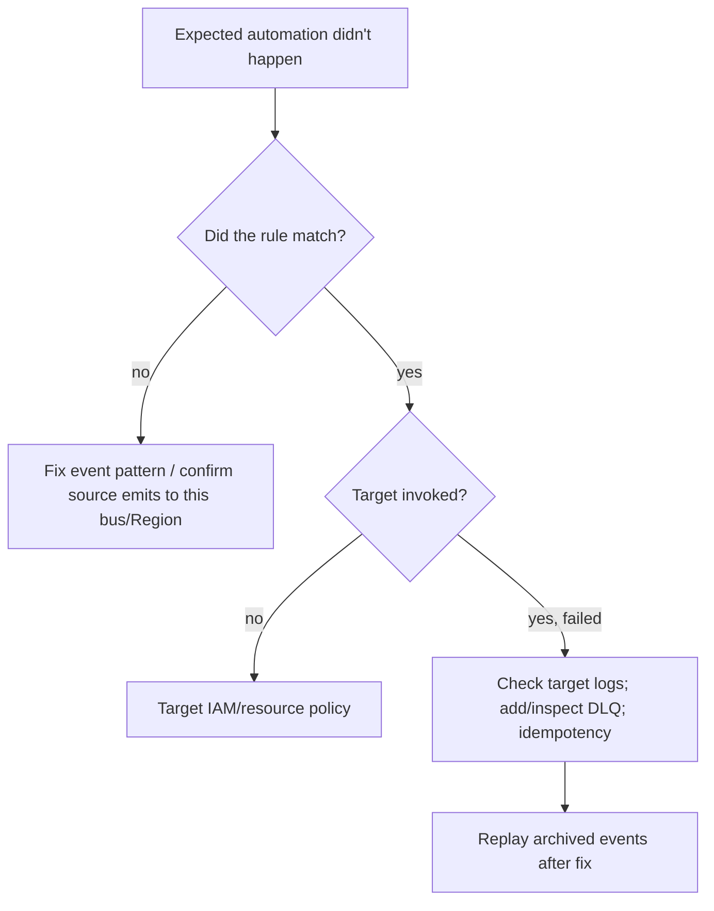

# EventBridge Governance Integrations - SRE Operations

> Operational reality: rules that don't fire, lost events, runaway remediation, real patterns/examples, and cost ops.

See also: [01 - EventBridge Governance Integrations Intro bits & bytes](01%20-%20EventBridge%20Governance%20Integrations%20Intro%20bits%20%26%20bytes.md) · [02 - EventBridge Governance Integrations Deep Dive](02%20-%20EventBridge%20Governance%20Integrations%20Deep%20Dive.md) · [03 - EventBridge Governance Integrations Exam Scenarios](03%20-%20EventBridge%20Governance%20Integrations%20Exam%20Scenarios.md) · [01 - AWS Systems Manager Intro bits & bytes](01%20-%20AWS%20Systems%20Manager%20Intro%20bits%20%26%20bytes.md)

---

## Table of Contents

- [1. Common Errors (Symptom → Root Cause → Fix → Prevention)](#1-common-errors-symptom--root-cause--fix--prevention)
- [2. Troubleshooting Workflow](#2-troubleshooting-workflow)
- [3. What to Monitor](#3-what-to-monitor)
- [4. Runbooks](#4-runbooks)
- [5. Real Examples](#5-real-examples)
- [6. Production Patterns by Org Size](#6-production-patterns-by-org-size)
- [7. Cost Operations](#7-cost-operations)

---

## 1. Common Errors (Symptom → Root Cause → Fix → Prevention)

### Rule never fires

- **Cause:** Event pattern doesn't match (wrong source/detail-type/case), or the source doesn't emit to this bus/Region.
- **Fix:** Test the pattern against a real event sample; verify the source emits (e.g. CloudTrail data events enabled).
- **Prevention:** Validate patterns with the sandbox/sample event; keep a test event library.

### Target not invoked

- **Cause:** Target IAM role/permissions missing, or target resource policy doesn't allow EventBridge.
- **Fix:** Grant the rule's role permission; add resource-based permission (e.g. Lambda permission).
- **Prevention:** Provision permissions via IaC with the rule.

### Events lost on failure

- **Cause:** No DLQ; target throttled/erroring past retries.
- **Fix:** Add a DLQ; alarm on DLQ; fix target capacity.
- **Prevention:** DLQ + idempotent targets by default.

### Remediation loop / storm

- **Cause:** Remediation action itself emits an event that re-triggers the rule.
- **Fix:** Exclude the remediation actor/role in the pattern; add guards/idempotency.
- **Prevention:** Design patterns to avoid self-trigger; test in non-prod.

### Cross-account events not arriving

- **Cause:** Central bus resource policy doesn't allow the org/source; member rule not forwarding.
- **Fix:** Update bus policy; configure member forwarding rule.
- **Prevention:** Standardize via landing-zone IaC.

[⬆ Back to top](#table-of-contents)

---

## 2. Troubleshooting Workflow



[⬆ Back to top](#table-of-contents)

---

## 3. What to Monitor

| Signal                                 | Why             |
| :------------------------------------- | :-------------- |
| Rule `TriggeredRules` / matched count  | Is it firing?   |
| Target `FailedInvocations`             | Delivery health |
| DLQ depth                              | Lost-event risk |
| Remediation success rate (target logs) | Effectiveness   |
| Latency event→action                   | MTTR            |

[⬆ Back to top](#table-of-contents)

---

## 4. Runbooks

### Runbook: build an auto-remediation

1. Capture a **sample event** from the source (CloudTrail/Config).
2. Write a precise **event pattern**; test against the sample.
3. Target an **SSM Automation** runbook (or Lambda) with a least-privilege role; make it **idempotent**.
4. Add a **DLQ** + alarm; enable **archive**.
5. Test in non-prod (including self-trigger checks); promote.

### Runbook: centralize org events

1. Create a custom bus in the security account; set a **resource policy** allowing the org.
2. In each member account, add a rule forwarding relevant events to the central bus.
3. Build rules in the security account for remediation/alerting; forward to SIEM.

[⬆ Back to top](#table-of-contents)

---

## 5. Real Examples

### Rule: remediate public bucket policy (CloudTrail event) → SSM

```bash
aws events put-rule --name public-bucket-guard \
  --event-pattern '{"source":["aws.s3"],"detail-type":["AWS API Call via CloudTrail"],"detail":{"eventName":["PutBucketPolicy","PutBucketAcl","PutBucketPublicAccessBlock"]}}'

aws events put-targets --rule public-bucket-guard --targets '[{
  "Id":"remediate","Arn":"arn:aws:ssm:ap-south-1:111111111111:automation-definition/Fix-S3-Public",
  "RoleArn":"arn:aws:iam::111111111111:role/EventBridgeSSMRole",
  "DeadLetterConfig":{"Arn":"arn:aws:sqs:ap-south-1:111111111111:eb-dlq"}
}]'
```

### Rule: Config NON_COMPLIANT → SNS

```json
{
  "source": ["aws.config"],
  "detail-type": ["Config Rules Compliance Change"],
  "detail": { "newEvaluationResult": { "complianceType": ["NON_COMPLIANT"] } }
}
```

### Central bus resource policy (accept org events)

```json
{
  "Version": "2012-10-17",
  "Statement": [
    {
      "Sid": "AllowOrgPutEvents",
      "Effect": "Allow",
      "Principal": "*",
      "Action": "events:PutEvents",
      "Resource": "arn:aws:events:ap-south-1:111111111111:event-bus/security-bus",
      "Condition": { "StringEquals": { "aws:PrincipalOrgID": "o-abc123" } }
    }
  ]
}
```

[⬆ Back to top](#table-of-contents)

---

## 6. Production Patterns by Org Size

| Context           | Pattern                                                                                               |
| :---------------- | :---------------------------------------------------------------------------------------------------- |
| **Startup**       | A few rules → Lambda/SNS for key events; DLQ on critical targets.                                     |
| **SMB**           | SSM Automation remediations; scheduled governance via Scheduler.                                      |
| **Enterprise**    | Central security bus (org); standardized remediation runbooks; archive/replay; SIEM forwarding.       |
| **Regulated**     | Audited remediation (CloudTrail); approval workflows (Step Functions); multi-Region rule replication. |
| **Multi-Account** | Member forwarding → central bus; least-privilege bus policy; consistent IaC.                          |

[⬆ Back to top](#table-of-contents)

---

## 7. Cost Operations

- Prefer **AWS-service events on the default bus** (generally free to match) over high-volume custom events.
- **Narrow event patterns** so expensive targets fire only when needed.
- Watch **target** costs (Lambda/SSM/Step Functions) more than EventBridge itself.
- The ROI is **lower MTTR and reduced exposure** from auto-remediation — usually far exceeding the per-event cost.

[⬆ Back to top](#table-of-contents)

---

Related: [01 - EventBridge Governance Integrations Intro bits & bytes](01%20-%20EventBridge%20Governance%20Integrations%20Intro%20bits%20%26%20bytes.md) · [02 - EventBridge Governance Integrations Deep Dive](02%20-%20EventBridge%20Governance%20Integrations%20Deep%20Dive.md) · [03 - EventBridge Governance Integrations Exam Scenarios](03%20-%20EventBridge%20Governance%20Integrations%20Exam%20Scenarios.md) · [24 - AWS Config & Audit Manager](24%20-%20AWS%20Config%20%26%20Audit%20Manager.md) · [01 - AWS Systems Manager Intro bits & bytes](01%20-%20AWS%20Systems%20Manager%20Intro%20bits%20%26%20bytes.md) · [01 - AWS CloudTrail Intro bits & bytes](01%20-%20AWS%20CloudTrail%20Intro%20bits%20%26%20bytes.md)
