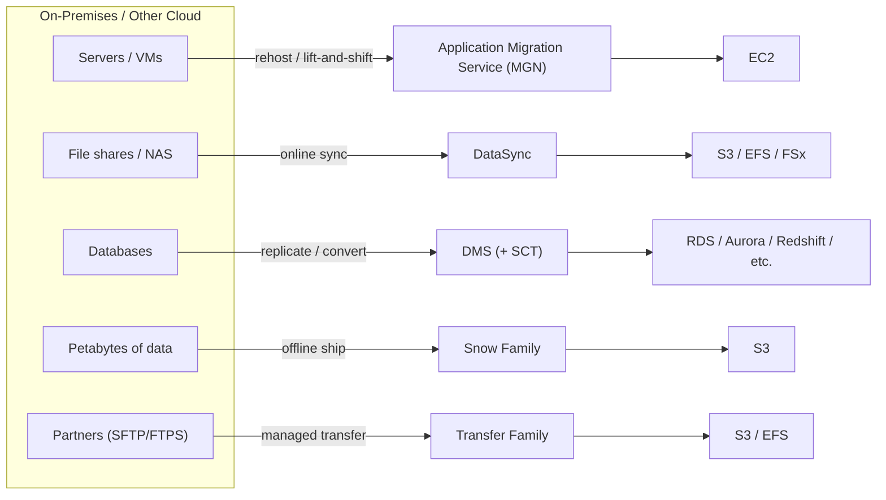

# Migration & Transfer - SAA-C03 Section Overview

> The Migration & Transfer domain is about **moving servers, databases, and data into (or around) AWS** - online or offline, one-time or continuous. For SAA-C03 the key skill is **picking the right tool from a scenario**: rehost a fleet of VMs (**Application Migration Service**), copy/sync file & object data (**DataSync**), migrate/replicate databases - even across engines (**DMS**), ship petabytes when the network is too slow (**Snow Family**), or run managed SFTP/FTPS/FTP into S3/EFS (**Transfer Family**). It maps to **Domain 2 (Resilient)**, **Domain 3 (High-Performing)**, and **Domain 4 (Cost-Optimized)**, plus the 6 Rs migration strategy framing.

See also: [01 - AWS Application Migration Service Intro bits & bytes](01%20-%20AWS%20Application%20Migration%20Service%20Intro%20bits%20%26%20bytes.md) · [01 - AWS DataSync Intro bits & bytes](01%20-%20AWS%20DataSync%20Intro%20bits%20%26%20bytes.md) · [01 - AWS DMS Intro bits & bytes](01%20-%20AWS%20DMS%20Intro%20bits%20%26%20bytes.md) · [01 - AWS Snow Family Intro bits & bytes](01%20-%20AWS%20Snow%20Family%20Intro%20bits%20%26%20bytes.md) · [01 - AWS Transfer Family Intro bits & bytes](01%20-%20AWS%20Transfer%20Family%20Intro%20bits%20%26%20bytes.md) · [00 - Media Services Overview](00%20-%20Media%20Services%20Overview.md)

---

## Table of Contents

- [How This Section Is Organised](#how-this-section-is-organised)
- [The Four-File Pattern Per Service](#the-four-file-pattern-per-service)
- [Service Index](#service-index)
- [The 6 Rs of Migration (Exam Framework)](#the-6-rs-of-migration-exam-framework)
- [Decision Guide: Which Tool When](#decision-guide-which-tool-when)
- [Mental Model: Servers, Data, Databases, Bulk, Ongoing Transfer](#mental-model-servers-data-databases-bulk-ongoing-transfer)
- [Cross-Domain Links](#cross-domain-links)

---

---

## How This Section Is Organised

Each service lives in its own numbered folder following the vault's four-file pattern, so you can study a service end-to-end or compare the same file type across services.

> **Exam reality check:** Migration is a meaningful slice of SAA-C03 scenario questions. They rarely test deep config; they test **service selection** ("which AWS service to move _this_ with _these_ constraints") and **the 6 Rs**. Master the decision guide below.

[⬆ Back to top](#table-of-contents)

---

## The Four-File Pattern Per Service

| File                        | Covers                                                                                                                                     |
| :-------------------------- | :----------------------------------------------------------------------------------------------------------------------------------------- |
| `01 - … Intro bits & bytes` | What it is, the problem it solves, when/when-not, alternatives, core concepts, architecture, cost intro, mini-quiz                         |
| `02 - … Deep Dive`          | Detailed architecture, control vs data plane, components, integrations, security, monitoring, limits & quotas, comparisons, best practices |
| `03 - … Exam Scenarios`     | Exam focus, keywords, distractors, elimination, **20 medium + 10 hard** scenarios with explanations                                        |
| `04 - … SRE Operations`     | Common errors, troubleshooting, runbooks, real CLI/IaC, production patterns, cost-optimization operations                                  |

[⬆ Back to top](#table-of-contents)

---

## Service Index

| #   | Service                                                                                                | Status | Primary exam angle                                           |
| :-- | :----------------------------------------------------------------------------------------------------- | :----- | :----------------------------------------------------------- |
| 01  | [AWS Application Migration Service (MGN)](01%20-%20AWS%20Application%20Migration%20Service%20Intro%20bits%20%26%20bytes.md) | Full   | Rehost/lift-and-shift servers to EC2 (block-level CDC)       |
| 02  | [AWS DataSync](01%20-%20AWS%20DataSync%20Intro%20bits%20%26%20bytes.md)                                                 | Full   | Online file/object data transfer & sync to S3/EFS/FSx        |
| 03  | [AWS Database Migration Service (DMS)](01%20-%20AWS%20DMS%20Intro%20bits%20%26%20bytes.md)                              | Full   | DB migration/replication, homogeneous & heterogeneous (+SCT) |
| 04  | [AWS Snow Family](01%20-%20AWS%20Snow%20Family%20Intro%20bits%20%26%20bytes.md)                                           | Full   | Offline petabyte transfer & edge compute                     |
| 05  | [AWS Transfer Family](01%20-%20AWS%20Transfer%20Family%20Intro%20bits%20%26%20bytes.md)                                   | Full   | Managed SFTP/FTPS/FTP into S3/EFS                            |

[⬆ Back to top](#table-of-contents)

---

## The 6 Rs of Migration (Exam Framework)

AWS frames migration strategy as the **6 Rs**. Know which service implements which.

| Strategy                                | Meaning                                    | Typical AWS service                     |
| :-------------------------------------- | :----------------------------------------- | :-------------------------------------- |
| **Rehost** ("lift & shift")             | Move as-is, no code change                 | **Application Migration Service (MGN)** |
| **Replatform** ("lift, tinker & shift") | Minor optimisations (e.g., move DB to RDS) | **DMS**, Elastic Beanstalk              |
| **Repurchase**                          | Move to a different product (SaaS)         | (commercial decision)                   |
| **Refactor / Re-architect**             | Redesign for cloud-native                  | Containers, serverless                  |
| **Retire**                              | Decommission what's unused                 | (none)                                  |
| **Retain** ("revisit")                  | Keep on-prem for now                       | (none)                                  |

> Exam cue: **"lift and shift / rehost with minimal effort" → MGN. "move the database to a managed engine / change engines" → DMS (+ SCT for heterogeneous).**

[⬆ Back to top](#table-of-contents)

---

## Decision Guide: Which Tool When

| You need to move…                      | …with this constraint                                         | Use                                       |
| :------------------------------------- | :------------------------------------------------------------ | :---------------------------------------- |
| **Whole servers/VMs** to EC2           | Minimal downtime, lift-and-shift                              | **Application Migration Service (MGN)**   |
| **Files/NAS or object data** online    | Fast, scheduled, validated sync                               | **DataSync**                              |
| **A database**                         | Same engine (homogeneous) or different engine (heterogeneous) | **DMS** (+ **SCT** for schema conversion) |
| **Petabytes**                          | Network too slow / sites disconnected                         | **Snow Family** (offline ship)            |
| **Ongoing partner file feeds**         | Standard SFTP/FTPS/FTP into AWS                               | **Transfer Family**                       |
| **One-time DB dump** small             | Quick                                                         | native tools / DMS                        |
| **Continuous file replication** to AWS | Hybrid steady-state                                           | **DataSync** (scheduled)                  |

> Network rule of thumb: if moving the data online would take **weeks**, ship it **offline with Snow**. If it's **TB-scale over a decent link**, **DataSync** online is usually right.

[⬆ Back to top](#table-of-contents)

---

## Mental Model: Servers, Data, Databases, Bulk, Ongoing Transfer

Five buckets cover the whole domain:

- **Servers** → **Application Migration Service (MGN)** - block-level replication of entire machines into EC2 (rehost).
- **File/object Data (online)** → **DataSync** - high-speed, validated sync to S3/EFS/FSx; great for ongoing hybrid copies.
- **Databases** → **DMS** - keep the source running while it migrates/replicates; **SCT** converts schema/code when engines differ.
- **Bulk (offline)** → **Snow Family** - physical devices for petabyte-scale or disconnected/edge sites.
- **Ongoing managed transfer** → **Transfer Family** - fully managed SFTP/FTPS/FTP endpoints landing data in S3/EFS for partners.

> The cleanest one-liner: **MGN = machines, DataSync = files, DMS = databases, Snow = trucks/petabytes, Transfer Family = SFTP-as-a-service.**

[⬆ Back to top](#table-of-contents)

---

## Cross-Domain Links

- Storage targets: [Amazon S3](01%20-%20S3%20Intro%20%26%20Core%20Concepts.md) · EFS / FSx (see Storage section)
- Database targets: RDS / Aurora / DynamoDB / Redshift (see Databases section)
- Networking for transfer: Direct Connect / VPN / VPC endpoints (see Networking section)
- DR & resilience: [00 - Media Services Overview](00%20-%20Media%20Services%20Overview.md) siblings and the DR-HA section
- Governance of migrated estate: [06 - IAM Identity Center & Organizations](06%20-%20IAM%20Identity%20Center%20%26%20Organizations.md) · [01 - AWS Backup Intro bits & bytes](01%20-%20AWS%20Backup%20Intro%20bits%20%26%20bytes.md) (Management & Governance)

[⬆ Back to top](#table-of-contents)
