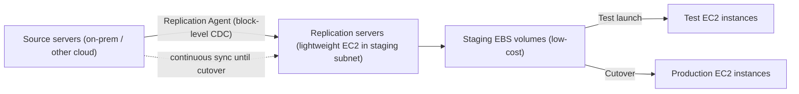

# AWS Application Migration Service (MGN) - Intro bits & bytes

> Application Migration Service (**MGN**, "Application Migration Service") is AWS's primary **rehost / lift-and-shift** tool: it continuously replicates your on-premises (or other-cloud) **servers at the block level** into AWS, then lets you **launch them as EC2 instances** with minimal downtime - no application rewrite. On the exam it's the default answer to _"migrate many servers/VMs to AWS quickly with minimal changes and minimal cutover downtime."_

See also: [02 - AWS Application Migration Service Deep Dive](02%20-%20AWS%20Application%20Migration%20Service%20Deep%20Dive.md) · [03 - AWS Application Migration Service Exam Scenarios](03%20-%20AWS%20Application%20Migration%20Service%20Exam%20Scenarios.md) · [04 - AWS Application Migration Service SRE Operations](04%20-%20AWS%20Application%20Migration%20Service%20SRE%20Operations.md) · [01 - AWS DMS Intro bits & bytes](01%20-%20AWS%20DMS%20Intro%20bits%20%26%20bytes.md) · [00 - Migration & Transfer Overview](00%20-%20Migration%20%26%20Transfer%20Overview.md)

---

## Table of Contents

- [1. The Problem It Solves](#1-the-problem-it-solves)
- [2. Core Concepts: Agent, Replication, Staging, Cutover](#2-core-concepts-agent-replication-staging-cutover)
- [3. The Migration Lifecycle](#3-the-migration-lifecycle)
- [4. When To Use It / When NOT To Use It](#4-when-to-use-it--when-not-to-use-it)
- [5. MGN vs DMS vs DataSync vs Snow](#5-mgn-vs-dms-vs-datasync-vs-snow)
- [6. Cost Model](#6-cost-model)
- [7. Mini-Quiz](#7-mini-quiz)

---

---

## 1. The Problem It Solves

Migrating dozens or hundreds of servers by hand - re-imaging, copying disks, reconfiguring - is slow, risky, and causes long downtime. MGN automates the **rehost**: install a lightweight **replication agent** on each source server, and MGN **continuously block-level replicates** the entire machine (OS, apps, state) into a **staging area** in your AWS account. When ready, you **test** non-disruptively, then **cut over** with **minimal downtime** because the data is already in sync.

> Mental model: MGN keeps a **live, block-level mirror** of each server in AWS staging, so cutover is just "boot the mirror as EC2." It rehosts **whole machines**, not individual files (DataSync) or databases (DMS).

> Naming note: MGN is the **successor to CloudEndure Migration** and AWS's recommended lift-and-shift service. SMS (Server Migration Service) is the older/deprecated tool.

[⬆ Back to top](#table-of-contents)

---

## 2. Core Concepts: Agent, Replication, Staging, Cutover

| Concept                        | What it is                                                                                                                               |
| :----------------------------- | :--------------------------------------------------------------------------------------------------------------------------------------- |
| **Replication Agent**          | Lightweight software installed on each source server; streams block-level changes to AWS.                                                |
| **Replication Servers**        | Small, automatically-managed EC2 instances in a **staging subnet** that receive replicated data and write it to **staging EBS volumes**. |
| **Staging Area**               | Low-cost EBS volumes holding the continuously-synced copy (you don't pay full production EC2 until launch).                              |
| **Launch Template / Settings** | How MGN turns the replica into an EC2 instance (instance type, subnet, SG, IAM) during test/cutover.                                     |
| **Test Instance**              | A non-disruptive boot of the replica to validate before cutover.                                                                         |
| **Cutover**                    | Final launch into production; source can then be decommissioned.                                                                         |

[⬆ Back to top](#table-of-contents)

---

## 3. The Migration Lifecycle

1. **Set up** MGN in the target region; create replication settings (staging subnet, instance types, encryption).
2. **Install the agent** on source servers (or use agentless for vSphere where supported).
3. **Initial sync** - full block copy; then **continuous replication** of changes (CDC).
4. **Configure launch settings** (right-size instance type, networking, IAM role).
5. **Test** - launch test instances; validate the app; iterate.
6. **Cutover** - launch production instances with minimal downtime; route traffic.
7. **Finalize** - decommission source and replication resources; stop billing for staging.

[⬆ Back to top](#table-of-contents)

---

## 4. When To Use It / When NOT To Use It

**Use it when:**

- **Lift-and-shift** of many servers/VMs to EC2 with **minimal downtime** and **no app changes**.
- Migrating from **on-premises, VMware, or another cloud** to AWS.
- You want a **non-disruptive test** before cutover.

**Don't use it when:**

- You only need to move **files/objects** → **DataSync**.
- You need to migrate/convert a **database** (especially across engines) → **DMS (+ SCT)**.
- You need **offline** bulk transfer because the network is too slow → **Snow Family**.
- You're **re-architecting** to containers/serverless (that's refactor, not rehost).

[⬆ Back to top](#table-of-contents)

---

## 5. MGN vs DMS vs DataSync vs Snow

|          | **MGN**                 | **DMS**                  | **DataSync**      | **Snow Family**       |
| :------- | :---------------------- | :----------------------- | :---------------- | :-------------------- |
| Moves    | Whole **servers** → EC2 | **Databases**            | **Files/objects** | **Bulk data offline** |
| Method   | Block-level CDC         | DB-level replication/CDC | Online sync       | Physical device       |
| Downtime | Minimal (pre-synced)    | Minimal (continuous)     | N/A               | Logistics time        |
| 6 R      | **Rehost**              | Replatform               | (data move)       | (data move)           |

> Exam trap: MGN moves **machines**; if the question is about a **database** specifically, the answer is **DMS**, not MGN (even though MGN could replicate the DB server's disks, the _managed database migration_ answer is DMS).

[⬆ Back to top](#table-of-contents)

---

## 6. Cost Model

- **MGN itself is free** for the standard migration period (typically up to 90 days per server after replication begins).
- You **pay for the AWS resources** it uses: **staging EBS volumes**, **replication server EC2** instances, **snapshots**, **data transfer**, and the **production EC2** once launched.
- Staging is intentionally **low cost** (small replication instances + cheap EBS) until you launch full production.

> Cost lever: finalize and **decommission staging promptly** after cutover; right-size launch templates so production EC2 isn't over-provisioned.

[⬆ Back to top](#table-of-contents)

---

## 7. Mini-Quiz

**Q1:** Migrate 200 on-prem servers to EC2 with minimal downtime and no code changes. Service?
_A:_ **Application Migration Service (MGN)** - rehost via block-level replication.

**Q2:** What keeps cutover downtime low?
_A:_ **Continuous block-level replication** keeps the staging copy in sync, so cutover is just launching the replica.

**Q3:** Can you validate before cutover?
_A:_ Yes - **test instances** boot non-disruptively from the replica.

**Q4:** Migrating just a PostgreSQL database to Aurora?
_A:_ **DMS** (+ SCT if converting), not MGN.

**Q5:** Is MGN charged during migration?
_A:_ MGN service is **free** for the migration window; you pay for staging EBS/EC2 and the launched instances.

---

> Continue to [02 - AWS Application Migration Service Deep Dive](02%20-%20AWS%20Application%20Migration%20Service%20Deep%20Dive.md).
