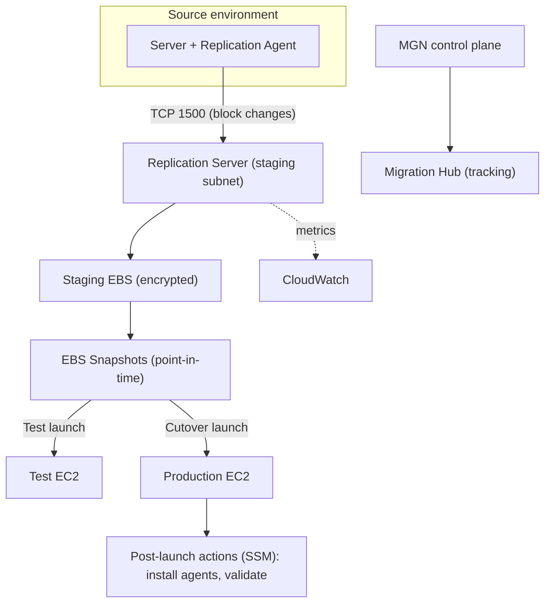

# AWS Application Migration Service (MGN) - Deep Dive

> Architecture of agents/replication servers/staging, continuous block-level CDC, test vs cutover, post-launch actions & automation, security (encryption, IAM, networking), monitoring, limits, integration with Migration Hub, comparisons, and best practices by pillar.

See also: [01 - AWS Application Migration Service Intro bits & bytes](01%20-%20AWS%20Application%20Migration%20Service%20Intro%20bits%20%26%20bytes.md) · [03 - AWS Application Migration Service Exam Scenarios](03%20-%20AWS%20Application%20Migration%20Service%20Exam%20Scenarios.md) · [04 - AWS Application Migration Service SRE Operations](04%20-%20AWS%20Application%20Migration%20Service%20SRE%20Operations.md) · [00 - Migration & Transfer Overview](00%20-%20Migration%20%26%20Transfer%20Overview.md)

---

## Table of Contents

- [1. Architecture & Replication Pipeline](#1-architecture--replication-pipeline)
- [2. Continuous Block-Level Replication (CDC)](#2-continuous-block-level-replication-cdc)
- [3. Test vs Cutover & Post-Launch Actions](#3-test-vs-cutover--post-launch-actions)
- [4. Networking for Replication](#4-networking-for-replication)
- [5. Security: Encryption, IAM, Isolation](#5-security-encryption-iam-isolation)
- [6. Monitoring & Observability](#6-monitoring--observability)
- [7. Limits & Quotas](#7-limits--quotas)
- [8. Integration Matrix (Migration Hub, etc.)](#8-integration-matrix-migration-hub-etc)
- [9. Comparisons](#9-comparisons)
- [10. Best Practices by Pillar](#10-best-practices-by-pillar)

---

---

## 1. Architecture & Replication Pipeline

- The **replication agent** on each source server reads disk **blocks** and streams changes to a **replication server** MGN manages in a dedicated **staging subnet** in your account.
- Replication servers write to **staging EBS volumes** (one set per source disk), kept continuously in sync.
- MGN periodically creates **EBS snapshots** as consistent points-in-time used to launch test/cutover instances.
- The **MGN control plane** orchestrates agents, replication servers, launch templates, and lifecycle state; results feed **AWS Migration Hub** for portfolio tracking.

[⬆ Back to top](#table-of-contents)

---

## 2. Continuous Block-Level Replication (CDC)

- After the **initial full sync**, MGN replicates only **changed blocks** (Change Data Capture) - efficient and low-bandwidth steady state.
- Because the copy is **always near-current**, cutover downtime is just the time to take a final snapshot and boot the production instance.
- Replication is **OS/app-agnostic** (it's block-level), so it handles arbitrary workloads on supported OSes (Windows/Linux).
- **Agentless** replication is available for **VMware vSphere** in supported scenarios.

[⬆ Back to top](#table-of-contents)

---

## 3. Test vs Cutover & Post-Launch Actions

| Phase                   | What happens                                                                                                                                    |
| :---------------------- | :---------------------------------------------------------------------------------------------------------------------------------------------- |
| **Test**                | Launch instances from the latest snapshot in an isolated subnet; validate app; does **not** affect source or stop replication. Repeat freely.   |
| **Cutover**             | Final launch into production; mark source as cut over; stop replication after finalize.                                                         |
| **Post-launch actions** | Automated steps (via **SSM**) run on launched instances: install CloudWatch/SSM agents, run validation scripts, disaster-recovery handoff, etc. |

> Best practice: always run **at least one successful test** and validate before cutover; use post-launch actions to standardise the landed instances.

[⬆ Back to top](#table-of-contents)

---

## 4. Networking for Replication

- Agents connect to replication servers over **TCP 1500**; replication servers reach the MGN/S3 endpoints over **443**.
- Connectivity options: over the **internet** (with encryption), **VPN**, or **Direct Connect** for high-volume/secure transfer.
- A dedicated **staging subnet** isolates replication traffic; use **VPC endpoints** to avoid public exposure where required.

[⬆ Back to top](#table-of-contents)

---

## 5. Security: Encryption, IAM, Isolation

| Control                   | Detail                                                                                                    |
| :------------------------ | :-------------------------------------------------------------------------------------------------------- |
| **Encryption in transit** | Replication data is encrypted (TLS) end to end.                                                           |
| **Encryption at rest**    | Staging EBS volumes/snapshots encrypted with **EBS/KMS** (use a CMK for control).                         |
| **IAM**                   | MGN service-linked role + scoped roles for agents/launch; least-privilege launch templates.               |
| **Network isolation**     | Dedicated staging subnet; security groups limiting 1500/443; private connectivity via DX/VPN/endpoints.   |
| **Account model**         | Migrate into the intended target account/region; integrate with Organizations for multi-account programs. |

[⬆ Back to top](#table-of-contents)

---

## 6. Monitoring & Observability

- MGN console shows **per-server migration state**, **replication lag**, and **data-replication progress**.
- **CloudWatch** metrics on replication servers (lag, throughput); alarm on **stalled replication** or **high lag**.
- **CloudTrail** audits MGN API actions.
- **Migration Hub** aggregates status across servers/applications for program reporting.

[⬆ Back to top](#table-of-contents)

---

## 7. Limits & Quotas

| Limit                            | Default (typical)               | Notes                                  |
| :------------------------------- | :------------------------------ | :------------------------------------- |
| Free migration window per server | ~90 days                        | After this, standard charges may apply |
| Source servers per account       | Thousands (soft)                | Request increases for large programs   |
| Concurrent replication           | Scales with replication servers | Bandwidth-bound at the source link     |
| Supported OS                     | Common Windows/Linux versions   | Check the supported-OS matrix          |
| Region                           | Broad                           | Migrate into the chosen target region  |

[⬆ Back to top](#table-of-contents)

---

## 8. Integration Matrix (Migration Hub, etc.)

| Service                             | Integration                                                               |
| :---------------------------------- | :------------------------------------------------------------------------ |
| **AWS Migration Hub**               | Central tracking of servers/applications across tools                     |
| **Systems Manager (SSM)**           | Post-launch actions, agent install, validation                            |
| **EC2 / EBS**                       | Target instances and staging volumes                                      |
| **KMS**                             | Encrypt staging volumes/snapshots                                         |
| **CloudWatch / CloudTrail**         | Metrics/alarms and API audit                                              |
| **Direct Connect / VPN**            | Private, high-throughput replication                                      |
| **Organizations**                   | Multi-account migration programs                                          |
| **Elastic Disaster Recovery (DRS)** | Sibling service sharing the same replication tech (for DR, not migration) |

[⬆ Back to top](#table-of-contents)

---

## 9. Comparisons

### MGN vs AWS Elastic Disaster Recovery (DRS)

|         | MGN                                  | DRS                                     |
| :------ | :----------------------------------- | :-------------------------------------- |
| Purpose | **Migrate** to AWS (one-time)        | **Disaster recovery** (ongoing)         |
| Tech    | Same block-level replication lineage | Same                                    |
| Outcome | Cutover, decommission source         | Keep replicating; fail over on disaster |

### MGN vs DMS

|               | MGN                | DMS                         |
| :------------ | :----------------- | :-------------------------- |
| Unit          | Whole server → EC2 | Database                    |
| Engine change | No (rehost)        | Yes (heterogeneous via SCT) |

[⬆ Back to top](#table-of-contents)

---

## 10. Best Practices by Pillar

**Security** - encrypt staging EBS with a CMK; private connectivity (DX/VPN/endpoints); least-privilege launch templates; isolate the staging subnet.

**Reliability** - run multiple successful **tests** before cutover; monitor replication lag; plan cutover windows and rollback (keep source until validated).

**Performance Efficiency** - right-size launch templates (don't 1:1 copy oversized on-prem specs); use DX for large fleets; sequence waves to fit bandwidth.

**Cost Optimization** - staging is cheap; **finalize promptly** to stop staging charges; right-size production EC2; use Savings Plans/RIs after steady state.

**Operational Excellence** - track with **Migration Hub**; standardise landed instances via **post-launch SSM actions**; migrate in **waves** by application.

[⬆ Back to top](#table-of-contents)

---

> Continue to [03 - AWS Application Migration Service Exam Scenarios](03%20-%20AWS%20Application%20Migration%20Service%20Exam%20Scenarios.md).
