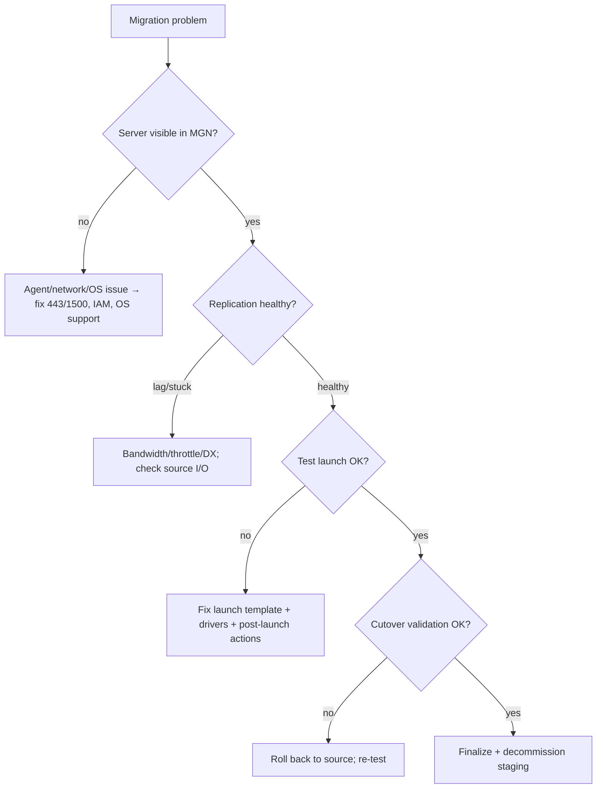

# AWS Application Migration Service (MGN) - SRE Operations

> Operational reality: where replication and cutovers go wrong, troubleshooting workflow, what to monitor/alarm, runbooks (wave, cutover, rollback), real CLI examples, production patterns by scale, and cost operations.

See also: [01 - AWS Application Migration Service Intro bits & bytes](01%20-%20AWS%20Application%20Migration%20Service%20Intro%20bits%20%26%20bytes.md) · [02 - AWS Application Migration Service Deep Dive](02%20-%20AWS%20Application%20Migration%20Service%20Deep%20Dive.md) · [03 - AWS Application Migration Service Exam Scenarios](03%20-%20AWS%20Application%20Migration%20Service%20Exam%20Scenarios.md) · [00 - Migration & Transfer Overview](00%20-%20Migration%20%26%20Transfer%20Overview.md)

---

## Table of Contents

- [1. Common Errors (Symptom → Root Cause → Fix → Prevention)](#1-common-errors-symptom--root-cause--fix--prevention)
- [2. Troubleshooting Workflow](#2-troubleshooting-workflow)
- [3. What to Monitor and Alarm On](#3-what-to-monitor-and-alarm-on)
- [4. Runbooks](#4-runbooks)
- [5. Real Examples](#5-real-examples)
- [6. Production Patterns by Scale](#6-production-patterns-by-scale)
- [7. Cost Operations](#7-cost-operations)
- [8. Cutover Readiness Checklist](#8-cutover-readiness-checklist)

---

## 1. Common Errors (Symptom → Root Cause → Fix → Prevention)

### Agent install fails / server not appearing

- **Cause:** Outbound 443/1500 blocked, wrong credentials/region, unsupported OS.
- **Fix:** Open required ports to replication servers/endpoints; verify IAM keys + region; check OS support.
- **Prevention:** Pre-flight network/OS checks before mass agent rollout.

### Replication stuck in "Initial sync" / high lag

- **Cause:** Bandwidth saturation, throttling, large disks, intermittent connectivity.
- **Fix:** Increase/dedicate bandwidth (DX), enable throttling windows, check source disk I/O.
- **Prevention:** Capacity-plan link; stagger waves; monitor lag.

### Test instance won't boot / app broken

- **Cause:** Wrong launch template (instance type, drivers), missing networking/SG, app config tied to old IP.
- **Fix:** Adjust launch settings; install required drivers; use post-launch actions to fix config.
- **Prevention:** Iterate on test launches until clean before cutover.

### Cutover succeeded but app can't reach dependencies

- **Cause:** Security groups/routes/DNS not updated for the new EC2.
- **Fix:** Update SGs, route tables, DNS records; validate connectivity.
- **Prevention:** Cutover runbook includes networking/DNS steps.

### Costs higher than expected after migration

- **Cause:** Staging not finalized; oversized production instances.
- **Fix:** Finalize migrations; right-size; apply Savings Plans/RIs.
- **Prevention:** Finalize promptly; right-size in launch templates.

### Replication server errors / capacity

- **Cause:** Too many sources per replication server; staging subnet limits.
- **Fix:** Scale replication servers; check subnet IP/EBS limits.
- **Prevention:** Plan staging subnet sizing for the wave.

[⬆ Back to top](#table-of-contents)

---

## 2. Troubleshooting Workflow



[⬆ Back to top](#table-of-contents)

---

## 3. What to Monitor and Alarm On

| Signal                                                                                 | Why                    |
| :------------------------------------------------------------------------------------- | :--------------------- |
| Replication **lag / backlog**                                                          | Cutover readiness risk |
| Replication **state changes** (stalled, error)                                         | Pipeline health        |
| Replication server **throughput**                                                      | Bandwidth/capacity     |
| Staging **EBS/EC2 cost**                                                               | Finalize hygiene       |
| Test/cutover **launch failures**                                                       | Launch template issues |
| CloudTrail MGN actions (`StartCutover`, `FinalizeCutover`, `TerminateTargetInstances`) | Change audit           |

[⬆ Back to top](#table-of-contents)

---

## 4. Runbooks

### Runbook: migrate a wave

1. Confirm in-scope servers; verify network/OS pre-flight.
2. Install agents; confirm servers appear and start replicating.
3. Wait for **healthy** replication (lag low).
4. Configure/launch **test** instances; validate the application.
5. Schedule **cutover** window; communicate.
6. **Cutover**; update SGs/routes/DNS; validate.
7. **Finalize**; decommission staging; tag and hand to ops.

### Runbook: cutover rollback

1. If post-cutover validation fails, **route traffic back to source** (still live).
2. Investigate (logs, networking, app config).
3. Re-test the migrated instance; re-attempt cutover.

### Runbook: stalled replication

1. Check replication state + lag in console.
2. Identify bottleneck (bandwidth, source I/O, connectivity).
3. Apply DX/throttling/staggering; resume; confirm lag recovers.

[⬆ Back to top](#table-of-contents)

---

## 5. Real Examples

### Mark servers ready / start test (CLI sketch)

```bash
# List source servers
aws mgn describe-source-servers

# Start a test launch
aws mgn start-test --source-server-id s-1234567890abcdef0

# Start cutover
aws mgn start-cutover --source-server-ids s-1234567890abcdef0

# Finalize after validation (stops replication, cleans staging)
aws mgn finalize-cutover --source-server-id s-1234567890abcdef0
```

### Update launch configuration (right-size target)

```bash
aws mgn update-launch-configuration \
  --source-server-id s-1234567890abcdef0 \
  --launch-disposition STARTED \
  --target-instance-type-right-sizing-method BASIC
```

### Post-launch action via SSM (concept)

```text
Configure MGN post-launch settings to run an SSM Automation document that:
  - installs CloudWatch + SSM agents
  - applies CIS hardening
  - registers the instance with the CMDB and tags it
```

[⬆ Back to top](#table-of-contents)

---

## 6. Production Patterns by Scale

| Context                 | Pattern                                                                                                                  |
| :---------------------- | :----------------------------------------------------------------------------------------------------------------------- |
| **Small (≤20 servers)** | Single wave, manual test/cutover, basic monitoring.                                                                      |
| **Medium**              | Wave planning by app, DX for bandwidth, Migration Hub tracking.                                                          |
| **Enterprise**          | Multi-account targets (Control Tower), automated post-launch hardening, dashboards on lag/cost, runbook-driven cutovers. |
| **Hybrid → DR**         | After migration, adopt **Elastic Disaster Recovery (DRS)** for ongoing failover.                                         |

[⬆ Back to top](#table-of-contents)

---

## 7. Cost Operations

- **Finalize promptly** - the #1 lever; unfinalized staging keeps billing EBS/EC2.
- **Right-size** target instances in launch templates; don't mirror oversized on-prem specs.
- Apply **Savings Plans / Reserved Instances** once workloads reach steady state.
- Use **DX** where bandwidth costs/time of online transfer justify it.
- Clean up **snapshots** and orphaned staging volumes after waves.

[⬆ Back to top](#table-of-contents)

---

## 8. Cutover Readiness Checklist

- ✅ Replication **healthy**, lag near zero.
- ✅ At least one **successful test** with app validation.
- ✅ **Launch template** right-sized; drivers/agents handled.
- ✅ **Networking/DNS** plan ready (SGs, routes, records).
- ✅ **Rollback** plan (source stays live until finalize).
- ✅ Stakeholders notified; window scheduled.
- ✅ Post-cutover **finalize + decommission** scheduled.

[⬆ Back to top](#table-of-contents)

---

Related: [01 - AWS Application Migration Service Intro bits & bytes](01%20-%20AWS%20Application%20Migration%20Service%20Intro%20bits%20%26%20bytes.md) · [02 - AWS Application Migration Service Deep Dive](02%20-%20AWS%20Application%20Migration%20Service%20Deep%20Dive.md) · [03 - AWS Application Migration Service Exam Scenarios](03%20-%20AWS%20Application%20Migration%20Service%20Exam%20Scenarios.md) · [01 - AWS DMS Intro bits & bytes](01%20-%20AWS%20DMS%20Intro%20bits%20%26%20bytes.md) · [00 - Migration & Transfer Overview](00%20-%20Migration%20%26%20Transfer%20Overview.md)
