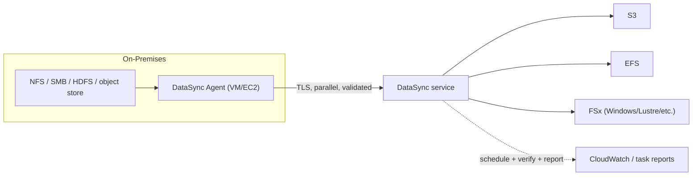

# AWS DataSync - Intro bits & bytes

> DataSync is a managed **online data-transfer** service that moves and **synchronises files and objects** between on-premises storage (NFS, SMB, HDFS, object) and AWS storage (**S3, EFS, FSx**) - and between AWS storage services - **fast, securely, and with built-in validation**. On the exam it's the answer to _"copy/sync large amounts of file or object data to AWS over the network, repeatedly, with integrity checks."_

See also: [02 - AWS DataSync Deep Dive](02%20-%20AWS%20DataSync%20Deep%20Dive.md) · [03 - AWS DataSync Exam Scenarios](03%20-%20AWS%20DataSync%20Exam%20Scenarios.md) · [04 - AWS DataSync SRE Operations](04%20-%20AWS%20DataSync%20SRE%20Operations.md) · [01 - AWS Snow Family Intro bits & bytes](01%20-%20AWS%20Snow%20Family%20Intro%20bits%20%26%20bytes.md) · [00 - Migration & Transfer Overview](00%20-%20Migration%20%26%20Transfer%20Overview.md)

---

## Table of Contents

- [1. The Problem It Solves](#1-the-problem-it-solves)
- [2. Core Concepts: Agent, Locations, Tasks](#2-core-concepts-agent-locations-tasks)
- [3. The Transfer Flow](#3-the-transfer-flow)
- [4. When To Use It / When NOT To Use It](#4-when-to-use-it--when-not-to-use-it)
- [5. DataSync vs Snow vs S3 CLI vs Storage Gateway vs Transfer Family](#5-datasync-vs-snow-vs-s3-cli-vs-storage-gateway-vs-transfer-family)
- [6. Cost Model](#6-cost-model)
- [7. Mini-Quiz](#7-mini-quiz)

---

---

## 1. The Problem It Solves

Copying terabytes of files with `cp`/`rsync`/scripts is slow, fragile, and hard to verify - and it doesn't handle permissions, retries, scheduling, and integrity well at scale. DataSync provides a **purpose-built, parallelised, encrypted transfer engine** that:

- Moves data **10x faster** than open-source tools (parallel transfers, optimised protocol).
- **Validates** data integrity end to end.
- Preserves **metadata** (permissions, timestamps, ownership) for NFS/SMB.
- Runs **one-time or scheduled**, incremental (only changed data after first run).

> Mental model: DataSync is **managed, validated, high-speed online sync** for **files and objects**. Use it for **online** transfers; when the network is too slow for the volume, use **Snow** (offline).

[⬆ Back to top](#table-of-contents)

---

## 2. Core Concepts: Agent, Locations, Tasks

| Concept            | What it is                                                                                                                                                                                                      |
| :----------------- | :-------------------------------------------------------------------------------------------------------------------------------------------------------------------------------------------------------------- |
| **Agent**          | A VM (VMware/Hyper-V/KVM) or EC2 instance deployed **near the source** (usually on-prem) that reads source data and ships it to AWS. **Not needed** for AWS-to-AWS transfers, or for some object/cloud sources. |
| **Location**       | A source or destination endpoint: NFS, SMB, HDFS, self-managed object storage, **S3**, **EFS**, **FSx** (Windows/Lustre/ONTAP/OpenZFS), and other-cloud object stores.                                          |
| **Task**           | The transfer job: a **source location + destination location + options** (filters, scheduling, verification, overwrite behaviour, bandwidth limit).                                                             |
| **Task execution** | One run of a task; produces metrics and an optional **task report**.                                                                                                                                            |

[⬆ Back to top](#table-of-contents)

---

## 3. The Transfer Flow

1. Deploy a **DataSync agent** near the source (on-prem) and activate it.
2. Define **source** and **destination** **locations**.
3. Create a **task** with options (filters, schedule, verification, bandwidth throttle).
4. Run it - DataSync transfers in **parallel over TLS**, then **verifies** integrity.
5. Subsequent runs are **incremental** (only changes); schedule for ongoing sync.
6. Review **CloudWatch metrics / task reports** for files transferred, skipped, verified.

[⬆ Back to top](#table-of-contents)

---

## 4. When To Use It / When NOT To Use It

**Use it when:**

- **Online** migration or **ongoing sync** of **file/object** data to S3/EFS/FSx.
- You need **integrity validation**, **metadata preservation**, scheduling, and incremental transfers.
- **AWS-to-AWS** transfers (e.g., S3 cross-region, EFS↔FSx) without managing an agent.
- Hybrid steady-state replication (e.g., nightly sync of a NAS to S3).

**Don't use it when:**

- The volume is so large the network would take **weeks** → **Snow Family** (offline).
- You're migrating **whole servers** → **MGN**; or a **database** → **DMS**.
- You need **standard SFTP/FTPS endpoints** for partners → **Transfer Family**.
- You need **low-latency local file access with cloud backing** (caching gateway) → **Storage Gateway (File Gateway)**.

[⬆ Back to top](#table-of-contents)

---

## 5. DataSync vs Snow vs S3 CLI vs Storage Gateway vs Transfer Family

|            | **DataSync**                  | **Snow Family**      | **S3 CLI/rsync** | **Storage Gateway**          | **Transfer Family**    |
| :--------- | :---------------------------- | :------------------- | :--------------- | :--------------------------- | :--------------------- |
| Mode       | Online, managed sync          | **Offline** ship     | Online, DIY      | Hybrid cache                 | Managed SFTP/FTPS/FTP  |
| Best for   | TB-scale files/objects online | PB-scale / slow link | Small/ad-hoc     | Ongoing local access + cloud | Partner file ingestion |
| Validation | **Built-in**                  | Device-level         | Manual           | N/A                          | Protocol-level         |
| Metadata   | Preserves NFS/SMB             | Varies               | Limited          | Native                       | N/A                    |

> Exam trap: **DataSync = online file/object transfer & sync; Snow = offline; Storage Gateway = ongoing hybrid access; Transfer Family = SFTP-as-a-service.** They are frequently offered together as distractors.

[⬆ Back to top](#table-of-contents)

---

## 6. Cost Model

- **Per-GB data transferred** by DataSync (a flat per-GB fee).
- Plus standard **storage** costs at the destination (S3/EFS/FSx), **request** costs, and any **cross-region/egress** data transfer.
- The **agent VM** runs on your hardware (no AWS charge); an **EC2 agent** incurs normal EC2 cost.
- No charge when idle - you pay per data moved.

> Cost lever: use **filters/includes-excludes** so you don't move data you don't need, and schedule incremental syncs (only changed data).

[⬆ Back to top](#table-of-contents)

---

## 7. Mini-Quiz

**Q1:** Sync 60 TB of on-prem NFS to S3 over the network, nightly, with integrity checks. Service?
_A:_ **DataSync** (scheduled, incremental, validated).

**Q2:** What three constructs define a DataSync job?
_A:_ **Agent** (near source), **Locations** (source/dest), **Task** (the transfer + options).

**Q3:** Do AWS-to-AWS transfers need an agent?
_A:_ **No** - agent is for on-prem/other sources; AWS-to-AWS is agentless.

**Q4:** 5 PB to move and the link would take months. DataSync?
_A:_ **No** - use **Snow Family** (offline).

**Q5:** Need partners to upload via SFTP into S3?
_A:_ **Transfer Family**, not DataSync.

---

> Continue to [02 - AWS DataSync Deep Dive](02%20-%20AWS%20DataSync%20Deep%20Dive.md).
