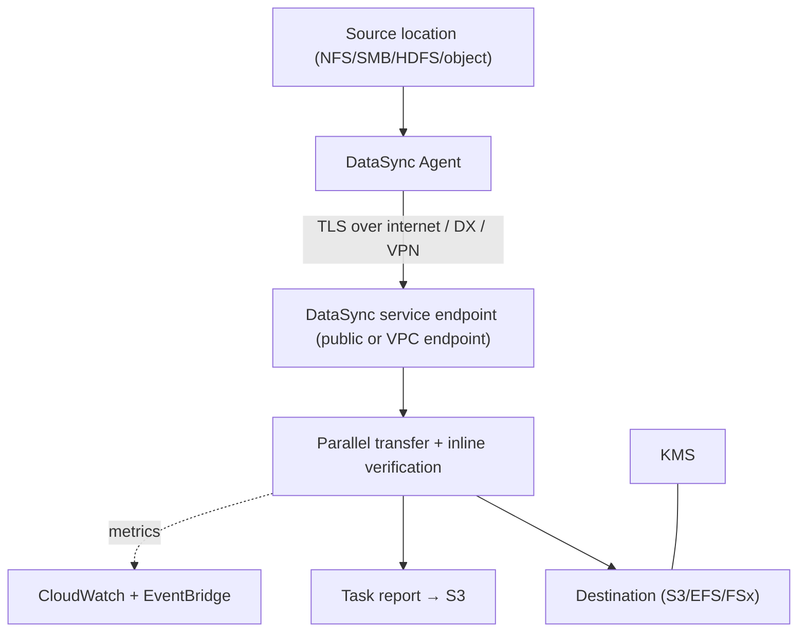

# AWS DataSync - Deep Dive

> Architecture of agent/locations/tasks, transfer engine & verification, supported source/destination matrix, scheduling & filters, bandwidth control, security (TLS, KMS, VPC endpoints, IAM), monitoring & task reports, limits, integrations, comparisons, and best practices by pillar.

See also: [01 - AWS DataSync Intro bits & bytes](01%20-%20AWS%20DataSync%20Intro%20bits%20%26%20bytes.md) · [03 - AWS DataSync Exam Scenarios](03%20-%20AWS%20DataSync%20Exam%20Scenarios.md) · [04 - AWS DataSync SRE Operations](04%20-%20AWS%20DataSync%20SRE%20Operations.md) · [00 - Migration & Transfer Overview](00%20-%20Migration%20%26%20Transfer%20Overview.md)

---

## Table of Contents

- [1. Architecture & Transfer Engine](#1-architecture--transfer-engine)
- [2. Source & Destination Matrix](#2-source--destination-matrix)
- [3. Task Options: Filters, Scheduling, Verification, Overwrite](#3-task-options-filters-scheduling-verification-overwrite)
- [4. Bandwidth & Performance](#4-bandwidth--performance)
- [5. Security: TLS, KMS, VPC Endpoints, IAM](#5-security-tls-kms-vpc-endpoints-iam)
- [6. Monitoring & Task Reports](#6-monitoring--task-reports)
- [7. Limits & Quotas](#7-limits--quotas)
- [8. Integration Matrix](#8-integration-matrix)
- [9. Comparisons](#9-comparisons)
- [10. Best Practices by Pillar](#10-best-practices-by-pillar)

---

---

## 1. Architecture & Transfer Engine

- The **agent** reads the source, **chunks and compresses** data, and sends it **encrypted (TLS)** to the DataSync service, which writes to the destination.
- The engine uses **parallelism, multiplexing, and incremental change detection** to maximise throughput - far faster than serial copy tools.
- After transfer, DataSync performs **inline + end-of-task verification** (checksums) to guarantee integrity.
- For **AWS-to-AWS** (e.g., S3→S3 cross-region, EFS→FSx), **no agent** is required - the service moves data directly.

[⬆ Back to top](#table-of-contents)

---

## 2. Source & Destination Matrix

| Type                       | Examples                                                                                                                      |
| :------------------------- | :---------------------------------------------------------------------------------------------------------------------------- |
| **On-prem / self-managed** | NFS, SMB (CIFS), HDFS, self-managed **object storage** (S3-compatible)                                                        |
| **Other cloud**            | Object stores (e.g., Google Cloud Storage, Azure Blob via S3-compatible/connectors)                                           |
| **AWS storage**            | **S3** (all storage classes), **EFS**, **FSx for Windows**, **FSx for Lustre**, **FSx for NetApp ONTAP**, **FSx for OpenZFS** |

- Transfers can be **on-prem → AWS**, **AWS → on-prem**, or **AWS → AWS**.
- DataSync can write to/read from specific **S3 storage classes** (e.g., land directly in Standard-IA or Glacier Instant Retrieval).

[⬆ Back to top](#table-of-contents)

---

## 3. Task Options: Filters, Scheduling, Verification, Overwrite

| Option                      | What it controls                                                         |
| :-------------------------- | :----------------------------------------------------------------------- |
| **Include/Exclude filters** | Glob patterns to move only the files you want                            |
| **Schedule**                | Hourly/daily/etc. (cron-like) for recurring incremental syncs            |
| **Verification mode**       | Verify all data, only transferred, or none (trade speed vs assurance)    |
| **Transfer mode**           | Transfer **all** data vs **only changed** (incremental)                  |
| **Overwrite/preserve**      | Keep deleted files in destination or mirror deletions; preserve metadata |
| **Task report**             | Detailed per-file report (transferred/skipped/verified/errors) to S3     |

[⬆ Back to top](#table-of-contents)

---

## 4. Bandwidth & Performance

- **Bandwidth throttle** per task to protect production links (set Mbps cap).
- Throughput scales with agent resources, network capacity, and file size distribution (many tiny files are slower than few large ones).
- For high volume, use **Direct Connect** or **multiple agents/tasks** in parallel.
- An **EC2 agent** in-region can accelerate AWS-side or other-cloud transfers.

[⬆ Back to top](#table-of-contents)

---

## 5. Security: TLS, KMS, VPC Endpoints, IAM

| Control                  | Detail                                                                                                |
| :----------------------- | :---------------------------------------------------------------------------------------------------- |
| **In transit**           | Always **TLS** between agent and service.                                                             |
| **At rest**              | Destination encryption (S3 SSE-S3/SSE-KMS, EFS/FSx KMS).                                              |
| **Private connectivity** | Use **VPC endpoints (PrivateLink)** so traffic never traverses the public internet; pair with DX/VPN. |
| **IAM**                  | Scoped roles for DataSync to read/write S3/EFS/FSx; least privilege on locations.                     |
| **Agent security**       | Agent activation key; keep the agent VM patched and network-restricted.                               |

[⬆ Back to top](#table-of-contents)

---

## 6. Monitoring & Task Reports

- **CloudWatch metrics**: bytes transferred, files transferred, throughput, errors per task execution.
- **CloudWatch Logs** for per-file transfer logging (configurable verbosity).
- **Task reports** to S3: complete manifest of what was transferred/skipped/verified/failed - great for audit/compliance.
- **EventBridge** events on task state (success/error) to trigger downstream automation/alerts.

[⬆ Back to top](#table-of-contents)

---

## 7. Limits & Quotas

| Limit              | Default (typical)     | Notes                                             |
| :----------------- | :-------------------- | :------------------------------------------------ |
| Files per task     | Tens of millions      | Very large file counts: split into multiple tasks |
| Tasks per account  | Soft limit            | Request increases                                 |
| Agents             | Multiple              | Scale out for throughput                          |
| Throughput         | Network/agent bound   | Use DX + multiple agents for high volume          |
| Bandwidth throttle | Configurable per task | Protect production links                          |

[⬆ Back to top](#table-of-contents)

---

## 8. Integration Matrix

| Service                                | Integration                                                        |
| :------------------------------------- | :----------------------------------------------------------------- | ----------- |
| **S3 / EFS / FSx**                     | Primary AWS destinations/sources → [Amazon S3](01%20-%20S3%20Intro%20%26%20Core%20Concepts.md) |
| **KMS**                                | Encrypt destination data                                           |
| **CloudWatch / EventBridge**           | Metrics, logs, task-state automation                               |
| **Direct Connect / VPN / PrivateLink** | Private, fast transport                                            |
| **IAM**                                | Least-privilege access to locations                                |
| **Storage Gateway**                    | Complementary: Gateway for ongoing access, DataSync for bulk move  |
| **S3 storage classes / lifecycle**     | Land data in the right tier, then lifecycle                        |

[⬆ Back to top](#table-of-contents)

---

## 9. Comparisons

### DataSync vs Storage Gateway (File Gateway)

|         | DataSync                  | File Gateway                                        |
| :------ | :------------------------ | :-------------------------------------------------- |
| Purpose | **Bulk move/sync**        | **Ongoing local access** with cloud backing + cache |
| Pattern | Scheduled tasks           | Continuous mount (NFS/SMB)                          |
| Use     | Migration / periodic sync | Hybrid file access                                  |

### DataSync vs Snow

|           | DataSync         | Snow                         |
| :-------- | :--------------- | :--------------------------- |
| Transport | Online           | Offline (ship)               |
| When      | Link is adequate | Link too slow / disconnected |

[⬆ Back to top](#table-of-contents)

---

## 10. Best Practices by Pillar

**Security** - VPC endpoints + DX/VPN for private transport; SSE-KMS on destinations; least-privilege IAM on locations; patch/restrict the agent.

**Reliability** - enable **verification**; use **task reports** for audit; schedule incrementals; alarm on task errors via EventBridge.

**Performance Efficiency** - DX + multiple agents/tasks for large volumes; mind small-file overhead; throttle to protect prod.

**Cost Optimization** - filters to move only needed data; incremental syncs; land directly in the right S3 storage class; clean up obsolete tasks.

**Operational Excellence** - IaC tasks/locations; EventBridge-driven post-transfer automation; dashboards on throughput/errors.

[⬆ Back to top](#table-of-contents)

---

> Continue to [03 - AWS DataSync Exam Scenarios](03%20-%20AWS%20DataSync%20Exam%20Scenarios.md).
