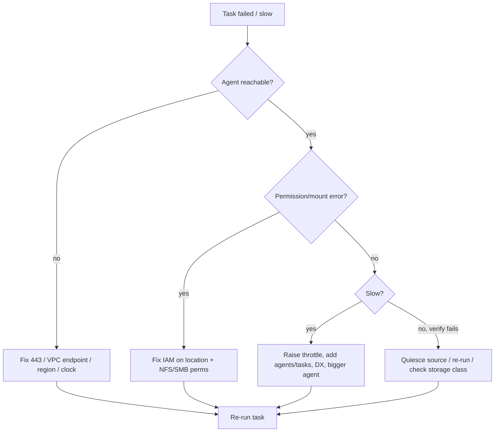

# AWS DataSync - SRE Operations

> Operational reality: where transfers fail and slow down, troubleshooting workflow, what to monitor/alarm, runbooks, real CLI examples (agent, locations, task, schedule), production patterns by scale, and cost operations.

See also: [01 - AWS DataSync Intro bits & bytes](01%20-%20AWS%20DataSync%20Intro%20bits%20%26%20bytes.md) · [02 - AWS DataSync Deep Dive](02%20-%20AWS%20DataSync%20Deep%20Dive.md) · [03 - AWS DataSync Exam Scenarios](03%20-%20AWS%20DataSync%20Exam%20Scenarios.md) · [00 - Migration & Transfer Overview](00%20-%20Migration%20%26%20Transfer%20Overview.md)

---

## Table of Contents

- [1. Common Errors (Symptom → Root Cause → Fix → Prevention)](#1-common-errors-symptom--root-cause--fix--prevention)
- [2. Troubleshooting Workflow](#2-troubleshooting-workflow)
- [3. What to Monitor and Alarm On](#3-what-to-monitor-and-alarm-on)
- [4. Runbooks](#4-runbooks)
- [5. Real Examples](#5-real-examples)
- [6. Production Patterns by Scale](#6-production-patterns-by-scale)
- [7. Cost Operations](#7-cost-operations)
- [8. Performance Tuning Cheatsheet](#8-performance-tuning-cheatsheet)

---

## 1. Common Errors (Symptom → Root Cause → Fix → Prevention)

### Agent won't activate

- **Cause:** Agent can't reach the activation/service endpoint (443), wrong region, time skew.
- **Fix:** Open outbound 443 to DataSync endpoints (or use VPC endpoint); set correct region; sync clock.
- **Prevention:** Pre-flight connectivity test; use VPC endpoint for private activation.

### Task fails with permission/mount errors

- **Cause:** IAM role lacks S3/EFS/FSx permissions; NFS/SMB export/share permissions wrong.
- **Fix:** Grant least-privilege IAM to the location; fix NFS export / SMB credentials.
- **Prevention:** Validate location config before first run.

### Transfer is slow

- **Cause:** WAN saturation/throttle too low, many small files, single agent, small agent VM.
- **Fix:** Raise throttle, add agents/tasks in parallel, use DX, give the agent more CPU/RAM.
- **Prevention:** Capacity-plan; aggregate small files; schedule off-peak.

### Files unexpectedly deleted at destination

- **Cause:** Overwrite/delete option mirrors source deletions.
- **Fix:** Adjust task options to preserve deleted files; enable S3 versioning.
- **Prevention:** Choose deletion behaviour deliberately; test on a subset.

### Verification fails / mismatches

- **Cause:** Source changing during transfer, corruption, or storage-class read limits.
- **Fix:** Re-run; quiesce source; check destination storage class readability.
- **Prevention:** Transfer stable snapshots; pick appropriate verification mode.

### Cost higher than expected

- **Cause:** Re-transferring unchanged data, no filters, wrong storage class, cross-region egress.
- **Fix:** Use incremental mode + filters; land in right storage class; minimise cross-region.
- **Prevention:** Review task options and reports regularly.

[⬆ Back to top](#table-of-contents)

---

## 2. Troubleshooting Workflow



[⬆ Back to top](#table-of-contents)

---

## 3. What to Monitor and Alarm On

| Signal                                    | Why                           |
| :---------------------------------------- | :---------------------------- |
| Task execution **status** (error/success) | Pipeline health (EventBridge) |
| **BytesTransferred / throughput**         | Performance + ETA             |
| **Files skipped / failed**                | Data completeness             |
| **Verification** results                  | Integrity                     |
| Agent **health / reachability**           | Availability                  |
| Cost / bytes moved trend                  | Budget control                |

[⬆ Back to top](#table-of-contents)

---

## 4. Runbooks

### Runbook: stand up an on-prem → S3 sync

1. Deploy + **activate** the agent near the source (VPC endpoint for private).
2. Create **source** (NFS/SMB) and **destination** (S3 + storage class) locations with IAM.
3. Create a **task**: filters, schedule, verification, throttle, deletion behaviour.
4. Run once; review **task report**; fix any errors.
5. Enable the **schedule** for incremental sync; alarm on errors via EventBridge.

### Runbook: large one-time migration

1. Validate network capacity; if too slow → switch to **Snow**.
2. Use **DX + multiple agents/tasks**; partition data by prefix.
3. Throttle during business hours; full-speed off-peak.
4. Verify; reconcile via task reports; cut over consumers.

### Runbook: transfer reconciliation

1. Pull the latest **task report** from S3.
2. Compare transferred vs skipped vs failed counts to expectations.
3. Re-run for failures; investigate persistent skips (permissions/filters).

[⬆ Back to top](#table-of-contents)

---

## 5. Real Examples

### Create locations and a task (CLI sketch)

```bash
# Source NFS location
aws datasync create-location-nfs \
  --server-hostname nas.corp.local \
  --subdirectory /exports/media \
  --on-prem-config AgentArns=arn:aws:datasync:ap-south-1:111111111111:agent/agent-abc

# Destination S3 location (Standard-IA)
aws datasync create-location-s3 \
  --s3-bucket-arn arn:aws:s3:::media-archive \
  --s3-config BucketAccessRoleArn=arn:aws:iam::111111111111:role/DataSyncS3Role \
  --s3-storage-class STANDARD_IA \
  --subdirectory /incoming

# Task with verification + filters + schedule
aws datasync create-task \
  --source-location-arn arn:aws:datasync:...:location/loc-src \
  --destination-location-arn arn:aws:datasync:...:location/loc-dst \
  --name nightly-media-sync \
  --options VerifyMode=ONLY_FILES_TRANSFERRED,OverwriteMode=ALWAYS,PreserveDeletedFiles=PRESERVE \
  --includes FilterType=SIMPLE_PATTERN,Value="*.mp4|*.mov" \
  --schedule ScheduleExpression="cron(0 2 * * ? *)"
```

### Start a task and watch it

```bash
aws datasync start-task-execution --task-arn arn:aws:datasync:...:task/task-123
aws datasync describe-task-execution --task-execution-arn <exec-arn>
```

### EventBridge rule on task completion (concept)

```text
EventBridge rule: source aws.datasync, detail-type "DataSync Task Execution State Change",
state = SUCCESS → start downstream Step Functions; state = ERROR → SNS page.
```

[⬆ Back to top](#table-of-contents)

---

## 6. Production Patterns by Scale

| Context                 | Pattern                                                                                                           |
| :---------------------- | :---------------------------------------------------------------------------------------------------------------- |
| **Small**               | One agent, one scheduled task, S3 destination, basic alarms.                                                      |
| **Medium**              | Filters + storage-class targeting + lifecycle; EventBridge automation; throttling.                                |
| **Enterprise**          | DX, multiple agents/tasks partitioned by prefix, VPC endpoints, CMK encryption, task-report auditing, dashboards. |
| **Hybrid steady-state** | DataSync for periodic sync + **Storage Gateway** for ongoing local access.                                        |

[⬆ Back to top](#table-of-contents)

---

## 7. Cost Operations

- **Per-GB** transfer fee - move **only what changed** (incremental) and use **filters**.
- Land data in the **right S3 storage class**; **lifecycle** to Glacier for archives.
- Minimise **cross-region/egress**; keep destination in the consuming region where possible.
- Decommission idle tasks/locations; right-size the agent VM (EC2 agent costs apply).

[⬆ Back to top](#table-of-contents)

---

## 8. Performance Tuning Cheatsheet

- **Bandwidth**: add **Direct Connect**; raise the throttle off-peak.
- **Parallelism**: multiple **agents** and **tasks** partitioned by directory/prefix.
- **Small files**: aggregate where possible; expect higher per-file overhead.
- **Agent size**: give the agent VM enough CPU/RAM/network.
- **Verification mode**: `ONLY_FILES_TRANSFERRED` balances speed vs assurance.

[⬆ Back to top](#table-of-contents)

---

Related: [01 - AWS DataSync Intro bits & bytes](01%20-%20AWS%20DataSync%20Intro%20bits%20%26%20bytes.md) · [02 - AWS DataSync Deep Dive](02%20-%20AWS%20DataSync%20Deep%20Dive.md) · [03 - AWS DataSync Exam Scenarios](03%20-%20AWS%20DataSync%20Exam%20Scenarios.md) · [01 - AWS Snow Family Intro bits & bytes](01%20-%20AWS%20Snow%20Family%20Intro%20bits%20%26%20bytes.md) · [00 - Migration & Transfer Overview](00%20-%20Migration%20%26%20Transfer%20Overview.md)
